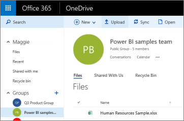

# Verbinding maken met in OneDrive opgeslagen bestanden voor uw Power BI-werkruimte
Wanneer u [een werkruimte maakt in Power BI](service-create-workspaces.md), maakt u ook een Microsoft 365-groep waaraan OneDrive voor Bedrijven is gekoppeld. In dit artikel wordt uitgelegd hoe u uw Excel-, CSV-en Power BI Desktop-bestanden opslaat en bijwerkt in OneDrive voor Bedrijven. Wijzigingen worden automatisch doorgevoerd in de Power BI-rapporten en dashboards op basis van de bestanden.

> [!NOTE]
> In de nieuwe werkruimte-ervaring is de relatie tussen Power BI-werkruimten en Microsoft 365-groepen gewijzigd. Er wordt niet automatisch een Microsoft 365-groep gemaakt wanneer u een van de nieuwe werkruimten maakt. Lees hier meer over [het maken van de nieuwe werkruimten](service-create-the-new-workspaces.md).

De bestanden worden in twee stappen toegevoegd aan uw werkruimte: 

1. Eerst [uploadt u bestanden naar de OneDrive voor bedrijven](#1-upload-files-to-the-onedrive-for-business-for-your-workspace) voor uw werkruimte.
2. Vervolgens maakt u [vanuit Power BI verbinding met deze bestanden](#2-import-excel-files-as-datasets-or-as-excel-online-workbooks).

> [!NOTE]
> Werkruimten zijn alleen beschikbaar met een [Power BI Pro-licentie](../fundamentals/service-features-license-type.md).
> 

## 1 Upload bestanden naar de OneDrive voor bedrijven voor uw werkruimte
1. Selecteer de pijl naast Werkruimten in de Power BI-service > selecteer het weglatingsteken ( **…** ) naast de naam van uw werkruimte. 
   
   
2. Selecteer **Bestanden** om de OneDrive voor bedrijven voor uw werkruimte in Microsoft 365 te openen.
   
   > [!NOTE]
   > Als in het menu van de werkruimte niet de optie **Bestanden** wordt weergegeven, moet u **Leden** selecteren om de OneDrive voor bedrijven voor uw werkruimte te openen. Selecteer hier **Bestanden**. Microsoft 365 installeert een opslaglocatie voor OneDrive voor bestanden van de groepswerkruimte van uw app. Dit proces kan enige tijd duren.
   > 
   > 
3. Hier kunt u uw bestanden uploaden naar de OneDrive voor bedrijven voor uw werkruimte. Selecteer **Uploaden**, en navigeer naar uw bestanden.
   
   

## 2 Excel-bestanden importeren als gegevenssets of Excel Online-werkmappen
Nu uw bestanden zijn opgeslagen in de OneDrive voor bedrijven voor uw werkruimte, kunt u kiezen. U kunt: 

* [De gegevens als een gegevensset importeren uit de Excel-werkmap](../connect-data/service-get-data-from-files.md). Vervolgens kunt u de gegevens gebruiken om rapporten en dashboards te maken die u in een webbrowser en op mobiele apparaten kunt weergeven.
* Of [verbinding maken met een complete Excel-werkmap in Power BI](../connect-data/service-excel-workbook-files.md) en deze precies weergeven als in Excel Online wordt weergegeven.

### Bestanden importeren in uw werkruimte of hiermee verbinding maken
1. Schakel in Power BI over naar de werkruimte, zodat de naam van de werkruimte in de linkerbovenhoek wordt vermeld. 
2. Selecteer **Gegevens ophalen** onderaan het navigatievenster. 
   
   
3. Selecteer in het vak **Bestanden** de optie **Ophalen**.
   
   
4. Selecteer **OneDrive** - *naam van uw werkruimte*.
   
    
5. Selecteer het gewenste bestand > **Verbinding maken**.
   
    U moet nu aangeven of u [de gegevens uit de Excel-werkmap wilt importeren](../connect-data/service-get-data-from-files.md) of [verbinding wilt maken met de complete Excel-werkmappen](../connect-data/service-excel-workbook-files.md).
6. Selecteer **Importeren** of **verbinding maken**.
   
    
7. Als u **Importeren** selecteert, verschijnt de werkmap op het tabblad **Gegevenssets**. 
   
    
   
    Als u **Verbinding maken** selecteert, bevindt de werkmap zich op het tabblad **Werkmappen**.
   
    

## Volgende stappen
* [Apps en werkruimten maken in Power BI](../collaborate-share/service-create-distribute-apps.md)
* [Gegevens importeren uit Excel-werkmappen](../connect-data/service-get-data-from-files.md)
* [Verbinding maken met complete Excel-werkmappen](../connect-data/service-excel-workbook-files.md
* Hebt u nog vragen? [Misschien dat de Power BI-community het antwoord weet](https://community.powerbi.com/)
* Feedback? Ga naar [Power BI ideeën](https://ideas.powerbi.com/forums/265200-power-bi)
