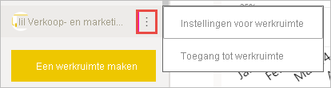
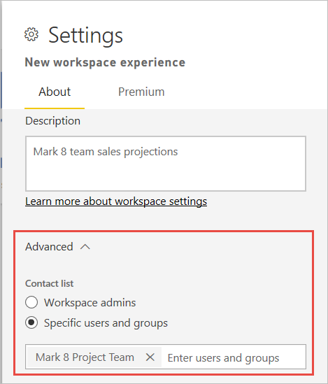

# De nieuwe werkruimten maken in Power BI

In dit artikel wordt uitgelegd hoe u een de *nieuwe werkruimten* maakt in plaats van een *klassieke* werkruimte. Beide soorten werkruimten zijn plekken om samen te werken met collega's. Hierin maakt u verzamelingen dashboards, rapporten en gepagineerde rapporten. Als u wilt, kunt u die verzameling samenbundelen in een *app* en die verspreiden onder een breder publiek.

Hier ziet u hoe nieuwe werkruimten anders zijn dan de oude. In de nieuwe werkruimten is het volgende mogelijk:

- Wijs werkruimterollen toe aan gebruikersgroepen en -personen.
- Een werkruimte in Power BI maken zonder een Microsoft 365-groep te maken.
- Meer gedetailleerde werkruimterollen gebruiken voor flexibeler beheer van machtigingen.

:::image type="content" source="media/service-create-the-new-workspaces/power-bi-workspace-sales-marketing.png" alt-text="Voorbeeldwerkruimte voor Sales & Marketing":::

Lees het artikel [Nieuwe werkruimten](service-new-workspaces.md) voor meer achtergrondinformatie.

Klaar om uw klassieke werkruimte te migreren? Zie [Een upgrade uitvoeren van de klassieke werkruimten naar de nieuwe werkruimten in Power BI](service-upgrade-workspaces.md) voor meer informatie.

> [!NOTE]
> De gebruikers toewijzen aan de rol Kijker om de beveiliging op rijniveau (RLS) af te dwingen voor Power BI Pro-gebruikers die door inhoud in een werkruimte bladeren.

## Een van de nieuwe werkruimten maken

1. Maak eerst de werkruimte. Selecteer **Werkruimten** > **Werkruimte maken**.
   
     

2. U maakt automatisch een bijgewerkte werkruimte, tenzij u kiest voor **Terugkeren naar klassieke werkruimte**.
   
     
     
     Als u **Terugkeren naar klassiek** selecteert, maakt u een [werkruimte op basis van een Microsoft 365-groep](service-create-workspaces.md).

2. Geef een unieke naam op voor de werkruimte. Als de naam niet beschikbaar is, bewerkt u deze tot een unieke naam.
   
     De app die uit maakt uit de werkruimte heeft dezelfde naam en hetzelfde pictogram als de werkruimte.
   
1. Dit zijn een paar optionele items die u kunt instellen voor uw werkruimte:

    Een **Werkruimteafbeelding** uploaden. Goedgekeurde bestanden zijn .png- of .jpg-bestanden. Het bestand moet kleiner zijn dan 45 kB.
    
    [Een **Lijst met contactpersonen** toevoegen](#create-a-contact-list). De werkruimtebeheerders zijn standaard contactpersonen. 
    
    [Geef een **Werkruimte op OneDrive**](#set-a-workspace-onedrive) op om gebruik te maken van Microsoft 365-groepsopslag. 

    Als u de werkruimte wilt toewijzen aan een **Toegewezen capaciteit**, selecteert u op het tabblad **Premium** de optie **Toegewezen capaciteit**.
     
    

1. Selecteer **Opslaan**.

    De werkruimte wordt gemaakt en in Power BI geopend. De werkruimte wordt weergegeven in de lijst met werkruimten waarvan u lid bent. 

## Een lijst met contactpersonen maken

U kunt opgeven welke gebruikers meldingen moeten ontvangen over problemen die optreden in de werkruimte. De standaardinstelling is dat elke gebruiker of groep die is ingesteld als een beheerder van de werkruimte een melding krijgt, maar u anderen toevoegen aan de *lijst met contactpersonen*. Gebruikers of groepen in de lijst met contactpersonen worden weergegeven in de UI (gebruikersinterface), zodat gebruikers hulp kunnen krijgen met betrekking tot de werkruimte.

1. U opent de instellingen voor de nieuwe **Lijst met contactpersonen** op een van twee manieren:

    In het deelvenster **Een werkruimte maken** wanneer u voor het eerst een werkruimte maakt.

    Selecteer in het navigatievenster de pijl naast **Werkruimten**, selecteer **Meer opties** (...) naast de naam van de werkruimte > **Werkruimte-instellingen**. Het deelvenster **Instellingen** wordt geopend.

    

2. Onder **Geavanceerd** > **Lijst met contactpersonen** accepteert u de standaardinstellingen, **Werkruimtebeheerders** of voegt u uw eigen lijst of **Specifieke gebruikers of groepen** toe. 

    

3. Selecteer **Opslaan**.

## Een werkruimte op OneDrive instellen

Met de functie Werkruimte op OneDrive kunt u een Microsoft 365-groep configureren waarvan de bestandsopslag uit de SharePoint-documentbibliotheek beschikbaar is voor werkruimtegebruikers. Eerst maakt u de groep buiten Power BI. 

Power BI biedt geen synchronisatie voor machtigingen van gebruikers of groepen die zijn geconfigureerd voor werkruimtetoegang met behulp van het lidmaatschap van een Microsoft 365-groep. Het beste is om [toegang tot de werkruimte](#give-access-to-your-workspace) te geven aan dezelfde Microsoft 365-groep, waarvan u de bestandsopslag configureert bij het instellen van deze Microsoft 365-groep. Vervolgens beheert u werkruimtetoegang via het lidmaatschapsbeheer van de Microsoft 365-groep. 

1. U opent de instellingen van de **OneDrive voor de werkruimte** op een van twee manieren:

    In het deelvenster **Een werkruimte maken** wanneer u voor het eerst een werkruimte maakt.

    Selecteer in het navigatievenster de pijl naast **Werkruimten**, selecteer **Meer opties** (...) naast de naam van de werkruimte > **Werkruimte-instellingen**. Het deelvenster **Instellingen** wordt geopend.

    

2. Onder **Geavanceerd** > **OneDrive van werkruimte** voert u de naam van de Microsoft 365-groep in die u eerder hebt gemaakt. Typ alleen de naam, niet de URL. Power BI haalt automatisch de OneDrive voor de groep op.

    

3. Selecteer **Opslaan**.

### Toegang tot de OneDrive-locatie van de werkruimte

Nadat u de OneDrive-locatie hebt geconfigureerd, bereikt u deze op dezelfde manier als de andere gegevensbronnen in de Power BI-service.

1. Selecteer in het navigatievenster de optie **Gegevens ophalen** en selecteer vervolgens in het vak **Bestanden** de optie **Ophalen**.

    

1.  De invoer **OneDrive - Bedrijven** is uw eigen OneDrive voor Bedrijven. De tweede OneDrive is de OneDrive die u hebt toegevoegd.

    

### Verbinding maken met apps in nieuwe werkruimten

Met de nieuwe werkruimte-ervaring worden *apps* gemaakt en gebruikt in plaats van inhoudspakketten. Apps zijn verzamelingen dashboards, rapporten en gegevenssets die verbinding maken met externe services en organisatiegegevens. Met apps kunt u eenvoudig gegevens ophalen uit services zoals Microsoft Dynamics CRM, Salesforce en Google Analytics.

In de nieuwe werkruimte-ervaring kunt u geen organisatie-inhoudspakketten maken of gebruiken. Vraag uw interne teams om apps te bieden voor alle inhoudspakketten die u momenteel gebruikt. 

## Toegang verlenen tot uw werkruimte

Iedereen met een beheerdersrol in een werkruimte kan anderen toegang geven tot de werkruimte.

1. Omdat u beheerder bent, ziet u op de pagina met de werkruimte-inhoud **Toegang** staan.

    

1. Voeg aan deze werkruimten beveiligingsgroepen, distributielijsten, Microsoft 365-groepen of personen toe als beheerder, leden, inzenders of kijkers. Zie [Rollen in de nieuwe werkruimten](service-new-workspaces.md#roles-in-the-new-workspaces) voor een uitleg over de verschillende rollen.

    

9. Selecteer **Toevoegen** > **Sluiten**.

## Een app distribueren

Als u officiële inhoud wilt distribueren naar een grote doelgroep binnen uw organisatie, kunt u een *app* vanuit uw werkruimte publiceren.  Wanneer de inhoud klaar is, kunt u kiezen welke dashboards en rapporten u wilt publiceren. Vervolgens publiceert u deze als een app. U kunt vanuit elke werkruimte een app maken.

Lees meer over hoe u [een app publiceert vanuit de nieuwe werkruimten](service-create-distribute-apps.md).

## Beveiligingsinstellingen

Met de instelling **Toestaan dat inzenders de app voor deze werkruimte bijwerken** geven Beheerders van de werkruimte gebruikers met de rol Inzender de mogelijkheid om de app bij te werken voor de werkruimte. Standaard kunnen alleen beheerders en leden van de werkruimte de app publiceren en bijwerken voor de werkruimte. 

Wanneer deze functie is ingeschakeld, kunnen Inzenders:
* Metagegevens van de app, zoals naam, pictogram, beschrijving, ondersteuningssite, en kleur bijwerken
* Items toevoegen aan of verwijderen uit de app, zoals het toevoegen van rapporten of gegevenssets
* De app-navigatie of het standaarditem wijzigen waarin de app wordt geopend

Inzenders kunnen echter niet:
* De app voor de eerste keer publiceren
* De machtigingen voor de app wijzigen

## Volgende stappen
* Lees meer over het [organiseren van werk in de nieuwe werkruimte-ervaring in Power BI](service-new-workspaces.md)
* [Klassieke werkruimten maken](service-create-workspaces.md)
* [Publish an app from the new workspaces in Power BI](service-create-distribute-apps.md) (Een app publiceren vanuit de nieuwe werkruimten in Power BI)
* Vragen? [Misschien dat de Power BI-community het antwoord weet](https://community.powerbi.com/)
