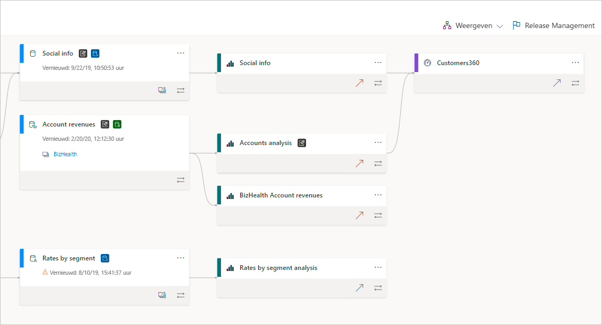
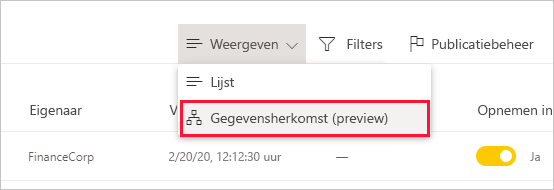
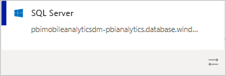
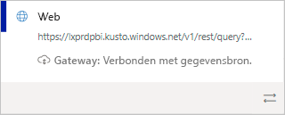
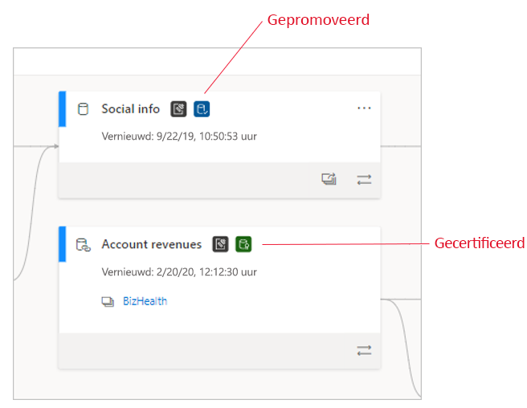
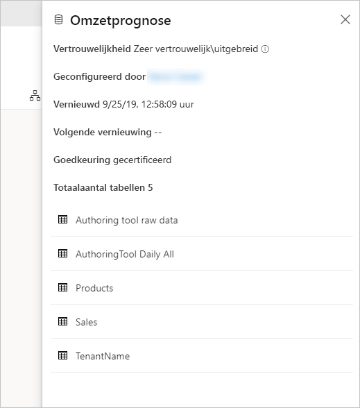
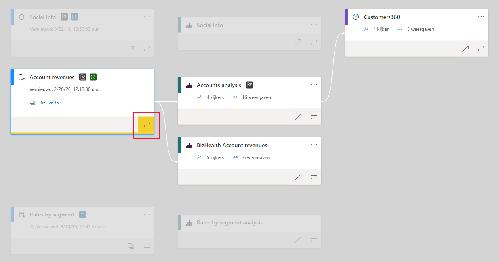

# Gegevensherkomst
In moderne projecten die gaan over business intelligence (BI) kan het begrijpen van de gegevensstroom van de gegevensbron naar de bestemming een grote uitdaging zijn. De uitdaging is zelfs groter als u geavanceerde analytische projecten hebt gebouwd die uit meerdere gegevensbronnen, artefacten en afhankelijkheden bestaan. Vragen als "Wat gebeurt er als ik deze gegevens wijzig?" of 'Waarom is dit rapport niet bijgewerkt?' kunnen moeilijk te beantwoorden zijn. Misschien is er wel een team van deskundigen of een grondig onderzoek nodig om dit te begrijpen. We hebben een gegevensherkomstweergave ontworpen om u te helpen bij het beantwoorden van deze vragen.

 
Power BI heeft verschillende typen artefacts, zoals dashboards, rapporten, gegevenssets en gegevensstromen. Veel gegevenssets en gegevensstromen maken verbinding met externe gegevensbronnen, zoals SQL Server, en met externe gegevenssets in andere werkruimten. Wanneer een gegevensset zich buiten uw eigen werkruimte bevindt, kan deze zich mogelijk in een werkruimte bevinden die eigendom is van iemand van IT of van een andere analist. Externe gegevensbronnen en gegevenssets maken het moeilijker om te weten waar de gegevens uiteindelijk vandaan komen. Voor complexe en eenvoudigere projecten introduceren we herkomstweergave.

In de herkomstweergave ziet u de herkomstrelaties tussen alle artefacten in een werkruimte en alle bijbehorende externe afhankelijkheden. Er worden verbindingen weergegeven tussen alle werkruimte-artefacten, waaronder verbindingen met gegevensstromen, zowel upstream als downstream.    

<iframe width="560" height="315" src="https://www.youtube.com/embed/rUj06dqB98g" frameborder="0" allowfullscreen></iframe>

> [!VIDEO https://youtu.be/rUj06dqB98g]

## Herkomstweergave verkennen

Elke werkruimte, hetzij nieuw of klassiek, heeft automatisch een herkomstweergave. U hebt minimaal een rol Inzender in de werkruimte nodig om deze weer te geven. Zie [Machtigingen](#permissions) in dit artikel voor meer informatie.

* Ga naar de herkomstweergave om toegang te krijgen tot de weergave werkruimtelijst. Tik op de pijl naast **Lijstweergave** en selecteer **Herkomstweergave**.

   

In deze weergave ziet u alle artefacten in de werkruimte, en hoe de gegevens van de ene naar de andere artefact stromen.

**Gegevensbronnen**

U ziet de gegevensbronnen waaruit de gegevenssets en de gegevensstromen hun gegevens halen. Op de kaarten van de gegevensbron ziet u meer informatie die u kan helpen bij het identificeren van de bron. U ziet voor Azure SQL Server bijvoorbeeld ook de naam van de database.

 
**Gateways**

Als een gegevensbron via een on-premises gateway is verbonden, worden de gatewaygegevens toegevoegd aan de gegevensbronkaart. Als u een machtiging hebt (als gatewaybeheerder of als gegevensbrongebruiker), ziet u meer informatie, zoals de naam van de gateway.

**Gegevenssets en gegevensstromen**
 
In gegevenssets en gegevensstromen ziet u de laatste vernieuwingstijd, en ook of de gegevensset of gegevensstroom is gecertificeerd of gepromoveerd.

 
Als een rapport in de werkruimte is gebouwd op een gegevensset of gegevensstroom in een andere werkruimte, ziet u de naam van de bronwerkruimte op de kaart van de betreffende gegevensset of gegevensstroom. Selecteer de naam van de bronwerkruimte om naar deze werkruimte te gaan.

* Voor elk artefact selecteert u **Meer opties** (...) om het menu Opties weer te geven. Het bevat alle acties die ook beschikbaar zijn in de lijstweergave.

Als u meer metagegevens in een artefact wilt zien, selecteert u het artefact zelf. Aanvullende informatie over het artefact wordt weergegeven in een zijvenster. In de afbeelding hieronder worden de metagegevens van een geselecteerde gegevensset weergegeven in het zijvenster.

 
## Toon herkomst van elk artefact 

Stel dat u de herkomst van een specifiek artefact wilt zien.

* Selecteer de dubbele pijlen onder het artefact.

   

   Power BI markeert alle artefacten die betrekking hebben op dat artefact en dimt de rest. 

## Navigatie en volledig scherm 

Herkomstweergave is een interactief canvas. U kunt de muis en touchpad gebruiken om te navigeren in het canvas, en om in of uit te zoomen.

* Als u wilt in- en uitzoomen, gebruikt u het menu in de rechterbenedenhoek, of uw muis of touchpad.
* Als u meer ruimte nodig hebt voor de grafiek zelf, gebruikt u de optie volledig scherm in de rechterbenedenhoek. 

    

## Machtigingen

* U hebt een Power BI Pro-licentie nodig om de herkomstweergave te bekijken.
* Herkomstweergave is alleen beschikbaar voor gebruikers die toegang hebben tot de werkruimte.
* Gebruikers moeten beschikken over een rol Beheerder, Lid of Inzender in de werkruimte. Gebruikers met de rol Kijker kunnen niet schakelen naar de herkomstweergave.

## Overwegingen en beperkingen

- De herkomstweergave is niet beschikbaar in Internet Explorer. Zie [Ondersteunde browsers voor Power BI](../fundamentals/power-bi-browsers.md) voor meer informatie.

## Volgende stappen

* [Introductie van gegevenssets in meerdere werkruimten (preview)](../connect-data/service-datasets-across-workspaces.md)
* [Impactanalyse voor gegevenssets](service-dataset-impact-analysis.md)
