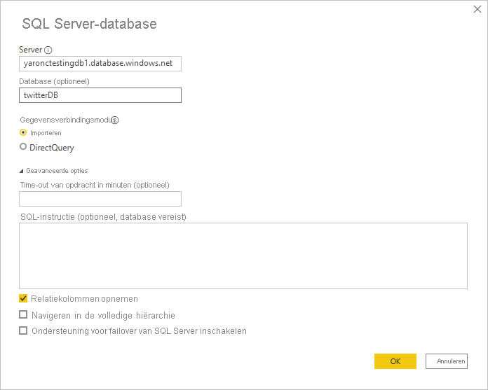

# Impactanalyse van de gegevensbron

Impactanalyse van de gegevensbron helpt u te ontdekken waar uw gegevensbron wordt gebruikt in uw organisatie. Dit kan handig zijn wanneer de gegevensbron tijdelijk of permanent offline is gehaald en u wilt weten voor wie dit gevolgen heeft. Het toont u hoeveel werkruimten, gegevensstromen en gegevenssets van de gegevensbron gebruikmaken en het biedt u eenvoudige navigatie naar de werkruimten waarin de betrokken gegevensstromen en gegevenssets zich bevinden, zodat u verder onderzoek kunt uitvoeren.

Met een impactanalyse van de gegevensbron kunt u ook gegevensduplicatie in de tenant opsporen, zoals wanneer een aantal verschillende gebruikers vergelijkbare modellen bouwen op dezelfde gegevensbron. Door u te helpen dergelijke redundante gegevenssets en gegevensstromen op te sporen, biedt een impactanalyse van de gegevensbron ondersteuning voor het doel om 'één bron van waarheid' te hebben.

## Een impactanalyse van de gegevensbron uitvoeren

U voert als volgt een impactanalyse van de gegevensbron uit:

1. Ga naar de werkruimte met de gegevensbron waarin u geïnteresseerd bent en open [Herkomstweergave](service-data-lineage.md).
1. Zoek de kaart van de gegevensbron en klik op het pictogram Impactanalyse.

    
 
Het zijpaneel voor de impactanalyse wordt geopend.

 
* **Gegevensbrontype**: Geeft het gegevensbrontype aan
* **Pad naar de gegevensbron**: Pad naar de gegevensbron, zoals gedefinieerd in Power BI Desktop. In de bovenstaande afbeelding wordt het pad naar de gegevensbron van de SQL-serverdatabase bijvoorbeeld gevormd door de verbindingsreeks 'twitterDB-yaronctestingdb1.database.windows.net', zoals gedefinieerd in Power BI Desktop (zie onder). Het bestaat uit de databasenaam 'twitterDB' en de servernaam 'yaronctestingdb1.database.windows.net'.

    
 
* **Samenvatting van de impact**: Hierin ziet u het aantal mogelijk betrokken werkruimten, gegevensstromen en gegevenssets. Dit aantal is inclusief werkruimten waartoe u geen toegang hebt.
* **Gebruiksanalyse**: Hierin ziet u voor elke werkruimte de namen van de betrokken gegevensstromen en gegevenssets. U kunt de impact op een specifieke werkruimte nog verder verkennen door op de naam van de werkruimte te klikken om de werkruimte te openen. Wanneer u zich in de betrokken werkruimte bevindt, gebruikt u [impactanalyse van de gegevensset](service-dataset-impact-analysis.md) om de gebruiksgegevens te zien over verbonden rapporten en dashboards.

## Contactpersonen informeren

Als u een wijziging in een gegevensbron hebt aangebracht of als u overweegt om een wijziging aan te brengen, kunt u contact opnemen met de relevante gebruikers om hen hiervan op de hoogte te stellen. Wanneer u contactpersonen informeert, wordt een e-mailbericht naar de [lijsten met contactpersonen](service-create-the-new-workspaces.md#create-a-contact-list) van alle betrokken werkruimten verzonden (in het geval van klassieke werkruimten wordt het e-mailbericht verzonden naar de werkruimtebeheerders). Uw naam wordt in de e-mail vermeld, zodat de contactpersonen u kunnen vinden en u via een nieuwe e-mailconversatie een antwoord kunnen sturen. 

1. Klik op **Contactpersonen informeren** in het zijpaneel met de impactanalyse. Het dialoogvenster Contactpersonen informeren wordt weergegeven.

   

1. Typ in het tekstvak enkele details over de wijziging.
1. Als u klaar ben met het bericht, klikt u op **Verzenden**.

## Privacy

In het zijpaneel met de impactanalyse worden alleen de werkelijke namen weergegeven voor werkruimten, gegevenssets en gegevensstromen waartoe u toegang hebt. Bij items waartoe u geen toegang hebt, wordt Beperkte toegang weergegeven. De reden hiervoor is dat sommige namen van items mogelijk naar persoonlijke gegevens verwijzen.
De samenvatting van de impact bevat alle betrokken gegevensstromen en gegevenssets, zelfs die zich in werkruimten bevinden waartoe u geen toegang hebt.

## Beperkingen

De impactanalyse van de gegevensbron wordt nog niet ondersteund voor gepagineerde rapporten, dus u kunt niet zien of de gegevensbron rechtstreeks impact heeft op dit type rapporten in de tenant.

## Volgende stappen

* [Impactanalyse voor gegevenssets](service-dataset-impact-analysis.md)
* [Gegevensherkomst](service-data-lineage.md)