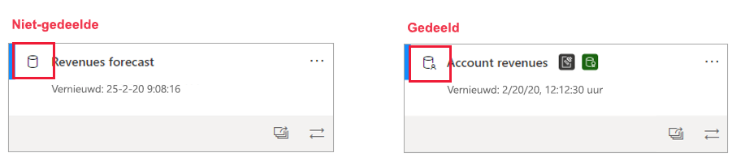
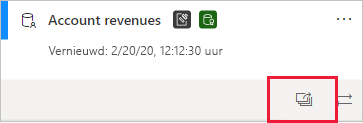
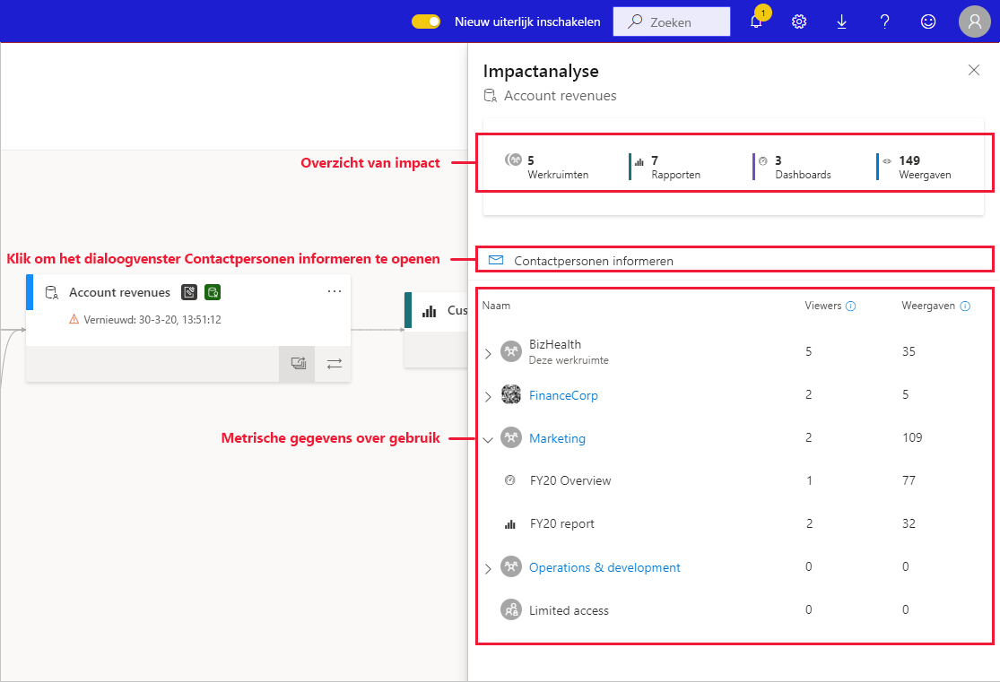
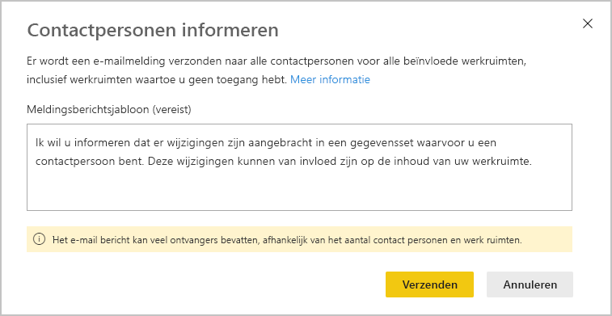
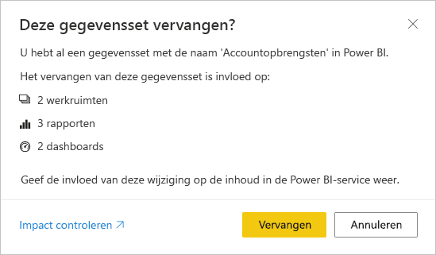

# Impactanalyse voor gegevenssets

Wanneer u wijzigingen aanbrengt in een gegevensset of overweegt wijzigingen aan te brengen, is het belangrijk om te evalueren welke impact deze wijzigingen kunnen hebben op rapporten en dashboards die zich downstream bevinden en die afhankelijk zijn van die gegevensset. **Impactanalyse voor gegevenssets** biedt u informatie die u helpt om deze evaluatie uit te voeren.
* U ziet dan hoeveel werkruimten, rapporten en dashboards mogelijk worden beïnvloed door uw wijziging, en u krijgt eenvoudige navigatiemogelijkheden geboden naar de werkruimten waar de betrokken rapporten en dashboards zich bevinden, zodat u dit verder kunt onderzoeken.
* Hier ziet u het aantal unieke bezoekers en het aantal weergaven voor de mogelijk betrokken items. Dit helpt u bij het vaststellen van de algehele impact die de wijziging op het item downstream heeft. Het is bijvoorbeeld waarschijnlijk belangrijker om het effect van een wijziging in een rapport met 20.000 unieke kijkers te onderzoeken, dan om het effect van de wijziging in een rapport met drie kijkers te onderzoeken.
* Het is een eenvoudige manier om de relevante mensen op de hoogte te stellen van een wijziging die u hebt aangebracht of die u overweegt aan te brengen.

Een impactanalyse voor gegevenssets kan eenvoudig worden gestart vanuit de [gegevensherkomstweergave](service-data-lineage.md).

## Gedeelde gegevenssets identificeren

U kunt een impactanalyse voor gegevenssets uitvoeren op gedeelde en niet-gedeelde gegevenssets. Dit is echter vooral handig voor gegevenssets die worden gedeeld vanuit meerdere werkruimten, waar het veel ingewikkelder is om een duidelijk beeld te krijgen van afhankelijkheden verder downstream dan met niet-gedeelde gegevenssets, waar alle afhankelijkheden zich in dezelfde werkruimte bevinden als de gegevensset zelf.

In de gegevensherkomstweergave kunt u het verschil tussen gedeelde gegevenssets en niet-gedeelde gegevenssets zien door te kijken naar het pictogram in de linkerbovenhoek van de gegevenssetkaart.

## Impactanalyse voor gegevenssets uitvoeren

U kunt een impactanalyse voor gegevenssets uitvoeren op elke gegevensset in de werkruimte, ongeacht of deze is gedeeld of niet. U kunt geen impactanalyse uitvoeren op externe gegevenssets die worden weergegeven in de herkomstweergave, maar die zich in feite in een andere werkruimte bevinden. Als u een impactanalyse wilt uitvoeren op een externe gegevensset, moet u naar de bronwerkruimte navigeren.

Als u een impactanalyse voor gegevenssets wilt uitvoeren, klikt u op de knop voor impactanalyse op de gegevenssetkaart.

Het zijpaneel voor de impactanalyse wordt geopend.

* Het **overzicht van de impact** bevat het aantal werkruimten, rapporten en dashboards dat mogelijk wordt beïnvloed, evenals het totale aantal weergaven voor alle rapporten en dashboards downstream die zijn verbonden met de gegevensset.
* Met de koppeling **Contactpersonen informeren** wordt een dialoogvenster geopend waarmee u een bericht over eventuele wijzigingen in de gegevensset kunt maken en verzenden naar de lijst met contactpersonen met werkruimten die door de wijzigingen worden beïnvloed. 
* De **gebruiksanalyse** toont voor elke werkruimte het totale aantal weergaven voor de mogelijk beïnvloede rapporten en dashboards die in die werkruimte voorkomen, en voor elk rapport en elk dashboard, het totale aantal kijkers en weergaven, waarbij
   * Kijkers: Het aantal afzonderlijke gebruikers dat een rapport of dashboard heeft bekeken.
   * Weergaven: het aantal weergaven voor een rapport of dashboard

De metrische gebruiksgegevens hebben betrekking op de laatste 30 dagen. De huidige dag is niet inbegrepen. De aantallen omvatten het gebruik via gerelateerde apps. De metrische gegevens helpen u om te begrijpen wat het gebruik van een gegevensset in de tenant is, en om te beoordelen wat de invloed van wijzigingen in uw gegevensset kunnen zijn.

## Contactpersonen informeren

Als u een wijziging in een gegevensset hebt aangebracht of als u overweegt om een wijziging aan te brengen, kunt u contact opnemen met de relevante gebruikers om hen hiervan op de hoogte te stellen. Wanneer u contactpersonen informeert, wordt een e-mail verzonden naar de [lijsten met contactpersonen](../service-create-the-new-workspaces.md#workspace-contact-list) voor alle werkruimten die hierdoor kunnen worden beïnvloed. Uw naam wordt in de e-mail vermeld, zodat de contactpersonen u kunnen vinden en u via een nieuwe e-mailconversatie een antwoord kunnen sturen. 

1. Klik op **Contactpersonen informeren** in het zijpaneel met de impactanalyse. Het dialoogvenster Contactpersonen informeren wordt weergegeven.

   

1. Typ in het tekstvak enkele details over de wijziging.
1. Als u klaar ben met het bericht, klikt u op **Verzenden**.

> [!NOTE]
> Het is niet mogelijk om contactpersonen te informeren als de gegevensset waarop u een impactanalyse uitvoert, zich in een klassieke werkruimte bevindt.

## Privacy

U moet schrijfmachtigingen hebben om een impactanalyse op een gegevensset te kunnen uitvoeren. In het zijpaneel met de impactanalyse worden alleen de werkelijke namen weergegeven voor werkruimten, rapporten en dashboards waartoe u toegang hebt. Bij items waartoe u geen toegang hebt, wordt **Beperkte toegang** weergegeven. De reden hiervoor is dat sommige namen van items mogelijk naar persoonlijke gegevens verwijzen.

Zelfs als u geen toegang hebt tot sommige werkruimten ziet u nog steeds een overzicht van de metrische gebruiksgegevens voor deze werkruimten en worden de berichten om uw contactpersonen te informeren toch naar de contactpersonen op de lijst van personen voor deze werkruimten verzonden.

## Impactanalyse van Power BI Desktop

Wanneer u een wijziging aanbrengt in een gegevensset in Power BI Desktop en deze gegevensset vervolgens opnieuw publiceert naar de Power BI-service, wordt een bericht weergegeven met het aantal werkruimten, rapporten en dashboards dat mogelijk door de wijziging wordt beïnvloed. U wordt ook gevraagd om te bevestigen dat u de momenteel gepubliceerde gegevensset wilt vervangen door de gegevensset die u hebt gewijzigd. Het bericht bevat ook een koppeling naar de volledige impactanalyse van de gegevensset in de Power BI-service, waar u meer informatie vindt en actie kunt ondernemen om de risico's van uw wijziging te beperken.

> [!NOTE]
> De informatie die in het bericht wordt weergegeven, geeft alleen de potentiële impact aan, niet dat er daadwerkelijk al iets is beschadigd. Vaak hebben wijzigingen in een gegevensset geen nadelige gevolgen voor rapporten en dashboards verder downstream. U krijgt dit bericht echter toch, omdat u hiermee meer duidelijkheid hebt over mogelijke gevolgen.
>
>In het bericht wordt het aantal werkruimten alleen weergegeven als meer dan één werkruimte rapporten en dashboards bevat die betroffen zijn.

## Beperkingen

* Het gebruik van metrische gebruiksgegevens wordt momenteel niet ondersteund voor klassieke en persoonlijke werkruimten.

## Volgende stappen

* [Introductie van gegevenssets in meerdere werkruimten (preview)](../service-datasets-across-workspaces.md)
* [Gegevensherkomst](service-data-lineage.md)
