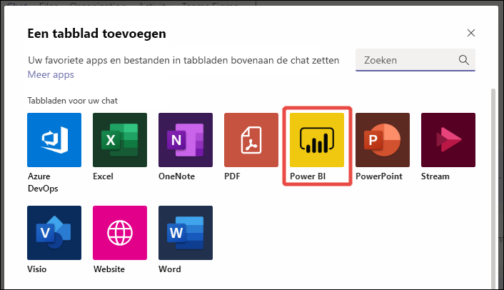
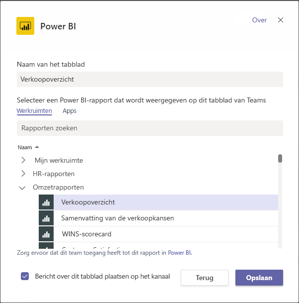
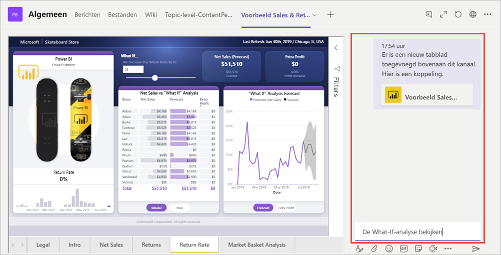

# Power BI-inhoud insluiten in Microsoft Teams

U kunt eenvoudig interactieve Power BI-rapporten insluiten in kanalen en chats van Microsoft Teams. 

## Vereisten

Als u het tabblad **Power BI** in Microsoft Teams wilt gebruiken, moet u ervoor zorgen dat:

- Microsoft Teams het **Power BI**-tabblad bevat.
- Als u een rapport wilt toevoegen aan Microsoft Teams met het **Power BI**-tabblad, moet u ten minste de rol Kijker hebben in de werkruimte die als host voor het rapport fungeert. Zie [Rollen in de nieuwe werkruimten](service-new-workspaces.md#roles-in-the-new-workspaces) voor informatie over de verschillende rollen.
- Als gebruikers het rapport willen bekijken op het **Power BI**-tabblad in Microsoft Teams, moeten ze gemachtigd zijn om het rapport te bekijken.
- Gebruikers moeten gebruikers van Microsoft Teams zijn met toegang tot kanalen en chats.

Zie [Samenwerken in Microsoft Teams met Power BI](service-embed-report-microsoft-teams.md) voor achtergrondinformatie over de manier waarop Power BI en Microsoft Teams samenwerken, inclusief andere vereisten.

## Een rapport insluiten in Microsoft Teams

Volg deze stappen als u uw rapport wilt insluiten in een Microsoft Teams-kanaal of -chat.

1. Open een kanaal of chat in Microsoft Teams en selecteer het pictogram **+** .

    

1. Selecteer het **Power BI**-tabblad.

    

1. Gebruik de beschikbare opties om een rapport in een werkruimte of een Power BI-app te selecteren.

    

1. De naam van het tabblad wordt automatisch bijgewerkt met de naam van het rapport, maar u kunt deze wijzigen.

1. Selecteer **Opslaan**.

### Rapporten die u kunt insluiten in het Power BI-tabblad

U kunt de volgende rapporttypen insluiten op het **Power BI**-tabblad:

- Interactieve en gepagineerde rapporten.
- Rapporten in **Mijn werkruimte**, nieuwe en klassieke werkruimten.
- Rapporten in Power BI-apps.

## Een gesprek starten

Wanneer u een tabblad voor een Power BI-rapport toevoegt aan Microsoft Teams, wordt er automatisch een tabgesprek voor het rapport gemaakt.

- Selecteer in de rechterbovenhoek het pictogram **Tabgesprek weergeven**.

    

    De eerste opmerking is een koppeling naar het rapport. Iedereen in dat Microsoft Teams-kanaal kan het rapport in het gesprek bekijken en bespreken.

    

## Bekende problemen en beperkingen

- Wanneer u in Microsoft Teams gegevens exporteert vanuit een visueel element in een Power BI-rapport, wordt het automatisch opgeslagen in de map Downloads. Het is een Excel-bestand met de naam data (*n*).xlsx, waarbij *n* het aantal malen aangeeft dat u gegevens naar dezelfde map hebt geëxporteerd.
- U kunt geen Power BI-dashboards insluiten in het **Power BI**-tabblad voor Microsoft Teams.
- [URL-filters](service-url-filters.md) worden niet ondersteund voor het **Power BI**-tabblad voor Microsoft Teams.
- In nationale clouds is het nieuwe **Power BI**-tabblad niet beschikbaar. Er is mogelijk een oudere versie beschikbaar die geen ondersteuning biedt voor de nieuwe werkruimte of rapporten in Power BI-apps.
- Nadat u het tabblad hebt opgeslagen, moet u de naam van het tabblad niet wijzigen via de instellingen op het tabblad. Gebruik de optie **Naam wijzigen** om deze te wijzigen.
- Zie de sectie [Bekende problemen en beperkingen](service-collaborate-microsoft-teams.md#known-issues-and-limitations) van het artikel Samenwerken in Microsoft Teams voor andere problemen.

## Volgende stappen

- [Samenwerken in Microsoft Teams met Power BI](service-collaborate-microsoft-teams.md)

Hebt u nog vragen? [Misschien dat de Power BI-community het antwoord weet](https://community.powerbi.com/).
