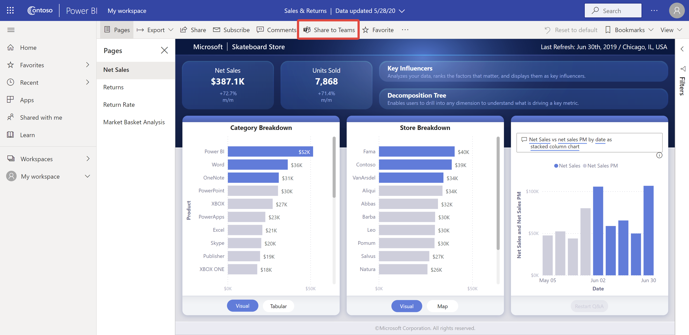

# Samenwerken in Microsoft Teams met Power BI

Met het **Power BI**-tabblad voor Microsoft Teams kunt u eenvoudig interactieve rapporten insluiten in Microsoft Teams-kanalen en -chats. Gebruik het **Power BI**-tabblad voor Microsoft Teams om uw collega's te helpen de gegevens te vinden die uw team gebruikt en de gegevens te bespreken in uw teamkanalen. Wanneer u een koppeling naar uw rapporten, dashboards en apps in het Microsoft Teams-berichtvak plakt, wordt in het koppelingsvoorbeeld informatie over de koppeling gegeven. Gebruik de knoppen **Delen met Teams** om snel gesprekken te starten wanneer u rapporten en dashboards in Power BI bekijkt.

## Vereisten

Voor een goede werking van het **Power BI**-tabblad voor Microsoft Teams moet u ervoor zorgen dat:

- Uw gebruikers over een Power BI Pro-licentie beschikken, of dat het rapport is ingesloten in een [Power BI Premium-capaciteit (EM of P SKU)](../admin/service-premium-what-is.md) met een Power BI-licentie.
- Microsoft Teams het **Power BI**-tabblad bevat.
- Gebruikers zich hebben aangemeld bij de Power BI-service om hun Power BI-licentie te activeren, zodat zij het rapport kunnen gebruiken.
- Als u een rapport wilt toevoegen aan Microsoft Teams met het **Power BI**-tabblad, moet u ten minste de rol Kijker hebben in de werkruimte die als host voor het rapport fungeert. Zie [Rollen in de nieuwe werkruimten](service-new-workspaces.md#roles-in-the-new-workspaces) voor informatie over de verschillende rollen.
- Als gebruikers het rapport willen bekijken op het **Power BI**-tabblad in Microsoft Teams, moeten ze gemachtigd zijn om het rapport te bekijken.
- Gebruikers moeten gebruikers van Microsoft Teams zijn met toegang tot kanalen en chats.

Voor een goede werking van de voorbeelden moet aan de volgende voorwaarden worden voldaan:

- Gebruikers moeten voldoen aan de vereisten voor het gebruik van het **Power BI**-tabblad voor Microsoft Teams.
- Gebruikers moeten bij Power BI zijn aangemeld.

Voor de goede werking van de knoppen **Delen met Teams** moet aan de volgende voorwaarden worden voldaan:

- Gebruikers moeten voldoen aan de vereisten voor het gebruik van het **Power BI**-tabblad voor Microsoft Teams.
- Gebruikers moeten bij Power BI zijn aangemeld.
- Power BI-beheerders hebben de tenantinstelling **Delen met Teams** niet uitgeschakeld.

## Uw rapport insluiten

Volg deze stappen als u uw rapport wilt insluiten in een Microsoft Teams-kanaal of -chat.

1. Open een kanaal of chat in Microsoft Teams en selecteer het pictogram **+** .

    

1. Selecteer het **Power BI**-tabblad.

    

1. Gebruik de beschikbare opties om een rapport in een werkruimte of een Power BI-app te selecteren.

    

1. De naam van het tabblad wordt automatisch bijgewerkt met de naam van het rapport, maar u kunt deze wijzigen.

1. Selecteer **Opslaan**.

## Ondersteunde rapporten voor het insluiten van het Power BI-tabblad

U kunt de volgende rapporttypen insluiten op het **Power BI**-tabblad:

- Interactieve en gepagineerde rapporten.
- Rapporten in **Mijn werkruimte**, nieuwe en klassieke werkruimten.
- Rapporten in Power BI-apps.

## Een koppelingsvoorbeeld verkrijgen

Volg deze stappen om een koppelingsvoorbeeld te krijgen voor inhoud in de Power BI-service.

1. Kopieer een koppeling naar een rapport, een dashboard of een app in de Power BI-service. U kunt bijvoorbeeld de koppeling uit de adresbalk van de browser kopiëren.

1. Plak de koppeling in het berichtvak van Microsoft Teams. Meld u aan bij de service voor het koppelingsvoorbeeld als u hierom wordt gevraagd. Mogelijk moet u enkele seconden wachten voordat het koppelingsvoorbeeld wordt geladen.

    

1. Na het aanmelden verschijnt het basiskoppelingsvoorbeeld.

    

1. Selecteer het pictogram **Uitvouwen** om de uitgebreide voorbeeldkaart weer te geven.

    

1. Op de uitgebreide voorbeeldkaart worden de koppeling en relevante actieknoppen weergegeven.

    

1. Verzend het bericht.

## De knoppen Delen met Teams in de Power BI-service

Volg deze stappen om koppelingen te delen met Microsoft Teams-kanalen en -chats wanneer u rapporten of dashboards bekijkt in de Power BI-service.

1. Gebruik de knoppen **Delen met Teams** op de actiebalk of in het contextmenu van een bepaalde visual.

   * Knop **Delen met Teams** op de actiebalk:

       
    
   * Knop **Delen met Teams** in het contextmenu van de visual:
    
      

1. Selecteer in het dialoogvenster **Delen met Microsoft Teams** het kanaal waarnaar of de personen waaraan u de koppeling wilt versturen. U kunt eventueel een bericht invoeren. U kunt worden gevraagd u eerst aan te melden bij Microsoft Teams.

    

1. Selecteer **Delen** om de koppeling te versturen.
    
1. De koppeling wordt toegevoegd aan bestaande gesprekken of er wordt een nieuwe chat gestart.

    

1. Selecteer de koppeling om het item te openen in de Power BI-service.

1. Als u het contextmenu voor een bepaalde visual hebt gebruikt, wordt de visual gemarkeerd als het rapport wordt geopend.

    
    

## Toegang verlenen tot rapporten

Wanneer een rapport wordt ingesloten in Microsoft Teams of een koppeling naar een item wordt verzonden, zijn gebruikers niet automatisch gemachtigd om het rapport te bekijken. U moet [gebruikers toestaan om het rapport in Power BI te bekijken](service-share-dashboards.md). U kunt een Microsoft 365-groep voor uw team gebruiken om dat gemakkelijker te maken.

> [!IMPORTANT]
> Controleer wie het rapport kan raadplegen in de Power BI-service en verleen toegang tot personen die niet worden vermeld.

Eén manier om ervoor te zorgen dat iedereen in een team toegang heeft tot rapporten, is door de rapporten in één werkruimte te plaatsen en de Microsoft 365-groep voor uw team toegang te geven.

## Koppelingsvoorbeelden

Er worden koppelingsvoorbeelden gegeven voor de volgende items in Power BI:
- Rapporten
- Dashboards
- Apps

Voor de service voor koppelingsvoorbeelden moeten uw gebruikers zich aanmelden. Als u zich wilt afmelden, selecteert u het pictogram **Power BI** onder aan het berichtvak. Selecteer vervolgens **Afmelden**.

## Een gesprek starten

Wanneer u een tabblad voor een Power BI-rapport toevoegt aan Microsoft Teams, wordt er automatisch een tabgesprek voor het rapport gemaakt.

- Selecteer in de rechterbovenhoek het pictogram **Tabgesprek weergeven**.

    

    De eerste opmerking is een koppeling naar het rapport. Iedereen in dat Microsoft Teams-kanaal kan het rapport in het gesprek bekijken en bespreken.

    
    
## Tenantinstelling Delen met Teams

Dankzij de tenantinstelling **Delen met Teams** in de Power BI-beheerdersportal kunnen organisaties de knoppen **Delen met Teams** verbergen. Indien de instelling is uitgeschakeld, zien gebruikers de knoppen **Delen met Teams** niet op de actiebalk of in de contextmenu's bij het bekijken van rapporten en dashboards in de Power BI-service.

## Bekende problemen en beperkingen

- Power BI ondersteunt niet dezelfde gelokaliseerde talen als Microsoft Teams. U kunt hierdoor mogelijk niet de juiste lokalisatie in het ingesloten rapport zien.
- Power BI-dashboards kunnen niet worden ingesloten in het **Power BI**-tabblad voor Microsoft Teams.
- Gebruikers zonder een Power BI-licentie of machtiging voor toegang tot het rapport krijgen een bericht dat de inhoud niet beschikbaar is.
- Mogelijk ontstaan er problemen als u Internet Explorer 10 gebruikt. <!--You can look at the [browsers support for Power BI](../consumer/end-user-browsers.md) and for [Microsoft 365](https://products.office.com/office-system-requirements#Browsers-section). -->
- [URL-filters](service-url-filters.md) worden niet ondersteund voor het **Power BI**-tabblad voor Microsoft Teams.
- In nationale clouds is het nieuwe **Power BI**-tabblad niet beschikbaar. Er is mogelijk een oudere versie beschikbaar die geen ondersteuning biedt voor de nieuwe werkruimte of rapporten in Power BI-apps.
- Nadat u het tabblad hebt opgeslagen, kunt u de naam van het tabblad niet wijzigen via de instellingen op het tabblad. Gebruik de optie **Naam wijzigen** om deze te wijzigen.
- Eenmalige aanmelding wordt niet ondersteund voor de service voor koppelingsvoorbeelden.
- Koppelingsvoorbeelden werken niet in chat- of privé-kanalen voor vergaderingen.
- De knoppen **Delen met Teams** werken mogelijk niet als de privacyinstelling in uw browser op strikt of streng staat ingesteld. Gebruik de optie **Problemen? Open een nieuw venster** als het dialoogvenster niet goed wordt geopend.
- **Delen met Teams** bevat geen koppelingsvoorbeeld.
- Koppelingsvoorbeelden en **Delen met Teams** geven gebruikers geen toestemming het item te bekijken. Toestemming moet afzonderlijk worden beheerd.
- De knop **Delen met Teams** is niet beschikbaar in visuele contextmenu's wanneer de auteur van een rapport de optie **Meer** op *Uit* heeft gezet voor de visual.

## Volgende stappen

- [Een dashboard delen met collega's en anderen](service-share-dashboards.md)
- [Een app maken en distribueren in Power BI](service-create-distribute-apps.md)
- [Wat is Power BI Premium?](../admin/service-premium-what-is.md)

Hebt u nog vragen? [Misschien dat de Power BI-community het antwoord weet](https://community.powerbi.com/).
