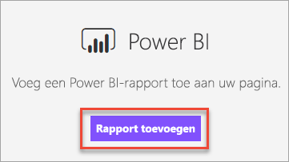
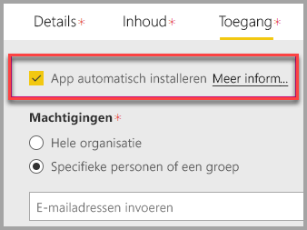

# Een rapportwebonderdeel insluiten in SharePoint Online

Met het nieuwe webonderdeel Rapport van Power BI voor SharePoint Online kunt u eenvoudig interactieve Power BI-rapporten insluiten in SharePoint Online-pagina's.

Wanneer u de nieuwe optie **Insluiten in SharePoint Online** gebruikt, wordt in ingesloten rapporten rekening gehouden met de machtigingen voor items en gegevensbeveiliging via [beveiliging op rijniveau](../admin/service-admin-rls.md) zodat u eenvoudig veilige interne portals kunt maken.

## Vereisten

Voor een goede werking van **Insluiten in SharePoint Online**-rapporten werken, is het volgende vereist:

* Een Power BI Pro-licentie of een [Power BI Premium-capaciteit (EM of P-SKU)](../admin/service-premium-what-is.md) met een Power BI-licentie.
* Voor het Power BI-webonderdeel voor SharePoint Online is [Moderne pagina's](https://support.office.com/article/Allow-or-prevent-creation-of-modern-site-pages-by-end-users-c41d9cc8-c5c0-46b4-8b87-ea66abc6e63b) vereist.
* Als u een ingesloten rapport wilt gebruiken, moeten gebruikers zich aanmelden bij Power BI-service om de Power BI-licentie te activeren.

> [!Note]
> Voor organisaties in nationale Power BI-clouds is er geen gratis licentie. In deze omgeving moeten alle gebruikers die toegang willen tot het ingesloten rapport in Sharepoint een Power BI Pro-licentie hebben.

## Uw rapport insluiten
Als u uw rapport in SharePoint Online wilt insluiten, moet u de rapport-URL ophalen en deze gebruiken in het Power BI-webonderdeel van SharePoint Online.

### Een rapport-URL ophalen

1. Open een rapport in de Power BI-service.

2. Selecteer in het menu **Delen** de optie **Rapport insluiten** > **SharePoint Online**.

    

3. Kopieer de rapport-URL in het dialoogvenster.

    

### Het Power BI-rapport toevoegen aan een SharePoint Online-pagina

1. Open de doelpagina in SharePoint Online en selecteer **Bewerken**.

    

    Of selecteer in Sharepoint Online **+ Nieuw** om een nieuwe moderne sitepagina te maken.

    

2. Selecteer de vervolgkeuzelijst **+** en selecteer vervolgens het webonderdeel **Power BI**.

    

3. Selecteer **Rapport toevoegen**.

      

4. Plak de eerder gekopieerde rapport-URL in het deelvenster **Power BI-rapportkoppeling**. Het rapport wordt automatisch geladen.

    

5. Selecteer **Publiceren** om de wijziging zichtbaar te maken voor uw SharePoint Online-gebruikers.

    

## Toegang verlenen tot rapporten

Wanneer een rapport wordt ingesloten in SharePoint Online, zijn gebruikers niet automatisch gemachtigd om het rapport weer te geven. U moet de weergavemachtigingen instellen in Power BI.

> [!IMPORTANT]
> Controleer wie het rapport kan raadplegen in de Power BI-service en verleen toegang tot personen die niet worden vermeld.

U kunt in Power BI op twee manieren toegang tot rapporten verschaffen. De eerste manier: als u een Microsoft 365-groep gebruikt om uw SharePoint Online-teamsite te maken, geeft u aan dat de gebruiker lid is van de **werkruimte binnen de Power BI-service** en de **SharePoint-pagina**. Zie [Een werkruimte beheren](service-manage-app-workspace-in-power-bi-and-office-365.md) voor meer informatie.

De tweede manier is om een rapport in een app in te sluiten en dit rapport rechtstreeks te delen met gebruikers:  

1. De auteur, die een Pro-gebruiker moet zijn, maakt een rapport in een werkruimte. Als u het rapport wilt delen met *gebruikers van de gratis versie van Power BI*, moet de werkruimte zijn ingesteld als een *Premium-werkruimte*.

2. De auteur publiceert de app en installeert deze. De auteur moet de app installeren, zodat deze toegang heeft tot de URL van het rapport dat wordt gebruikt voor het insluiten in SharePoint Online.

3. Nu moeten alle eindgebruikers de app ook installeren. U kunt ook de functie **App automatisch installeren** gebruiken. U kunt deze functie inschakelen in de [Power BI-beheerportal](../admin/service-admin-portal.md), zodat de app voor de eindgebruikers wordt geïnstalleerd.

   

4. De auteur opent de app en gaat naar het rapport.

5. De auteur kopieert de URL voor het insluiten van het rapport uit het rapport dat door de app is geïnstalleerd. Gebruik niet de oorspronkelijk rapport-URL uit de werkruimte.

6. Maak een nieuwe teamsite in SharePoint Online.

7. Voeg de eerder gekopieerde rapport-URL toe aan het webonderdeel Power BI.

8. Voeg alle eindgebruikers en/of groepen die gebruik gaan maken van de gegevens toe aan de SharePoint Online-pagina en in de Power BI-app die u hebt gemaakt.

    > [!NOTE]
    > **Gebruikers of groepen hebben toegang nodig tot zowel de SharePoint Online-pagina als het rapport in de Power BI-app om het rapport te kunnen zien op de SharePoint-pagina.**

De eindgebruiker kan nu naar de teamsite in SharePoint Online gaan en de rapporten bekijken op de pagina.

## Meervoudige verificatie

Als u zich voor uw Power BI-omgeving moet aanmelden met meervoudige verificatie, krijgt u mogelijk het verzoek om u aan te melden met een beveiligingsapparaat om uw identiteit te verifiëren. Dit gebeurt als u zich niet hebt aangemeld bij SharePoint Online met meervoudige verificatie, maar voor uw Power BI-omgeving een beveiligingsapparaat is vereist om het account te valideren.

> [!NOTE]
> Power BI biedt nog geen ondersteuning voor meervoudige verificatie met Azure Active Directory 2.0. Gebruikers krijgen een foutbericht te zien. Als dergelijke gebruikers zich met hun beveiligingsapparaat opnieuw aanmelden bij SharePoint Online, kunnen ze het rapport mogelijk weergeven.

## Instellingen van het webonderdeel

Hieronder vindt u de instellingen die u kunt aanpassen voor het Power BI-webonderdeel voor SharePoint Online.

| Eigenschap | Beschrijving |
| --- | --- |
| Paginanaam |Hiermee stelt u de standaardpagina van het webonderdeel in. Selecteer een waarde in de vervolgkeuzelijst. Als er geen pagina's worden weergegeven, zijn er twee mogelijke redenen: uw rapport bestaat uit één pagina of de URL die u hebt geplakt, bevat de naam van een pagina. Verwijder de rapportsectie uit de URL om een specifieke pagina te selecteren. |
| Weergave |Hiermee kunt u aanpassen hoe het rapport in de SharePoint Online-pagina past. |
| Navigatievenster weergeven |Geeft het navigatievenster van de pagina weer of verbergt het. |
| Filterdeelvenster weergeven |Geeft het Filterdeelvenster weer of verbergt het. |

## Rapporten die niet worden geladen

Als het rapport niet wordt geladen in het Power BI-webonderdeel, wordt mogelijk het volgende bericht weergegeven:

Er zijn twee gangbare redenen voor dit bericht.

1. U hebt geen toegang tot rapporten.
2. Het rapport is verwijderd.

Neem contact op met de eigenaar van de SharePoint Online-pagina om het probleem op te lossen.

## Licentieverlening

Gebruikers die in SharePoint een rapport bekijken, moeten een **Power BI Pro-licentie** hebben of de inhoud moet zich in een werkruimte bevinden in een **[Power BI Premium-capaciteit (EM of P SKU)](../admin/service-admin-premium-purchase.md)** .

## Bekende problemen en beperkingen

* Fout: 'Er is een fout opgetreden. Meld u af en meld u opnieuw aan. Ga vervolgens opnieuw naar deze pagina. Correlatie-ID: niet-gedefinieerde HTTP-antwoordstatus: 400, serverfoutcode 10001, bericht: Ontbrekende vernieuwingstoken'
  
  Als u dit foutbericht ontvangt, probeert u een van de onderstaande stappen voor probleemoplossing.
  
  1. Meld u af bij SharePoint en meld u weer aan. Sluit alle browservensters voordat u zich weer aanmeldt.

  2. Als voor uw gebruikersaccount meervoudige verificatie (MFA) is vereist, meldt u zich aan bij SharePoint met uw MFA-apparaat (telefoon-app, smartcard enzovoort).
  
  3. Accounts van Azure B2B-gastgebruikers worden niet ondersteund. Gebruikers zien het Power BI-logo in het onderdeel dat wordt geladen, maar het rapport wordt niet weergegeven.

* Power BI ondersteunt niet dezelfde gelokaliseerde talen als SharePoint Online. U kunt hierdoor mogelijk niet de juiste lokalisatie zien in een ingesloten rapport.

* Er kunnen problemen optreden als u Internet Explorer 10 gebruikt. <!--You can look at the [browsers support for Power BI](../fundamentals/power-bi-browsers.md) and for [Microsoft 365](https://products.office.com/office-system-requirements#Browsers-section). -->

* Het Power BI-webonderdeel is niet beschikbaar voor [nationale clouds](https://powerbi.microsoft.com/clouds/).

* De klassieke SharePoint Server wordt niet ondersteund met dit webonderdeel.

* [URL-filters](service-url-filters.md) worden niet ondersteund met het SPO-webonderdeel.

## Volgende stappen

* [Toestaan of verhinderen dat eindgebruikers moderne sitepagina's maken](https://support.office.com/article/Allow-or-prevent-creation-of-modern-site-pages-by-end-users-c41d9cc8-c5c0-46b4-8b87-ea66abc6e63b)  
* [Een app maken en distribueren in Power BI](service-create-distribute-apps.md)  
* [Een dashboard delen met collega's en anderen](service-share-dashboards.md)  
* [Wat is Power BI Premium?](../admin/service-premium-what-is.md)
* [Rapport insluiten in een veilige portal of website](service-embed-secure.md)

Hebt u nog vragen? [Misschien dat de Power BI-community het antwoord weet](https://community.powerbi.com/)
