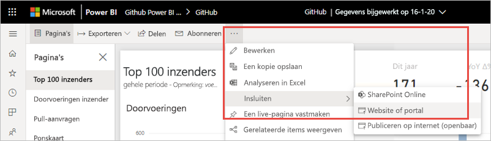
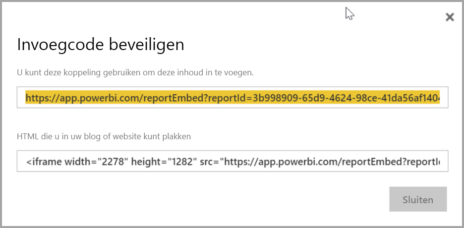
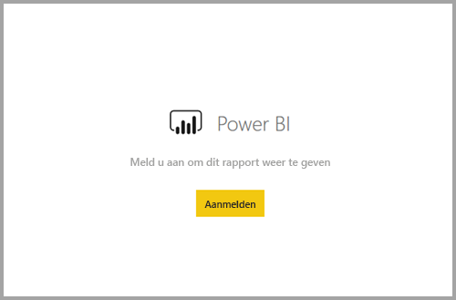
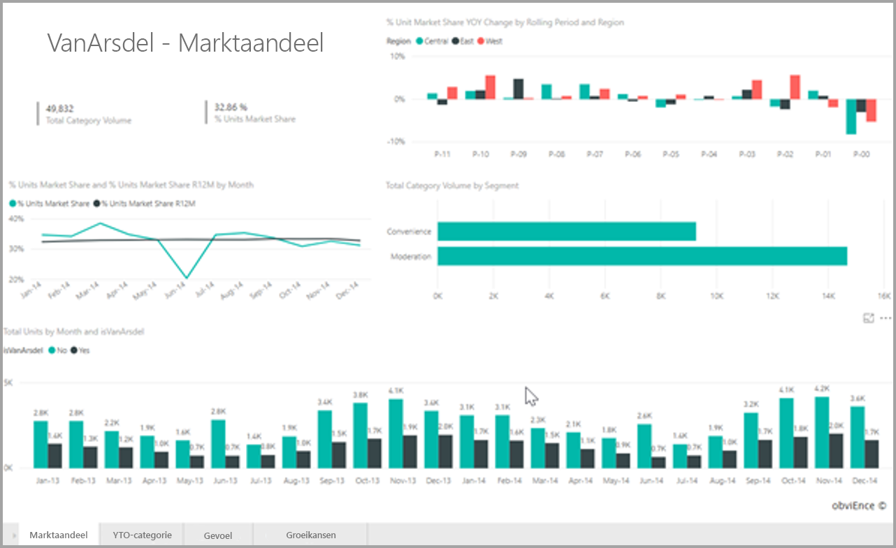
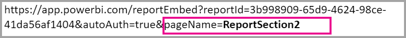

# <a name="embed-a-report-in-a-secure-portal-or-website"></a>Een rapport insluiten in een beveiligde portal of website

Met de nieuwe optie **Insluiten** voor Power BI-rapporten kunt u eenvoudig en veilig rapporten insluiten in interne webportals. Deze portals kunnen **cloudportals** zijn of **on-premises worden gehost**, zoals via SharePoint 2019. Ingesloten rapporten respecteren alle itemmachtigingen en gegevensbeveiliging via [beveiliging op rijniveau (RLS)](../admin/service-admin-rls.md). Deze bieden insluiting zonder codering in portals waarin URL's en iframes worden geaccepteerd. 

De optie **Insluiten** ondersteunt [URL-filters](service-url-filters.md) en URL-instellingen. Deze optie biedt een benadering voor integratie met portals waarvoor weinig codering en slechts basiskennis van HTML en JavaScript is vereist.

## <a name="how-to-embed-power-bi-reports-into-portals"></a>Power BI-rapporten insluiten in portals

1. Open een rapport in de Power BI-service.

2. Selecteer in het menu **Delen** de optie **Rapport insluiten** >  **Website of portal**.

    

2. In het dialoogvenster **Ingesloten code beveiligen** selecteert u **de koppeling die u kunt gebruiken om deze inhoud in te sluiten** of de **HTML die u kunt plakken in uw blog of website** in een iFrame.

    

3. Of een gebruiker een rapport-URL nu rechtstreeks opent of een rapport-URL opent die is ingesloten in een webportal, voor rapporttoegang is verificatie vereist. Het volgende scherm wordt weergegeven als een gebruiker zich niet heeft aangemeld bij Power BI in de browsersessie. Wanneer de gebruiker **Aanmelden** selecteert, wordt er mogelijk een nieuw browservenster of tabblad geopend. Laat de gebruiker controleren of er pop-upblokkeringen zijn als er geen aanmeldingsprompt wordt weergegeven.

    

4. Wanneer de gebruiker zich heeft aangemeld, wordt het rapport geopend met de gegevens en de mogelijkheid om tussen pagina's te navigeren en filters in te stellen. Alleen gebruikers met weergavemachtigingen kunnen het rapport bekijken in Power BI. Alle [RLS-regels (beveiliging op rijniveau)](../admin/service-admin-rls.md) worden eveneens toegepast. Ten slotte moet de gebruiker over de juiste licentie beschikken: de gebruiker moet een licentie hebben voor Power BI Pro of het rapport moet zich bevinden in een werkruimte met Power BI Premium-capaciteit. Steeds wanneer de gebruiker een nieuw browservenster opent, moet deze zich opnieuw aanmelden. Eenmaal aangemeld worden andere rapporten echter automatisch geladen.

    

5. Wanneer u een iFrame gebruikt, moet u mogelijk de **hoogte** en **breedte** bewerken zodat het op de webpagina van uw portal past.

    

## <a name="granting-report-access"></a>Rapporttoegang verlenen

Met de optie **Insluiten** worden gebruikers niet automatisch gemachtigd om het rapport te bekijken. Weergavemachtigingen worden ingesteld in de Power BI-service.

In de Power BI-service kunt u ingesloten rapporten delen met gebruikers die toegang nodig hebben. Als u een Microsoft 365-groep gebruikt, kunt u de gebruiker weergeven als lid van de werkruimte. Zie [Uw werkruimte beheren in Power BI en Microsoft 365](service-manage-app-workspace-in-power-bi-and-office-365.md) voor meer informatie.

## <a name="licensing"></a>Licentieverlening

Gebruikers die het ingesloten rapport willen bekijken, hebben een Power BI Pro-licentie nodig tenzij de inhoud zich bevindt in een werkruimte met [Power BI Premium-capaciteit (EM of P SKU)](../admin/service-admin-premium-purchase.md).

## <a name="customize-your-embed-experience-using-url-settings"></a>Uw insluitervaring aanpassen met behulp van URL-instellingen

U kunt de gebruikerservaring aanpassen met behulp van de invoerinstellingen van de insluitings-URL. In het verstrekte iFrame kunt u de **src**-instellingen van de URL bijwerken.

| Eigenschap  | Beschrijving  |
|-----------|--------------|
| pageName  | Met de queryreeksparameter **pageName** kunt u instellen welke pagina van het rapport u wilt openen. U vindt deze waarde aan het einde van de rapport-URL wanneer u een rapport bekijkt in de Power BI-service, zoals hieronder wordt weergegeven. |
| URL-filters  | U kunt [URL-filters](service-url-filters.md) gebruiken in de insluitings-URL die u hebt ontvangen in de Power BI-gebruikersinterface om de ingesloten inhoud te filteren. Op deze manier kunt u integraties bouwen met slechts weinig programmacode en alleen basiskennis van HTML en JavaScript.  |

## <a name="set-which-page-opens-for-an-embedded-report"></a>Instellen welke pagina van een ingesloten rapport wordt geopend 

U vindt de waarde **pageName** aan het einde van de rapport-URL wanneer u een rapport bekijkt in de Power BI-service.

1. Open het rapport vanuit de Power BI-service in uw webbrowser en kopieer vervolgens de adresbalk-URL.

    

2. Voeg de waarde van **pageName** toe aan de URL.

    

## <a name="filter-report-content-using-url-filters"></a>Rapportinhoud filteren met behulp van URL-filters 

U kunt [URL-filters](service-url-filters.md) gebruiken om verschillende rapportweergaven aan te bieden. Met bijvoorbeeld de onderstaande URL wordt het rapport zo gefilterd dat alleen gegevens voor de energiesector worden weergegeven.

Het gebruik van de combinatie van **pageName** en [URL-filters](service-url-filters.md) kan zeer handig zijn. Met basiskennis van HTML en JavaScript kunt u ervaringen bouwen.

Hier ziet u bijvoorbeeld een knop die u kunt toevoegen aan een HTML-pagina:

```html
<button class="textLarge" onclick='show("ReportSection", "Energy");' style="display: inline-block;">Show Energy</button>
```

Wanneer deze knop wordt geselecteerd, wordt een functie geactiveerd om het iFrame bij te werken met een bijgewerkte URL die het energiesectorfilter bevat.

```javascript
function show(pageName, filterValue)

{

var newUrl = baseUrl + "&pageName=" + pageName;

if(null != filterValue && "" != filterValue)

{

newUrl += "&$filter=Industries/Industry eq '" + filterValue + "'";

}

//Assumes there's an iFrame on the page with id="iFrame"

var report = document.getElementById("iFrame")

report.src = newUrl;

}
```


U kunt zo veel knoppen toevoegen als u wilt, om met weinig programmacode een aangepaste ervaring te maken. 

## <a name="considerations-and-limitations"></a>Overwegingen en beperkingen

* Gepagineerde rapporten worden ondersteund met scenario's voor beveiligde insluiting. Gepagineerde rapporten met URL-parameters worden ook ondersteund. Lees meer over het [opgeven van rapportparameters in een URL voor een gepagineerd rapport](../paginated-reports/report-builder-url-pass-parameters.md).

* Beveiligd insluiten werkt voor rapporten die zijn gepubliceerd naar de Power BI-service.

* Steeds wanneer de gebruiker een nieuw browservenster opent, moet deze zich opnieuw aanmelden om het rapport te kunnen bekijken.

* In sommige browsers moet u de pagina na het aanmelden vernieuwen, met name in de InPrivate- of Incognito-modus.

* Er kunnen problemen optreden als u niet-ondersteunde browserversies gebruikt. Power BI biedt ondersteuning voor [de volgende browsers](../fundamentals/power-bi-browsers.md).

* De klassieke SharePoint-server wordt niet ondersteund, omdat hiervoor versies van Internet Explorer nodig zijn die ouder zijn dan 11 of waarvoor de modus voor de compatibiliteitsweergave moet worden ingeschakeld.

* Voor een ervaring met eenmalige aanmelding gebruikt u de optie [Insluiten in SharePoint Online](service-embed-report-spo.md) of bouwt u een aangepaste integratie met behulp van de insluitingsmethode [Gebruiker is eigenaar van gegevens](../developer/embedded/embed-sample-for-your-organization.md). 

* De mogelijkheid van automatische verificatie die bij de optie **Insluiten** wordt verstrekt, werkt niet met de Power BI JavaScript-API. Gebruik voor de Power BI JavaScript-API de insluitingsmethode [Gebruiker is eigenaar van gegevens](../developer/embedded/embed-sample-for-your-organization.md). 

* De levensduur van het verificatietoken wordt bepaald op basis van uw AAD-instellingen. Wanneer het verificatietoken verloopt, moet de gebruiker de browser vernieuwen om een bijgewerkt verificatietoken te krijgen. De standaardlevensduur is één uur, maar in uw organisatie kan deze korter of langer zijn.  In dit scenario is het niet mogelijk om het token automatisch te vernieuwen.

## <a name="next-steps"></a>Volgende stappen

* [Manieren om uw werk te delen in Power BI](service-how-to-collaborate-distribute-dashboards-reports.md)

* [Een rapport filteren door queryreeksparameters in de URL te gebruiken](service-url-filters.md)

* [Insluiten met webonderdeel Rapport in SharePoint Online](service-embed-report-spo.md)

* [Publiceren op internet vanuit Power BI](service-publish-to-web.md)
