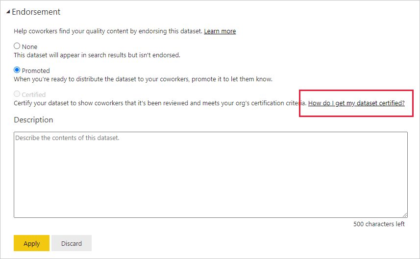
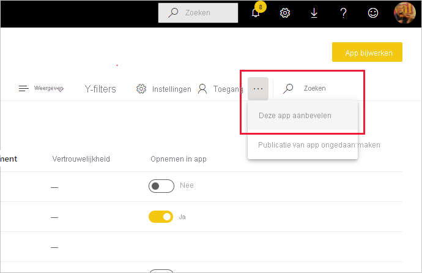

# Uw inhoud goedkeuren

Power BI biedt twee manieren waarop u uw waardevolle, hoogwaardige inhoud kunt goedkeuren om de zichtbaarheid ervan te vergroten: **promotie** en **certificering** .

* **Promotie** : Promotie is een manier om inhoud te markeren waarvan u denkt dat deze waardevol en de moeite waard is voor anderen. Dit stimuleert het gezamenlijk gebruik en de verspreiding van inhoud binnen een organisatie.

    Elke eigenaar van inhoud, en elk lid met schrijfmachtigingen voor de werkruimte waarin de inhoud zich bevindt, kan de inhoud promoveren wanneer deze goed genoeg wordt geacht om te delen.

* **Certificering** : Certificering betekent dat de inhoud voldoet aan de kwaliteitsnormen van de organisatie en dat de inhoud kan worden beschouwd als betrouwbaar, gezaghebbend en klaar voor gebruik in de hele organisatie.

    Alleen geautoriseerde revisoren kunnen inhoud certificeren. Eigenaren van inhoud die willen dat hun inhoud wordt gecertificeerd en die niet gemachtigd zijn om deze zelf te certificeren, moeten de richtlijnen van hun organisatie volgen om hun inhoud te laten certificeren.

Momenteel is het mogelijk om de volgende items goed te keuren
* Gegevenssets
* Gegevensstromen (preview)
* Rapporten (preview)
* Apps (preview)

In dit artikel wordt beschreven hoe u [inhoud promoveert](#promote-content), hoe u [inhoud certificeert](#certify-content) als u een geautoriseerde revisor bent en hoe u [certificering aanvraagt](#request-content-certification) als dat niet het geval is.

Raadpleeg [Goedkeuring: Power BI-inhoud promoveren en certificeren](service-endorsement-overview.md) voor meer informatie over goedkeuring.

## Inhoud promoveren

Als u inhoud wilt promoveren, moet u schrijfmachtigingen hebben voor de werkruimte waarin de inhoud zich bevindt die u wilt promoveren.

>[!NOTE]
>Ter illustratie wordt het goedkeuringsdialoogvenster voor gegevenssets hieronder weergegeven. De dialoogvensters voor de andere inhoudstypen zijn praktisch identiek, met dezelfde keuzerondjes. 

1. Ga naar de [instellingen](#how-to-get-to-content-settings) van de inhoud die u wilt promoveren.

1. Vouw de sectie Goedkeuring uit en selecteer **Verhoogd niveau** . Als u een gegevensset wilt promoveren, geeft u een korte beschrijving van de gegevensset.

    

1. Selecteer **Toepassen** .

## Inhoud certificeren

Inhoudscertificering is een grote verantwoordelijkheid en alleen geautoriseerde gebruikers kunnen inhoud certificeren. Andere gebruikers kunnen [inhoudscertificering aanvragen](#request-content-certification). In deze sectie wordt beschreven hoe u inhoud certificeert.

>[!NOTE]
>Ter illustratie wordt het goedkeuringsdialoogvenster voor gegevenssets hieronder weergegeven. De dialoogvensters voor de andere inhoudstypen zijn praktisch identiek, met dezelfde keuzerondjes. 

1. Verkrijg schrijfmachtigingen voor de werkruimte waarin de te certificeren inhoud zich bevindt. U kunt deze machtigingen aanvragen bij de eigenaar van de inhoud of bij iedereen met beheerdersmachtigingen voor de werkruimte.

1. Bekijk de inhoud zorgvuldig en bepaal of deze voldoet aan de certificeringsnormen van uw organisatie.

1. Als u besluit om de inhoud te certificeren, gaat u naar de werkruimte waar de inhoud zich bevindt en opent u vervolgens de [instellingen](#how-to-get-to-content-settings) van de inhoud die u wilt certificeren.

1. Vouw de sectie Goedkeuring uit en selecteer **Gecertificeerd** . 

    

1. Selecteer **Toepassen** .

## Inhoudscertificering aanvragen

Als u uw inhoud wilt certificeren, maar niet gemachtigd bent om dit te doen, volgt u de onderstaande stappen.

>[!NOTE]
>Ter illustratie wordt het goedkeuringsdialoogvenster voor gegevenssets hieronder weergegeven. De dialoogvensters voor de andere inhoudstypen zijn praktisch identiek, met dezelfde keuzerondjes. 

1. Ga naar de werkruimte waar de inhoud zich bevindt die u wilt certificeren en open vervolgens de [instellingen](#how-to-get-to-content-settings) van die inhoud.

1. Vouw de sectie Goedkeuring uit. De knop **Gecertificeerd** wordt grijs weergegeven, omdat u niet gemachtigd bent om inhoud te certificeren. Klik op de koppeling voor informatie over hoe u uw inhoud kunt laten certificeren.

    
    
    >[!NOTE]
    >Als u op de bovenstaande koppeling hebt geklikt, maar werd teruggeleid naar deze opmerking, betekent dit dat uw Power BI-beheerder geen informatie beschikbaar heeft gesteld. Neem in dat geval rechtstreeks contact op met de Power BI-beheerder.

## Instellingen voor inhoud ophalen

U opent het dialoogvenster Goedkeuring via de instellingen van de inhoud die u wilt goedkeuren. Volg de onderstaande instructies om de instellingen voor elk inhoudstype weer te geven.

* **Gegevenssets** : Beweeg in de lijstweergave de muisaanwijzer over de gegevensset die u wilt goedkeuren, klik op **Meer opties (...)** en kies vervolgens **Instellingen** in het menu dat wordt weergegeven.
* **Gegevensstromen** (preview): Beweeg in de lijstweergave de muisaanwijzer over de gegevensstroom die u wilt goedkeuren, klik op **Meer opties (...)** en kies vervolgens **Instellingen** in het menu dat wordt weergegeven.

* **Rapporten** (preview): Beweeg in de lijstweergave de muisaanwijzer over het rapport dat u wilt goedkeuren, klik op **Meer opties (...)** en kies vervolgens **Instellingen** in het menu dat wordt weergegeven. Als het rapport is geopend, kunt u ook **Bestand > Instellingen** kiezen.

* **Apps** (preview): Ga naar de app-werkruimte, klik op **Meer opties (...)** op de menubalk en kies **Deze app goedkeuren** .

    

## Volgende stappen

* [Meer informatie over inhoudsgoedkeuring](service-endorsement-overview.md)
* [Inhoudscertificering inschakelen](../admin/service-admin-setup-certification.md) (Power BI-beheerders)
* Vragen? [Misschien dat de Power BI-community het antwoord weet](https://community.powerbi.com/)
