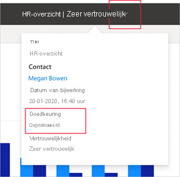

# Goedkeuring: Power BI-inhoud promoveren en certificeren

## Overzicht van goedkeuring

Organisaties hebben vaak grote hoeveelheden Power BI-inhoud beschikbaar om te delen en opnieuw te gebruiken door hun Power BI-gebruikers. Het kan lastig zijn om betrouwbare, gezaghebbende inhoud te identificeren. Goedkeuring is een manier om het voor gebruikers gemakkelijker te maken om de hoogwaardige inhoud te vinden die ze nodig hebben. Goedgekeurde inhoud is duidelijk gelabeld, zowel in Power BI als op andere plaatsen waar gebruikers Power BI-inhoud zoeken (zoals Excel). Het krijgt ook prioriteit bij sommige zoekopdrachten en u kunt er in sommige lijsten op sorteren.

Er zijn twee soorten goedkeuring: **promotie** en **certificering**.

* **Promotie**: Met promotie kunnen gebruikers inhoud markeren die ze waardevol en de moeite waard vinden en die klaar is voor gebruik door anderen. Op deze manier wordt de gezamenlijke verspreiding van inhoud binnen de organisatie gestimuleerd.

    Elke eigenaar van inhoud, en elk lid met schrijfmachtigingen voor de werkruimte waarin de inhoud zich bevindt, kan eenvoudig de inhoud promoveren wanneer deze goed genoeg wordt geacht om te delen.

* **Certificering**: Certificering betekent dat de inhoud voldoet aan de kwaliteitsnormen van de organisatie en dat deze kan worden beschouwd als betrouwbare, gezaghebbende inhoud die klaar is voor gebruik in de hele organisatie.

    Alleen een geselecteerde groep revisoren (gedefinieerd door de Power BI-beheerder) is gemachtigd om inhoud te certificeren. Eigenaren van inhoud die hun inhoud gecertificeerd willen hebben en die niet gemachtigd zijn om deze zelf te certificeren, moeten de richtlijnen van hun organisatie volgen om hun inhoud te laten certificeren.

    **Certificering is alleen beschikbaar als een Power BI-beheerder deze optie heeft ingeschakeld en geconfigureerd voor uw organisatie**.

In de onderstaande afbeelding ziet u hoe goedgekeurde inhoud (gepromoveerd en gecertificeerd) duidelijk wordt aangegeven wanneer u een gegevensset zoekt voor het maken van een rapport.

## Inhoudstypen die kunnen worden goedgekeurd
Power BI ondersteunt momenteel goedkeuring voor:
* Gegevenssets
* Gegevensstromen (preview)
* Rapporten (preview)
* Apps (preview)

## Goedgekeurde inhoud identificeren

Goedgekeurde inhoud is gelabeld met badges en pictogrammen in lijsten, kaarten en andere locaties, zowel in Power BI als in locaties zoals Excel waar Power BI-inhoud te vinden is. De volgende badges en pictogrammen identificeren goedgekeurde inhoud.

|Badge|Pictogram|
|---------|---------|
|||
|||
|||

Als u zich in een rapport of app bevindt, kunt u de goedkeuringsstatus ook bekijken via de koptekst.
* Certificering wordt aangegeven in zowel de koptekst als in de vervolgkeuzelijst van de koptekst, waar u ook kunt zien door wie de inhoud is gecertificeerd.

    

* Promotie wordt alleen aangegeven in de vervolgkeuzelijst van de koptekst.
 
    

## Bepalen of u een app of een rapport gaat goedkeuren

Goedkeuring is bedoeld om te worden gebruikt voor de inhoudsitems (apps, rapporten, gegevenssets en gegevensstromen) die gebruikers moeten kunnen vinden, gebruiken en eventueel opnieuw delen.

Wanneer u gegevens deelt met een brede doelgroep, wordt aanbevolen een best practice van Power BI te volgen en die gegevens via een app te delen. Als u deze best practice volgt, wilt u dat mensen die app eenvoudig kunnen vinden. In dergelijke gevallen moet u de app goedkeuren. 

Als u het handig vindt om rapporten rechtstreeks te delen, kunt u het rapport zelf goedkeuren. 

Of u nu een rapport of een app deelt, als de onderliggende gegevenssets zijn opgeschoond en klaar om te worden gedeeld, is het een goed idee om ook de gegevenssets goed te keuren. Hetzelfde geldt voor gegevensstromen.  

## Volgende stappen

* [Power BI-inhoud promoveren of certificeren](service-endorse-content.md)
* [Certificering inschakelen voor uw organisatie](../admin/service-admin-setup-certification.md) (Power BI-beheerders)
* Vragen? [Misschien dat de Power BI-community het antwoord weet](https://community.powerbi.com/)