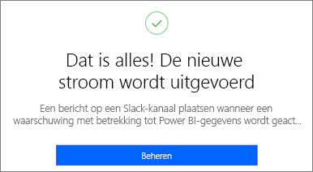
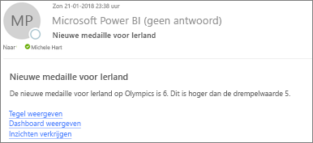
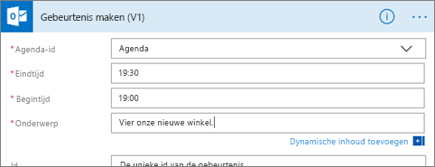
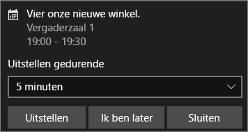

# Power BI-gegevenswaarschuwingen integreren met Power Automate

[Power Automate](/power-automate/getting-started) is een SaaS-aanbieding voor het automatiseren van werkstromen voor het groeiende aantal apps en SaaS-services. U kunt taken automatiseren door uw favoriete apps en services,inclusief Power BI, te integreren om meldingen te ontvangen, bestanden te synchroniseren, gegevens te verzamelen en meer. In dit artikel automatiseert u de generatie van een e-mail van een Power BI-gegevenswaarschuwing.

[Ga direct aan de slag met Power Automate.](/power-automate/getting-started)

## Vereisten
In dit artikel wordt laten zien hoe u twee verschillende stromen maakt: een vanuit een sjabloon en de ander compleet nieuw. Als u alles op de voet wilt volgen, [maakt u een gegevensmelding Power BI](../create-reports/service-set-data-alerts.md) en [meldt u zich aan voor power Automate](https://flow.microsoft.com/#home-signup). Helemaal gratis.

## Een stroom maken met een sjabloon
In deze taak gebruiken we een sjabloon om een eenvoudige stroom te maken die wordt geactiveerd via een Power BI-gegevenswaarschuwing (melding).

1. Meld u aan bij Power Automate (flow.microsoft.com).
2. Selecteer **Sjablonen**, zoek naar **Power BI** > **Een e-mail verzenden naar een doelgroep wanneer een waarschuwing met betrekking tot Power BI-gegevens wordt geactiveerd**.
   
    :::image type="content" source="media/service-flow-integration/power-automate-templates.png" alt-text="Schermopname in Power Automate: Een e-mail verzenden naar een doelgroep wanneer een waarschuwing met betrekking tot Power BI-gegevens wordt geactiveerd.":::

### De stroom maken
Dit sjabloon heeft één trigger, een Power BI-gegevenswaarschuwing en één actie om een e-mail te sturen. Wanneer u een veld selecteert, wordt in Power Automate dynamische inhoud weergegeven die u kunt opnemen.  In dit voorbeeld hebben we de waarde en de URL van de tegel opgenomen in de berichttekst.

1. Selecteer **Doorgaan**.

    :::image type="content" source="media/service-flow-integration/power-automate-power-bi-mail.png" alt-text="Schermopname in Power Automate: Een e-mail verzenden naar een doelgroep wanneer een waarschuwing met betrekking tot Power BI-gegevens wordt geactiveerd.":::

1. Selecteer in het venster **Waarschuwings-id** een Power BI-gegevenswaarschuwing. Zie [Gegevenswaarschuwingen in Power BI](../create-reports/service-set-data-alerts.md) als u wilt weten hoe een waarschuwing maakt.
   
    :::image type="content" source="media/service-flow-integration/power-automate-select-alert-id.png" alt-text="Schermopname in Power Automate: Een e-mail verzenden naar een doelgroep wanneer een waarschuwing met betrekking tot Power BI-gegevens wordt geactiveerd.":::
2. Voer een of meer geldige e-mailadressen in.

3. Power Automate genereert automatisch een **onderwerp** en **tekst** voor u, die u kunt behouden of bewerken. De tekst gebruikt HTML voor opmaak.

    :::image type="content" source="media/service-flow-integration/power-automate-autogenerated-email.png" alt-text="Schermopname in Power Automate: Een e-mail verzenden naar een doelgroep wanneer een waarschuwing met betrekking tot Power BI-gegevens wordt geactiveerd.":::

1. Wanneer u klaar bent met uw bericht, selecteert u **Volgende stap** of **Opslaan**.  De stroom is gemaakt en geëvalueerd.  Als er fouten worden aangetroffen, ontvangt u een melding in Power Automate.
2. Als er fouten worden aangetroffen, selecteert u **Stroom bewerken** om ze te corrigeren. Selecteer anders **Gereed** om de nieuwe stroom uit te voeren.
   
   
5. Wanneer de gegevenswaarschuwing wordt geactiveerd, stuurt Power Automate een e-mail naar het adres dat u hebt opgegeven.  
   
   

## Een volledig nieuwe stroom maken
In deze taak maken we een eenvoudige maar volledig nieuwe stroom die wordt geactiveerd via een Power BI-gegevenswaarschuwing (melding).

1. Meld u aan bij Power Automate (flow.microsoft.com).
2. Selecteer **Maken** > **Geautomatiseerde stroom**.

    :::image type="content" source="media/service-flow-integration/power-automate-create-automated-flow.png" alt-text="Schermopname in Power Automate: Een e-mail verzenden naar een doelgroep wanneer een waarschuwing met betrekking tot Power BI-gegevens wordt geactiveerd.":::   
3. Geef in **Een geautomatiseerde stroom maken** uw stroom een naam.
1. Zoek in **De trigger van uw stroom kiezen** naar **Power BI**.
1. Selecteer **Power BI - Wanneer een door gegevens gegenereerde waarschuwing wordt geactiveerd** > **Maken**.

    :::image type="content" source="media/service-flow-integration/power-automate-build-automated-flow.png" alt-text="Schermopname in Power Automate: Een e-mail verzenden naar een doelgroep wanneer een waarschuwing met betrekking tot Power BI-gegevens wordt geactiveerd.":::

### Uw stroom bouwen
1. Selecteer in het venster **Waarschuwings-id** de naam van uw waarschuwing. Zie [Gegevenswaarschuwingen in Power BI](../create-reports/service-set-data-alerts.md) als u wilt weten hoe een waarschuwing maakt.

    :::image type="content" source="media/service-flow-integration/power-automate-select-alert-id-scratch.png" alt-text="Schermopname in Power Automate: Een e-mail verzenden naar een doelgroep wanneer een waarschuwing met betrekking tot Power BI-gegevens wordt geactiveerd.":::   

2. Selecteer **Nieuwe stap**.
   
3. Zoek in **Een actie kiezen** naar **Outlook** > **Gebeurtenis maken**.

    :::image type="content" source="media/service-flow-integration/power-automate-choose-action-create-event.png" alt-text="Schermopname in Power Automate: Een e-mail verzenden naar een doelgroep wanneer een waarschuwing met betrekking tot Power BI-gegevens wordt geactiveerd.":::   
4. Vul de gebeurtenisvelden in. Wanneer u een veld selecteert, wordt in Power Automate dynamische inhoud weergegeven die u kunt opnemen.
   
   
5. Als u klaar bent, selecteert u **Stroom maken**.  De stroom wordt opgeslagen en geëvalueerd in Power Automate. Als er geen fouten zijn, selecteert u **Gereed** om de stroom uit te voeren.  De nieuwe stroom wordt toegevoegd aan de pagina **Mijn stromen**.
   
   
6. Wanneer de stroom wordt geactiveerd door uw Power BI-gegevenswaarschuwing, ontvangt u een Outlook-gebeurtenismelding die vergelijkbaar is met de volgende.
   
    

## Volgende stappen
* [Aan de slag met Power Automate](/power-automate/getting-started/)
* [Gegevensmeldingen instellen in de Power BI-service](../create-reports/service-set-data-alerts.md)
* [Gegevenswaarschuwingen instellen op uw iPhone](../consumer/mobile/mobile-set-data-alerts-in-the-mobile-apps.md)
* Hebt u nog vragen? [Misschien dat de Power BI-community het antwoord weet](https://community.powerbi.com/)