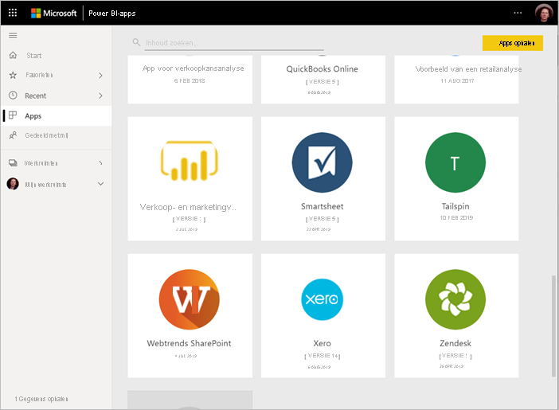
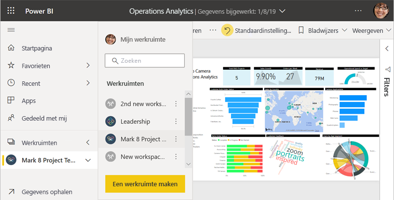
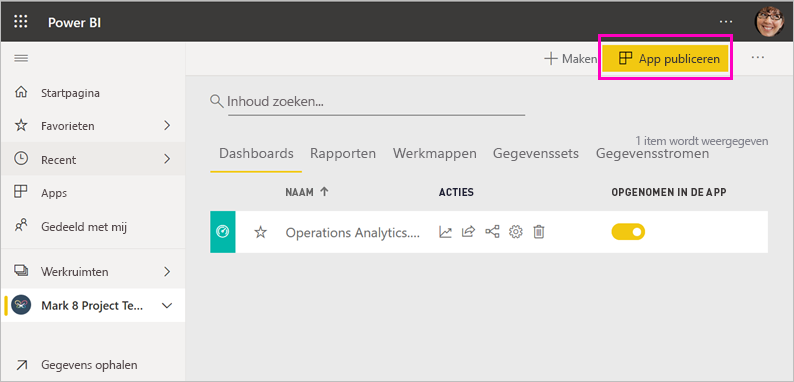
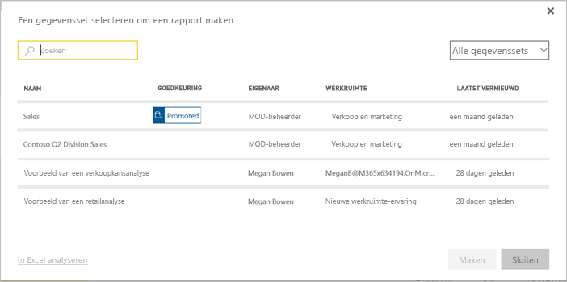
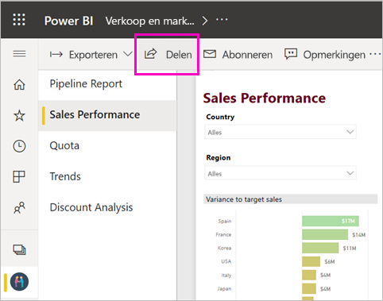
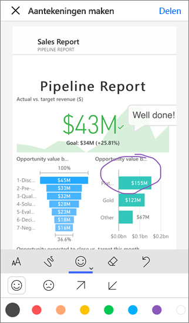

# Uw werk delen in Power BI

U hebt dashboards en rapporten gemaakt. Misschien hebt u er ook wel samen aan gewerkt met collega's. In dat geval moeten anderen toegang hebben tot de dashboards en rapporten. Wat is de beste manier om ze te distribueren? In dit artikel vergelijken we deze opties voor samenwerken en delen in Power BI:

* Samenwerken met collega's om betekenisvolle rapporten en dashboards te maken in *werkruimten*.
* Deze dashboards en rapporten opnemen in *apps* en ze distribueren naar een grotere groep of de hele organisatie.
* *Gedeelde gegevenssets* maken die uw collega's kunnen gebruiken als basis voor hun eigen rapporten, in hun eigen werkruimten.
* Dashboards of rapporten vanuit de service of de mobiele Power BI-apps delen met een paar personen.
* Aantekeningen toevoegen en delen vanuit de mobiele Power BI-apps.
* Een rapport insluiten in Microsoft Teams.
* Rapporten afdrukken.
* Rapporten *insluiten* in beveiligde portals of openbare websites.
* Een *sjabloon-app* maken die u kunt distribueren naar externe Power BI-gebruikers via Microsoft AppSource.

Bij alle opties moet u voor het delen van de inhoud een [licentie voor Power BI Pro](../fundamentals/service-features-license-type.md) hebben of moet de inhoud zich in een [Premium-capaciteit](../admin/service-premium-what-is.md) bevinden. De licentievereisten verschillen voor de collega's die uw inhoud bekijken, afhankelijk van welke optie u kiest. In de volgende secties gaan we in op de details. 

*Apps in de Power BI-service*

## Samenwerken in een werkruimte

Wanneer teams samenwerken, hebben de teamleden toegang tot dezelfde documenten nodig zodat ze snel kunnen samenwerken. Werkruimten in Power BI bieden een plaats waar teams het eigendom en beheer van dashboards, rapporten, gegevenssets en werkmappen kunnen delen. Soms organiseren Power BI-gebruikers hun werkruimten op basis van organisatorische structuren, in andere gevallen maken ze werkruimten voor specifieke projecten. Ook kunnen organisaties diverse werkruimten gebruiken om verschillende versies van de door hun gebruikte rapporten of dashboards op te slaan. 

Werkruimten bevatten rollen waarmee wordt bepaald welke machtigingen uw collega's hebben. U kunt deze rollen gebruiken om te bepalen wie de hele werkruimte kan beheren of wie inhoud van de werkruimte mag bewerken en distribueren.

U kunt natuurlijk inhoud in Mijn werkruimte plaatsen en deze vanaf die locatie met anderen delen. Maar werkruimten zijn beter voor samenwerking dan Mijn werkruimte, omdat personen hiermee samen eigenaar van de inhoud kunnen zijn. U en uw hele team kunnen eenvoudig wijzigingen aanbrengen of anderen toegang geven. Mijn werkruimte kan het beste door personen worden gebruikt voor eenmalige of persoonlijke inhoud.

Stel dat u een voltooid dashboard hebt dat u wilt delen met uw collega's. Wat is de beste manier om uw collega's toegang tot het dashboard te geven? Het antwoord is afhankelijk van een aantal factoren. 

- Als collega's het dashboard actueel moeten houden of toegang tot alle inhoud in de werkruimte moeten hebben, kunt u ze toevoegen aan de werkruimte. 
- Als een collega alleen dat dashboard en niet alle inhoud in de werkruimte hoeft te zien, kunt u opnieuw uit meerdere mogelijkheden kiezen. Als een paar mensen alleen dat ene dashboard nodig hebben, kunt u het dashboard waarschijnlijk het beste delen.
- Als het dashboard echter onderdeel is van een grotere set inhoud die u wilt distribueren naar veel collega's, is het publiceren van een *app* waarschijnlijk de beste optie.

Power BI heeft een nieuwe werkruimte-ervaring. Lees [Nieuwe werkruimten maken](service-create-the-new-workspaces.md) om te zien hoe werkruimten zijn veranderd. 

## Inzichten in een app distribueren

Stel dat u uw dashboard wilt distribueren naar een brede doelgroep in uw organisatie. Uw collega's en u hebben een *werkruimte* gemaakt en daarna dashboards, rapporten en gegevenssets gemaakt en verfijnd in de werkruimte. Nu gaat u de gewenste dashboards en rapporten selecteren en als een app publiceren, voor een groep of voor de hele organisatie.

Apps zijn gemakkelijk te vinden en installeren in de Power BI-service ([https://app.powerbi.com](https://app.powerbi.com)). U kunt gebruikers in uw bedrijf een directe koppeling sturen naar de app of ze kunnen ernaar zoeken in AppSource. Als de Power BI-beheerder u hiervoor toestemming geeft, kunt u een app automatisch installeren in de Power BI-accounts van uw collega's. Lees meer over het [publiceren van uw apps](service-create-distribute-apps.md).

Nadat ze een app hebben geïnstalleerd, kunnen ze deze bekijken in hun browser of op een mobiel apparaat.

Gebruikers die de app willen bekijken, moeten ook beschikken over een Power BI Pro-licentie, of de app moet worden opgeslagen in een Premium-capaciteit van Power BI. Lees [Wat is Power BI Premium?](../admin/service-premium-what-is.md) voor meer informatie.

U kunt ook apps publiceren voor personen buiten uw organisatie. Deze personen kunnen de app-inhoud bekijken en op verschillende manieren weergeven, maar niet delen met anderen. U kunt nu *sjabloon-apps* maken en deze implementeren voor elke klant met Power BI.

## Een gegevensset delen

Sommige mensen zijn beter in het maken van goed ontworpen gegevensmodellen van hoge kwaliteit in hun rapporten dan anderen. Misschien bent u zo iemand. De hele organisatie kan profiteren van dezelfde goed ontworpen gegevensmodellen. Gebruik voor dergelijke situaties *gedeelde gegevenssets*. Wanneer u een rapport met een gegevensmodel voor iedereen maakt, kunt u het rapport opslaan in de Power BI-service en de juiste mensen toestemming geven het te gebruiken. Vervolgens kunnen ze uw gegevensset voor hun eigen rapporten gebruiken. Op die manier baseren alle mensen hun rapporten op dezelfde gegevens en zien ze dezelfde 'versie van de waarheid'.

Meer informatie over [het maken en gebruiken van gedeelde gegevenssets](../connect-data/service-datasets-across-workspaces.md).

## Dashboards en rapporten delen

Stel dat u een dashboard en een rapport hebt voltooid in uw eigen Mijn werkruimte of in een werkruimte en u een paar andere personen toegang tot de onderdelen wilt geven. Eén manier om dat te doen, is door ze te *delen*. 

U hebt een Power BI Pro-licentie nodig om uw inhoud te delen. Dit geldt ook voor de personen met wie u de inhoud deelt, tenzij de inhoud zich in een werkruimte in een [Premium-capaciteit](../admin/service-premium-what-is.md) bevindt. Wanneer u een dashboard of rapport deelt, kunnen de personen het dashboard of rapport bekijken en de inhoud ervan op verschillende manieren weergeven, maar niet bewerken. Ze zien dezelfde gegevens die u in het dashboard of rapport ziet en krijgen toegang tot alle gegevens in de onderliggende gegevensset, tenzij [beveiliging op rijniveau (RLS)](../admin/service-admin-rls.md) wordt toegepast. De collega's met wie u het dashboard deelt, kunnen het weer delen met andere collega's, maar alleen als u dat toestaat. 

U kunt ook delen met personen buiten uw organisatie. Deze personen kunnen het dashboard en rapport ook bekijken en de inhoud ervan op verschillende manieren weergeven, maar niet delen. 

Meer informatie over het [delen van dashboards en rapporten](service-share-dashboards.md) vanuit de Power BI-service. U kunt ook een filter toevoegen aan een koppeling en [ een gefilterde weergave van uw rapport delen](service-share-reports.md).

## Aantekeningen toevoegen en delen vanuit de mobiele Power BI-apps

In de mobiele Power BI-apps voor iOS en Android kunt u aantekeningen toevoegen aan een tegel, rapport of visueel element en het onderdeel vervolgens via e-mail delen met anderen.

U deelt een momentopname van de tegel, het rapport of het visuele element. Dit betekent dat de ontvangers een weergave van het onderdeel zien precies zoals deze was op het moment dat u het e-mailbericht hebt verstuurd. Het e-mailbericht bevat ook een koppeling naar het dashboard of rapport. Als de ontvangers een licentie voor Power BI Pro hebben, of als de inhoud zich bevindt in een [Premium capaciteit](../admin/service-premium-what-is.md), en u het object al met ze hebt gedeeld, kunnen ze het openen. U kunt momentopnamen van tegels naar iedereen verzenden, niet alleen naar collega's in hetzelfde e-maildomein.

Lees hier meer over het [toevoegen van aantekeningen en het delen van tegels, rapporten en visuele elementen](../consumer/mobile/mobile-annotate-and-share-a-tile-from-the-mobile-apps.md) vanuit de mobiele apps voor iOS en Android.

U kunt ook [een momentopname van een tegel delen](../consumer/mobile/mobile-windows-10-phone-app-get-started.md) vanuit de Power BI-app voor Windows 10-apparaten.

## Een rapport insluiten in Microsoft Teams

Vergroot de gegevensgestuurde samenwerking in uw organisatie door uw Power BI-rapporten en gepagineerde rapporten in Power BI in te sluiten in Microsoft Teams. U kunt afzonderlijke Power BI-tabbladen voor elk afzonderlijk rapport toevoegen en elk tabblad de naam van het rapport of een andere naam geven. Uw collega's kunnen uw rapporten weergeven op de Power BI-tabbladen in Teams. Ze kunnen ook het gespreksvenster en opmerkingen over het rapport direct in Teams openen. Lees meer over [het insluiten van een rapport in Microsoft Teams](service-embed-report-microsoft-teams.md).

## Afdrukken of opslaan als PDF of een ander statisch bestand

U kunt vanuit de Power BI-service een dashboard, dashboardtegel, rapportpagina of visualisatie in zijn geheel afdrukken of opslaan als PDF-bestand (of andere statische bestandsindeling). Rapporten kunnen alleen pagina voor pagina worden afgedrukt. U kunt niet het hele rapport in één keer afdrukken. Lees hier meer over het [afdrukken of opslaan als een statisch bestand](../consumer/end-user-print.md).

## Rapporten insluiten in beveiligde portals of openbare websites

### Insluiten in beveiligde portals

U kunt Power BI-rapporten insluiten in portals of websites waar uw gebruikers ze verwachten te zien.  
U kunt met **Insluiten in SharePoint Online** en de optie **Insluiten** in de Power BI-service veilig rapporten insluiten voor uw interne gebruikers. 

- **Insluiten in SharePoint Online** werkt met het Power BI-webonderdeel voor SharePoint Online. Er wordt hiermee een ervaring geboden voor eenmalige aanmelding met controle over hoe het rapport wordt ingesloten. 
- De optie **Insluiten** werkt met elke portal of website die ondersteuning biedt voor ingesloten inhoud met een URL of een iFrame. 

Ongeacht welke optie u kiest, Power BI dwingt alle machtigingen en beveiliging van gegevens af voordat gebruikers inhoud kunnen zien. De persoon die het rapport weergeeft, moet over de juiste licentie beschikken. Meer informatie over [Insluiten in SharePoint Online](service-embed-report-spo.md) en de optie [Insluiten](service-embed-secure.md) in Power BI.

### Publiceren naar openbare websites

U kunt met **Publiceren op internet** Power BI-rapporten publiceren op internet door interactieve visualisaties in te sluiten in blogberichten, op websites, in social media en in andere middelen voor onlinecommunicatie. Dit is mogelijk voor alle apparaten. Iedereen op internet kan uw rapporten dan weergeven en u hebt geen controle over wie kan zien wat u hebt gepubliceerd. Er is ook geen licentie voor Power BI nodig. Publiceren op internet is alleen beschikbaar voor rapporten die u kunt bewerken. U kunt geen rapporten op internet publiceren als deze met u zijn gedeeld of als ze zijn opgenomen in een app. Lees hier meer over [publiceren op internet](service-publish-to-web.md).

>[!Warning]
>Gebruik [Publiceren op internet](service-publish-to-web.md) alleen om inhoud openbaar te delen, niet voor intern delen.

## Sjabloon-apps maken en implementeren

*Sjabloon-apps* zijn ontworpen om openbaar te worden gedistribueerd, vaak in Microsoft AppSource. U bouwt een app die u door weinig of geen code te schrijven voor elke klant met Power BI kunt implementeren. Uw klanten maken verbinding met hun eigen gegevens en instantiëren hun eigen accounts. Meer informatie over [Power BI-sjabloon-apps](../connect-data/service-template-apps-overview.md).

## Volgende stappen

* [Dashboards delen met collega's en anderen](service-share-dashboards.md)
* [Een app opslaan en publiceren in PowerApps](service-create-distribute-apps.md)
* [Rapport insluiten in een beveiligde portal of website](service-embed-secure.md)

Wilt u feedback geven? Dit kan op de [site van de Power BI-community](https://community.powerbi.com/).

Hebt u nog vragen? [Misschien dat de Power BI-community het antwoord weet](https://community.powerbi.com/)
