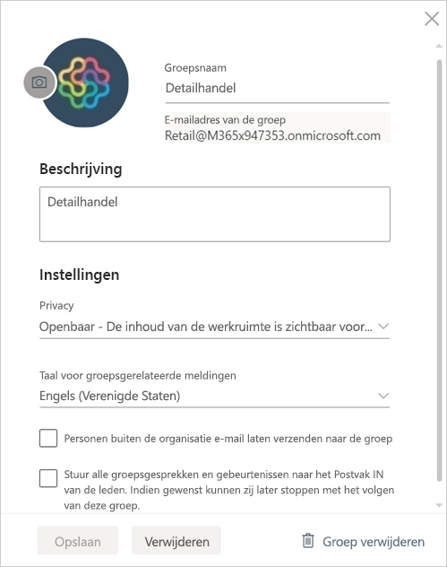

# Uw werkruimte beheren in Power BI en Microsoft 365

Als maker of beheerder van een [werkruimte in Power BI](service-create-distribute-apps.md) of in Microsoft 365, beheert u bepaalde aspecten van de werkruimte in Power BI. Andere aspecten beheert u in Microsoft 365.

> [!NOTE]
> In de nieuwe werkruimte-ervaring is de relatie tussen Power BI-werkruimten en Microsoft 365-groepen gewijzigd. Er wordt niet automatisch een Microsoft 365-groep gemaakt wanneer u een van de nieuwe werkruimten maakt. Meer informatie over [het maken van de nieuwe werkruimten](service-create-the-new-workspaces.md).

In **Power BI** kunt u:

* Leden aan een werkruimte toevoegen of hieruit verwijderen. U kunt een lid van de werkruimte ook beheerder maken.
* Bewerk de naam van de werkruimte.
* Verwijder de werkruimte. Hierdoor wordt ook de Microsoft 365-groep verwijderd.

In **Microsoft 365** kunt u het volgende doen:

* Groepsleden aan uw werkruimte toevoegen of hieruit verwijderen. U kunt een lid ook eigenaar maken.
* De groepsnaam, afbeelding, beschrijving en andere instellingen bewerken.
* Het e-mailadres van de groep zien.
* De groep verwijderen.

U hebt een [Power BI Pro](../fundamentals/service-features-license-type.md)-licentie nodig om beheerder of lid van een werkruimte te zijn. Uw app-gebruikers hebben ook een Power BI Pro-licentie nodig, tenzij uw werkruimte zich in een Power BI Premium-capaciteit bevindt. Lees [Wat is Power BI Premium?](../admin/service-premium-what-is.md) voor meer informatie.

## Uw werkruimte bewerken in Power BI

1. Selecteer in de Power BI-service de pijl naast **Werkruimten** > selecteer **Meer opties** (…) naast de naam van de werkruimte > **Deze werkruimte bewerken**.

   

   > [!NOTE]
   > U ziet **Deze werkruimte bewerken** alleen als u beheerder van een werkruimte bent.

1. Hier kunt u de werkruimte een andere naam geven, leden toevoegen of verwijderen of de werkruimte verwijderen.

   

1. Selecteer **Opslaan** of **Annuleren**.

## Eigenschappen van een Power BI-werkruimte bewerken in Microsoft 365

U kunt aspecten van een werkruimte ook rechtstreeks bewerken in Outlook voor Microsoft 365.

### De leden van de werkruimtegroep bewerken

1. Selecteer in de Power BI-service de pijl naast **Werkruimten** > selecteer **Meer opties** (...) naast de naam van uw werkruimte > **Leden**.

   

   Hiermee opent u de groepsweergave van Outlook voor Microsoft 365 van uw werkruimte. Mogelijk moet u zich aanmelden bij uw bedrijfsaccount.

1. Selecteer de rol naast de naam van een teamlid om deze persoon **lid** of **eigenaar** te maken. Selecteer de **X** om de persoon uit de groep te verwijderen.

   

### Een afbeelding toevoegen en andere werkruimte-eigenschappen instellen

Wanneer u uw app distribueert vanuit de werkruimte, is de afbeelding die u hier toevoegt de afbeelding voor uw app. Zie [Een afbeelding toevoegen aan uw Microsoft 365-werkruimte](service-create-workspaces.md#add-an-image-to-your-microsoft-365-workspace-optional) in het artikel **De nieuwe werkruimten maken**.

1. Ga in de Outlook voor Microsoft 365-weergave van uw werkruimte naar het tabblad **Over** en selecteer **Bewerken**.

    
1. U kunt de naam, beschrijving en taal bewerken voor groepsgerelateerde meldingen. U kunt hier ook een afbeelding toevoegen en andere eigenschappen instellen.

   

1. Selecteer **Opslaan** of **Verwijderen**.

## Volgende stappen

* [Een app publiceren in Power BI](service-create-distribute-apps.md)

* Hebt u nog vragen? [Misschien dat de Power BI-community het antwoord weet](https://community.powerbi.com/)
