# Metrische gebruiksgegevens controleren in de nieuwe werkruimte-ervaring (preview)

Wanneer u weet hoe uw inhoud wordt gebruikt, kunt u de invloed ervan demonstreren en prioriteiten vaststellen voor uw inspanningen. De metrische gegevens over gebruik kunnen aantonen dat een van uw rapporten dagelijks wordt gebruikt door een enorm segment van de organisatie en ze kunnen aantonen dat een dashboard dat u hebt gemaakt helemaal niet wordt weergegeven. Dit type feedback is zeer waardevol bij uw inspanningen werk leidt.

Als u rapporten maakt in moderne werkruimten, hebt u toegang tot verbeterde rapporten met metrische gegevens over gebruik waarmee u kunt ontdekken hoe deze rapporten worden gebruikt in uw organisatie en wie ze gebruiken. U kunt ook algemene prestatieproblemen identificeren. De verbeterde gebruiksrapporten in de moderne werkruimte-ervaring vervangen de bestaande rapporten over metrische gegevens over gebruik die worden beschreven in [Metrische gegevens over het gebruik van Power BI-dashboards en -rapporten bewaken](service-usage-metrics.md).

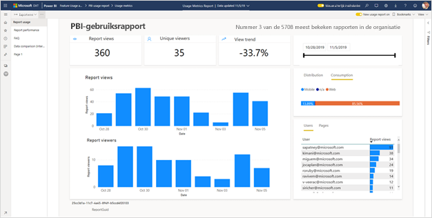

> [!NOTE]
> U kunt alleen rapporten met metrische gegevens over gebruik uitvoeren in de Power BI-service. Als u een rapport met metrische gegevens over gebruik echter opslaat of vastmaakt aan een dashboard, kunt u het rapport openen en bewerken op mobiele apparaten.

## Vereisten

- U hebt een licentie voor Power BI Pro nodig om de metrische gegevens over gebruik uit te voeren en te raadplegen. Het is wel zo dat er voor alle gebruikers gebruiksgegevens worden vastgelegd, ongeacht de licentie die aan hen is toegewezen.
- Om toegang te krijgen tot verbeterde metrische gegevens over het gebruik van een rapport, moet het rapport zich in een moderne werkruimte bevinden en moet u bewerkingstoegang tot dat rapport hebben.
- Uw Power BI-beheerder moet metrische gegevens over gebruik hebben ingeschakeld voor makers van inhoud. De Power BI-beheerder kan ook het verzamelen van gegevens per gebruiker hebben ingeschakeld in de functie voor metrische gegevens over gebruik. Lees hier hoe u [deze opties inschakelt in de beheerportal](../admin/service-admin-portal.md#control-usage-metrics).

## Een verbeterd rapport met metrische gegevens over gebruik maken en weergeven

Alleen gebruikers met machtigingen van een beheerder, lid of inzender kunnen het verbeterde rapport voor metrische gegevens over het gebruik weergeven. De machtigingen van een kijker zijn niet voldoende. Als u ten minste een inzender bent voor een moderne werkruimte waarin uw rapport zich bevindt, kunt u de volgende procedure gebruiken om de verbeterde metrische gegevens over het gebruik weer te geven:

1. Open de werkruimte met het rapport waarvoor u de metrische gegevens over gebruik wilt analyseren.
2. Open in de lijst met werkruimte-inhoud het contextmenu van het rapport en selecteer **Rapport voor metrische gegevens over het gebruik weergeven**. U kunt ook het rapport openen, het contextmenu openen op de opdrachtbalk en vervolgens **Metrische gegevens over gebruik** selecteren.

    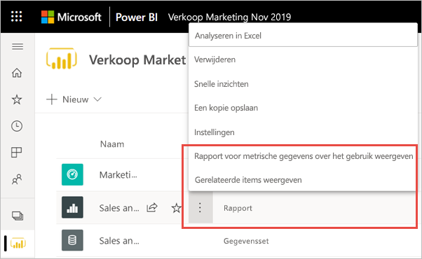

1. De eerste keer dat u dit doet, maakt Power BI het rapport met metrische gegevens over gebruik en laat u weten wanneer het gereed is.

    

1. Selecteer **Metrische gegevens over het gebruik weergeven** om de resultaten te bekijken.
2. Als dit de eerste keer is dat u dit doet, bestaat de kans dat Power BI het oude rapport met metrische gegevens over gebruik opent. Als u het verbeterde rapport met verbeterde metrische gegevens over gebruik wilt weergeven, zet u de schakelaar Nieuw gebruiksrapport uit in de rechterbovenhoek op **Aan**.

    

    > [!NOTE]
    > De schakelaar Nieuw gebruiksrapport uit ziet u alleen zien als uw rapport zich in een moderne werkruimte bevindt. Verouderde werkruimten bieden geen ondersteuning voor verbeterde rapporten met metrische gegevens over gebruik.

## Het verbeterde rapport met metrische gegevens over gebruik

Wanneer u het verbeterde rapport met metrische gegevens over gebruik weergeeft door de bovenstaande procedure te volgen, genereert Power BI een vooraf samengesteld rapport met metrische gegevens over gebruik voor die inhoud voor de afgelopen 30 dagen. Het rapport lijkt op de Power BI-rapporten waarmee u al bekend bent. U kunt segmenteren op basis van hoe uw eindgebruikers toegang hebben gekregen, of ze toegang kregen via de website of mobiele app, enzovoort. Naarmate uw rapporten zich ontwikkelen, vult het rapport met metrische gegevens over gebruik zich ook. Het wordt elke dag wordt bijgewerkt met nieuwe gegevens.

> [!NOTE]
> Rapporten met metrische gegevens over gebruik worden niet weergegeven in Recent, Werkruimten, Favorieten of andere inhoudslijsten. Ze kunnen niet worden toegevoegd aan een app. Als u een tegel van een rapport met metrische gegevens over gebruik vastmaakt aan een dashboard, kunt u dat dashboard niet toevoegen aan een app.

### Gegevensset Rapport voor metrische gegevens over het gebruik

Het verbeterde rapport met metrische gegevens over gebruik is afhankelijk van de gegevensset Rapport voor metrische gegevens over het gebruik, die automatisch wordt gemaakt door Power BI wanneer u het verbeterde rapport met metrische gegevens over gebruik voor het eerst start. Power BI vernieuwt deze gegevensset vervolgens dagelijks. Hoewel u het vernieuwingsschema niet kunt wijzigen, kunt u wel de referenties bijwerken die Power BI gebruikt om de metrische gegevens over gebruik te vernieuwen. Dit kan nodig zijn om geplande vernieuwing te hervatten als de referenties zijn verlopen of als u de gebruiker die het rapport met metrische gegevens over het gebruik voor het eerst heeft gestart, hebt verwijderd uit de werkruimte waarin de gegevensset zich bevindt.

> [!NOTE]
> In de preview-versie kan de gegevensset voor metrische gebruiksgegevens kleine wijzigingen hebben die van invloed zijn op aangepaste rapporten.  

### Pagina's van rapport met metrische gegevens over gebruik

Het verbeterde rapport met metrische gegevens over gebruik bevat de volgende rapportpagina's:

- **Report usage**    Bevat informatie over rapportweergaven en rapportbekijkers, zoals hoeveel gebruikers het rapport op datum hebben bekeken.
- **Report performance**    Toont de typische openingstijden van het rapport, onderverdeeld naar verbruiksmethode en browsertypen.
- **FAQ**     Biedt antwoord op veelgestelde vragen, zoals What is a "Viewer" en what is a "View"?

### Welke metrische gegevens worden gerapporteerd?

| **Pagina** | **Meting** | **Beschrijving** |
| --- | --- | --- |
| Gebruik rapporteren | Report views | Er wordt een rapportweergave geregistreerd op het moment dat iemand een rapport opent. De definitie van een weergave verschilt van eerdere rapporten met metrische gegevens over gebruik. Het wijzigen van rapportpagina's wordt niet langer beschouwd als een extra weergave. Activiteiten zoals delen en vastmaken worden niet langer in aanmerking genomen bij metrische gebruiksgegevens.|
| Gebruik rapporteren | Unique viewers | Een kijker is iemand die het rapport ten minste eenmaal heeft geopend tijdens de periode (op basis van het AAD-gebruikersaccount). |
| Gebruik rapporteren | View trend | De weergavetrend weerspiegelt de wijzigingen in het aantal weergaven in de loop van de tijd. De eerste helft van de geselecteerde tijdsperiode wordt vergeleken met de tweede helft. |
| Gebruik rapporteren | Date slicer | U kunt de tijdsperiode op de pagina Report usage wijzigen, bijvoorbeeld om de trends voor week-over-week-of tweewekelijks te berekenen. In de linkerbenedenhoek van de pagina Report usage kunt u de vroegste en de laatste datum bepalen waarvoor gebruiksgegevens beschikbaar zijn voor het geselecteerde rapport. |
| Gebruik rapporteren | Positie | Op basis van het aantal weergaven toont de rangorde de populariteit van een rapport in vergelijking met alle andere rapporten in de organisatie. De positie 1 betekent dat het rapport de meeste weergaven van alle rapporten in de organisatie heeft.   |
| Gebruik rapporteren | Report views per day | Het totale aantal weergaven per dag. |
| Gebruik rapporteren | Report viewers per day | Het totale aantal verschillende gebruikers die het rapport hebben weergegeven (op basis van het AAD-gebruikersaccount). |
| Gebruik rapporteren | Distribution method | Hoe gebruikers toegang hebben gekregen tot het rapport, zoals door lid te zijn van een werkruimte, doordat het rapport met hen is gedeeld of door een app te installeren. |
| Gebruik rapporteren | Platform slicer | Of het rapport is geopend via de Power BI-service (powerbi.com), Power BI Embedded of een mobiel apparaat. |
| Gebruik rapporteren | Users with report views | Toont de lijst met gebruikers die het rapport hebben geopend, gesorteerd op aantal weergaven. |
| Gebruik rapporteren | Pagina's | Als het rapport meer dan één pagina heeft, segmenteert u het rapport op de pagina('s) die is (zijn) weergegeven. Als u een lijstoptie voor 'Leeg' ziet, betekent dit dat een rapportpagina onlangs is toegevoegd (binnen 24 uur wordt de daadwerkelijke naam van de nieuwe pagina weergegeven in de slicerlijst) en/of dat rapportpagina's zijn verwijderd. 'Leeg' legt deze situaties vast. |
| Report performance | Typical opening time | De typische openingstijd van het rapport komt overeen met het 50e percentiel van de tijd die nodig is om het rapport te openen. Met andere woorden: het is de tijd waarbinnen 50% van de open-rapport-acties wordt voltooid. De pagina Report performance toont ook de typische openingstijden van het rapport, onderverdeeld naar verbruiksmethode en browsertype. Op dit moment meten we de prestaties voor het eerste keer laden van het rapport en het weergeven van de eerste pagina. De meting begint wanneer het rapport wordt aangevraagd en eindigt wanneer de laatste visual wordt weergegeven. Rapportinteracties, zoals segmenteren, filteren of wijzigen van pagina's, worden niet opgenomen in de prestatiegegevens.  |
| Report performance | Opening time trend | De trend van de openingstijd weerspiegelt de wijzigingen in de prestaties van het openen van het rapport in de loop van de tijd. De openingstijden voor het rapport van de eerste helft van de geselecteerde tijdsperiode worden vergeleken met de openingstijden van de tweede helft. |
| Report performance | Date slicer | U kunt de tijdsperiode op de pagina Report performance wijzigen, bijvoorbeeld om de trends voor week-over-week-of tweewekelijks te berekenen. In de linkerbenedenhoek van de pagina Report performance kunt u de vroegste en de laatste datum bepalen waarvoor gebruiksgegevens beschikbaar zijn voor het geselecteerde rapport. |
| Report performance | Daily performance | De prestaties voor 10%, 50% en 90% van de open-rapport-acties berekend voor elke afzonderlijke dag. |
| Report performance | 7-day performance | De prestaties voor 10%, 50% en 90% van de open-rapport-acties berekend over de afgelopen zeven dagen voor elke datum. |
| Report performance | Consumption method | Hoe gebruikers het rapport hebben geopend, zoals via de Power BI-service (powerbi.com), Power BI Embedded of een mobiel apparaat. |
| Report performance | Browsers | De browser waarmee de gebruikers het rapport hebben geopend, zoals Firefox, Edge en Chrome. |

## Referenties voor rapport met metrische gegevens over gebruik bijwerken

Gebruik de volgende procedure om een gegevensset voor het rapport met metrische gegevens over het gebruik over te nemen en de referenties bij te werken.

1. Open de werkruimte met het rapport waarvoor u de gegevensset voor het rapport met metrische gegevens over gebruik wilt bijwerken.
2. Selecteer in de zwarte balk bovenaan het pictogram **Instellingen** en selecteer vervolgens **Instellingen**.

    

3. Ga naar het tabblad **Gegevenssets**.

1. Selecteer de gegevensset Rapport voor metrische gegevens over het gebruik. 

    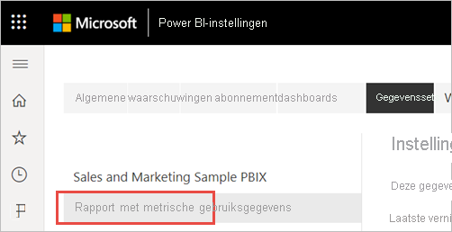
    
    Als u niet de huidige eigenaar van de gegevensset bent, moet u het eigendom overnemen voordat u de referenties van de gegevensbron kunt bijwerken. 
    
5. Selecteer de knop **Overnemen** en selecteer vervolgens in het dialoog venster **De gegevenssetinstellingen overnemen** opnieuw **Overnemen**.

1. Selecteer **Referenties bewerken** onder **Gegevensbronreferenties**.

    

2. Selecteer **Aanmelden**in het dialoogvenster **Rapport voor metrische gegevens over het gebruik configureren**.

    

1. Voltooi de aanmeldingsstappen en lees de melding dat de gegevensbron is bijgewerkt.

    > [!NOTE]
    > De gegevensset Rapport voor metrische gegevens over het gebruik bevat gebruiksgegevens voor de afgelopen dertig dagen. Het kan tot 24 uur duren voordat nieuwe gebruiksgegevens worden geïmporteerd. Het is niet mogelijk om de gegevens handmatige te vernieuwen via de gebruikersinterface van Power BI.

## Rapporten met metrische gegevens over gebruik uitschakelen

Rapporten met metrische gegevens over gebruik zijn een functie die de Power BI- of globale beheerder kan in- of uitschakelen. Beheerders hebben gedetailleerde controle welke gebruikers toegang hebben tot metrische gegevens over gebruik hebben; ze zijn standaard ingeschakeld voor alle gebruikers in de organisatie. Zie [Metrische gegevens over gebruik beheren](../admin/service-admin-portal.md#control-usage-metrics) in het artikel over de beheerportal voor meer informatie over deze instellingen.

> [!NOTE]
> Alleen beheerders voor de Power BI-tenant kunnen de beheerportal bekijken en instellingen bewerken.

## Gebruikersgegevens uitsluiten van rapporten met metrische gegevens over gebruik

Standaard wordt gegevens per gebruiker ingeschakeld voor metrische gegevens over gebruik. Accountgegevens van gebruikers van inhoud worden in het metrische rapport opgenomen. Als beheerders deze gegevens niet willen weergeven aan sommige of alle gebruikers, kunnen ze gebruikersgegevens uitsluiten van uw gebruiksrapport door de optie Gegevens per gebruiker in metrische gegevens over gebruik voor makers van inhoud uit te schakelen in het gedeelte Tenantinstellingen van de beheerportal van Power BI. Dit kan voor bepaalde beveiligingsgroepen of voor de hele organisatie.

1. Ga in de beheerportal naar het tabblad **Tenantinstellingen** en vouw onder **Instellingen voor controle en gebruik** de optie **Gegevens per gebruiker in metrische gegevens over gebruik voor makers van inhoud** uit en selecteer **Uitgeschakeld**.

2. Selecteer desgewenst **Alle bestaande gegevens per gebruiker verwijderen uit de huidige inhoud van metrische gegevens over gebruik** en selecteer daarna **Toepassen**.

    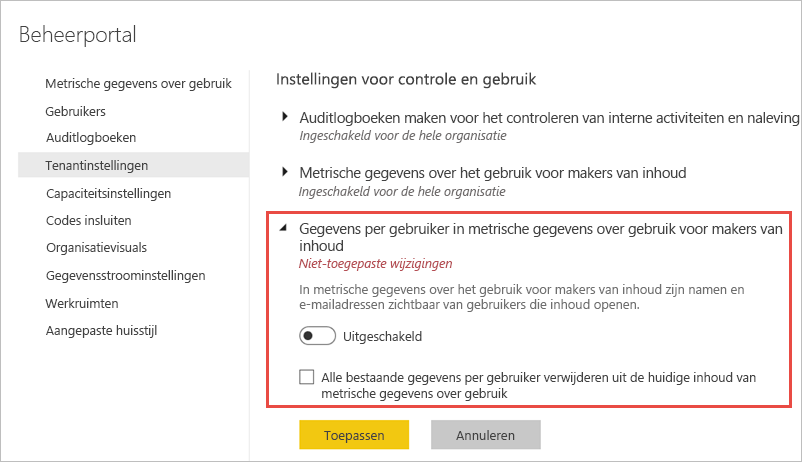

Als gebruikersgegevens worden uitgesloten, wordt in het gebruiksrapport naar gebruikers verwezen als Unnamed.

Wanneer beheerders metrische gegevens over gebruik uitschakelen voor de gehele organisatie, kunnen ze de optie Alle bestaande inhoud voor metrische gegevens over gebruik verwijderen gebruiken om alle bestaande rapporten en dashboardtegels te verwijderen die zijn gemaakt met behulp van de rapporten met metrische gegevens over gebruik. Deze optie verwijdert alle toegang tot metrische gegevens voor alle gebruikers in de organisatie die deze mogelijk al gebruiken. Het verwijderen van bestaande metrische gegevens over gebruik kan niet ongedaan worden gemaakt.

> [!NOTE]
> Alleen beheerders voor de Power BI-tenant kunnen de beheerportal zien en de instelling Alle bestaande gegevens per gebruiker verwijderen uit de huidige inhoud van metrische gegevens over gebruik configureren.

## Het rapport met metrische gegevens over gebruik aanpassen

U hebt verschillende mogelijkheden om u te verdiepen in de rapportgegevens of om uw eigen rapporten te maken op basis van de onderliggende gegevensset:

- **[Maak een kopie van het rapport](#create-a-copy-of-the-usage-report) in de Power BI-service.**   Gebruik **Een kopie opslaan** om een afzonderlijk exemplaar te maken van het rapport met metrische gegevens over gebruik, dat u vervolgens kunt aanpassen aan uw specifieke behoeften.
- **[Maak verbinding met de gegevensset](#create-a-new-usage-report-in-power-bi-desktop) met een nieuw rapport.**   Voor elke werkruimte heeft de gegevensset de naam Rapport voor metrische gegevens over het gebruik, zoals eerder is uitgelegd in de sectie [Gegevensset Rapport voor metrische gegevens over het gebruik](#usage-metrics-report-dataset). U kunt Power BI Desktop gebruiken om aangepaste rapporten met metrische gegevens over gebruik te maken op basis van de onderliggende gegevensset.
- **[Gebruik Analyseren in Excel](#analyze-usage-data-in-excel).**   U kunt ook gebruikmaken van draaitabellen, grafieken en slicerfuncties in Microsoft Excel 2010 SP1 of hoger om de Power BI-gebruiksgegevens te analyseren. Lees meer over de functie [Analyseren in Excel](service-analyze-in-excel.md).

### Een kopie maken van het gebruiksrapport

Wanneer u een kopie maakt van het alleen-lezen, vooraf samengestelde rapport, maakt Power BI een bewerkbaar exemplaar van het rapport. Op het eerste gezicht is er geen verschil te zien. U kunt het rapport nu echter openen in de bewerkingsweergave, nieuwe visualisaties filters en pagina's toevoegen, bestaande visualisaties wijzigen of verwijderen, en nog veel meer. Power BI slaat het nieuwe rapport in de huidige werkruimte op.

1. Selecteer in het nieuwe rapport met metrische gegevens over gebruik het menu **Meer opties** (...) en selecteer **Een kopie opslaan**.

    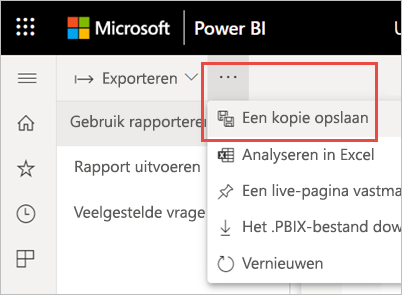

2. Voer in het dialoogvenster **Uw rapport opslaan** een naam in en selecteer **Opslaan**.

    Power BI maakt een bewerkbaar Power BI-rapport, dat wordt opgeslagen in de huidige werkruimte, en opent de kopie van het rapport. 

3. Selecteer het menu **Meer opties** (...) en selecteer vervolgens **Bewerken** om over te schakelen naar de bewerkingsweergave. 

    U kunt bijvoorbeeld andere filters instellen, nieuwe pagina's toevoegen, nieuwe visualisaties maken, de lettertypen en kleuren opmaken, enzovoort.

1. Het nieuwe rapport wordt opgeslagen op het tabblad Rapporten in de huidige werkruimte en wordt ook toegevoegd aan de inhoudslijst Recent.

    
    
> [!NOTE]
> Wanneer u een kopie bewaart van het rapport van metrische gebruiksgegevens, wordt deze behandeld als een standaard Power BI-rapport. Het is toegankelijk voor alle gebruikers die weergavemachtigingen hebben in de werkruimte, inclusief gebruikers met de Viewer-rol.

### Een nieuw gebruiksrapport maken in Power BI Desktop

U kunt een nieuw gebruiksrapport maken in Power BI Desktop, op basis van de gegevensset Rapport voor metrische gegevens over het gebruik. Als u een verbinding tot stand wilt brengen met de gegevensset Rapport voor metrische gegevens over het gebruik en uw eigen rapport wilt maken, moet u zijn aangemeld bij de Power BI-service in Power BI Desktop. 

1. Open Power BI Desktop.

2. Als u niet bent aangemeld bij de Power BI-service, selecteert u **Aanmelden** in het menu **Bestand**.

1. Als u verbinding wilt maken met de gegevensset Rapport voor metrische gegevens over het gebruik, selecteert u **Gegevens ophalen** op het lint **Startpagina**.

4. Selecteer in het linkerdeelvenster **Power Platform**en vervolgens **Power BI-gegevenssets** > **Verbinding maken**.

    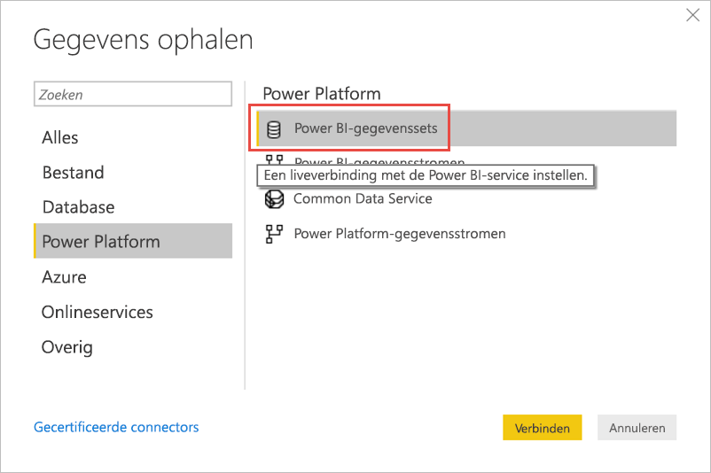

1. Scrol naar de gewenste gegevensset of typ *Rapport voor metrische gegevens over het gebruik* in het zoekvak. 

6. Controleer in de kolom Werkruimte of u de juiste gegevensset hebt geselecteerd en selecteer vervolgens **Maken**. 

    

7. Controleer de lijst met velden in Power BI Desktop, waarmee u toegang krijgt tot de tabellen, kolommen en metingen in de geselecteerde gegevensset.

    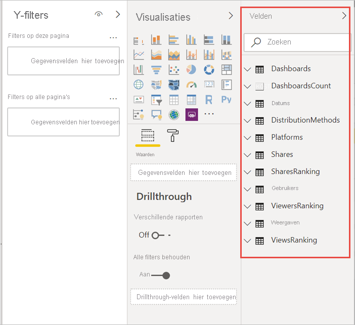

1. U kunt nu aangepaste gebruiksrapporten maken en delen, allemaal vanuit dezelfde gegevensset Rapport voor metrische gegevens over het gebruik.

### Gebruiksgegevens analyseren in Excel

Wanneer u in Excel verbinding maakt met de gebruiksgegevens, kunt u draaitabellen maken waarin de vooraf gedefinieerde metingen worden gebruikt. Excel-draaitabellen bieden geen ondersteuning voor aggregatie van numerieke velden met slepen en neerzetten wanneer de tabellen zijn verbonden met een Power BI-gegevensset.

1. Als u dat nog niet hebt gedaan, [maakt u eerst een kopie van het rapport met metrische gegevens over gebruik](#create-a-copy-of-the-usage-report). 

2. Open het nieuwe rapport met metrische gegevens over gebruik, selecteer het menu **Meer opties** (...) en selecteer **Analyseren in Excel**.

    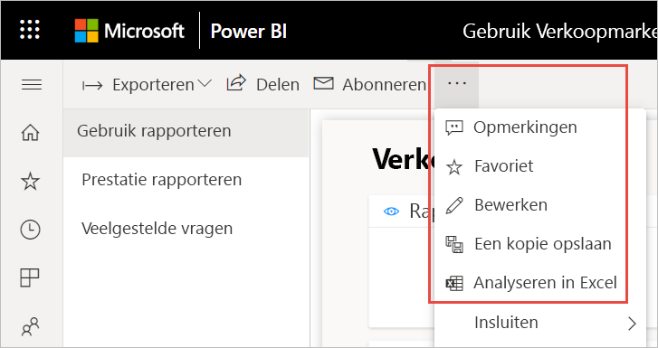

1. Als u het dialoogvenster **Eerst moet u een aantal updates in Excel uitvoeren** ziet, selecteert u **Downloaden** en installeert u de meest recente updates voor Power BI-connectiviteit. Selecteer **Ik heb deze updates al geïnstalleerd** als dat al is gebeurd.

    

    > [!NOTE]
    > Sommige organisaties hebben mogelijk groepsbeleidsregels ingesteld die voorkomen dat de vereiste Analyseren in Excel-updates worden geïnstalleerd in Excel. Als het niet lukt om de updates te installeren, vraagt u dit na bij uw beheerder.

1. Er verschijnt in de browser een dialoogvenster met de vraag wat u wilt doen met het bestand Usage Metrics report.odc. Selecteer **Openen**.

    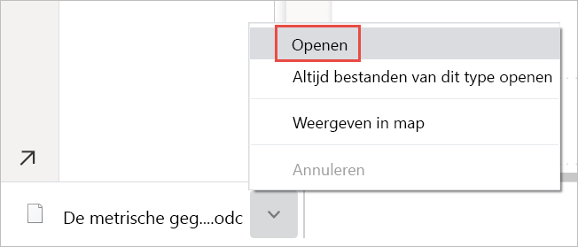

1. Excel wordt gestart door Power BI. Controleer de bestandsnaam en het pad voor het .ODC-bestand en selecteer vervolgens **Inschakelen**.

    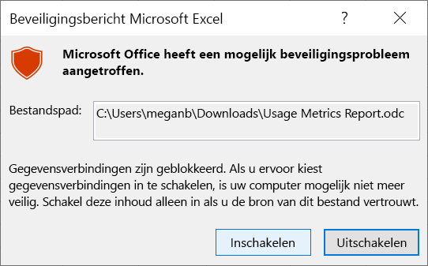

1. Nu Excel is geopend en u een lege draaitabel hebt, kunt u velden naar de vakken Rijen, Kolommen, Filters en Waarden slepen en aangepaste weergaven maken van uw gebruiksgegevens.

    

## Metrische gegevens over gebruik in nationale clouds

Power BI is beschikbaar in afzonderlijke nationale clouds. Deze clouds bieden hetzelfde niveau van beveiliging, privacy, naleving en transparantie als de algemene versie van Power BI, gecombineerd met een uniek model voor lokale voorschriften met betrekking tot het leveren van services, gegevensopslag, toegang en beheer. Moderne metrische gebruiksgegevens zijn momenteel beschikbaar in de volgende nationale clouds: 

- US Government Community Cloud
- US Government Community Cloud High
- US Department of Defense
- China

Zie [nationale clouds](https://powerbi.microsoft.com/clouds/) voor meer informatie.

## Overwegingen en beperkingen

Het is belangrijk om te begrijpen dat er verschillen kunnen optreden wanneer u het verbeterde rapport met metrische gegevens over verbruik vergelijkt met het originele rapport. Zo zijn de metrische gegevens over het rapportgebruik nu gebaseerd op activiteitsgegevens die zijn verzameld door de Power BI-service. Eerdere versies van het rapport met metrische gegevens over gebruik waren afhankelijk van de client-telemetrie, die niet altijd overeenkomt met de metrische gegevens over gebruik die door de service zijn verzameld. Daarnaast hanteert het verbeterde rapport met metrische gegevens over gebruik een andere definitie voor een 'weergave'. Een weergave is een open-rapport-gebeurtenis, zoals vastgelegd in de service telkens wanneer iemand een rapport opent. Het wijzigen van rapportpagina's wordt niet langer beschouwd als een extra weergave.

> [!NOTE]
> Omdat het verbeterde rapport met metrische gegevens over gebruik afhankelijk is van activiteitsgegevens die worden verzameld door de Power BI-service, komen de metrische gegevens over gebruik nu overeen met het cumulatieve aantal activiteiten in auditlogboeken en activiteitenlogboeken. Te lage of te hoge aantallen activiteiten als gevolg van inconsistente netwerkverbindingen, ad blockers of andere problemen op de client, hebben geen invloed meer op het aantal kijkers en weergaven.

Naast de bovenstaande verschillen tussen de eerdere versie en de verbeterde versie van het rapport met metrische gegevens over gebruik, moet u rekening houden met de volgende beperkingen voor de preview-versie:

- Metrische gegevens over het gebruik van dashboards zijn nog steeds afhankelijk van de vorige versie van de rapporten met metrische gegevens over gebruik.
- Verbeterde rapporten met metrische gegevens over gebruik zijn alleen beschikbaar voor rapporten in moderne werkruimten. Rapporten in verouderde werkruimten bieden alleen ondersteuning voor de vorige versie van de rapporten met metrische gegevens over gebruik.
- De metrische gegevens over rapportprestaties worden gebaseerd op client-telemetrie. Bepaalde typen weergaven worden niet opgenomen in de prestatiemetingen. Wanneer een gebruiker bijvoorbeeld in een e-mail bericht een koppeling naar een rapport selecteert, wordt de weergave verwerkt in het rapportgebruik, maar wordt er geen gebeurtenis opgenomen in de metrische gegevens over prestaties.
- Metrische gegevens over rapportprestaties zijn niet beschikbaar voor gepagineerde rapporten. Op het tabblad Pages van de pagina Report usage worden geen gegevens weergegeven voor deze typen rapporten, evenmin in de grafieken op de pagina Report performance overigens.
- Het maskeren van gebruikers werkt niet zoals verwacht bij het gebruik van geneste groepen. Als uw organisatie de optie Gegevens per gebruiker in metrische gegevens over gebruik voor makers van inhoud heeft uitgeschakeld in het gedeelte met tenantinstellingen van de Power BI-beheerportal, worden alleen de leden op het hoogste niveau gemaskeerd. Leden van subgroepen zijn nog steeds zichtbaar.
- Het initialiseren van de gegevensset Rapport voor metrische gegevens over het gebruik kan enkele minuten duren, met als gevolg dat er een leeg rapport met metrische gegevens over gebruik wordt weergegeven omdat de gebruikersinterface van Power BI niet wacht totdat het vernieuwen is voltooid. Controleer de vernieuwingsgeschiedenis in de instellingen van de gegevensset Rapport voor metrische gegevens over het gebruik om te bevestigen of de vernieuwingsbewerking is geslaagd.
- Het initialiseren van de gegevensset Rapport voor metrische gegevens kan mislukken vanwege een time-out die optreedt tijdens het vernieuwen. Raadpleeg het gedeelte Problemen oplossen hieronder om dit probleem op te lossen.
- Delen is uitgeschakeld voor het rapport voor metrische gebruiksgegevens. Om mensen leestoegang tot het rapport te geven, moet u ze eerst toegang tot de werkruimte geven.
- In sommige scenario's ziet u mogelijk dat de prestatiegegevens ontbreken. Dit kan voorkomen als een gebruiker een rapport opent en communiceert met het rapport voordat het laden is voltooid of als er een fout is opgetreden tijdens het laden van het rapport.
- De prestatiegegevens zijn afhankelijk van de client/het apparaat waarmee gegevens naar Power BI worden verzonden. Afhankelijk van de netwerklatentie, advertentieblokkers, firewalls en netwerkregels die door uw organisatie zijn ingesteld, is het mogelijk dat de prestatiegegevens nooit Power BI bereiken. Daarom kunnen de prestatiegegevens alleen maar een voorbeeld geven en kunnen ze niet alle gebruikers omvatten of tonen. 

## Veelgestelde vragen

Naast de bovenstaande overwegingen en beperkingen, kunnen de volgende vragen en antwoorden over metrische gegevens over gebruik handig zijn voor gebruikers en beheerders:

**V:** Ik kan geen metrische gegevens over gebruik opvragen voor een rapport.

**A:** U kunt alleen metrische gegevens over gebruik zien voor rapporten waarvan u de eigenaar bent of waarvoor u machtigingen hebt om deze te bewerken.

**V:** Waarom zie ik de schakelaar Nieuw gebruiksrapport uit niet in de rechterbovenhoek van mijn bestaande rapport met metrische gegevens over gebruik?

**A:** Het verbeterde rapport met metrische gegevens over gebruik is alleen beschikbaar voor rapporten in moderne werkruimten.

**V:** Welke tijdsperiode wordt gedekt door het rapport?

**A:** Het gebruiksrapport is gebaseerd op activiteitsgegevens voor de afgelopen dertig dagen, met uitzondering van activiteiten op de huidige dag. U kunt de periode verfijnen met behulp van de datumslicer op de pagina Report usage, bijvoorbeeld om alleen de gegevens van de afgelopen week te analyseren.

**V:** Wanneer zie ik de meest recente activiteitsgegevens?

**A:** Het gebruiksrapport bevat activiteitsgegevens tot de laatste volledige dag op basis van de UTC-tijdzone. De gegevens in het rapport zijn ook afhankelijk van de vernieuwingstijd voor de gegevensset. Power BI vernieuwt de gegevensset eenmaal per dag.

**V:** De gegevens lijken niet up-to-date te zijn.

**A:** Het kan tot 24 uur duren voordat nieuwe activiteitsgegevens worden weergegeven in het gebruiksrapport.

**V:** Wat is de gegevensbron voor de gebruiksgegevens?

**A:** Met de gegevensset Rapport voor metrische gegevens over het gebruik importeert u gegevens uit een archief van metrische gegevens voor intern gebruik van Power BI. Dit gebeurt met behulp van een aangepaste gegevensconnector voor metrische gegevens van gebruik. U kunt de referenties voor de gegevensconnector voor metrische gegevens van gebruik bijwerken op de pagina met de instellingen voor de gegevensset Rapport voor metrische gegevens over het gebruik.

**V:** Hoe kan ik verbinding maken met de gegevens? Of het standaardrapport wijzigen?

**A:** U kunt een kopie maken van het vooraf gemaakte, gebruiksrapport met het kenmerk alleen-lezen. De kopie van het rapport maakt verbinding met dezelfde gegevensset Rapport voor metrische gegevens over het gebruik en stelt u in staat om de rapportdetails te bewerken.

**V:** Wat is een 'kijker' en wat is een 'weergave'?

**A:** Een kijker is iemand die het rapport ten minste eenmaal heeft geopend tijdens de periode. Een weergave is een open-rapport-gebeurtenis. Er wordt een rapportweergave geregistreerd op het moment dat iemand een rapport opent.

De definitie van een weergave verschilt van eerdere rapporten met metrische gegevens over gebruik. Het wijzigen van rapportpagina's wordt niet langer beschouwd als een extra weergave.

**V:** Hoe wordt de 'weergavetrend' berekend?

**A:** De weergavetrend weerspiegelt de wijzigingen in het aantal weergaven in de loop van de tijd. De eerste helft van de geselecteerde tijdsperiode wordt vergeleken met de tweede helft. U kunt de tijdsperiode op de pagina Report usage wijzigen met behulp van de datumslicer, bijvoorbeeld om de trends voor week-over-week-of tweewekelijks te berekenen.

**V:** Wat betekenen 'distributie' en 'platform'?

**A:** Distributie laat zien hoe de kijkers toegang tot een rapport hebben verkregen: rechtstreeks gedeeld, via toegang tot de werkruimte of via een app.

Het platform verwijst naar de technologie die een kijker heeft gebruikt om een rapport te openen: via PowerBI.com, Mobile of Embedded.

**V:** Hoe werkt de rangordebepaling van een rapport?

**A:** Op basis van het aantal weergaven toont de rangorde de populariteit van een rapport in vergelijking met alle andere rapporten in de organisatie. De positie 1 betekent dat het rapport de meeste weergaven van alle rapporten in de organisatie heeft.

**V:** Wat zijn 'Unnamed' gebruikers?

**A:** Uw organisatie kan besluiten om gebruikersgegevens weg te laten uit het gebruiksrapport. In dat geval wordt in het gebruiksrapport naar gebruikers verwezen als Unnamed.

**V:** Wat is de 'typische openingstijd van een rapport'?

**A:** De typische openingstijd van het rapport komt overeen met het 50e percentiel van de tijd die nodig is om het rapport te openen. Met andere woorden: het is de tijd waarbinnen 50% van de open-rapport-acties wordt voltooid. De pagina Report performance toont ook de typische openingstijden van het rapport, onderverdeeld naar verbruiksmethode en browsertype.

**V:** Hoe wordt de 'trend voor de openingstijd' berekend?

**A:** De trend van de openingstijd weerspiegelt de wijzigingen in de prestaties van het openen van het rapport in de loop van de tijd. De openingstijden voor het rapport van de eerste helft van de geselecteerde tijdsperiode worden vergeleken met de openingstijden van de tweede helft. U kunt de tijdsperiode op de pagina Report performance wijzigen met behulp van de datumslicer, bijvoorbeeld om de trends voor week-over-week-of tweewekelijks te berekenen.

**V:**  De vorige versie van het rapport met metrische gegevens over gebruik bevat vier rapporten, maar de verbeterde versie slechts drie.

**A:**  Het verbeterde rapport met metrische gegevens over gebruik bevat alleen rapporten die in de afgelopen dertig dagen zijn geopend, terwijl de vorige versie de afgelopen negentig dagen dekt. Als een rapport niet is opgenomen in het verbeterde rapport met metrische gegevens over gebruik, is dit rapport waarschijnlijk langer dan dertig dagen niet gebruikt.

## Problemen oplossen: De gegevensset verwijderen

Als u problemen vermoedt met gegevensconsistentie of het vernieuwen van gegevens, kan het zinvol zijn om de bestaande gegevensset Rapport voor metrische gegevens over het gebruik te verwijderen. Vervolgens kunt u Metrische gegevens over het gebruik weergeven opnieuw uitvoeren om een nieuwe gegevensset te genereren met de bijbehorende verbeterde rapporten met metrische gegevens over gebruik. Volg deze stappen.

### De gegevensset verwijderen

1. Open de werkruimte met het rapport waarvoor u de gegevensset voor het rapport met metrische gegevens over gebruik opnieuw wilt instellen.

2. Selecteer in de zwarte balk bovenaan het pictogram **Instellingen** en selecteer vervolgens **Instellingen**.

    

3. Ga naar het tabblad **Gegevenssets** en selecteer de gegevensset Rapport voor metrische gegevens over het gebruik. 

    

5. Kopieer de id's van de werkruimte en de gegevensset uit de URL die wordt weergegeven in de adresbalk van uw browser.

    

1. Ga in uw browser naar [https://docs.microsoft.com/rest/api/power-bi/datasets/deletedatasetingroup](/rest/api/power-bi/datasets/deletedatasetingroup) en selecteer de knop **Proberen**.

    

1. Meld u aan bij Power BI, plak de werkruimte-id in het tekstvak **groupId** en de gegevensset-id in het tekstvak **datasetId** en selecteer **Uitvoeren**. 

    

1. Controleer of onder de knop **Uitvoeren** de responscode **200** wordt weergegeven door de service. Deze code geeft aan dat de gegevensset en de bijbehorende rapporten met metrische gegevens over gebruik zijn verwijderd.

    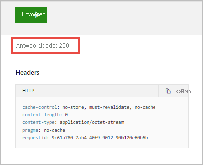

### Een nieuw rapport met metrische gegevens over gebruik maken

1. Als u terug naar de Power BI-service gaat, ziet u dat de gegevensset is verdwenen.

    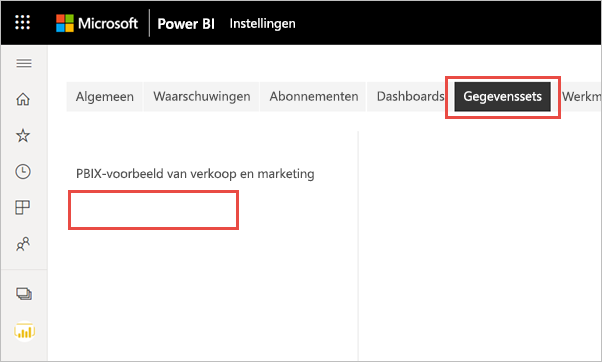

2. Als het rapport met metrische gegevens over gebruik nog steeds wordt in de lijst met rapporten staat, vernieuwt u de browser.

3. [Maak een nieuw rapport met metrische gegevens over gebruik](#create--view-an-improved-usage-metrics-report).

## Volgende stappen

[Power BI beheren in de beheerportal](../admin/service-admin-portal.md)

Hebt u nog vragen? [Misschien dat de Power BI-community het antwoord weet](https://community.powerbi.com/)
