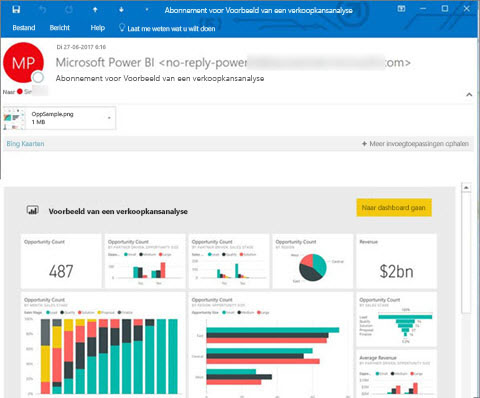
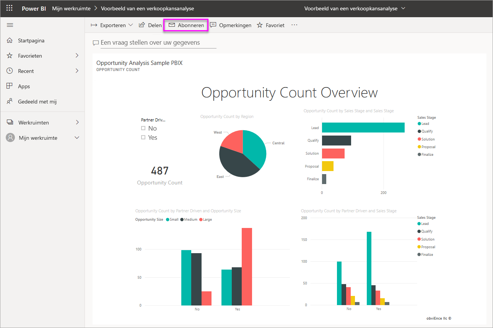
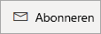
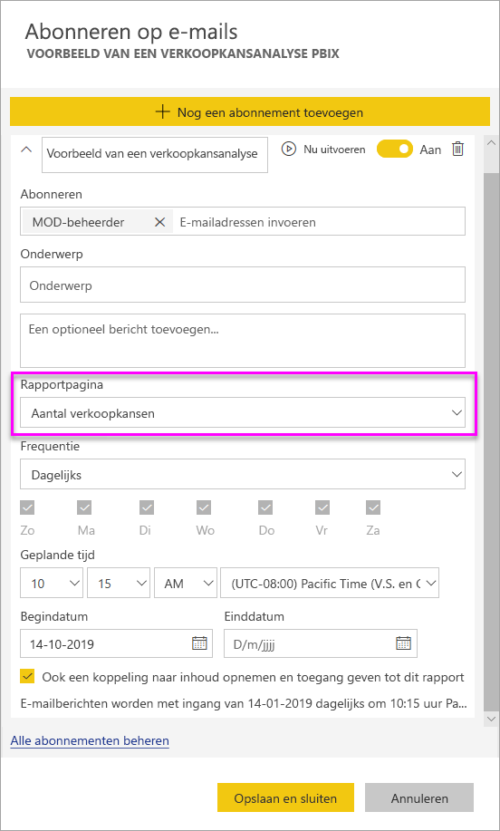
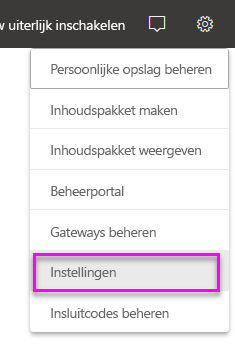
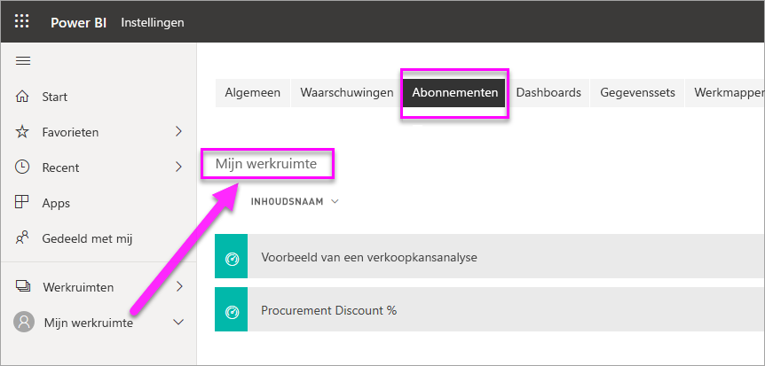

# Uzelf en anderen abonneren op rapporten en dashboards in de Power BI-service

U kunt uzelf en uw collega's abonneren op de rapportpagina's, dashboards en gepagineerde rapporten die voor u het belangrijkst zijn. Met e-mailabonnementen van Power BI kunt u het volgende doen:

- Bepaal hoe vaak u de e-mailberichten wilt ontvangen: dagelijks, wekelijks, elk uur, maandelijks of eenmaal daags na de initiële vernieuwing van gegevens.
- Kies, wanneer u dagelijks, wekelijks, elk uur of maandelijks kiest, het tijdstip waarop u het e-mailbericht wilt ontvangen.
- Stel 24 verschillende abonnementen per Power BI-rapport of -dashboard in.  Er is geen limiet voor het aantal abonnementen dat u kunt instellen voor gepagineerde rapporten.
- Laat een e-mail verzenden met een afbeelding van het rapport en een koppeling naar het rapport in de service.  Wanneer deze koppeling wordt geselecteerd op een mobiel apparaat waarop Power BI-apps zijn geïnstalleerd, wordt de Power BI-app gestart in plaats van dat het rapport of het dashboard op de website van Power BI wordt geopend.
- Neem een bijlage van het volledige rapport op als u zich abonneert op een gepagineerd rapport.
- Verzend e-mail naar gebruikers buiten uw tenant als uw Power BI-inhoud wordt gehost in een Premium-capaciteit.  Beheerders kunnen de toegang beheren tot degenen die e-mailabonnementen naar externe gebruikers kunnen verzenden, door gebruik te maken van de bestaande beheerinstellingen voor extern delen in het Power BI-beheercentrum.

 

## Vereisten

De volgende gebruikers kunnen een abonnement **maken**:

- Gebruikers met een Power BI Pro-licentie 
- Gebruikers die inhoud in een premium-werkruimte of -app bekijken, kunnen zich abonneren op de bijbehorende inhoud, zelfs zonder een Power BI Pro-licentie. 

U hebt geen bewerkingsmachtigingen nodig voor de inhoud (dashboard of rapport) om een abonnement voor uzelf te maken, maar u moet wel over deze machtigingen beschikken om er eentje te maken voor iemand anders.

## Abonneren op een dashboard, rapportpagina of gepagineerd rapport

Het proces voor het abonneren op een dashboard, rapport of gepagineerd rapport is vergelijkbaar. U kunt u met dezelfde knop abonneren op dashboards en rapporten van de Power BI-service.

Het abonneren op gepagineerde rapporten is enigszins anders. Zie [Uzelf en anderen abonneren op gepagineerde rapporten in Power BI-service](../consumer/paginated-reports-subscriptions.md) voor meer informatie.
 
.

1. Open het dashboard of het rapport.
2. Selecteer in de bovenste menubalk **Abonneren** of selecteer het pictogram van een envelop :::image type="icon" source="media/service-report-subscribe/power-bi-icon-envelope.png" border="false":::.
   
    

1. Gebruik de gele schuifregelaar om het abonnement in of uit te schakelen. Als u de schuifregelaar instelt op **Uit**, wordt het abonnement niet verwijderd. Selecteer het prullenbakpictogram om het abonnement te verwijderen.

2. Uw e-mailadres bevindt zich al in het vak **Abonneren**. U kunt tevens andere e-mailadressen in hetzelfde domein toevoegen aan het abonnement. Als het rapport of het dashboard wordt gehost in een [Premium-capaciteit](../admin/service-premium-what-is.md), kunt u andere afzonderlijke e-mailadressen en groepsaliassen abonneren, ongeacht of deze zich nu wel of niet in uw domein bevinden. Als het rapport of het dashboard wordt gehost in een Premium-capaciteit, kunt u andere personen abonneren, maar zij moeten tevens beschikken over een Power BI Pro-licentie. Zie [Aandachtspunten en probleemoplossing](#considerations-and-troubleshooting) hieronder voor uitgebreide informatie.

3. Vul de gegevens **Onderwerp** en **Bericht** voor het e-mailbericht in.

4. Selecteer een **frequentie** voor uw abonnement:  **Dagelijks**, **Elk uur**, **Wekelijks**, **Maandelijks** of **Nadat gegevens zijn vernieuwd (dagelijks)** . Als u het e-mailbericht van het abonnement alleen op bepaalde dagen wilt ontvangen, selecteert u **Elk uur** of **Wekelijks** en selecteert u de dagen waarop u het wilt ontvangen. Als u bijvoorbeeld het e-mailbericht van het abonnement alleen op weekdagen wilt, ontvangen, selecteert u **Wekelijks** en schakelt u de selectievakjes voor de **Za** en **Zo** uit. Als u **Maandelijks** selecteert, voert u de dag(en) van de maand in waarop u de abonnementsmail wilt ontvangen.

5. Als u **Dagelijks**, **Elk uur**, **Maandelijks** of **Wekelijks** kiest, kunt u ook een **geplande tijd** voor het abonnement kiezen. U kunt de verzending op het hele uur of om 15, 30 of 45 minuten erna laten uitvoeren. Selecteer ochtend (AM) of middag/avond (PM). U kunt ook de tijdzone opgeven. Als u **Elk uur** kiest, selecteert u de **geplande tijd** waarop u het abonnement wilt starten. Het abonnement wordt vervolgens elk uur daarna uitgevoerd.

6. De begindatum voor uw abonnement is standaard de datum waarop u het hebt gemaakt. U hebt de mogelijkheid om een einddatum te selecteren. Als u geen einddatum instelt, is de einddatum automatisch één jaar na de begindatum. U kunt deze op elk gewenst moment wijzigen in ongeacht welke datum in de toekomst (tot het jaar 9999) voordat het abonnement afloopt. Wanneer een abonnement een einddatum heeft bereikt, wordt het stopgezet tenzij u het opnieuw inschakelt. U ontvangt vóór de geplande einddatum een melding/meldingen met de vraag of u wilt verlengen.

    Merk op in de onderstaande schermafbeelding dat wanneer u zich op een rapport abonneert, u zich feitelijk abonneert op een rapport_pagina_. Als u zich op meer dan één pagina in een rapport wilt abonneren, selecteert u **Nog een abonnement toevoegen** en selecteert u een andere pagina.
     
      

1. (Optioneel) Selecteer of u een koppeling wilt toevoegen aan de inhoud in Power BI en of u gebruikerstoegang wilt geven tot de inhoud waarop u hen abonneert.  Als u ervoor kiest een koppeling op te nemen voor de beste ervaring, moet u ervoor zorgen dat alle gebruikers toegang hebben tot het rapport.
2. Selecteer **Opslaan en sluiten**. Degenen die zijn geabonneerd, ontvangen een e-mailbericht en een momentopname van het dashboard of de rapportpagina voor de frequentie en de tijd die u hebt geselecteerd. Alles bij elkaar kunt u maximaal 24 abonnementen per rapport of dashboard maken en kunt u zorgen voor unieke ontvangers, tijden en frequenties voor elk abonnement. Alle abonnementen die zijn ingesteld op **Nadat gegevens zijn vernieuwd** voor uw dashboard of rapport verzenden nog steeds alleen een e-mailbericht na de eerste geplande vernieuwing.

    > [!NOTE]
    > Als u het abonnement bewerkt na het opslaan en sluiten, is de selectie voor het geven van toegang aan gebruikers tot de inhoud waarop u zich abonneert ingeschakeld, ongeacht uw eerdere selecties.
    >

    > [!TIP]
    > Wilt u het e-mailbericht verzenden direct vanuit een abonnement of op aanvraag op elk gewenst moment? Selecteer **Nu uitvoeren** voor de abonnementen voor het dashboard of rapport dat u wilt verzenden. U ziet een melding dat er een e-mailbericht onderweg is naar iedereen voor dat specifieke abonnement. Als u deze actie uitvoert, wordt dit niet meegeteld in uw limiet van 24 geplande abonnementsuitvoeringen per dag per rapport of dashboard. Dit leid er NIET toe dat de gegevens van de onderliggende gegevensset worden vernieuwd.
    >

## Uw abonnementen beheren

Alleen degene die het abonnement heeft gemaakt, kan dit beheren. Er zijn twee paden naar het scherm voor het beheren van uw abonnementen. Voor het eerste pad selecteert u in het dialoogvenster **Abonneren op e-mails** de optie **Alle abonnementen beheren** (zie stap 4 hierboven). Voor het tweede pad selecteert u in de bovenste menubalk het Power BI-tandwielpictogram  en kiest u **Instellingen**.

Welke abonnementen worden weergegeven, is afhankelijk van de werkruimte die op dat moment actief is. Als u alle abonnementen voor alle werkruimten allemaal in één keer wilt weergeven, moet u ervoor zorgen dat **Mijn werkruimte** actief is. Zie [Werkruimten in Power BI](service-create-workspaces.md) voor meer informatie over werkruimten.

Een abonnement eindigt in een van de volgende situaties:

- De Pro-licentie is verlopen.
- De eigenaar verwijdert het dashboard of rapport.
- Het gebruikersaccount dat is gebruikt voor het maken van het abonnement wordt verwijderd.

Power BI-beheerders kunnen de Power BI auditlogboeken gebruiken om details over abonnementen te bekijken. Deze details omvatten:

- Created By
- Gemaakt op
- Inhoud waarop is geabonneerd
- Ontvangers
- Frequentie
- Gewijzigd door/
- Datum wijziging

## Aandachtspunten en probleemoplossing

### Algemeen

- Net als bij andere BI-producten is de tijd waarop u uw abonnement instelt, ingesteld op wanneer de verwerking van het abonnement begint.  Wanneer de verwerking van het rapport is voltooid, wordt het abonnement in de wachtrij geplaatst en naar de ontvangers van het e-mailbericht verzonden.  We streven ernaar alle abonnementen zo snel mogelijk te verwerken en te leveren. Soms ziet u tijdens een piekvraag echter een langere vertraging vanwege het aantal abonnementen dat tegelijk kan worden verzonden door Power BI. De meeste klanten zullen geen vertraging van meer dan 15 minuten bemerken om rapporten te verwerken en te verzenden. Op bepaalde tijdstippen en in tenants met een aanzienlijk gebruik kan dit tot 30 minuten duren.  De verwachting is dat de levering nooit met een vertraging van meer dan 60 minuten te maken krijgt vanaf het moment dat het abonnement wordt gepland.  Als u een vertraging van deze duur ondervindt, moet u eerst controleren of het adres `no-reply-powerbi@microsoft.com` op uw lijst met veilige verzenders staat en niet wordt geblokkeerd door uw e-mailprovider.  Als het e-mail bericht niet wordt geblokkeerd, neemt u contact op met Power BI-ondersteuning voor hulp.
- Momenteel worden e-mailabonnementen op rapporten en dashboards waarvoor gegevenssets van liveverbindingen worden gebruikt, niet ondersteund wanneer u andere gebruikers dan uzelf abonneert. Dit geldt niet voor gepagineerde rapporten. U kunt anderen abonneren op een gepagineerd rapport met behulp van uw beveiligingscontext. Lees meer over [abonneren op gepagineerde rapporten](../consumer/paginated-reports-subscriptions.md).
- Wanneer dashboards of rapporten langer dan twee maanden niet worden bezocht, wordt de vernieuwing van de bijbehorende gegevenssets automatisch door Power BI onderbroken. Als u echter een abonnement aan een dashboard of rapport toevoegt, wordt het dashboard of rapport niet onderbroken, ook net als het niet wordt bezocht.
- Als u geen e-mails voor een abonnement ontvangt, controleert u of uw User Principal Name (UPN) e-mails kan ontvangen.
- Als uw dashboard of rapport zich in Premium-capaciteit bevindt, kunt u e-mailaliassen van een groep gebruiken voor abonnementen, in plaats van alle collega's één voor één met het eigen e-mailadres te abonneren. De aliassen zijn gebaseerd op de huidige Active Directory.
- Als uw inhoud zich niet in een Premium-capaciteit bevindt, kunnen alleen Power BI Pro gebruikers e-mailabonnementen ontvangen. 
- Abonnementen bieden momenteel geen ondersteuning voor bladwijzers.
- De optie om toegang te bieden tot het rapport/dashboard wordt altijd weergegeven als ingeschakeld wanneer u een bestaand abonnement bewerkt.  Als u deze optie hebt gewist en het abonnement opslaat, wordt die status opgeslagen. Wanneer u het rapport echter opnieuw gaat bewerken, wordt het standaard gecontroleerd.

### Dashboards

- Dashboards met meer dan 25 vastgemaakte tegels of 4 vastgemaakte live-rapportpagina’s worden mogelijk niet volledig weergegeven in naar gebruikers verzonden e-mailberichten voor het abonnement. Abonnementen op dashboards op basis van dit aantal tegels worden niet geblokkeerd. Als u problemen ondervindt, worden ze echter beschouwd als niet-ondersteund. U kunt overwegen om ze zodanig te wijzigen dat ze binnen een ondersteund bereik vallen.
- In uitzonderlijk gevallen duurt het bij e-mailabonnementen langer dan vijftien minuten voordat deze worden geleverd aan de ontvangers. Als dit gebeurt, is het het beste om het vernieuwen van uw gegevens en het uitvoeren van het e-mailabonnement op verschillende tijdstippen te laten plaatsvinden; zo zorgt u voor tijdige levering. Als het probleem zich blijft voordoen, neemt u contact op met de ondersteuning van Power BI.
- Als voor e-mailabonnementen in een dashboard beveiliging op rijniveau (RLS) is toegepast op een of meer tegels, worden deze tegels niet weergegeven.
- Voor dashboardabonnementen worden bepaalde soorten tegels nog niet ondersteund. Hierbij gaat het om: streamingtegels, videotegels en tegels voor aangepaste webinhoud.
- Als u een dashboard deelt met een collega buiten uw tenant, kunt u niet ook voor deze collega een abonnement maken, *tenzij* het dashboard zich in een Premium-werkruimte of -app bevindt. Als u `aaron@contoso.com` bent, kunt u delen met `anyone@fabrikam.com`, maar kunt u `anyone@fabrikam.com` nog niet abonneren en kunnen zij zich niet abonneren op gedeelde inhoud.

### Rapporten

- Als de gegevensset RLS gebruikt voor e-mailabonnementen voor rapporten, kunt u een abonnement voor uzelf maken. U kunt andere gebruikers niet abonneren op een rapport waarop RLS (beveiliging op rijniveau) is toegepast, maar wel op gepagineerde rapporten. U kunt anderen abonneren op een gepagineerd rapport met behulp van uw beveiligingscontext. Lees meer over [abonneren op gepagineerde rapporten](../consumer/paginated-reports-subscriptions.md).
- Abonnementen op rapportpagina’s zijn gekoppeld aan de naam van de rapportpagina. Als u zich abonneert op een rapportpagina en daarna de naam ervan wijzigt, moet u uw abonnement opnieuw maken.
- Uw organisatie kan bepaalde instellingen in Azure Active Directory configureren, waardoor de mogelijkheid wordt beperkt om e-mailabonnementen in Power BI te gebruiken. Deze beperkingen omvatten, maar zijn niet beperkt tot, het gebruik van meervoudige verificatie of beperkingen voor IP-bereik bij het openen van resources.
- E-mailabonnementen bieden geen ondersteuning voor de [aangepaste visuals](../developer/visuals/power-bi-custom-visuals.md). De enige uitzondering hierop vormen de aangepaste visuals die zijn [gecertificeerd](../developer/visuals/power-bi-custom-visuals-certified.md).
- E-mailabonnementen bieden op dit moment geen ondersteuning voor de aangepaste R-visuals.
- E-mailabonnementen worden verzonden met de standaard filter- en slicerstatus voor het rapport. De wijzigingen die u aanbrengt in de standaardwaarden nadat u zich abonneert, worden niet weergegeven in het e-mailbericht. Gepagineerde rapporten ondersteunen deze mogelijkheid wel en bieden de mogelijkheid om de specifieke parameterwaarden te configureren per abonnement.
- Stel dat u een rapport hebt met een live-verbinding met Analysis Services en dat de abonnementen zijn ingesteld om te worden uitgevoerd na het vernieuwen van gegevens. Het wordt uitgevoerd bij de eerste keer dat de Power BI-service een wijziging in uw on-premises model detecteert wanneer het Analysis Services-exemplaar wordt gecontroleerd.  Power BI controleert elk uur op een wijziging in het Analysis Services-gegevensmodel om te bepalen wanneer het abonnement moet worden verzonden.

## Volgende stappen

- [Uzelf en anderen abonneren op gepagineerde rapporten in Power BI-service](../consumer/paginated-reports-subscriptions.md)
- Hebt u nog vragen? [Misschien dat de Power Bi-community het antwoord weet](https://community.powerbi.com/).    
- [Lees het blogbericht](https://powerbi.microsoft.com/blog/introducing-dashboard-email-subscriptions-a-360-degree-view-of-your-business-in-your-inbox-every-day/)