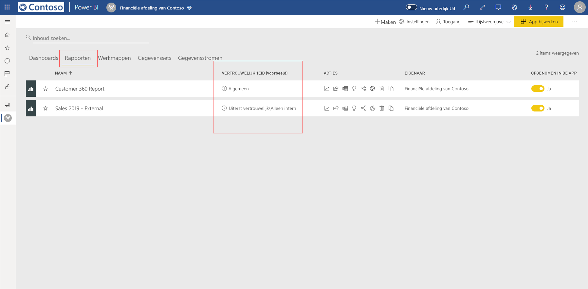
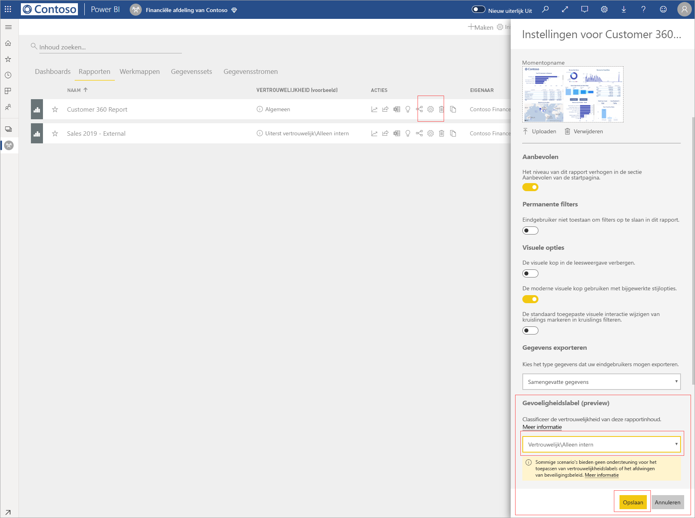
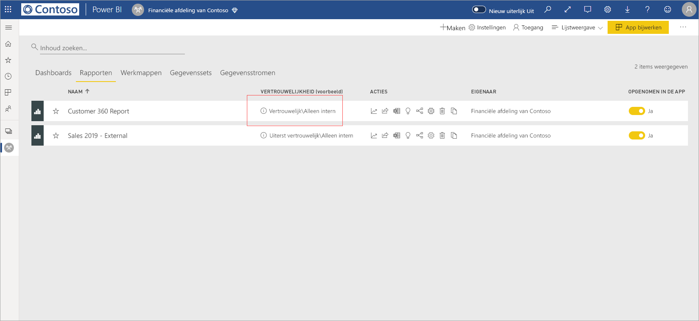
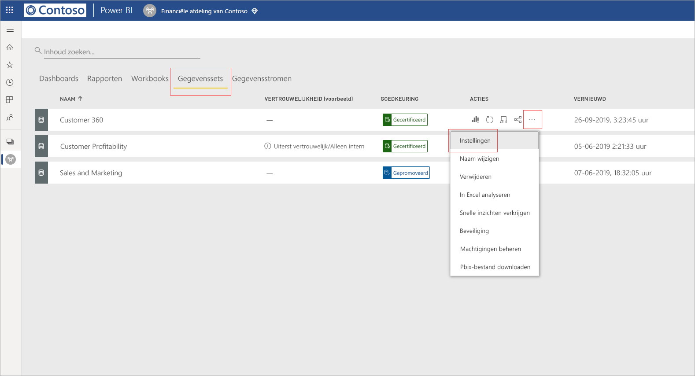
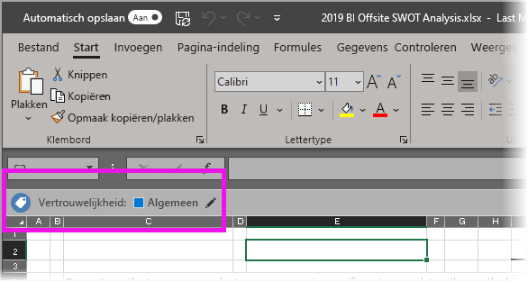

# Vertrouwelijkheidslabels voor gegevens toepassen in Power BI (preview-versie)

Wanneer vertrouwelijkheidslabels zijn ingeschakeld in de Power BI-service, kunt u uw dashboards, rapporten, gegevenssets en gegevensstromen beveiligen tegen onbevoegde toegang en lekken door er vertrouwelijkheidslabels voor gegevens op toe te passen. Door uw gegevens op de juiste manier te labelen met vertrouwelijkheidslabels voor gegevens, zorgt u ervoor dat alleen bevoegde personen toegang tot uw gegevens hebben.

Wanneer gegevensbeveiliging is ingeschakeld, worden vertrouwelijkheidslabels weergegeven in de kolom Vertrouwelijkheid in de lijstweergave van dashboards, rapporten, gegevenssets en gegevensstromen.

> [!NOTE]
> Voor het toepassen van vertrouwelijkheidslabels op Power BI-dashboards, -rapporten, -gegevenssets en -gegevensstromen zijn bepaalde licenties en machtigingen vereist. Zie [Vertrouwelijkheidslabels toepassen](#applying-sensitivity-labels) voor meer informatie.

## Vertrouwelijkheidslabels toepassen

Als u vertrouwelijkheidslabels in Power BI wilt toepassen,moeten u en uw organisatie aan de volgende vereisten voldoen:

* Uw organisatie moet een gevoeligheidslabel hebben gedefinieerd in het [Microsoft 365-beveiligingscentrum](https://security.microsoft.com/) of het [Microsoft 365-compliancecentrum](https://compliance.microsoft.com/).
* U moet bij een beveiligingsgroep horen die machtigingen heeft om vertrouwelijkheidslabels voor gegevens toe te passen, zoals beschreven in het artikel [Vertrouwelijkheidslabels voor gegevens inschakelen in Power BI (preview-versie)](../admin/service-security-enable-data-sensitivity-labels.md#enable-data-sensitivity-labels).
* U moet over een Power BI Pro-licentie en machtigingen voor bewerken beschikken voor de resources die u van een label wilt voorzien. 
* U moet over een Azure Information Protection Premium P1- of Premium P2-licentie beschikken. Microsoft Azure Information Protection kan ofwel als zelfstandig product als via een van de Microsoft-licentiesuites worden aangeschaft. Zie [Prijzen voor Azure Information Protection](https://azure.microsoft.com/pricing/details/information-protection/) voor meer informatie.

Als u een vertrouwelijkheidslabel op een rapport wilt toepassen of wijzigen, klikt u op het pictogram voor de rapportinstellingen op het item in de werkruimtelijst en gaat u vervolgens naar de sectie voor vertrouwelijkheid van gegevens in het zijdeelvenster Instellingen. Kies het juiste vertrouwelijkheidslabel en sla de instellingen op.

Het bijgewerkte vertrouwelijkheidslabel wordt weergegeven in de vertrouwelijkheidskolom. 

Voor het toepassen of wijzigen van een vertrouwelijkheidslabel op een dashboard volgt u hetzelfde proces als het proces dat voor rapporten is beschreven. 

U kunt ook vertrouwelijkheidslabels op gegevenssets en gegevensstromen instellen. In de volgende afbeelding ziet u hoe u een vertrouwelijkheidslabel op een gegevensset instelt; de stappen voor gegevensstromen zijn vergelijkbaar.

Als u een vertrouwelijkheidslabel op een gegevensset wilt instellen, selecteert u het tabblad Gegevenssets. Klik op de drie puntjes op de gegevensset waarop u een label wilt toepassen en kies **Instellingen**.

Op de pagina Instellingen voor de gegevensset opent u de sectie Vertrouwelijkheidslabels, kiest u het gewenste vertrouwelijkheidslabel en klikt u op **Toepassen**.

Voor het toepassen of wijzigen van een vertrouwelijkheidslabel op een gegevensstroom volgt u hetzelfde proces als het proces dat voor gegevenssets is beschreven.

## Vertrouwelijkheidslabels verwijderen
Als u een vertrouwelijkheidslabel wilt verwijderen uit een rapport, dashboard, gegevensset of gegevensstroom, volgt u de [dezelfde procedure als wordt gebruikt voor het toepassen van labels](#applying-sensitivity-labels), maar kiest u **(Geen)** wanneer u wordt gevraagd de vertrouwelijkheid van de gegevens te classificeren. 

## Gegevensbeveiliging in geëxporteerde bestanden

Wanneer u [gegevens exporteert uit een rapport](https://docs.microsoft.com/power-bi/consumer/end-user-export) dat van een vertrouwelijkheidslabel is voorzien, wordt het vertrouwelijkheidslabel overgenomen door het gegenereerde bestand (Excel, PowerPoint en PDF; CSV wordt niet ondersteund). Het vertrouwelijkheidslabel wordt zichtbaar in het bestand en toegang tot het bestand wordt beperkt tot alleen gebruikers die over de juiste machtigingen beschikken.

## Overwegingen en beperkingen

Bij het toepassen van vertrouwelijkheidslabels voor gegevens moet u het volgende overwegen:

* Voor het toepassen en weergeven van Microsoft Information Protection-vertrouwelijkheidslabels in Power BI is een Azure Information Protection Premium P1- of Premium P2-licentie vereist. Microsoft Azure Information Protection kan ofwel als zelfstandig product als via een van de Microsoft-licentiesuites worden aangeschaft. Zie [Prijzen voor Azure Information Protection](https://azure.microsoft.com/pricing/details/information-protection/) voor meer informatie.
* Vertrouwelijkheidslabels kunnen alleen worden toegepast op dashboards, rapporten, gegevenssets en gegevensstromen.
* Afdwinging van labels en besturingselementen voor beveiliging op geëxporteerde bestanden wordt alleen ondersteund voor Excel-, PowerPoint- en PDF-bestanden. Labels en beveiliging worden niet afgedwongen wanneer gegevens worden geëxporteerd naar .CSV-bestanden, Abonneren op e-mail, Visuals insluiten en Afdrukken.
* Een gebruiker die een bestand uit Power BI exporteert, beschikt over machtigingen voor toegang tot en het bewerken van dat bestand volgens de instellingen voor het vertrouwelijkheidslabel. De gebruiker die de gegevens exporteert, krijgt geen eigenaarsmachtigingen voor het bestand. 
* Vertrouwelijkheidslabels zijn momenteel niet beschikbaar voor [gepagineerde rapporten]( https://docs.microsoft.com/power-bi/paginated-reports-report-builder-power-bi) en werkmappen. 
* Vertrouwelijkheidslabels op Power BI-assets zijn alleen zichtbaar in de werkruimtelijst en herkomstweergaven; labels zijn momenteel niet zichtbaar in de weergaven Favorieten, Gedeeld met mij, Recente items of App. Houd er echter rekening mee dat een label dat op een Power BI-asset is toegepast, zelfs als dit niet zichtbaar is, permanent worden toegevoegd aan de gegevens die naar Excel-, PowerPoint- en PDF-bestanden worden geëxporteerd.
* Het gevoeligheidslabel *bestand Versleutelingsinstelling*, geconfigureerd in het [Microsoft 365-beveiligingscentrum](https://security.microsoft.com/) of het [Microsoft 365-compliancecentrum](https://compliance.microsoft.com/), is alleen van toepassing op bestanden die *worden geëxporteerd vanuit* Power BI; het wordt niet afgedwongen *binnen* Power BI.
* [HYOK-beveiliging](https://docs.microsoft.com/azure/information-protection/configure-adrms-restrictions) wordt niet ondersteund voor labels die zijn toegepast in Power BI.
* Er gelden [licentievereisten](https://docs.microsoft.com/microsoft-365/compliance/get-started-with-sensitivity-labels#subscription-and-licensing-requirements-for-sensitivity-labels) voor het weergeven en toepassen van labels in Office-apps.
* Vertrouwelijkheidslabels worden alleen ondersteund voor tenants in de wereldwijde (openbare) cloud. Vertrouwelijkheidslabels worden niet ondersteund voor tenants in andere clouds.
* Vertrouwelijkheidslabels worden niet ondersteund voor [externe gebruikers (Azure Active Directory B2B-gastgebruikers)](../admin/service-admin-azure-ad-b2b.md). Dit betekent dat externe gebruikers geen labels kunnen bekijken en geen gegevens kunnen exporteren naar Excel-, PDF-en PPTX-bestanden. [Verwijder het label](#removing-sensitivity-labels) om externe gebruikers in staat te stellen gegevens te exporteren naar deze bestandstypen.

## Volgende stappen

In dit artikel is beschreven hoe u vertrouwelijkheidslabels voor gegevens in Power BI kunt toepassen. De volgende artikelen bieden meer informatie over gegevensbeveiliging in Power BI. 

* [Overzicht van gegevensbeveiliging in Power BI](../admin/service-security-data-protection-overview.md)
* [Vertrouwelijkheidslabels voor gegevens in Power BI inschakelen](../admin/service-security-enable-data-sensitivity-labels.md)
* [Microsoft Cloud App Security-besturingselementen gebruiken in Power BI](../admin/service-security-using-microsoft-cloud-app-security-controls.md)