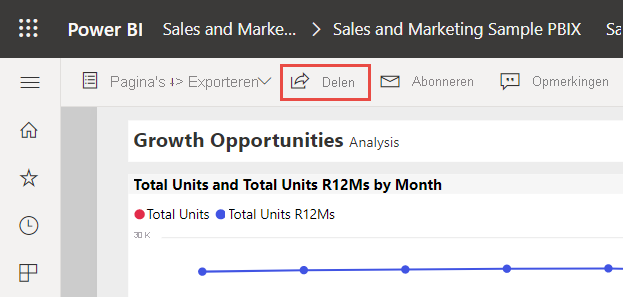
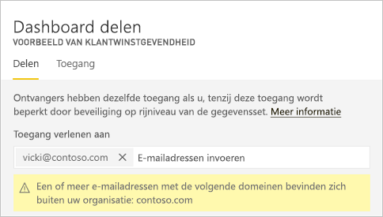
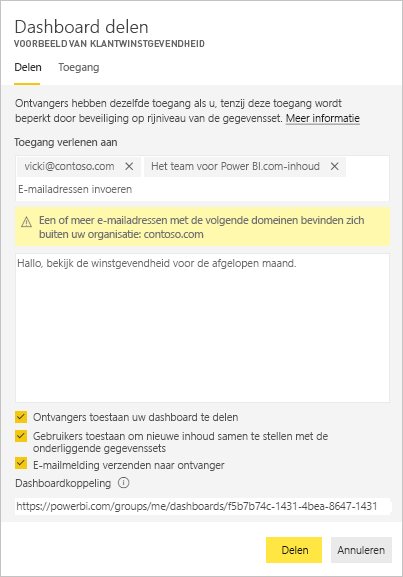
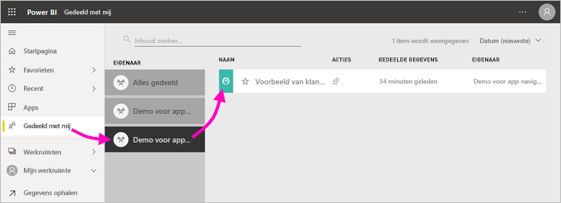
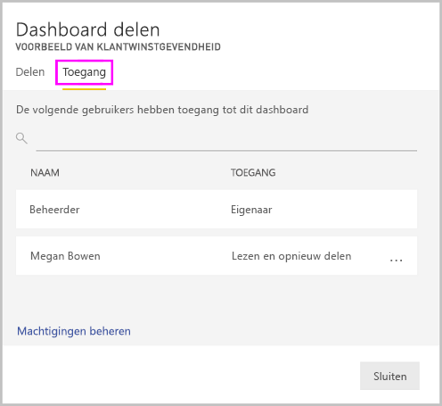
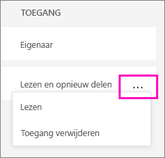
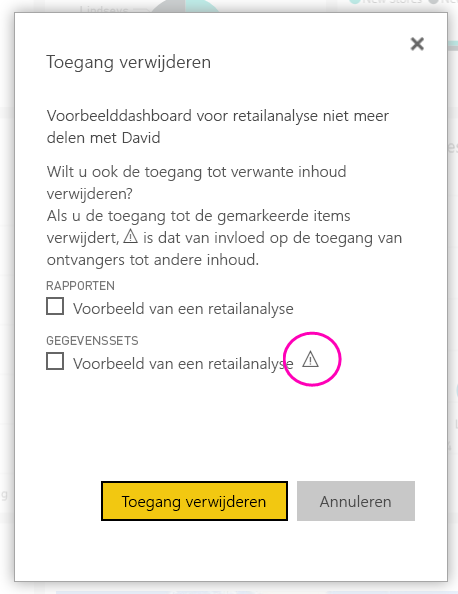

# Power BI-dashboards en -rapporten delen met collega's en anderen
*Delen* is de eenvoudigste manier om personen toegang te geven tot uw dashboards en rapporten in de Power BI-service. U kunt delen met personen binnen of buiten uw organisatie.

Wanneer u een dashboard of rapport deelt, kunnen de personen met wie u het deelt ernaar kijken en er interactie mee hebben, maar ze kunnen het niet bewerken. Ze zien dezelfde gegevens die u ziet in het dashboard en rapporten en hebben toegang tot de hele onderliggende gegevensset, tenzij beveiliging op rijniveau wordt toegepast op de onderliggende gegevensset.  De collega's met wie u het dashboard of rapport deelt, kunnen het ook weer met hun collega's delen, maar alleen als u dat toestaat. De personen buiten uw organisatie kunnen het dashboard of rapport bekijken en er interactie mee hebben, maar ze kunnen het niet delen. 

U kunt dashboards en rapporten delen vanaf veel plaatsen in de Power BI-service: Favorieten, Recent, Mijn werkruimte. U kunt ook delen vanuit andere werkruimten, als u de rol van [beheerder, lid of inzender hebt](service-new-workspaces.md#roles-in-the-new-workspaces) in de werkruimte. En u kunt dashboards en rapporten delen in Met mij gedeeld, als de eigenaar dit toestaat. 

De Power BI-service biedt andere manieren om samen te werken en uw dashboards en rapporten te distribueren. Lees [manieren voor samenwerken en delen in Power BI](service-how-to-collaborate-distribute-dashboards-reports.md) om te zien welke manier het beste werkt voor uw situatie. 

Als u inhoud wilt gaan delen, hebt u een [Power BI Pro-licentie](../fundamentals/service-features-license-type.md) nodig, ongeacht of u inhoud binnen of buiten uw organisatie deelt. Uw ontvangers hebben ook een Power BI Pro-licentie nodig, tenzij de inhoud zich in een [Premium-capaciteit](../admin/service-premium-what-is.md) bevindt. 

Het is niet mogelijk om rechtstreeks te *delen* vanuit Power BI Desktop. U [publiceert uw rapporten vanuit Power BI Desktop](../create-reports/desktop-upload-desktop-files.md) naar de Power BI-service. U kunt echter [een dashboard delen vanuit de mobiele apps van Power BI](../consumer/mobile/mobile-share-dashboard-from-the-mobile-apps.md).  

## Een dashboard of rapport delen

1. Selecteer **Delen** :::image type="icon" source="../media/power-bi-share-icon.png" border="false"::: in een lijst met dashboards of rapporten, of in een geopend dashboard of rapport.

2. Typ in het bovenste vak het volledige e-mailadres voor afzonderlijke personen, distributiegroepen of beveiligingsgroepen. U kunt niet delen met dynamische distributielijsten. 
   
   U kunt delen met mensen met adressen buiten uw organisatie, maar u ziet dan wel een waarschuwing. Lees meer over [delen buiten uw organisatie](#share-a-dashboard-or-report-outside-your-organization) in dit artikel.
   
    
 
   >[!NOTE]
   >Het invoervak biedt ondersteuning voor maximaal 100 afzonderlijke gebruikers of groepen. Zie [Delen met meer dan 100 gebruikers](#share-with-more-than-100-separate-users) in dit artikel voor manieren om met meer personen te delen.

3. Typ desgewenst een bericht. Dit is niet verplicht.
4. Als collega's uw inhoud met anderen mogen delen, schakelt u **Ontvangers toestaan uw dashboard (of rapport) te delen** in.
   
   Anderen toestaan om te delen, wordt *opnieuw delen* genoemd. Zij kunnen uw dashboard dan opnieuw delen vanuit de Power BI-service en de mobiele apps, of de e-mail met de uitnodiging doorsturen naar anderen in uw organisatie. De uitnodiging verloopt na één maand. Personen buiten uw organisatie kunnen niet opnieuw delen. Als eigenaar van de inhoud kunt u de mogelijkheid om de inhoud opnieuw te delen in het algemeen of alleen voor bepaalde personen uitschakelen. Zie [Delen stoppen of wijzigen](#stop-or-change-sharing) in dit artikel.

5. Als u **Gebruikers toestaan nieuwe inhoud te maken met behulp van de onderliggende gegevenssets** selecteert, kunnen gebruikers in andere werkruimten hun eigen rapporten maken op basis van de gegevensset voor dit dashboard. Lees meer over [rapporten maken op basis van gegevenssets van verschillende werkruimten](../connect-data/service-datasets-discover-across-workspaces.md).

1. Selecteer **Delen.**
   
     
   
   Power BI verstuurt een e-mailuitnodiging naar personen, maar niet naar groepen. De e-mail bevat een koppeling naar de gedeelde inhoud. U ziet de melding **Geslaagd**. 
   
   Wanneer ontvangers in uw organisatie op de koppeling klikken, wordt het dashboard of rapport door Power BI toegevoegd aan de lijstpagina **Gedeeld met mij** van die personen. Ze kunnen uw naam selecteren om alle inhoud te zien die u met hen hebt gedeeld. 
   
   
   
   Wanneer ontvangers buiten uw organisatie op de koppeling klikken, zien ze het dashboard of rapport, maar niet in de gebruikelijke Power BI-portal. Lees meer over [delen met personen buiten uw organisatie](#share-a-dashboard-or-report-outside-your-organization) in dit artikel.

## Zien wie heeft er toegang tot een dashboard of rapport
Soms moet u de personen zien met wie u inhoud hebt gedeeld en zien met wie zij die vervolgens hebben gedeeld.

1. Selecteer **Delen** :::image type="icon" source="../media/power-bi-share-icon.png" border="false"::: in de lijst met dashboards en rapporten of in het dashboard of rapport zelf. 
2. Selecteer in het dialoogvenster **Dashboard delen** of **Rapport delen** de optie **Toegang**.
   
    

    Personen buiten uw organisatie worden aangeduid als **Gast**.

    In deze weergave kunt u [de machtigingen voor delen stoppen of wijzigen](#stop-or-change-sharing) in dit artikel. 

## Een dashboard of rapport delen buiten uw organisatie
Wanneer u inhoud deelt met personen buiten uw organisatie, krijgen zij een e-mail met een koppeling naar het gedeelde dashboard of rapport. Ze moeten zich aanmelden bij Power BI om te zien wat u hebt gedeeld. Als ze geen licentie voor Power BI Pro hebben, kunnen ze er één aanvragen wanneer ze op de koppeling klikken.

Nadat ze zich hebben aangemeld, zien ze het gedeelde dashboard of rapport in een eigen browservenster, dus niet in de gebruikelijke Power BI-portal. Om dit dashboard of rapport later te openen, moeten ze een bladwijzer voor de koppeling maken.

Ze kunnen geen inhoud van dit dashboard of rapport bewerken. Ze kunnen met de grafieken werken en filters of slicers wijzigen, maar ze kunnen de gemaakte wijzigingen niet opslaan. 

Het gedeelde dashboard of rapport is alleen zichtbaar voor uw directe ontvangers. Als u bijvoorbeeld het e-mailbericht naar Vicki@contoso.com stuurt, is het dashboard alleen voor Vicki te zien. Niemand anders kan het dashboard zien, zelfs niet als Vicki hen de koppeling doorstuurt. Vicki moet hetzelfde e-mailadres gebruiken om het te openen. Als zij zich aanmeldt met een ander e-mailadres, heeft zij geen toegang tot het dashboard.

Personen buiten uw organisatie kunnen helemaal geen gegevens zien als rolbeveiliging of beveiliging op rijniveau is geïmplementeerd op on-premises tabellaire modellen van Analysis Services.

Gebruik een beveiligingsgroep, niet een distributiegroep, om te delen met een groep die personen met externe e-mailadressen bevat. Voor personen met externe e-mailadressen in een distributiegroep is de inhoud die u deelt niet zichtbaar, tenzij ze Azure Active Directory (Azure AD) B2B-gastgebruikers zijn. Meer informatie over [Azure AD B2B- gastgebruikers](../admin/service-admin-azure-ad-b2b.md).

Als u vanuit een mobiele Power BI-app een koppeling verstuurt naar personen buiten uw organisatie, wordt het dashboard na het klikken op de koppeling geopend in een browser, niet in de mobiele Power BI-app.

### Externe gebruikers toestaan inhoud te bewerken

Uw Power BI-beheerder kan externe gastgebruikers toestaan om inhoud in uw organisatie te bewerken en te beheren. Als dat het geval is, hebben uw externe gebruikers geen alleen-gebruik-ervaring. Ze kunnen inhoud binnen uw organisatie bewerken en beheren. Meer informatie over [Power BI-inhoud naar externe gastgebruikers met Azure AD B2B distribueren](../admin/service-admin-azure-ad-b2b.md).

## Delen met meer dan 100 afzonderlijke gebruikers

U kunt met maximaal 100 gebruikers of groepen inhoud delen door één keer de actie voor delen uit te voeren. U kunt echter meer dan 500 gebruikers toegang verlenen tot een item. Hier zijn een paar suggesties:

- Deel inhoud meerdere keren door de gebruikers afzonderlijk op te geven.
- Deel inhoud met een gebruikersgroep die alle gebruikers bevat. 
- Maak het rapport of het dashboard in een werkruimte en maak vervolgens een app vanuit de werkruimte. U kunt de app delen met veel meer personen. Lees meer over [het publiceren van apps in Power BI](service-create-distribute-apps.md).

## Delen stoppen of wijzigen
Alleen de eigenaar van het dashboard of het rapport kan opnieuw delen in- en uitschakelen.

### Als u de uitnodiging nog niet hebt verzonden
* Schakel het selectievakje **Ontvangers toestaan uw dashboard (of rapport) te delen** onderaan de uitnodiging uit voordat u deze verzendt.

### Als u het dashboard of rapport al hebt gedeeld
1. Selecteer **Delen** :::image type="icon" source="../media/power-bi-share-icon.png" border="false"::: in de lijst met dashboards en rapporten of in het dashboard of rapport zelf. 
2. Selecteer in het dialoogvenster **Dashboard delen** of **Rapport delen** de optie **Toegang**.
   
    
3. Selecteer het weglatingsteken ( **...** ) naast **Lezen en opnieuw delen** en selecteer:
   
   
   
   * **Lezen** om te voorkomen dat deze persoon met iemand anders deelt.
   * **Toegang verwijderen** om ervoor te zorgen dat die persoon de gedeelde inhoud helemaal niet meer ziet.

4. In het dialoogvenster **Toegang verwijderen** geeft u aan of u de toegang tot de bijbehorende inhoud, zoals rapporten en gegevenssets, ook wilt verwijderen. Als u items met een waarschuwingspictogram  verwijdert, wordt aangeraden verwante inhoud ook te verwijderen. Anders wordt deze niet correct weergegeven.

    

## Beperkingen en overwegingen
Houd rekening met de volgende zaken bij het delen van dashboards en rapporten:

* Wanneer u een dashboard deelt met collega's, deelt u ook de onderliggende gegevensset. Uw collega's krijgen toegang tot de hele gegevensset, tenzij de toegang wordt beperkt door [beveiliging op rijniveau](../admin/service-admin-rls.md). Rapportauteurs kunnen gebruikmaken van mogelijkheden waarmee gebruikerservaringen worden aangepast bij het weergeven van of werken met rapporten. Zo kunnen kolommen worden verborgen, de acties voor visuals worden beperkt, en meer. Deze aangepaste gebruikerservaring is niet van invloed op de gegevens waartoe gebruikers toegang hebben in de gegevensset. Gebruik [beveiliging op rijniveau](../admin/service-admin-rls.md) in de gegevensset zodat de referenties van elke persoon bepalen tot welke gegevens ze toegang hebben.
* Iedereen met wie u uw dashboard deelt, kan dit zien en kan in de [leesweergave](../consumer/end-user-reading-view.md#reading-view) interactie hebben met de gerelateerde rapporten. In het algemeen kunnen ze geen rapporten maken of wijzigingen in bestaande rapporten opslaan. Als u echter **Gebruikers toestaan nieuwe inhoud te maken met behulp van de onderliggende gegevenssets** selecteert, kunnen gebruikers in andere werkruimten hun eigen rapporten maken op basis van de gegevensset voor dit dashboard of rapport.
* Hoewel niemand de gegevensset kan zien of downloaden, hebben zij rechtstreeks toegang tot de gegevensset met behulp van de functie Analyseren in Excel. Een beheerder kan de mogelijkheid om Analyseren in Excel te gebruiken beperken voor iedereen in de groep. De beperking is echter van toepassing op iedereen in deze groep en voor elke werkruimte waartoe de groep behoort.
* Iedereen kan [de gegevens handmatig vernieuwen](../connect-data/refresh-data.md).
* Als u Microsoft 365 gebruikt voor e-mail, kunt u delen met leden van een distributiegroep door het e-mailadres in te voeren dat is gekoppeld aan de distributiegroep.
* Collega's die uw e-maildomein delen, en collega's met een ander domein maar dat wel binnen dezelfde tenant is geregistreerd, kunnen het dashboard delen met anderen. Stel dat de domeinen contoso.com en contoso2.com bijvoorbeeld zijn geregistreerd in dezelfde tenant en uw e-mailadres konrads@contoso.com is. Zowel ravali@contoso.com als gustav@contoso2.com kunnen uw dashboard delen, zolang u hen toestemming geeft om te delen.
* Als uw collega's al toegang hebben tot een specifiek dashboard of rapport, kunt u een directe koppeling verzenden door de URL te kopiëren wanneer u zich in het dashboard of rapport bevindt. Bijvoorbeeld: `https://powerbi.com/dashboards/g12466b5-a452-4e55-8634-xxxxxxxxxxxx`.
* Als uw collega's al toegang tot een specifiek dashboard hebben, kunt u ook [een directe koppeling naar het onderliggende rapport versturen](service-share-reports.md). 

## Volgende stappen

- [Hoe kan ik samenwerken aan dashboards en rapporten en deze delen?](service-how-to-collaborate-distribute-dashboards-reports.md)
- [Problemen met het delen van dashboards of rapporten oplossen](service-troubleshoot-sharing.md)
- [Toegang tot gedeelde dashboards of rapporten aanvragen of verlenen](service-request-access.md)
- [Een gefilterd Power BI-rapport delen](service-share-reports.md)
- Vragen? [Misschien dat de Power BI-community het antwoord weet](https://community.powerbi.com/)
