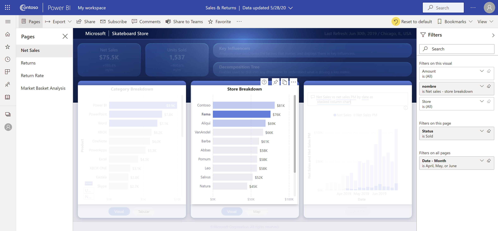

# Chatten in Microsoft Teams vanuit de Power BI-service

U kunt rechtstreeks vanuit de Power BI-service via Microsoft Teams chatten over Power BI-dashboards, -rapporten en -visuals. Gebruik de functie **Chatten in Teams** om snel gesprekken te starten wanneer u rapporten en dashboards in de Power BI-service bekijkt.

## Vereisten

Als u de functionaliteit **Chatten in Teams** in Power BI wilt gebruiken, moet u zorgen dat de Power BI-beheerder de tenantinstelling **Delen met Teams** heeft uitgeschakeld de Power BI-beheerportal. Met deze instelling kunnen organisaties de knoppen **Chatten in Teams** verbergen. Zie het artikel over de [Power BI-beheerportal](../admin/service-admin-portal.md#share-to-teams) voor meer informatie.

Zie [Samenwerken in Microsoft Teams met Power BI](service-collaborate-microsoft-teams.md) voor achtergrondinformatie over de manier waarop Power BI en Microsoft Teams samenwerken, inclusief andere vereisten.

## In Microsoft Teams chatten over Power BI-inhoud

Volg deze stappen om koppelingen naar rapporten, dashboards en visuals in de Power BI-service te delen en te chatten via Microsoft Teams-kanalen en -chats.

1. Selecteer een van deze opties:

   * **Chatten in Teams** in de actiebalk van een dashboard of rapport:

       
    
   * **Chatten in Teams** in het contextmenu voor één visual:
    
      

1. Selecteer in het dialoogvenster **Delen met Microsoft Teams** het team of kanaal waarnaar u de koppeling wilt versturen. U kunt eventueel een bericht invoeren. U kunt worden gevraagd u eerst aan te melden bij Microsoft Teams.

    

1. Selecteer **Delen** om de koppeling te versturen.
    
1. De koppeling wordt toegevoegd aan bestaande gesprekken of er wordt een nieuwe chat gestart.

    

1. Selecteer de koppeling om het item te openen in de Power BI-service.

1. Als u het contextmenu voor een bepaalde visual hebt gebruikt, wordt de visual gemarkeerd als het rapport wordt geopend.

    

## Bekende problemen en beperkingen

- Gebruikers zonder een Power BI-licentie of machtiging voor toegang tot het rapport krijgen een bericht dat de inhoud niet beschikbaar is.
- De knoppen **Chatten in Teams** werken mogelijk niet als de privacyinstelling in uw browser op strikt of streng staat ingesteld. Gebruik de optie **Problemen? Open een nieuw venster** als het dialoogvenster niet goed wordt geopend.
- **Chatten in Teams** bevat geen voorbeeld van de koppeling.
- Voorbeelden van koppelingen en **Chatten in Teams** geven gebruikers geen toestemming het item te bekijken. Toestemming moet afzonderlijk worden beheerd.
- De knop **Chatten in Teams** is niet beschikbaar in visuele contextmenu's wanneer de auteur van een rapport **Meer opties** voor de visual op **Uit** heeft ingesteld.
- Zie de sectie [Bekende problemen en beperkingen](service-collaborate-microsoft-teams.md#known-issues-and-limitations) van het artikel Samenwerken in Microsoft Teams voor andere problemen.

## Volgende stappen

- [Samenwerken in Microsoft Teams met Power BI](service-collaborate-microsoft-teams.md)

Hebt u nog vragen? [Misschien dat de Power BI-community het antwoord weet](https://community.powerbi.com/).
