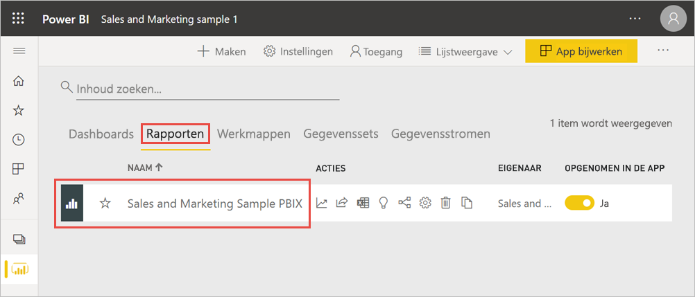
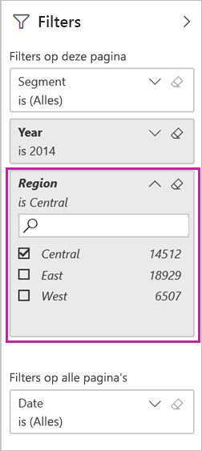
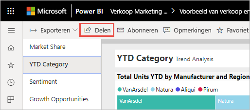
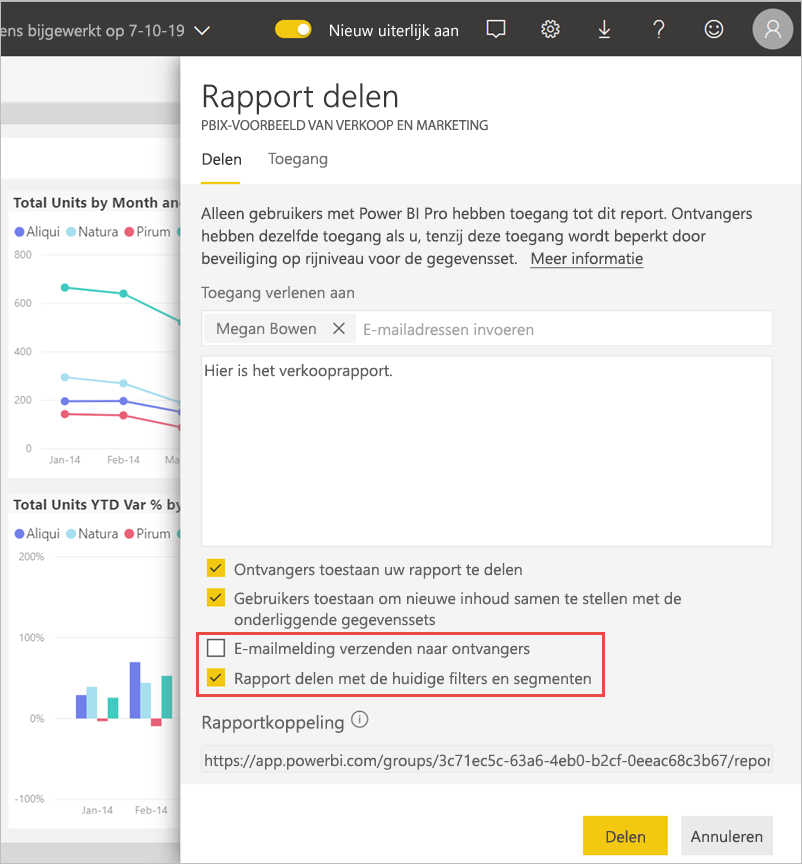
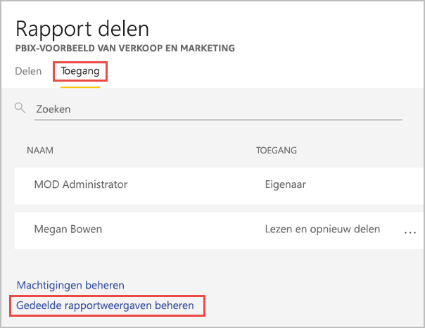
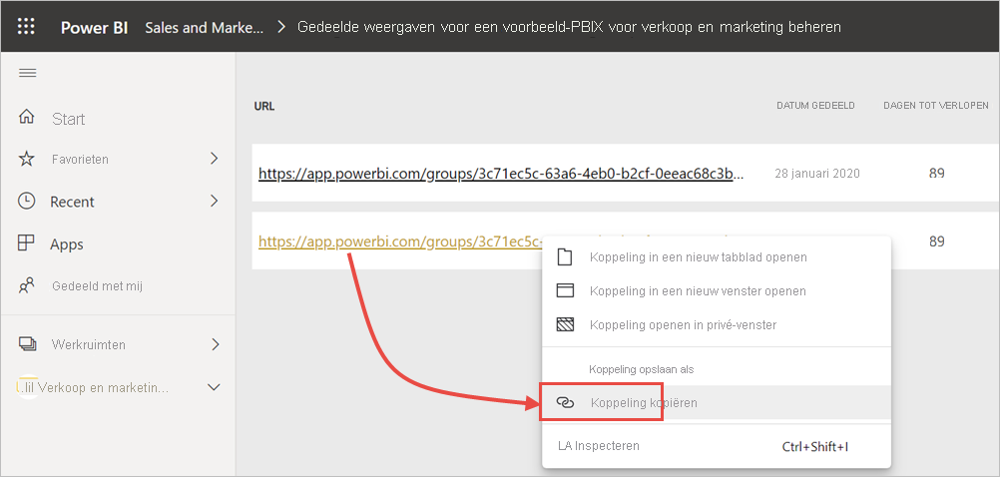

# Een Power BI-rapport filteren en delen
*Delen* is een goede manier om enkele personen toegang te geven tot uw dashboards en rapporten. Wat gebeurt er als u een gefilterde versie van een rapport wilt delen? Misschien wilt u dat het rapport alleen gegevens bevat voor een bepaalde stad of verkoper of jaar. In dit artikel wordt uitgelegd hoe u een rapport filtert en de gefilterde versie van het rapport deelt. Een andere manier om een gefilterd rapport te delen, is door [queryparameters toe te voegen aan de rapport-URL](service-url-filters.md). In beide gevallen wordt het rapport gefilterd wanneer een ontvanger het de eerste keer opent. De ontvanger kan de filterselecties in het rapport desgewenst wissen.

Power BI ondersteunt ook [andere manieren om samen te werken en rapporten te distribueren](service-how-to-collaborate-distribute-dashboards-reports.md). Als u wilt gaan delen, moeten u en de ontvangers een [Power BI Pro licentie](../fundamentals/service-features-license-type.md) hebben, of de inhoud moet zich in een [Premium-capaciteit](../admin/service-premium-what-is.md) bevinden. 

## Stappen volgen met voorbeeldgegevens

In dit artikel wordt de voorbeeldsjabloon-app Marketing en Sales gebruikt. Wilt u het proberen? 

1. Installeer de [voorbeeldsjabloon-app Marketing en Sales](https://appsource.microsoft.com/product/power-bi/microsoft-retail-analysis-sample.salesandmarketingsample?tab=Overview).
2. Selecteer de app en selecteer **App verkennen**.

   

3. Selecteer het potloodpictogram om de werkruimte te openen die u met de app hebt geïnstalleerd.

    

4. Selecteer in de lijst met werkruimte-inhoud de optie **Rapporten**en selecteer vervolgens het rapport **Sales and Marketing Sample PBIX**.

    

    U kunt de zelfstudie vanaf hier volgen.

## Een filter instellen in het rapport

Open een rapport in de [bewerkingsweergave](../consumer/end-user-reading-view.md) en pas een filter toe.

In dit voorbeeld filteren we de pagina JTD-categorie van de voorbeeldsjabloon-app Marketing en Sales, zodat alleen waarden worden weergegeven waarbij **Regio** gelijk is aan **Centraal**. 
 

Sla het rapport op.

## Het gefilterde rapport delen

1. Selecteer **Delen**.

   

2. Wis **E-mailmelding verzenden naar ontvanger**, zodat u in plaats daarvan een gefilterde koppeling kunt verzenden, selecteer **Rapport delen met de huidige filters en slicers**en selecteer vervolgens **Delen**.

    

4. Selecteer opnieuw **Delen**.

   

5. Selecteer het tabblad **Toegang** en selecteer vervolgens **Gedeelde rapportweergaven beheren**.

    

6. Klik met de rechtermuisknop op de gewenste URL en selecteer **Koppeling kopiëren**.

    

7. Wanneer u deze koppeling deelt, zien ontvangers het gefilterde rapport. 

## Beperkingen en overwegingen
Houd rekening met het volgende bij het delen van rapporten:

* Wanneer u een gegevensset deelt door machtigingen te beheren, door rapporten of dashboards te delen of door een app te publiceren, verleent u toegang tot de gehele gegevensset, tenzij [beveiliging op rijniveau (RLS)](../admin/service-admin-rls.md) de toegang beperkt. Rapportauteurs kunnen gebruikmaken van mogelijkheden waarmee gebruikerservaringen worden aangepast bij het weergeven van of werken met rapporten. Zo kunnen kolommen worden verborgen, de acties voor visuals worden beperkt, en meer. Deze aangepaste gebruikerservaring is niet van invloed op de gegevens waartoe gebruikers toegang hebben in de gegevensset. Gebruik [beveiliging op rijniveau](../admin/service-admin-rls.md) in de gegevensset zodat de referenties van elke persoon bepalen tot welke gegevens ze toegang hebben.

## Volgende stappen
* [Manieren om uw werk te delen in Power BI](service-how-to-collaborate-distribute-dashboards-reports.md)
* [Een dashboard delen](service-share-dashboards.md)
* Hebt u nog vragen? [Misschien dat de Power BI-community het antwoord weet](https://community.powerbi.com/).
* Wilt u feedback geven? Dit kan op de [site van de Power BI-community](https://community.powerbi.com/).
