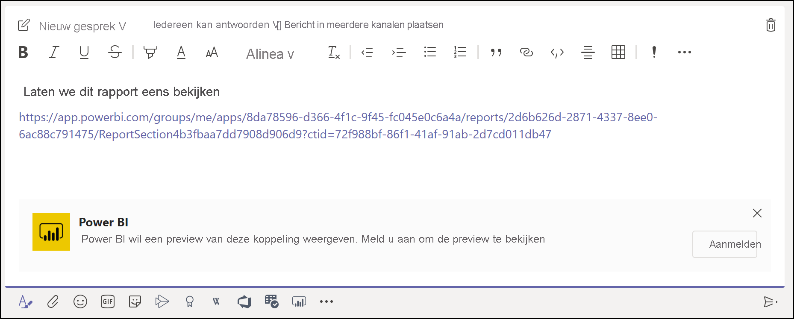
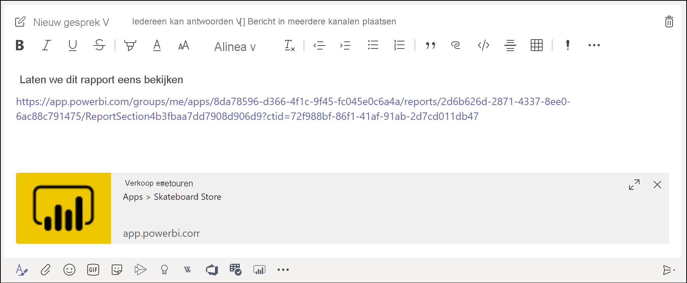
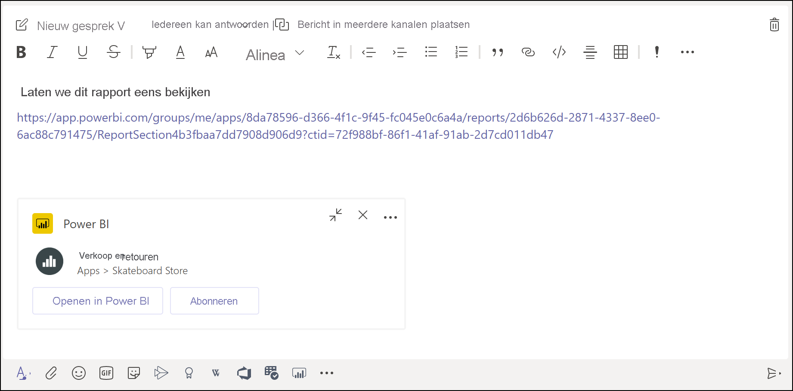

# Een voorbeeld krijgen van een Power BI-koppeling in Microsoft Teams

Wanneer u een koppeling naar uw rapporten, dashboards en apps in het Microsoft Teams-berichtvak plakt, wordt in het koppelingsvoorbeeld informatie over de koppeling gegeven. Er worden koppelingsvoorbeelden gegeven voor de volgende items in Power BI:

- Rapporten
- Dashboards
- Apps

Voor de service voor koppelingsvoorbeelden moeten uw gebruikers zich aanmelden. Als u zich wilt afmelden, selecteert u het pictogram **Power BI** onder aan het berichtvak. Selecteer vervolgens **Afmelden**.

Zie [Samenwerken in Microsoft Teams met Power BI](service-collaborate-microsoft-teams.md) voor achtergrondinformatie over de manier waarop Power BI en Microsoft Teams samenwerken, inclusief de vereisten waaraan u moet voldoen.

## Een koppelingsvoorbeeld verkrijgen

Volg deze stappen om een koppelingsvoorbeeld te krijgen voor inhoud in de Power BI-service.

1. Kopieer een koppeling naar een rapport, een dashboard of een app in de Power BI-service. U kunt bijvoorbeeld de koppeling uit de adresbalk van de browser kopiëren.

1. Plak de koppeling in het berichtvak van Microsoft Teams. Meld u aan bij de service voor het koppelingsvoorbeeld als u hierom wordt gevraagd. Mogelijk moet u enkele seconden wachten voordat het koppelingsvoorbeeld wordt geladen.

    

1. Na het aanmelden verschijnt het basiskoppelingsvoorbeeld.

    

1. Selecteer het pictogram **Uitvouwen** om de uitgebreide voorbeeldkaart weer te geven.

    

1. Op de uitgebreide voorbeeldkaart worden de koppeling en relevante actieknoppen weergegeven.

    

1. Verzend het bericht.

## Bekende problemen en beperkingen

- Eenmalige aanmelding wordt niet ondersteund voor de service voor koppelingsvoorbeelden.
- Koppelingsvoorbeelden werken niet in chat- of privé-kanalen voor vergaderingen.
- Zie de sectie [Bekende problemen en beperkingen](service-collaborate-microsoft-teams.md#known-issues-and-limitations) van het artikel Samenwerken in Microsoft Teams voor andere problemen.

## Volgende stappen

- [Samenwerken in Microsoft Teams met Power BI](service-collaborate-microsoft-teams.md)

Hebt u nog vragen? [Misschien dat de Power BI-community het antwoord weet](https://community.powerbi.com/).
