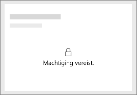
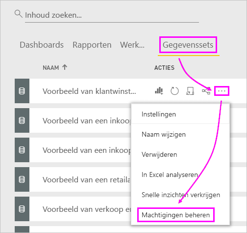
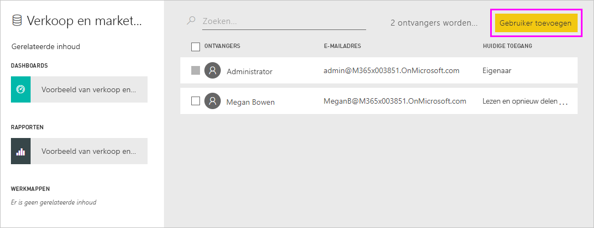
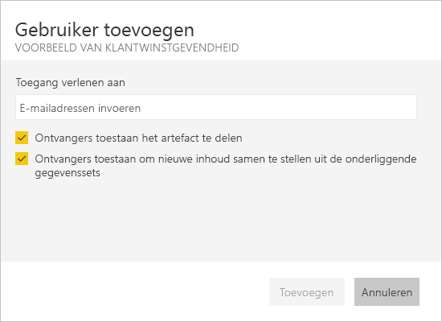
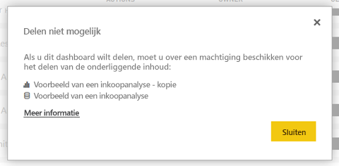

# Problemen met het delen van dashboards of rapporten oplossen

Hier volgen enkele veelvoorkomende problemen die kunnen optreden wanneer u een dashboard of rapport deelt of als iemand anders dit met u deelt. 

## De ontvangers van een dashboard zien een vergrendelingspictogram in een tegel

De personen met wie u inhoud deelt zien mogelijk een vergrendelde tegel in een dashboard of het bericht 'Machtiging is vereist' wanneer ze proberen om een rapport weer te geven.

Als dit het geval is, moet u hen toestemming geven voor de onderliggende gegevensset.

1. Ga naar het tabblad **Gegevenssets** in de inhoudslijst.

1. Selecteer het beletselteken ( **...** ) naast de gegevensset en selecteer vervolgens **Machtigingen beheren**.

    

1. Selecteer **Gebruiker toevoegen**.

    

1. Typ het volledige e-mailadres voor afzonderlijke personen, distributiegroepen of beveiligingsgroepen. U kunt niet delen met dynamische distributielijsten.

    

1. Selecteer **Toevoegen**.

## Ik kan geen dashboards of rapporten delen

Als u een dashboard of rapport wilt delen, hebt u toestemming nodig om de onderliggende inhoud (gerelateerde rapporten en gegevenssets) opnieuw te delen. Als een bericht wordt weergegeven dat u niet kunt delen, vraagt u de auteur van het rapport u toestemming te geven deze rapporten en gegevenssets opnieuw te delen.

## Ik heb geen toegang tot een dashboard of rapport

Als u het bericht 'Toegang aanvragen' ziet wanneer u de koppeling naar een rapport of dashboard selecteert, bent u niet gemachtigd om het weer te geven. U moet [toegang aanvragen](service-request-access.md).

## Volgende stappen

- [Power BI-dashboards en -rapporten delen met collega's en anderen](service-share-dashboards.md)
- [Hoe kan ik samenwerken aan dashboards en rapporten en deze delen?](service-how-to-collaborate-distribute-dashboards-reports.md)
-  [Een gefilterd Power BI-rapport delen](service-share-reports.md)
- Vragen? [Misschien dat de Power BI-community het antwoord weet](https://community.powerbi.com/)
