# Een upgraden uitvoeren van de klassieke werkruimten naar de nieuwe werkruimten in Power BI

In dit artikel wordt uitgelegd hoe u een klassieke werkruimte bijwerkt of *migreert* naar de nieuwe werkruimte-ervaring. U kunt elke klassieke werkruimte bijwerken. De nieuwe werkruimten hebben meer gedetailleerde werkruimterollen, zodat u de toegang tot de inhoud ervan beter kunt beheren. U heb ook meer flexibiliteit bij het beheren van bijgewerkte werkruimten, omdat deze losser zijn verbonden met de oorspronkelijke Microsoft 365-groep. Informatie over de [nieuwe werkruimte-ervaring](service-new-workspaces.md).

>[!NOTE]
>Er is een upgrade voor de werkruimte beschikbaar als een openbare preview. 

>[!NOTE]
>Upgrade van werkruimte kan worden geïnitieerd door een Power BI-beheerder. Werkruimtebeheerders ontvangen een e-mail wanneer hun werkruimte wordt bijgewerkt door hun Power BI-beheerder. [Meer informatie](../admin/service-admin-portal.md#workspaces) 

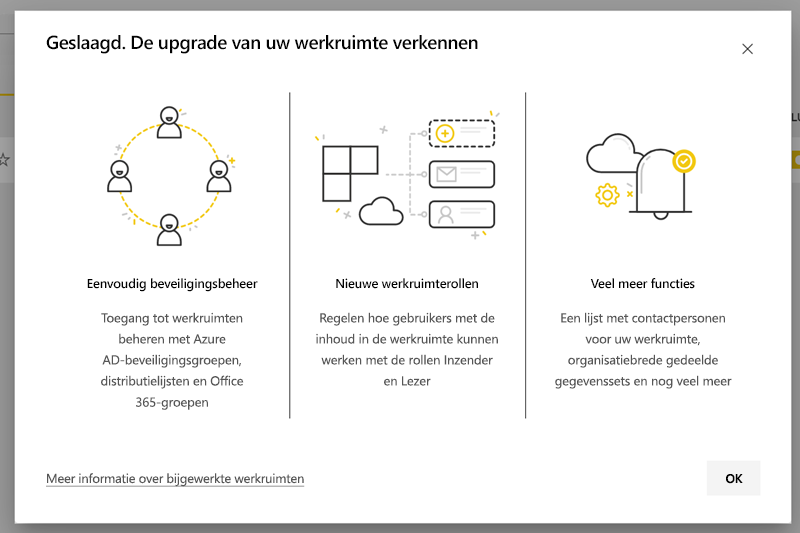

Mogelijk moet u wel rekening houden met bepaalde wijzigingen in uw werkruimte. Inhoudspakketten worden bijvoorbeeld niet ondersteund in de nieuwe werkruimte-ervaring. Zie de sectie [Overwegingen en beperkingen voor de upgrade](#upgrade-considerations-and-limitations) verderop in dit artikel.

## Dingen die u moet plannen voordat u een upgrade uitvoert

U moet een aantal dingen doen *na* de upgrade. U kunt deze het beste plannen *voordat* u de upgrade uitvoert:
- Bekijk de toegangslijst en zorg ervoor dat u op de hoogte bent van de [machtigingen na de upgrade](#permissions-after-upgrade).
- Bekijk de [lijst met contactpersonen](#modify-the-contact-list) en zorg ervoor dat deze naar wens is ingesteld.
- Lees de informatie over de [nieuwe werkruimte-ervaring](service-new-workspaces.md) als u dat nog niet hebt gedaan.

## Een klassieke werkruimte upgraden

Elke werkruimtebeheerder kan de werkruimte upgraden. Voor klassieke werkruimten moet u een eigenaar van de onderliggende Microsoft 365-groep zijn om een werkruimtebeheerder te zijn. Voer de volgende stappen uit om een werkruimte te upgraden.

1. Selecteer in de lijst Inhoud van de werkruimte **Meer opties** ( **...** ) > **Deze werkruimte bewerken**.

    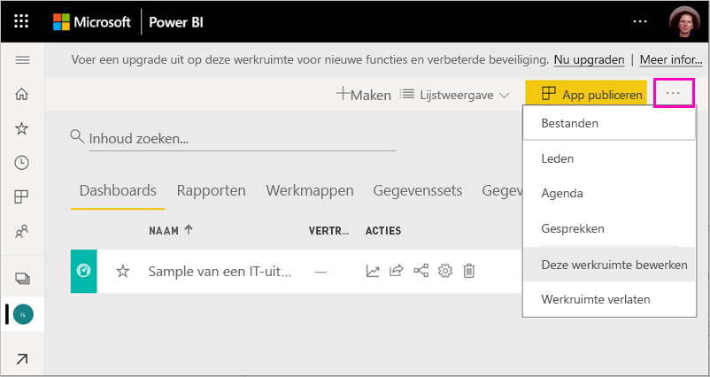

1. Vouw **Geavanceerd** uit en selecteer **Nu upgraden**.

    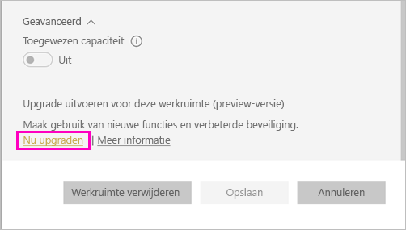

1. Bekijk de informatie in het dialoogvenster. Er worden waarschuwingen weergegeven als u inhoudspakketten in de werkruimte hebt gepubliceerd of geïnstalleerd. Wanneer u klaar bent, schakelt u **Ik ben gereed voor de upgrade van deze werkruimte** in en selecteert u vervolgens **Upgrade uitvoeren**.

    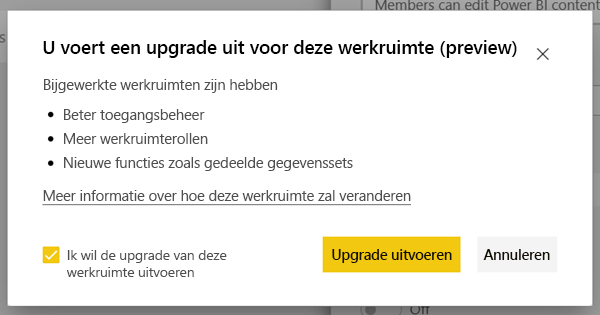

2. Tijdens de upgrade ziet u het bericht dat de **upgrade wordt uitgevoerd**. Meestal duurt het nog geen minuut om uw werkruimte bij te werken.

1. Nadat de upgrade is voltooid, wordt een dialoogvenster weergegeven dat de upgrade is **geslaagd**. U ziet uw nieuwe werkruimte-ervaring met dezelfde naam en inhoud. U wordt aangeraden [Werk organiseren in de nieuwe werkruimten in Power BI](service-new-workspaces.md) te lezen, zodat u op de hoogte bent van de verschillen tussen nieuwe werkruimten en klassieke werkruimten.

### Gevolgen voor andere gebruikers van de werkruimte

We raden u aan de upgrade uit te voeren buiten kantooruren wanneer er weinig gebruikers actief zijn en items in de werkruimte bekijken of bewerken.

Gebruikers die de werkruimte actief gebruiken, wordt gevraagd hun browser te vernieuwen. Gebruikers die een rapport bewerken, krijgen de mogelijkheid om het rapport op te slaan voordat ze hun browser vernieuwen.

## Overwegingen en beperkingen voor de upgrade

- Na de upgrade wordt de inhoud van de klassieke werkruimte weergegeven in de nieuwe werkruimte. Hij wordt ook vermeld in **Gedeeld met mij**.
- De URL's en id's van uw werkruimte, de inhoud van de werkruimte en de app die vanuit de werkruimte wordt gepubliceerd, blijven hetzelfde. Inhoud van inhoudspakketten die in uw werkruimte zijn geïnstalleerd, wordt afzonderlijk afgehandeld. Zie [Inhoudspakketten tijdens de upgrade](#content-packs-during-upgrade) in dit artikel voor meer informatie.
- Inhoudspakketten worden niet ondersteund in de nieuwe werkruimte-ervaring. Lees de secties over [gepubliceerde inhoudspakketten](#published-content-packs) of [geïnstalleerde inhoudspakketten](#installed-content-packs) voor meer informatie over hoe deze worden afgehandeld tijdens de upgrade. Het is raadzaam om inhoudspakketten die in uw werkruimte zijn geïnstalleerd of gepubliceerd te verwijderen voordat u de upgrade uitvoert.
- De Microsoft 365-groep voor uw klassieke werkruimte wordt niet beïnvloed door de upgrade van de werkruimte in Power BI. Alle teams, SharePoint-sites, postvakken of andere resources die worden beheerd door Microsoft 365, worden niet gewijzigd. Ze blijven intact wanneer u de upgrade van uw Power BI-werkruimte uitvoert. Ook de Microsoft 365-groep blijft hetzelfde.
- Er zijn wijzigingen in de manier waarop uw werkruimte wordt beveiligd na de upgrade. Zie de sectie [Machtigingen na de upgrade](#permissions-after-upgrade) voor meer informatie.
- Zo nodig kunt u gebruikmaken van de optie voor **terugkeer naar een klassieke werkruimte**. Bepaalde aspecten van de werkruimte kunnen echter niet volledig worden hersteld naar hoe het was vóór de upgrade. Als u eenmaal functies gebruikt die alleen in de nieuwe werkruimte-ervaring werken, is terugkeer naar een klassieke werkruimte niet meer mogelijk. De optie voor terugkeer is tot 30 dagen na de upgrade beschikbaar.
- Power BI-beheerders kunnen een upgrade van een werkruimte initiëren. Werkruimtebeheerders ontvangen een e-mail wanneer hun werkruimte is bijgewerkt door de Power BI-beheerder.

## Machtigingen na de upgrade

Selecteer **Toegang** in de menubalk boven aan de lijst met werkruimte-inhoud om de machtigingen na de upgrade te controleren.

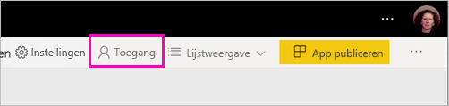

Elke Microsoft 365-groepseigenaar wordt afzonderlijk toegevoegd aan de beheerdersrol voor de bijgewerkte werkruimte. De Microsoft 365-groep zelf wordt toegevoegd aan een werkruimterol. De rol waaraan de groep wordt toegevoegd, is afhankelijk van het feit of de klassieke werkruimte is geconfigureerd als *alleen-lezen* of *lezen/schrijven*:

- Als de werkruimte is ingesteld op **Leden kunnen Power BI-inhoud bewerken**, wordt de Microsoft 365-groep na de upgrade toegevoegd aan de toegangslijst voor de werkruimte met de rol **Lid**.
- Als de werkruimte is ingesteld op **Leden kunnen Power BI-inhoud alleen lezen**, wordt de Microsoft 365-groep na de upgrade toegevoegd aan de toegangslijst voor de werkruimte met de rol **Kijker**.

Omdat de Microsoft 365-groep een rol krijgt in de werkruimte, heeft elke gebruiker die aan de Microsoft 365-groep is toegevoegd, die rol in de werkruimte na de upgrade. Als u na de upgrade echter nieuwe eigenaren aan de Microsoft 365-groep toevoegt, hebben ze geen beheerdersrol voor de werkruimte.

### Verschillen in rollen voor en na de upgrade

Werkruimterollen in de klassieke werkruimten zijn anders dan die in de nieuwe werkruimten. Met de nieuwe werkruimte-ervaring kunt u werkruimterollen toekennen aan Microsoft 365-groepen,-beveiligingsgroepen of distributielijsten.

- **Leden** kunnen afzonderlijke items delen en toegang tot de hele werkruimte verlenen via de rollen Lid, Inzender of Kijker
- **Kijkers** kunnen alleen inhoud bekijken. Ze kunnen geen onderliggende gegevens exporteren of analyseren in Excel voor werkruimtegegevenssets, tenzij ze de machtiging Build hebben.

Alle gebruikers met toegang tot items in de werkruimte via een machtiging voor delen of een app-machtiging hebben nog steeds toegang tot die items. Iedereen met toegang tot de werkruimte heeft ook toegang tot de app die is gepubliceerd vanuit de werkruimte. Deze gebruikers worden niet vermeld in de toegangslijst voor de app.

U wordt aangeraden te evalueren of u de nieuwe rol Inzender wilt gebruiken. Na de upgrade kunt u de rol van de Microsoft 365-groep in Inzender wijzigen in het deelvenster Toegang.

Na de upgrade kunt u overwegen om een beveiligingsgroep, Microsoft 365-groep of een distributielijst voor werkruimtebeheerders te maken, in plaats van de toegang te beheren via roltoewijzingen aan individuele gebruikers.

Lees hier meer over [rollen in de nieuwe werkruimten](service-new-workspaces.md#roles-in-the-new-workspaces).

## Licentieverlening na de upgrade

Gebruikers met de werkruimterollen Beheerder, Lid of Inzender hebben een Power BI Pro-licentie nodig voor toegang tot de werkruimte.

Als de werkruimte zich in de gedeelde capaciteit bevindt, hebben gebruikers met de werkruimterol Kijker ook een Power BI Pro-licentie nodig voor toegang tot de werkruimte. Als de werkruimte zich in een Premium-capaciteit bevindt, hebben gebruikers met de rol Kijker geen Power BI Pro-licentie nodig voor toegang tot de werkruimte.

## Overige nieuwe werkruimtefuncties

De nieuwe werkruimte-ervaring bevat functies die niet beschikbaar zijn in de klassieke werkruimten. Een verschil is de mogelijkheid om een lijst met contactpersonen in te stellen die afwijkt van de lijst met werkruimtebeheerders of -eigenaren. Een overeenkomst is dat deze nog steeds verbonden is met de Share Point-documentbibliotheek van de Microsoft 365-groep.

### De lijst met contactpersonen wijzigen

1. Selecteer **Instellingen** in de menubalk boven aan de lijst met werkruimte-inhoud om de instellingen voor de werkruimte weer te geven.

    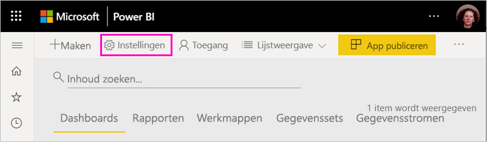

2. Onder **Geavanceerd**, bij **Lijst met contactpersonen**, is de Microsoft 365-groep geconfigureerd waarmee de upgrade van de werkruimte is uitgevoerd. U kunt meer gebruikers of groepen toevoegen aan de lijst met contactpersonen of overschakelen naar werkruimtebeheerders.

    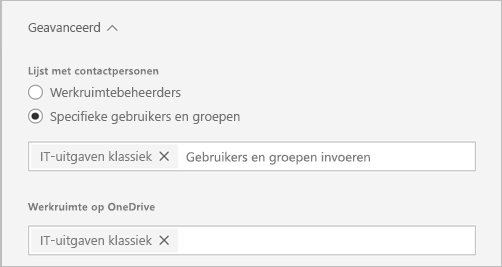

### De werkruimte OneDrive 

Na de upgrade is de werkruimte **OneDrive-** verbonden met de SharePoint-documentbibliotheek van de Microsoft 365-groep. Deze documentbibliotheek wordt weergegeven als de optie **OneDrive** onder **> Gegevens ophalen > Bestanden**. Mogelijk zijn niet alle gebruikers van de werkruimte gemachtigd voor deze documentbibliotheek als ze geen lid zijn van de Microsoft 365-groep.

## Inhoudspakketten tijdens de upgrade

De nieuwe werkruimte-ervaring biedt geen ondersteuning voor inhoudspakketten. Gebruik in plaats daarvan apps en gedeelde gegevenssets voor het distribueren van inhoud in de werkruimte. U kunt het beste gepubliceerde of geïnstalleerde inhoudspakketten uit de werkruimte verwijderen voordat u de upgrade uitvoert. Als er echter inhoudspakketten zijn gepubliceerd of geïnstalleerd wanneer u een upgrade uitvoert, wordt geprobeerd de inhoud te behouden, zoals verderop in dit artikel wordt beschreven.  Er is geen manier om het inhoudspakket of de koppeling van inhoud aan het inhoudspakket te herstellen na de upgrade.

### Gepubliceerde inhoudspakketten

Inhoudspakketten die zijn gepubliceerd vanuit de werkruimte, worden tijdens de upgrade verwijderd. U kunt ze na de upgrade niet publiceren of bijwerken, zelfs niet als u terugkeert naar de klassieke werkruimte. Als anderen uw inhoudspakket hebben geïnstalleerd in hun eigen werkruimten, zien ze na de upgrade een kopie van de inhoud van het inhoudspakket in hun werkruimten. Zie de sectie **Geïnstalleerde inhoudspakketten** voor meer informatie.

### Geïnstalleerde inhoudspakketten

Wanneer u een upgrade van uw werkruimte uitvoert, of een upgrade wordt uitgevoerd van de werkruimte van waaruit het inhoudspakket wordt gepubliceerd, worden er belangrijke wijzigingen aangebracht in geïnstalleerde inhoudspakketten. Na de upgrade bevat uw werkruimte een kopie van de inhoud van het inhoudspakket. Deze is verbonden met de oorspronkelijke gegevensset in de oorspronkelijke werkruimte.

Er zijn echter belangrijke verschillen:

- De inhoud wordt niet meer bijgewerkt als het inhoudspakket wordt bijgewerkt.
- De URL's en item-id's worden gewijzigd en alle bladwijzers of koppelingen die u hebt gedeeld met anderen moeten worden bijgewerkt.
- Alle aanpassingen van gebruikers in het oorspronkelijke inhoudspakket van uw werkruimte gaan verloren. Aanpassingen zijn onder andere abonnementen, waarschuwingen, persoonlijke bladwijzers, permanente filters en favorieten.
- Nieuwe gebruikers hebben mogelijk geen toegang tot de gegevenssets die zich in het inhoudspakket bevonden. U moet er samen met de eigenaar van de gegevensset voor zorgen dat gebruikers van de werkruimte toegang hebben tot de gegevens.

## Terugkeren naar een klassieke werkruimte

Als onderdeel van de upgrade-ervaring hebt u de mogelijkheid om binnen 30 dagen na de upgrade terug te keren naar een klassieke werkruimte. Met deze functie wordt de koppeling van de werkruimte-inhoud teruggezet met de oorspronkelijke Microsoft 365-groep. Deze optie is beschikbaar voor het geval dat uw organisatie grote problemen ondervindt met het gebruik van de nieuwe werkruimte-ervaring. Er zijn echter beperkingen. Lees eerst [Overwegingen voor terugkeer naar klassiek](#considerations-for-switching-back-to-classic) in dit artikel.

Om te kunnen terugkeren, moet u een eigenaar zijn van de Microsoft 365-groep waaraan de werkruimte was gekoppeld vóór de upgrade. Volg deze stappen.

1. Selecteer in de lijst Inhoud van de werkruimte **Meer opties** ( **...** ) > **Instellingen voor werkruimte**.

    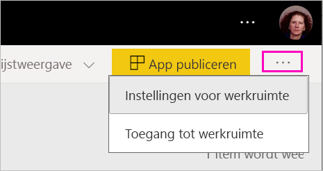

1. Vouw **Geavanceerd** uit en selecteer **Terugkeren naar klassiek**. Als deze optie niet beschikbaar is, raadpleegt u [Overwegingen voor terugkeer naar klassiek](#considerations-for-switching-back-to-classic) in dit artikel.

    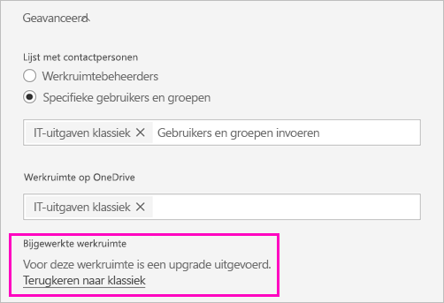

1. Wanneer u zover bent, schakelt u het selectie vakje **Ik ben klaar om terug te keren naar klassiek** in en selecteert u de optie voor **terugkeer naar een klassieke werkruimte**. Mogelijk ziet u waarschuwingen of blokkeringen in dit dialoogvenster. Lees de [overwegingen voor terugkeer](#considerations-for-switching-back-to-classic) in dit artikel als u deze problemen ondervindt.

    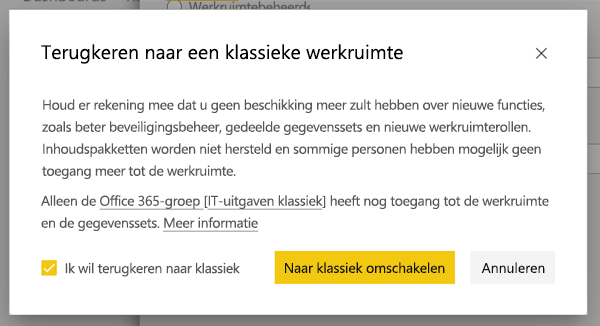

1. Wanneer de terugkeer is voltooid, wordt een bevestigingsvenster weergegeven.

    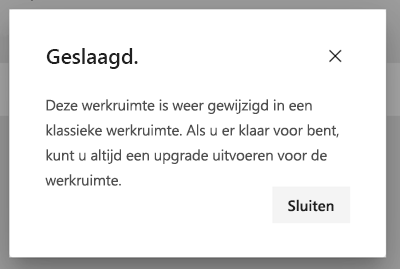

### Overwegingen voor terugkeer naar klassiek

U kunt niet terugkeren als een of meer van de volgende beweringen over uw werkruimte waar zijn:

- De Microsoft 365 groep is verwijderd.
- Het is meer dan 30 dagen geleden dat u de upgrade hebt uitgevoerd.
- Gegevenssets in de werkruimte worden gebruikt door rapporten of dashboards in andere werkruimten. Hoe gebeurt dit? Stel, u hebt vóór de upgrade een inhoudspakket gepubliceerd vanuit de werkruimte en iemand heeft dat inhoudspakket geïnstalleerd in een andere werkruimte. Onmiddellijk na de upgrade worden de gegevenssets gebruikt door de rapporten en dashboards in dat inhoudspakket.
- De werkruimte maakt deel uit van een beheerpijplijn voor de levenscyclus van toepassingen.
- De werkruimte wordt gebruikt voor sjabloon-apps.
- De werkruimte maakt gebruik van de functie voor grote modellen.
- De werkruimte maakt gebruik van de nieuwe functie voor metrische gegevens over gebruik.

Bij terugkeer naar een klassieke werkruimte wordt er geen exacte kopie van de oorspronkelijke werkruimte teruggezet. De volgende wijzigingen worden aangebracht:

- Machtigingen voor de werkruimte worden ingesteld door de Microsoft 365-groep waarmee de werkruimte oorspronkelijk was verbonden vóór de upgrade.
  - Alle beheerders van de Microsoft 365-groep worden beheerders van de klassieke werkruimte.
  - Alle leden van de Microsoft 365-groep worden leden van de klassieke werkruimte. Als de klassieke werkruimte was ingesteld op **Leden kunnen Power BI-inhoud alleen lezen**, wordt deze instelling hersteld.
  - Gebruikers of gebruikersgroepen die aan de werkruimte zijn toegevoegd nadat de upgrade is voltooid (buiten de Microsoft 365-groep), hebben geen toegang meer tot de werkruimte. Voeg ze toe aan de Microsoft 365-groep om ze toegang te geven. Houd er rekening mee dat Microsoft 365-groepen geen nestbeveiliging of distributiegroepen in het lidmaatschap toestaan.
  - Gebruikers die toegang tot de app voor de werkruimte hebben gekregen, hebben nog steeds toegang tot de app.
  - Gebruikers die toegang tot items in de werkruimte hebben gekregen via delen, hebben nog steeds toegang tot de items.
- Inhoudspakketten die zijn gepubliceerd vanuit de klassieke werkruimte vóór de upgrade, worden niet hersteld.
- Inhoudspakketten die zijn geïnstalleerd in de klassieke werkruimte vóór de upgrade, worden niet hersteld.
- Abonnementen die zijn gemaakt door gebruikers in de werkruimte na de upgrade, worden verwijderd. Abonnementen die al bestonden vóór de upgrade, blijven werken zoals verwacht.
- Gegevensmeldingen blijven niet behouden. Deze worden verwijderd.
- Als u de naam van de werkruimte na de upgrade hebt gewijzigd, wordt de naam van de werkruimte teruggezet zodat deze overeenkomt met de naam van de Microsoft 365-groep.
- Lopende bewerkingen, zoals vernieuwbewerkingen, worden niet beïnvloed door de upgrade van de werkruimte.

## Migratie naar de nieuwe werkruimten voor uw tenant beheren 

Organisaties die proactief willen migreren naar de nieuwe werkruimte-ervaring, kunnen dit doen via de Power BI-beheerportal. De Power BI-beheerder kan een of meer werkruimten selecteren voor een upgrade. Upgrades van werkruimten die door de Power BI-beheerder zijn geïnitieerd delen dezelfde overwegingen en beperkingen voor upgrades van werkruimten die door de werkruimtebeheerder zijn geïnitieerd. [Meer informatie](../admin/service-admin-portal.md#workspaces) 

Organisaties die een dergelijk proces willen beheren, wordt aangeraden om de volgende stappen uit te voeren om te zorgen voor een duidelijke communicatie met de betreffende werkruimtebeheerders.

1. De lijst met werkruimten in de Power BI-beheerportal en de bijbehorende API bevat alle werkruimten in Power BI. Klassieke werkruimten worden weergegeven met het type Groep in de lijst.
2. Werk samen met afzonderlijke groepseigenaren of met uw beheerder in Microsoft 365 om hen op de hoogte te brengen van uw plannen om een upgrade uit te voeren van hun klassieke werkruimten.

De upgradefunctie voor de werkruimte biedt geen hulpprogramma's voor programmatische upgrades. Daarnaast worden nieuwe Microsoft 365-groepen die zijn gemaakt in uw organisatie, nog steeds weergegeven in Power BI.
   
   
## Bekende problemen

Er zijn een aantal bekende problemen waarmee u te maken kunt krijgen na het uitvoeren van de upgrade:
- Mogelijk wordt het waarschuwingsdialoogvenster Fout bij het laden van model weergegeven. Dit bericht wordt onbedoeld weergegeven en kan worden genegeerd. 
- De namen van een aantal werkruimten zijn anders na het uitvoeren van de upgrade. Wanneer dit zich voordoet, is de werkruimtenaam teruggezet naar een eerdere naam voor de werkruimte of is de werkruimtenaam leeg. U kunt dit probleem oplossen door de naam van de werkruimte te wijzigen in de gewenste naam.
- In een werkruimte die een geïnstalleerd inhoudspakket had, ziet u mogelijk extra dashboards die niet zichtbaar waren vóór het uitvoeren van de upgrade. In dit geval is een inhoudspakket mogelijk niet recent bijgewerkt. U kunt deze dashboards veilig verwijderen.

## Volgende stappen

* [Werk organiseren in de nieuwe werkruimte-ervaring](service-new-workspaces.md)
* [De nieuwe werkruimten maken](service-create-the-new-workspaces.md)
* [De klassieke werkruimten maken](service-create-workspaces.md)
* [Een door de Power BI beheerder geïnitieerde werkruimte-upgrade starten](../admin/service-admin-portal.md#workspaces)
* Vragen? [Misschien dat de Power BI-community het antwoord weet](https://community.powerbi.com/)
