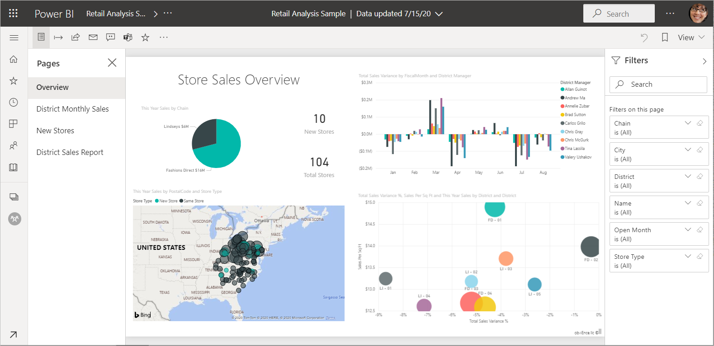
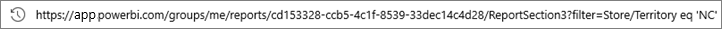
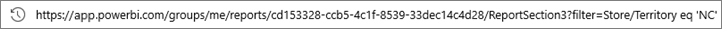
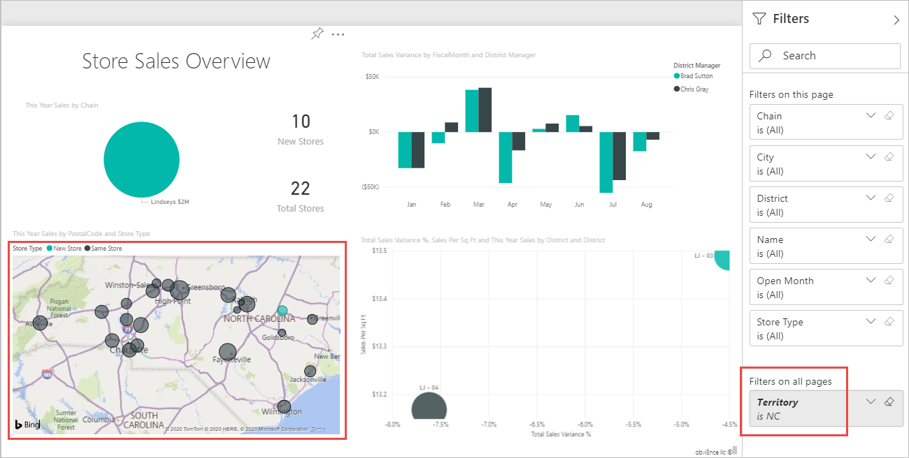
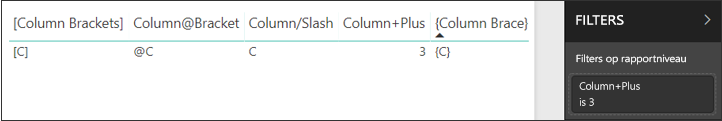
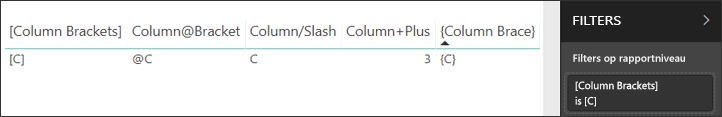

# <a name="filter-a-report-using-query-string-parameters-in-the-url"></a>Een rapport filteren door queryreeksparameters in de URL te gebruiken

Wanneer u een rapport in Power BI-service opent, heeft elke pagina van het rapport een eigen unieke URL. Als u deze rapportpagina wilt filteren, kunt u het deelvenster met filters gebruiken op het rapportcanvas.  U kunt ook queryreeksparameters toevoegen aan de URL om het rapport vooraf te filteren. Misschien hebt u een rapport dat u aan collega's wilt laten zien en u wilt het voor hen vooraf filteren. U kunt beginnen met de standaard-URL voor het rapport, de filterparameters toevoegen aan de URL en hen vervolgens via e-mail de volledige nieuwe URL sturen.

In dit artikel wordt het voorbeeldrapport van een retailanalyse gebruikt. Als u dit scenario wilt volgen, kunt u het [voorbeeldrapport](../create-reports/sample-retail-analysis.md#get-the-sample) downloaden.



## <a name="uses-for-query-string-parameters"></a>Manieren om queryreeksparameters te gebruiken

Stel dat u werkt in Power BI Desktop. U wilt een rapport maken met koppelingen naar andere Power BI-rapporten, maar u wilt slechts een deel van de informatie in de andere rapporten opnemen. Filter om te beginnen de rapporten met queryreeksparameters en sla de URL's op. Maak vervolgens in Desktop een tabel met deze nieuwe rapport-URL's.  Publiceer en deel het rapport vervolgens.

U kunt queryreeksparameters ook gebruiken om een geavanceerde Power BI-oplossing te maken.  Ze maken met DAX een rapport dat dynamisch een gefilterde rapport-URL genereert op basis van de selectie die hun klant maakt in het huidige rapport. Wanneer de klant op de URL klikt, wordt alleen de benodigde informatie weergegeven. 

## <a name="query-string-parameter-syntax-for-filtering"></a>Syntaxis van queryreeksparameter voor filteren

U kunt parameters gebruiken om het rapport te filteren op een of meer waarden, zelfs als die waarden spaties of speciale tekens bevatten. De basissyntaxis is vrij eenvoudig: start met de URL van het rapport, voeg een vraagteken toe en vervolgens uw filtersyntaxis.

*URL*?filter=*Tabel*/*Veld* eq '*waarde*'



* De namen van de **tabel** en het **veld** zijn hoofdlettergevoelig, de **waarde** is dat niet.
* Velden die verborgen zijn in de rapportageweergave kunnen nog steeds worden gefilterd.

### <a name="field-types"></a>Veldtypen

Een veld kan een cijfer, datum/tijd of tekenreeks bevatten. Het type dat u kiest, moet overeenkomen met het type dat wordt ingesteld in de gegevensset.  Als u bijvoorbeeld een tabelkolom van het type Tekenreeks maakt, ontstaat er een probleem als u een datum/tijd of numerieke waarde wilt opgeven in een gegevenssetkolom van het type Datum, zoals Table/StringColumn eq 1.

* **Tekenreeksen** moeten tussen enkele aanhalingstekens staan, bijvoorbeeld 'naam manager'.
* **Cijfers** hoeven niet op een speciale manier te worden opgemaakt. Zie [Numerieke gegevenstypen](#numeric-data-types) in dit artikel voor meer informatie.
* **Datums en tijden** Zie [Datumgegevenstypen](#date-data-types) in dit artikel. 

Als het nog steeds verwarrend voor u is, lees dan verder en we zullen het voor u uitsplitsen.  

## <a name="filter-on-a-field"></a>Filteren op een veld

Stel dat de URL van ons rapport als volgt is.


En we zien op onze visualisatiekaart boven dat we winkels in North Carolina hebben. *NC* is de waarde die voor North Carolina staat in het veld **Gebied** van de tabel **Winkel**. Als u het rapport zodanig wilt filteren dat er alleen winkels in ‘NC’ worden weergegeven, voegt u deze reeks aan de URL toe:

```
?filter=Store/Territory eq 'NC'
```



Nu is het rapport gefilterd op North Carolina. Alle visualisaties op het rapport bevatten alleen gegevens voor North Carolina.



## <a name="filter-on-more-than-one-value-in-a-field"></a>Filteren op meer dan één waarde in een veld

Als u wilt filteren op meer dan één waarde in één veld, gebruikt u de operator **in** in plaats van de operator **and**. De syntaxis is:

*URL*?filter=*Tabel*/*Veld* **in** ('*waarde1*', '*waarde2*')

Als u in hetzelfde voorbeeld het rapport zo wilt filteren dat er alleen gegevens voor winkels in North Carolina (NC) of Tennessee (TN) worden weergegeven, voegt u het volgende toe aan de URL;

```
?filter=Store/Territory in ('NC', 'TN')
```

Zie de tabel [Operatoren](#operators) verderop in dit artikel voor een lijst met andere nuttige operatoren.

## <a name="filter-on-multiple-fields"></a>Filteren op meerdere velden

U kunt ook filteren op meerdere velden door extra parameters aan uw URL toe te voegen. Daarvoor gaat u terug naar de oorspronkelijke filterparameter.

```
?filter=Store/Territory eq 'NC'
```

Als u wilt filteren op aanvullende velden, voegt u een '**and**' en een ander veld toe in dezelfde indeling als hierboven. Hier volgt een voorbeeld.

```
?filter=Store/Territory eq 'NC' and Store/Chain eq 'Fashions Direct'
```

## <a name="operators"></a>Operators

Power BI ondersteunt naast '**and**' nog verschillende andere operators. De volgende tabel bevat deze operators en het type inhoud waar de operators ondersteuning voor bieden.

|operator  | definitie | tekenreeks  | getal | Datum |  Voorbeeld|
|---------|---------|---------|---------|---------|---------|
|**and**     | en |  ja      | ja |  ja|  product/price le 200 and price gt 3.5 |
|**eq**     | is gelijk aan |  ja      | ja   |  ja       | Address/City eq 'Redmond' |
|**ne**     | is niet gelijk aan |   ja      | ja  | ja        |  Address/City ne 'London' |
|**ge**     |  groter dan of gelijk aan       | nee | ja |ja |  product/price ge 10
|**gt**     | groter dan        |nee | ja | ja  | product/price gt 20
|**le**     |   kleiner dan of gelijk aan      | nee | ja | ja  | product/price le 100
|**lt**     |  kleiner dan       | nee | ja | ja |  product/price lt 20
|**in\*\***     |  inclusief       | ja | ja |  ja | Student/Age in (27, 29)


\*\*Als u **in** gebruikt, kunnen de waarden rechts van **in** in een lijst met door komma's gescheiden waarden zijn geplaatst, tussen haakjes. Er kan ook een expressie worden geplaatst waarmee een verzameling wordt geretourneerd.

### <a name="numeric-data-types"></a>Numerieke gegevenstypen

Power BI-URL-filters kunnen in de volgende indelingen cijfers bevatten.

|Type getal  |Voorbeeld  |
|---------|---------|
|**geheel getal**     |   5      |
|**long**     |   5 L of 5 l      |
|**double**     |   5.5, 55e-1, 0.55e+1, 5D, 5d, 0.5e1D, 0.5e1d, 5.5D, 5.5d, 55e-1D of 55e-1d     |
|**decimal**     |   5 M of 5 m of 5,5 M of 5,5 m      |
|**float**     | 5 F of 5 f of 0,5e1 F of 0,5e-1 d        |

### <a name="date-data-types"></a>Datumgegevenstypen

Power BI biedt ondersteuning voor OData V3 en V4 voor de gegevenstypen **Date** en **DateTimeOffset**. Voor OData V3 moeten datums tussen enkele aanhalingstekens staan en worden ze voorafgegaan door het woord datetime. Enkele aanhalingstekens en het woord datetime zijn niet nodig in OData V4. 
  
Datums worden weergegeven in de EDM-indeling (2019-02-12T00:00:00): Wanneer u een datum opgeeft als 'JJJJ-MM-DD', interpreteert Power BI deze als 'JJJJ-MM-DDT00:00:00'. Controleer of de maand en dag uit twee cijfers bestaan, MM en DD.

Waarom is dit onderscheid van belang? Stel dat u de queryreeksparameter **Table/Date gt '2018-08-03'** maakt.  Bevat het resultaat dan 3 augustus 2018 of wordt er begonnen bij 4 augustus 2018? Power BI vertaalt uw query naar **Table/Date gt '2018-08-03T00:00:00'** . De resultaten omvatten dus alle datums met een niet-nul-tijdgedeelte, omdat deze datums groter zijn dan **'2018-08-03T00:00:00'** .

Er zijn andere verschillen tussen V3 en V4. OData V3 biedt geen ondersteuning voor Dates, alleen voor DateTime. Als u dus de V3-indeling gebruikt, moet u deze kwalificeren met de volledige datum en tijd. Letterlijke waarden voor de datum, zoals datetime'2019-05-20', worden niet ondersteund in de V3-notatie. Maar u kunt dit gewoon schrijven als 2019-05-20 in de V4-notatie. Hier volgen twee equivalente filterquery's in V3 en V4:

- OData V4-indeling: filter=Table/Date gt 2019-05-20
- OData V3-indeling: filter=Table/Date gt datetime'2019-05-20T00:00:00'


## <a name="special-characters-in-url-filters"></a>Speciale tekens voor URL-filters

### <a name="special-characters-in-table-and-column-names"></a>Speciale tekens in tabel- en kolomnamen

Voor speciale tekens en spaties in tabel- en kolomnamen is aanvullende opmaak vereist. Als uw query spaties, streepjes of andere niet-ASCII-tekens bevat, gebruikt u vóór die speciale tekens een *escape-code*, die begint met een onderstrepingsteken en een X ( **_x**), vervolgens de viercijferige **Unicode**, gevolgd door nog een onderstrepingsteken. Als de Unicode uit minder dan vier tekens bestaat, moet u opvulnullen gebruiken. Hieronder ziet u een aantal voorbeelden.

|Id  |Unicode  | Code voor Power BI  |
|---------|---------|---------|
|**Tabelnaam**     | Ruimte is 0x20        |  Table_x0020_Name       |
|**Column**@**Number**     |   @ is 0x40     |  Column_x0040_Number       |
|**[Column]**     |  [ is 0x005B ] is 0x005D       |  _x005B_Column_x005D_       |
|**Column+Plus**     | + is 0x2B        |  Column_x002B_Plus       |

Table_x0020_Name/Column_x002B_Plus eq 3 


Table_x0020_Special/_x005B_Column_x0020_Brackets_x005D_ eq '[C]' 

### <a name="special-characters-in-values"></a>Speciale tekens in waarden

URL-filters bieden al ondersteuning voor alle speciale tekens in veldwaarden, met uitzondering van het enkele aanhalingsteken ('). Dat is het enige teken waarvoor u een escape-teken nodig hebt. Als u een enkel aanhalingsteken wilt zoeken, gebruikt u twee enkele aanhalingstekens (''). 

Bijvoorbeeld:

- `?filter=Table/Name eq 'O''Brien'` wordt: 

    :::image type="content" source="media/service-url-filters/power-bi-url-filter-obrien.png" alt-text="Naam is O'Brien":::

- `?filter=Table/Name eq 'Lee''s Summit'` wordt:

    :::image type="content" source="media/service-url-filters/power-bi-url-filter-lees.png" alt-text="De Summit van Lee":::

- De operator `in` ondersteunt deze escape-tekens ook: `?filter=Table/Name in ('Lee''s Summit', 'O''Brien')` wordt:

    :::image type="content" source="media/service-url-filters/power-bi-url-filter-in.png" alt-text="De Summit van Lee of O'Brien":::

## <a name="use-dax-to-filter-on-multiple-values"></a>DAX gebruiken om op meerdere waarden te filteren

U kunt ook op meerdere velden filteren door een berekende kolom te maken waarmee twee velden worden samengevoegd in één waarde. Vervolgens kunt u filteren op die waarde.

We hebben bijvoorbeeld twee velden: gebied en keten. U kunt in Power BI Desktop een [nieuw berekende kolom maken](../transform-model/desktop-tutorial-create-calculated-columns.md) (veld) met de naam GebiedKeten. Houd er rekening mee dat de naam van het **veld** geen spaties mag bevatten. Hier volgt de DAX-formule voor die kolom.

GebiedKeten = [Gebied] & "-" & [Keten]

Publiceer het rapport naar de Power BI-service en gebruik de URL-queryreeks vervolgens om te filteren om zodoende alleen gegevens voor de winkels van Lindseys in NC weer te geven.

```
https://app.powerbi.com/groups/me/reports/8d6e300b-696f-498e-b611-41ae03366851/ReportSection3?filter=Store/TerritoryChain eq 'NC – Lindseys'
```

## <a name="pin-a-tile-from-a-filtered-report"></a>Maak een tegel uit een gefilterd rapport vast

Nadat u het rapport met queryreeksparameters hebt gefilterd, kunt u visualisaties uit het rapport aan uw dashboard vastmaken.  De tegel op het dashboard geeft de gefilterde gegevens weer en door het selecteren van deze dashboardtegel opent u het rapport dat is gebruikt om deze te maken.  De filters die u hebt toegepast met behulp van de URL worden echter niet opgeslagen met het rapport. Wanneer u de dashboardtegel selecteert, wordt het rapport in ongefilterde toestand geopend.  Dit betekent dat de gegevens die worden weergegeven op de dashboardtegel niet overeenkomen met de gegevens die worden weergegeven in de rapportvisualisatie.

Dit verschil is handig wanneer u verschillende resultaten wilt zien; gefilterd in het dashboard en ongefilterd in het rapport.

## <a name="considerations-and-troubleshooting"></a>Aandachtspunten en probleemoplossing

Er zijn een aantal dingen waar u op moet letten bij het gebruik van queryreeksparameters.

* Wanneer u de operator *in* gebruikt, moeten de waarden rechts van *in* worden opgenomen in een lijst gescheiden met komma's, met de lijst tussen haakjes.    
* Power BI-rapportserver ondersteunt ook de mogelijkheid om aanvullende filters op te geven met de URL-parameter 'filter'. In de Power BI-rapportserver lijkt de URL mogelijk op het volgende: `https://reportserver/reports/powerbi/Store Sales?rs:Embed=true&filter= Store/Territory eq 'NC' and Store/Chain eq 'Fashions Direct'`
* Rapport-URL-filters hebben een limiet van 10 expressies (10 filters die zijn verbonden via AND).
* Het gegevenstype Long is (2^53-1) wegens JavaScript-beperkingen.
* Power BI beperkt het aantal tekens in URL-queryreeksen niet. Verschillende browsers hebben verschillende lengtebeperkingen.

URL-filters worden in sommige insluitingsscenario's wel ondersteund en in andere niet.

- [Een rapport insluiten in een beveiligde portal of website](service-embed-secure.md) wordt ondersteund.
- URL-filters worden ondersteund in Power BI Embedded. Zie [Geavanceerde URL-filtermogelijkheden in Power BI Embedded](https://azure.microsoft.com/updates/power-bi-embedded-advanced-url-filtering-capabilities) voor meer informatie.
- Het filteren van een querytekenreeks werkt niet met [Publiceren op internet](service-publish-to-web.md) of [Exporteren naar PDF](../consumer/end-user-pdf.md).
- [Insluiten met webonderdeel Rapport in SharePoint Online](service-embed-report-spo.md) ondersteunt geen URL-filters.
- In teams kan geen URL worden opgegeven.

## <a name="next-steps"></a>Volgende stappen

[Een visualisatie vastmaken aan een dashboard](../create-reports/service-dashboard-pin-tile-from-report.md)  
[Aanmelden voor een gratis proefversie](https://powerbi.microsoft.com/get-started/)

Hebt u nog vragen? [Misschien dat de Power BI-community het antwoord weet](https://community.powerbi.com/)


