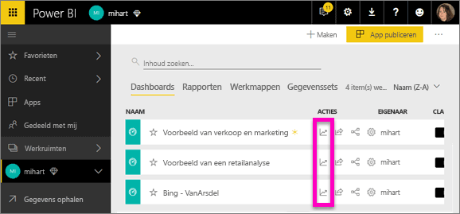
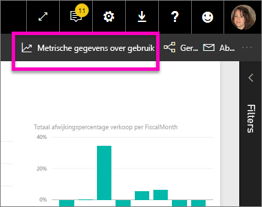
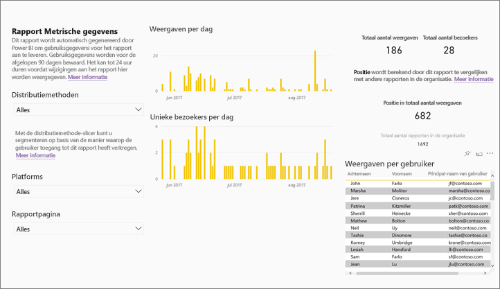
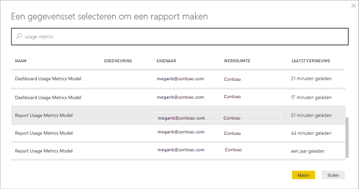
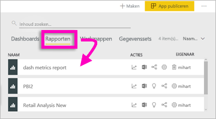
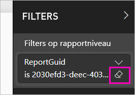

# Metrische gebruiksgegevens binnen klassieke werkruimten bewaken

Metrische gebruiksgegevens helpen u te begrijpen wat de impact van uw dashboards en rapporten is. Wanneer u metrische gegevens over het gebruik van dashboards of rapporten uitvoert, ontdekt u hoe deze dashboards en rapporten worden gebruikt binnen uw organisatie; wie ze gebruikt en met welk doel. In dit artikel vindt u een overzicht van rapporten met metrische gebruiksgegevens voor [klassieke werkruimten](service-create-workspaces.md). Als uw rapporten zich in een van de nieuwe werkruimten bevinden, raadpleegt u het artikel over het [bewaken van metrische gebruiksgegevens in de nieuwe werkruimte](service-modern-usage-metrics.md)  

Rapporten over metrische gegevens over gebruik zijn alleen-lezen. U kunt een dergelijk rapport echter wel kopiëren. U beschikt dan over een standaardrapport van Power BI dat u kunt bewerken. U kunt ook uw eigen rapporten maken in Power BI Desktop op basis van de onderliggende gegevensset, met daarin metrische gegevens over gebruik voor alle dashboards of alle rapporten in een werkruimte. In eerste instantie bevat het gekopieerde rapport alleen metrische gegevens voor het geselecteerde dashboard of rapport. U kunt het standaardfilter verwijderen om zo toegang te krijgen tot de onderliggende gegevensset, met alle metrische gegevens over gebruik voor de geselecteerde werkruimte. Misschien ziet u zelfs de namen van specifieke gebruikers, als de beheerder dit heeft toegestaan.

> [!NOTE]
> Metrische gegevens over gebruik houden het gebruik bij van rapporten die zijn ingesloten in SharePoint Online. Er worden echter geen gegevens over het gebruik bijgehouden voor dashboards en rapporten die worden ingesloten via de stroom Gebruiker is eigenaar van referenties of App is eigenaar van referenties. Er worden evenmin metrische gegevens over gebruik bijgehouden voor rapporten die zijn ingesloten via [Publiceren op internet](service-publish-to-web.md).

## Waarom metrische gegevens over gebruik belangrijk zijn

Wanneer u weet hoe uw inhoud wordt gebruikt, kunt u de invloed ervan demonstreren en prioriteiten vaststellen voor uw inspanningen. De metrische gegevens over gebruik kunnen aantonen dat een van uw rapporten dagelijks wordt gebruikt door een enorm segment van de organisatie en ze kunnen aantonen dat een dashboard dat u hebt gemaakt helemaal niet wordt weergegeven. Dit type feedback is zeer waardevol bij uw inspanningen werk leidt.

U kunt alleen rapporten met metrische gegevens over gebruik uitvoeren in de Power BI-service. Als u een rapport met metrische gegevens over gebruik echter opslaat of vastmaakt aan een dashboard, kunt u het rapport openen en bewerken op mobiele apparaten.

## Vereisten

- U hebt een licentie voor Power BI Pro nodig om de metrische gegevens over gebruik uit te voeren en te raadplegen. Het is wel zo dat er voor alle gebruikers gebruiksgegevens worden vastgelegd, ongeacht de licentie die aan hen is toegewezen.
- Als u toegang wilt tot de metrische gegevens over gebruik voor een bepaald dashboard of rapport, moet u bewerkingsrechten hebben voor dat dashboard of rapport.
- Uw Power BI-beheerder moet metrische gegevens over gebruik hebben ingeschakeld voor makers van inhoud. De Power BI-beheerder kan ook het verzamelen van gegevens per gebruiker hebben ingeschakeld in de functie voor metrische gegevens over gebruik. Lees hier hoe u [deze opties inschakelt in de beheerportal](../admin/service-admin-portal.md#control-usage-metrics). 

## Een rapport Metrische gegevens over gebruik weergeven

1. Begin in de werkruimte die het dashboard of rapport bevat.
2. Selecteer het pictogram **Metrische gegevens over gebruik**  in de inhoudslijst van de werkruimte of in het dashboard of rapport zelf.

    

    
3. De eerste keer dat u dit doet, maakt Power BI het rapport met metrische gegevens over gebruik en laat u weten wanneer het gereed is.

    
4. Selecteer **Metrische gegevens over het gebruik weergeven** om de resultaten te bekijken.

    Metrische gegevens over gebruik zijn een krachtige bondgenoot tijdens het implementeren en beheren van Power BI-dashboards en -rapporten. Wilt u weten welke pagina's van uw rapport het nuttigst zijn en welke u geleidelijk moet opheffen? Segmenteer op **rapportpagina** om erachter te komen. Wilt u weten of u een mobiele indeling voor uw dashboard moet maken? Segmenteer op **platformen** om te ontdekken hoeveel gebruikers gebruikmaken van uw inhoud via de mobiele apps versus via een webbrowser.

5. Beweeg desgewenst de muisaanwijzer over een visualisatie en selecteer het speldpictogram om de visualisatie toe te voegen aan een dashboard. Selecteer in de bovenste menubalk **Live-pagina vastmaken** om de gehele pagina toe te voegen aan een dashboard. Vanuit het dashboard kunt u de metrische gegevens over gebruik eenvoudiger controleren of delen met anderen.

    > [!NOTE]
    > Als u een tegel van een rapport met metrische gegevens over gebruik vastmaakt aan een dashboard, kunt u dat dashboard niet toevoegen aan een app.

### Rapport Metrische gegevens over dashboardgebruik

### Rapport Metrische gegevens over rapportgebruik

## Over het rapport Metrische gegevens over gebruik

Wanneer u **Metrische gegevens over gebruik** of het pictogram  selecteert naast een dashboard of rapport, genereert Power BI een vooraf samengesteld rapport met metrische gegevens over gebruik voor die inhoud voor de afgelopen 90 dagen.  Het rapport lijkt op de Power BI-rapporten waarmee u al bekend bent. U kunt segmenteren op basis van hoe uw eindgebruikers toegang hebben gekregen, of ze toegang kregen via de website of mobiele app, enzovoort. Naarmate uw dashboards en rapporten zich ontwikkelen, vult het rapport met metrische gegevens over gebruik zich ook. Het wordt elke dag wordt bijgewerkt met nieuwe gegevens.  

Rapporten met metrische gegevens over gebruik worden niet weergegeven in **Recent**, **Werkruimten**, **Favorieten** of andere inhoudslijsten. Ze kunnen niet worden toegevoegd aan een app. Als u een tegel van een rapport met metrische gegevens over gebruik vastmaakt aan een dashboard, kunt u dat dashboard niet toevoegen aan een app.

U hebt twee mogelijkheden om u te verdiepen in de rapportgegevens of om uw eigen rapporten te maken op basis van de onderliggende gegevensset: 

- Maak een kopie van het rapport in de Power BI-service. Zie [Een kopie opslaan van het rapport Metrische gegevens over gebruik](#save-a-copy-of-the-usage-metrics-report) verderop in dit artikel voor meer informatie.
- Maak verbinding met de gegevensset vanuit Power BI Desktop. Voor elke werkruimte heeft de gegevensset de naam 'Model voor het rapport Metrische gegevens over gebruik'. Zie [Verbinding maken met een gepubliceerde gegevensset](../connect-data/desktop-report-lifecycle-datasets.md#establish-a-power-bi-service-live-connection-to-the-published-dataset) voor meer informatie.

    

## Welke metrische gegevens worden gerapporteerd?

| Metrisch | Dashboard | Rapport | Beschrijving |
| --- | --- | --- | --- |
| Distributiemethodeslicer |ja |ja |Hoe gebruikers toegang kregen tot de inhoud. Er zijn drie mogelijke methoden: gebruikers kunnen toegang krijgen tot het dashboard of rapport door lid te zijn van een [werkruimte](../consumer/end-user-experience.md), doordat de inhoud [met hen is gedeeld](service-share-dashboards.md) of door een inhoudspakket/app te installeren.  Weergaven door middel van een app worden geteld als inhoudspakket. |
| Platformenslicer |ja |ja |Is het dashboard of rapport benaderd via de Power BI-service (powerbi.com) of een mobiel apparaat? Mobiel omvat al onze iOS-, Android- en Windows-apps. |
| Rapportpaginaslicer |nee |ja |Als het rapport meer dan één pagina heeft, segmenteert u het rapport op de pagina('s) die is (zijn) weergegeven. Leeg betekent dat een rapportpagina onlangs is toegevoegd (binnen 24 uur wordt de daadwerkelijke naam van de nieuwe pagina weergegeven in de slicerlijst) of dat rapportpagina's zijn verwijderd. 'Leeg' legt deze situaties vast. |
| Weergaven per dag |ja |ja |Totaal aantal weergaven per dag - een weergave wordt gedefinieerd als een gebruiker die een rapportpagina of dashboard laadt. |
| Unieke gebruikers per dag |ja |ja |Aantal *verschillende* gebruikers die het dashboard of rapport hebben weergegeven (op basis van het gebruikersaccount AAD). |
| Weergaven per gebruiker |ja |ja |Het aantal weergaven in de afgelopen 90 dagen, opgedeeld per individuele gebruikers. |
| Shares per dag |ja |nee |Het aantal keren dat het dashboard is gedeeld met een andere gebruiker of groep. |
| Totaal aantal weergaven |ja |ja |Het aantal weergaven in de afgelopen 90 dagen. |
| Totaal aantal bezoekers |ja |ja |Het aantal unieke bezoekers in de afgelopen 90 dagen. |
| Totaal aantal shares |ja |nee |Het aantal keren dat het dashboard of rapport in de afgelopen 90 dagen is gedeeld. |
| Totaal in de organisatie |ja |ja |Totaal aantal weergaven van alle dashboards en rapporten in de hele organisatie die minimaal eenmaal zijn weergegeven in de afgelopen 90 dagen.  Wordt gebruikt om de positie te berekenen. |
| Positie: Totaal aantal weergaven |ja |ja |Welke positie neemt dit dashboard of rapport in voor het totale aantal weergaven van alle dashboards en rapporten in de organisatie gedurende de afgelopen 90 dagen. |
| Positie: Totaal aantal shares |ja |nee |Welke positie neemt dit dashboard of rapport in voor het totale aantal shares van alle dashboards in de organisatie gedurende de afgelopen 90 dagen. |

## Een kopie opslaan van het rapport Metrische gegevens over gebruik

Gebruik **Opslaan als** om het rapport met metrische gegevens over gebruik te converteren naar een gewoon Power BI-rapport dat u kunt aanpassen aan uw specifieke behoeften. U kunt ook Power BI Desktop gebruiken om aangepaste rapporten met metrische gegevens over gebruik te maken op basis van de onderliggende gegevensset. Zie [Verbinding maken met een gepubliceerde gegevensset](../connect-data/desktop-report-lifecycle-datasets.md#establish-a-power-bi-service-live-connection-to-the-published-dataset) voor meer informatie.

Nog beter, de onderliggende gegevensset bevat de gebruiksdetails voor alle dashboards of rapporten in de werkruimte. Er komen dan nog meer mogelijkheden beschikbaar. U kunt bijvoorbeeld een rapport maken waarin de dashboards in uw werkruimte met elkaar worden vergeleken op basis van gebruik. U kunt ook een dashboard met metrische gegevens over gebruik voor uw Power BI-app maken door gebruiksgegevens samen te voegen voor alle inhoud die is gedistribueerd binnen die app.  Zie hoe u het filter verwijdert en [zie alle metrische gegevens over gebruik voor de werkruimte](#see-all-workspace-usage-metrics) verderop in dit artikel.

### Een kopie maken van het gebruiksrapport

Wanneer u een kopie maakt van het alleen-lezen, vooraf samengestelde rapport, maakt Power BI een bewerkbare kopie van het rapport. Op het eerste gezicht is er geen verschil te zien. U kunt het rapport nu echter openen in de bewerkingsweergave, nieuwe visualisaties filters en pagina's toevoegen, bestaande visualisaties wijzigen of verwijderen, en nog veel meer. Power BI slaat het nieuwe rapport in de huidige werkruimte op.

1. Selecteer **Bestand > Opslaan als** in het vooraf samengestelde rapport met metrische gegevens over gebruik. Power BI maakt een bewerkbaar Power BI-rapport, dat wordt opgeslagen in de huidige werkruimte.

    
2. Open het rapport in de weergave Bewerken en [werk ermee u zoals u ook met andere Power BI-rapporten werkt](../create-reports/service-interact-with-a-report-in-editing-view.md). Voeg bijvoorbeeld nieuwe pagina's toe en maak nieuwe visualisaties, voeg filters toe, maak de lettertypen en kleuren op, enzovoort.

    
3. Het nieuwe rapport wordt opgeslagen op het tabblad **Rapporten** in de huidige werkruimte en wordt ook toegevoegd aan de inhoudslijst **Recent**.

    

## Zie *alle* metrische gegevens over gebruik van de werkruimte

Als u de metrische gegevens over gebruik voor alle dashboards of voor alle rapporten in de werkruimte wilt zien, moet u een filter verwijderen. Het rapport wordt standaard gefilterd om alleen metrische gegevens weer te geven voor het dashboard of rapport dat is gebruikt om het gebruiksrapport te maken.

1. Selecteer **Rapport bewerken** om het nieuwe, bewerkbare rapport te openen in de bewerkingsweergave.

    
2. Zoek in het deelvenster Filters de bucket **Filters op rapportniveau** en verwijder het filter door naast **ReportGuid** het pictogram van een gum te selecteren.

    

    Het rapport bevat nu metrische gegevens voor de hele werkruimte.

## Besturingselementen voor Power BI-beheerders voor metrische gegevens over gebruik

Rapporten met metrische gegevens over gebruik zijn een functie die de Power BI- of globale beheerder kan in- of uitschakelen. Beheerders hebben gedetailleerde controle over welke gebruikers toegang hebben tot metrische gegevens over gebruik hebben; ze zijn standaard ingeschakeld (**Aan**) voor alle gebruikers in de organisatie.

> [!NOTE]
> Alleen beheerders voor de Power BI-tenant kunnen de beheerportal bekijken en instellingen bewerken. 

Standaard wordt gegevens per gebruiker ingeschakeld voor metrische gegevens over gebruik. Accountgegevens van gebruikers van inhoud worden in het metrische rapport opgenomen. Als beheerders deze informatie niet willen opnemen voor een bepaalde gebruiker of voor geen enkele gebruiker, kunnen ze de functie voor bepaalde beveiligingsgroepen of voor een hele organisatie uitschakelen. Accountgegevens worden dan in het rapport weergegeven als *Naamloos*.

Wanneer beheerders metrische gegevens over gebruik uitschakelen voor de gehele organisatie, kunnen ze de optie **Alle bestaande inhoud voor metrische gegevens over gebruik verwijderen** gebruiken om alle bestaande rapporten en dashboardtegels te verwijderen die zijn gemaakt met behulp van de rapporten met metrische gegevens over gebruik. Deze optie verwijdert de toegang tot metrische gegevens voor gebruikers in de organisatie die deze mogelijk al gebruiken. Het verwijderen van bestaande metrische gegevens over gebruik kan niet ongedaan worden gemaakt.

Zie [Metrische gegevens over gebruik beheren](../admin/service-admin-portal.md#control-usage-metrics) in het artikel over de beheerportal voor meer informatie over deze instellingen. 

## Metrische gegevens over gebruik in nationale clouds

Power BI is beschikbaar in afzonderlijke nationale clouds. Deze clouds bieden hetzelfde niveau van beveiliging, privacy, naleving en transparantie als de algemene versie van Power BI, gecombineerd met een uniek model voor lokale voorschriften met betrekking tot het leveren van services, gegevensopslag, toegang en beheer. Door dit unieke model voor lokale voorschriften zijn er geen metrische gebruiksgegevens beschikbaar in nationale clouds. Zie [nationale clouds](https://powerbi.microsoft.com/clouds/) voor meer informatie.

## Overwegingen en beperkingen

### Verschillen tussen auditlogboeken en metrische gegevens over het gebruik

Het is belangrijk om te begrijpen dat er verschillen kunnen optreden wanneer u metrische gegevens over verbruik vergelijkt met auditlogboeken en waarom. *Auditlogboeken* worden verzameld met gegevens uit de Power BI-service en *metrische gegevens over gebruik* worden verzameld in de client. Geaggregeerde tellingen van activiteiten in auditlogboeken komen mogelijk niet altijd overeen met metrische gegevens over gebruik. Dat zit zo:

* Metrische gegevens over gebruik tellen soms minder activiteiten doordat inconsistente netwerkverbindingen, ad blockers of andere problemen die de verzending van gebeurtenissen van de client kunnen verstoren.
* Bepaalde typen weergaven zijn niet opgenomen in metrische gegevens over gebruik, zoals eerder in dit artikel is beschreven.
* Metrische gegevens over gebruik tellen soms meer activiteiten. Dat komt voor in gevallen waarin de client vernieuwt zonder dat het nodig is om een aanvraag terug te sturen naar de Power BI-service.
* Delen is uitgeschakeld voor het rapport voor metrische gebruiksgegevens. Om mensen leestoegang tot het rapport te geven, moet u ze eerst toegang tot de werkruimte geven.

### Verschillen tussen REST API's en metrische gebruiksgegevens

De Power BI [Reports REST API's](/rest/api/power-bi/reports) en [Admin REST API's](/rest/api/power-bi/admin) gebruiken ook Power BI-servicegegevens. Zoals in de vorige sectie is beschreven, zijn er verschillende redenen waarom rapporttellingen (het aantal rapporten) van de API's kunnen afwijken van de rapporttellingen in de metrische gebruiksgegevens. De rapporttellingen die zijn afgeleid van de API's, worden niet beïnvloed door clientproblemen en moeten als nauwkeurig worden beschouwd.

### Klassieke metrische gebruiksgegevens worden niet ondersteund bij privékoppelingen 

Als uw organisatie [Privékoppelingen](../admin/service-security-private-links.md) gebruikt, bevatten klassieke rapporten met metrische gebruiksgegevens geen gegevens. Er geldt momenteel een beperking voor het overdragen van clientgegevens via privékoppelingen. 

### Andere overwegingen

U moet de inhoud in uw werkruimte, vanuit die werkruimte, ten minste één keer weergeven. Als de inhoud niet ten minste één keer in de werkruimte zelf wordt weergegeven, worden er geen gegevens uit de toepassingsweergaven opgenomen in het rapport voor metrische gegevens over het gebruik. Als u de blokkering van de gegevensverwerking voor dit rapport wilt opheffen, moet u de inhoud vanuit uw werkruimte ten minste één keer weergeven.

## Veelgestelde vragen

Naast de mogelijke verschillen tussen metrische gegevens over gebruik en auditlogboeken, kunnen de volgende vragen en antwoorden over metrische gegevens over gebruik handig zijn voor gebruikers en beheerders:

**V:**    Ik kan geen metrische gegevens over gebruik op een dashboard of rapport uitvoeren

**A:**    A: U ziet alleen de metrische gegevens over gebruik voor inhoud waarvan u eigenaar bent of waarvoor u machtigingen hebt om ze te bewerken.

**V:**    Leggen metrische gegevens over gebruik weergaven van de ingesloten dashboards en rapporten vast?

**A:**    Metrische gegevens over gebruik bieden geen ondersteuning voor het vastleggen van gebruik voor ingesloten dashboards en rapporten, en voor de stroom [Publiceren op internet](service-publish-to-web.md). In die gevallen raden we u aan om bestaande platformen voor webanalyse te gebruiken om het gebruik voor de hosting-app of -portal bij te houden.

**V:**    Ik kan geen metrische gegevens over gebruik uitvoeren op welke inhoud dan ook.

**A1:**    Beheerders kunnen deze functie uitschakelen voor hun organisatie.  Neem contact op met uw beheerder om te zien of dit het geval is.

**A2:**    Metrische gegevens over gebruik is een functie van Power BI Pro.

**V:**    De gegevens lijken niet up-to-date te zijn. Distributiemethoden worden bijvoorbeeld niet weergegeven, rapportpagina's ontbreken, enzovoort.

**A:**    Het kan 24 uur duren voordat gegevens zijn bijgewerkt.

**V:**    Er zijn vier rapporten in de werkruimte, maar in het rapport met metrische gegevens over gebruik worden er maar drie weergegeven.

**A:**    Het rapport met metrische gegevens over gebruik bevat alleen rapporten (of dashboards) die in de afgelopen negentig dagen zijn geopend.  Als een rapport (of dashboard) niet wordt weergegeven, is het waarschijnlijk meer dan 90 dagen niet gebruikt.

## Volgende stappen

[Power BI beheren in de beheerportal](../admin/service-admin-portal.md)

Hebt u nog vragen? [Misschien dat de Power BI-community het antwoord weet](https://community.powerbi.com/)