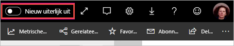
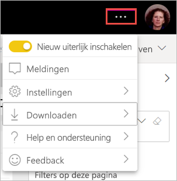

# Aanmelden voor het nieuwe uiterlijk van werkruimten (preview)

Werkruimten hebben een nieuw uiterlijk dat past bij het [nieuwe uiterlijk](../consumer/service-new-look.md) van de Power BI-service. Iedereen die de Power BI-service (app.powerbi.com) gebruikt, kan zich aanmelden. Wanneer u **Nieuw uiterlijk** inschakelt in de zwarte headerbalk, kunt u zich aanmelden voor het nieuwe uiterlijk voor rapporten en werkruimten. Alle werkruimten, zowel klassieke als nieuwe, kunnen profiteren van het nieuwe uiterlijk.

Zoekt u informatie over het nieuwe uiterlijk in **Power BI Desktop**? Zie [Het bijgewerkte lint in Power BI Desktop gebruiken](../create-reports/desktop-ribbon.md).

## Kenmerken van het nieuwe uiterlijk

:::image type="content" source="media/service-workspaces-new-look/power-bi-workspace-new-look-numbered.png" alt-text="Het nieuwe uiterlijk voor werkruimten, met bijschriftnummers voor uitleg":::

|Aantal  |Uitleg |
|---------|---------|
|    | **Gegevens ophalen**: het is gemakkelijker inhoud aan uw werkruimte toe te voegen. Selecteer de knop **+ Nieuw** om verbinding te maken met gegevens, bestanden te openen en rapporten, dashboards en meer te maken.  |
|   | **Weergavewisselaar**: als u de verbindingen tussen gegevensstromen, gegevenssets, rapporten en dashboards, en hun verbindingen met andere gegevensbronnen wilt weergeven, schakelt u tussen de weergave **Lijst** en de weergave **Herkomst**. |
|  | **Zoeken binnen een werkruimte**: doorzoek alle inhoud in een werkruimte met het nieuwe zoekvak.  |
|   | **Lijst en tabbladen**: alle inhoud in een werkruimte is opgenomen in een platte lijst met dashboards, rapporten, gegevenssets enzovoort, zoals SharePoint. U opent niet langer een werkruimte naar een mogelijk leeg tabblad **Dashboards** waar u uw inhoud dan niet ziet. Dit is de nieuwe tabvolgorde:  **Alle**: hier wordt alle inhoud (dashboards, rapporten, werkmappen, gepagineerde rapporten, gegevenssets en gegevensstromen) in de werkruimte weergegeven.  **Inhoud**: hier wordt alle inhoud verzameld die in de werkruimte voor gebruik (dashboards, rapporten, werkmappen en gepagineerde rapporten) is gemaakt.  **Gegevenssets en gegevensstromen**: hier worden alle gegevenssets en gegevensstromen in de werkruimte verzameld, zodat gegevens eenvoudig kunnen worden beheerd. |
|  | **Filters**: bij werkruimten met honderden artefacten kunt u de inhoud in het deelvenster Filters filteren. Zodra een filter is toegepast, ziet u het filter bovenaan de inhoudslijst. |

**Snelle acties**: wanneer u de inhoud in de lijst aanwijst, ziet u de meest voorkomende acties voor dat item, plus andere die beschikbaar zijn in het menu **Meer opties** (...).

:::image type="content" source="media/service-workspaces-new-look/power-bi-workspace-new-look-quick-actions.png" alt-text="Snelle acties in de nieuwe werkruimte":::

## Aanmelden voor het nieuwe uiterlijk

Elke gebruiker van de Power BI-service kan zich aanmelden voor het nieuwe uiterlijk. Schuif de knop **Nieuw uiterlijk uitschakelen** naar **Nieuw uiterlijk inschakelen**.

Als u terug wilt gaan naar het oude uiterlijk, schuift u de knop gewoon terug naar **uit** . Selecteer het menu met het beletselteken in de rechterbovenhoek als u deze optie niet ziet.

## Volgende stappen

- [Het bijgewerkte lint in Power BI Desktop gebruiken](../create-reports/desktop-ribbon.md)
- [Het nieuwe uiterlijk van de Power BI-service](../consumer/service-new-look.md)
- Vragen? [Misschien dat de Power BI-community het antwoord weet](https://community.powerbi.com/)
