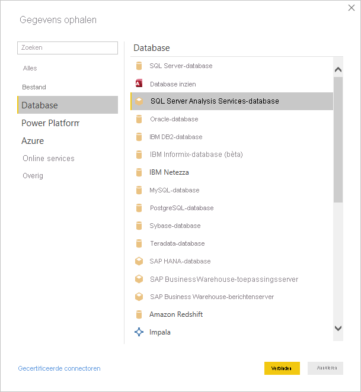
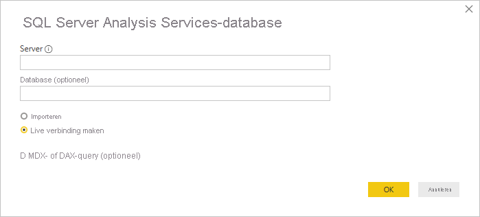
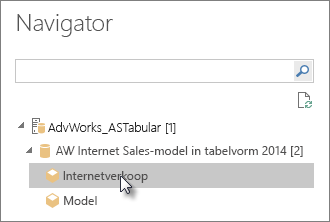
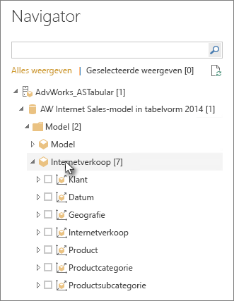

# Verbinding maken met tabellaire Analysis Services-gegevens in Power BI Desktop
Er zijn twee manieren om met Power BI Desktop verbinding te maken met en gegevens op te halen uit tabellaire SQL Server Analysis Services-modellen: U kunt ze verkennen met behulp van een liveverbinding of items selecteren en importeren in Power BI Desktop.

Laten we dit eens nader bekijken.

**Verkennen met behulp van een liveverbinding**: Wanneer u een liveverbinding gebruikt, worden de items in het tabellaire model of perspectief, zoals tabellen, kolommen en metingen, weergegeven in het deelvenster **Velden** van Power BI Desktop. Met de geavanceerde hulpprogramma's voor visualisatie en rapportage van Power BI Desktop kunt u het tabellaire model op nieuwe, zeer interactieve manieren verkennen.

Bij een liveverbinding worden er geen gegevens vanuit het tabellaire model geïmporteerd in Power BI Desktop. Bij elke interactie met een visualisatie wordt er in Power BI Desktop een query op het tabellaire model uitgevoerd, en worden de resultaten daarvan berekend en weergegeven. U ziet in het tabellaire model altijd de meest recente gegevens die beschikbaar zijn, ofwel vanaf de laatste verwerkingstijd ofwel vanuit de DirectQuery-tabellen in het tabellaire model. 

Tabellaire modellen zijn hierdoor hoogst nauwkeurig. Welke items in Power BI Desktop worden weergegeven is afhankelijk van uw machtigingen voor het tabellaire model waarmee u bent verbonden.

Als u dynamische rapporten in Power BI Desktop hebt gemaakt, kunt u deze delen door ze te publiceren op uw Power BI-site. Wanneer u een Power BI Desktop-bestand met een liveverbinding naar een tabellair model publiceert op uw Power BI-site, moet er een on-premises gegevensgateway zijn geïnstalleerd en geconfigureerd door een beheerder. Zie [On-premises gegevensgateway](service-gateway-onprem.md) voor meer informatie.

**Items selecteren en importeren in Power BI Desktop**: Wanneer u verbinding maakt met deze optie, kunt u items zoals tabellen, kolommen en metingen in het tabellaire model of perspectief selecteren, en deze items laden in een Power BI Desktop-model. Gebruik de Power Query-editor van Power BI Desktop om de gewenste vorm van de gegevens te wijzigen. Omdat er geen liveverbinding tussen Power BI Desktop en het tabellaire model behouden blijft, kunt u vervolgens uw Power BI Desktop-model offline verkennen of publiceren op uw Power BI-site.

## Verbinding maken met een tabellair model
1. Selecteer in Power BI Desktop op het tabblad **Start** de optie **Gegevens ophalen** > **Meer** > **Database**.
   
1. Selecteer **SQL Server Analysis Services-database** en selecteer vervolgens **Verbinding maken**.
   
   
3. Voer in het venster **SQL Server Analysis Services-database** de naam van de **Server** in, kies een verbindingsmodus en selecteer vervolgens **OK**.
   
   
4. Deze stap in het venster **Navigator** is afhankelijk van de verbindingsmodus die u hebt geselecteerd:

   - Als u een liveverbinding gebruikt, selecteert u een tabellair model of perspectief.
  
      
   - Als u ervoor hebt gekozen om items te selecteren en gegevens op te halen, selecteert u een tabellair model of perspectief en selecteert u vervolgens een bepaalde tabel of kolom die u wilt laden. Als u uw gegevens wilt vormgeven voordat ze worden geladen, selecteert u **Query's bewerken** om Power Query-editor te openen. Wanneer u klaar bent, selecteert u **Laden** om de gegevens in Power BI Desktop te importeren.

      

## Veelgestelde vragen
**Vraag:** Heb ik een on-premises gegevensgateway nodig?

**Antwoord**: Dat hangt ervan af. Als u Power BI Desktop gebruikt om een liveverbinding te maken met een tabellair model, maar dit model niet wilt publiceren op uw Power BI-site, hebt u geen gateway nodig. Als u het model wel wilt publiceren op uw Power BI-site, is een gegevensgateway noodzakelijk voor veilige communicatie tussen de Power BI-service en uw on-premises Analysis Services-server. Neem contact op met uw Analysis Services-serverbeheerder voordat u een gegevensgateway installeert.

Als u ervoor kiest items te selecteren en gegevens op te halen, importeert u tabellaire modelgegevens rechtstreeks in uw Power BI Desktop-bestand en hebt u ook geen gateway nodig.

**Vraag:** Wat is het verschil tussen een liveverbinding met een tabellair model vanuit de Power BI-service en een liveverbinding vanuit Power BI Desktop?

**Antwoord**: Bij een liveverbinding tussen een tabellair model op uw site in de Power BI-service en een on-premises Analysis Services-database in uw organisatie, is een on-premises gegevensgateway vereist voor veilige communicatie tussen deze twee. Bij een liveverbinding met een tabellair model van Power BI Desktop, is geen gateway vereist, omdat zowel Power BI Desktop als de Analysis Services-server waarmee u verbinding maakt on-premises worden uitgevoerd in uw organisatie. Als u uw Power BI Desktop-bestand echter wilt publiceren op uw Power BI-site publiceert, is wel een gateway vereist.

**Vraag:** Kan ik, als ik een liveverbinding heb gemaakt, verbinding maken met een andere gegevensbron via hetzelfde Power BI Desktop-bestand?

**Antwoord**: Nee. Het is niet mogelijk livegegevens te verkennen en verbinding te maken met een ander type gegevensbron via hetzelfde bestand. Als u al gegevens hebt geïmporteerd of al verbinding hebt gemaakt met een andere gegevensbron via een Power BI Desktop-bestand, moet u een nieuw bestand maken om deze live te kunnen verkennen.

**Vraag:** Kan ik, als ik een liveverbinding heb gemaakt, het model bewerken of hier query's op uitvoeren in Power BI Desktop?

**Antwoord**: U kunt in Power BI Desktop metingen op rapportniveau maken, maar alle overige query- en modelleringsfuncties zijn uitgeschakeld wanneer u gegevens live verkent.

**Vraag:** Als ik een liveverbinding heb gemaakt, is die dan wel veilig?

**Antwoord**: Ja. Uw huidige Windows-referenties worden gebruikt voor de verbinding met de Analysis Services-server. U kunt geen basisreferenties of opgeslagen referenties gebruiken in de Power BI-service of Power BI Desktop bij het live verkennen.

**Vraag:** In Navigator zie ik een model en een perspectief. Wat is het verschil?

**Antwoord**: Een perspectief is een bepaalde weergave van een tabellair model. Een perspectief bevat mogelijk alleen bepaalde tabellen, kolommen of metingen die nodig zijn voor een specifieke gegevensanalyse. Een tabellair model bevat altijd minstens één perspectief, dat al dan niet alles in het model kan omvatten. Neem contact op met de beheerder als u twijfelt over welk perspectief u moet selecteren.

**Vraag:** Zijn er functies van Analysis Services waarmee het gedrag van Power BI wordt gewijzigd?

**Antwoord**: Ja. Afhankelijk van de functies die in het tabellaire model worden gebruikt, kan de ervaring in Power BI Desktop veranderen. Voorbeelden zijn:
* Mogelijk ziet u de metingen in het model samen gegroepeerd bovenaan het deelvenster **Velden**, in plaats van in tabellen naast kolommen. U kunt ze nog steeds als normaal gebruiken. Het is nu eenvoudiger om ze op deze manier te vinden.

* Als in het tabellaire model berekeningsgroepen zijn gedefinieerd, kunt u deze alleen gebruiken in combinatie met modelmetingen en niet met impliciete metingen die u maakt door numerieke velden toe te voegen aan een visual. Op het model was mogelijk ook handmatig de vlag **DiscourageImplicitMeasures** ingesteld. Deze heeft hetzelfde effect. Zie [Berekeningsgroepen in Analysis Services](https://docs.microsoft.com/analysis-services/tabular-models/calculation-groups#benefits) voor meer informatie.

## De naam van de server wijzigen na de initiële verbinding
Het kan voorkomen dat u een Power BI Desktop-bestand met een liveverbinding voor verkenning hebt gemaakt, maar de verbinding later wilt configureren voor een andere server. Stel, u hebt een Power BI Desktop-bestand gemaakt voor een verbinding met een ontwikkelaarsserver en u wilt, voordat u het model publiceert naar de Power BI-service, de server wijzigen in de productieserver.

De servernaam wijzigen:

1. Selecteer **Query's bewerken** op het tabblad **Start**.

2. Voer in het venster **SQL Server Analysis Services-database** de nieuwe naam van de **Server** in en selecteer vervolgens **OK**.

   
## Problemen oplossen 
De volgende lijst bevat alle bekende problemen bij het verbinden met SQL Server Analysis Services (SSAS) of Azure Analysis Services: 

* **Fout: Kan het modelschema niet laden**: Deze fout treedt doorgaans op wanneer de gebruiker die verbinding maakt met Analysis Services geen toegang heeft tot de database/model.

