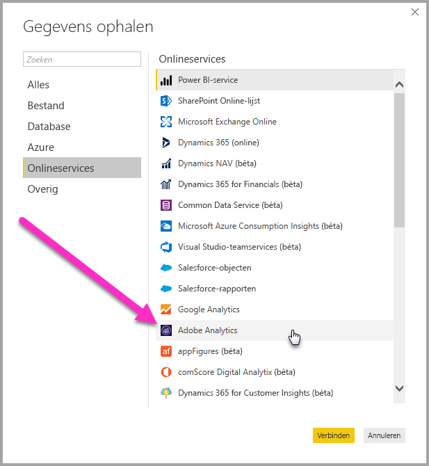
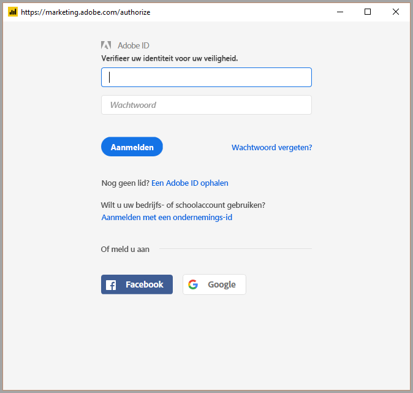
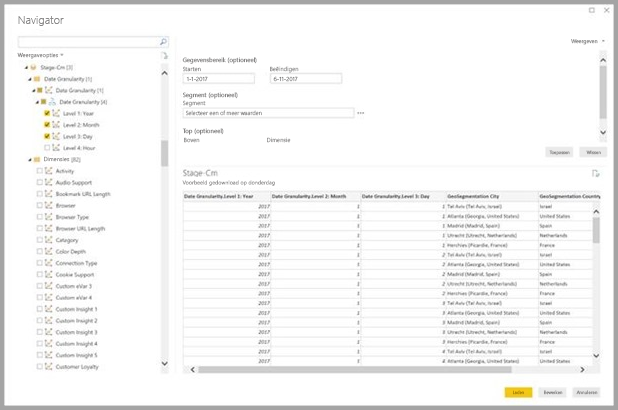
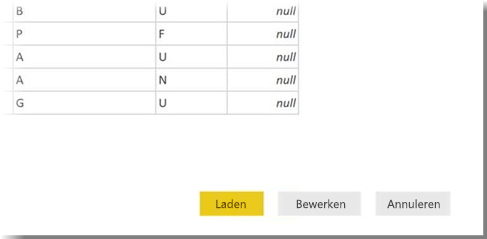

# Verbinding met Adobe Analytics maken in Power BI Desktop 
In **Power BI Desktop** kunt u verbinding maken met een **Adobe Analytics** en gebruikmaken van de onderliggende gegevens, net zoals elke andere gegevensbron in Power BI Desktop. 

## Verbinding maken met Adobe Analytics-gegevens
Als u verbinding wilt maken met **Adobe Analytics**-gegevens, selecteert u **Gegevens ophalen** op het lint **Start** in Power BI Desktop. Selecteer **Onlineservices** in de categorieën aan de linkerkant en u ziet **Adobe Analytics-connector**.

In het venster **Adobe Analytics** dat wordt weergegeven, selecteert u de knop **Aanmelden** en geeft u uw referenties op om u aan te melden bij uw Adobe Analytics-account. Het Adobe aanmeldvenster wordt weergegeven zoals te zien is in de volgende afbeelding.

Voer uw gebruikersnaam en wachtwoord in als u daarom wordt gevraagd. Wanneer u de verbinding hebt gemaakt, kunt u een voorbeeld bekijken van meerdere dimensies en metingen binnen het dialoogvenster Power BI **Navigator** en deze selecteren voor het maken van een enkele uitvoer in tabelvorm. U kunt ook alle benodigde invoerparameters opgeven die vereist zijn voor de geselecteerde items. 

U kunt de geselecteerde tabel **laden**, waarna de hele tabel in **Power BI Desktop** wordt geladen. U kunt de query ook **bewerken**. Hiervoor wordt **Query Editor** geopend, zodat u de gewenste set gegevens kunt filteren en verfijnen, om deze verfijnde gegevensset vervolgens in **Power BI Desktop** te laden.

## Volgende stappen
Met Power BI Desktop kunt u verbinding maken met allerlei andere gegevens. Bekijk de volgende bronnen voor meer informatie over gegevensbronnen:

* [Wat is Power BI Desktop?](../fundamentals/desktop-what-is-desktop.md)
* [Gegevensbronnen in Power BI Desktop](desktop-data-sources.md)
* [Gegevens vormgeven en combineren met Power BI Desktop](desktop-shape-and-combine-data.md)
* [Connect to Excel workbooks in Power BI Desktop](desktop-connect-excel.md) (Verbinding maken met Excel-werkmappen in Power BI Desktop)   
* [Enter data directly into Power BI Desktop](desktop-enter-data-directly-into-desktop.md) (Rechtstreeks gegevens in Power BI Desktop invoeren)   
