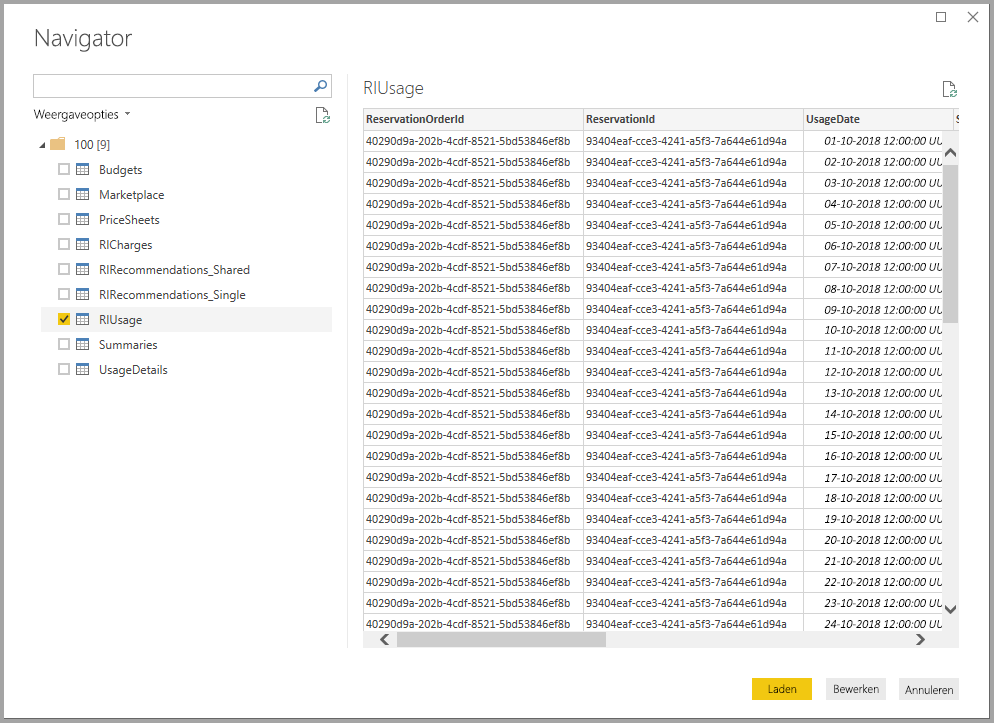
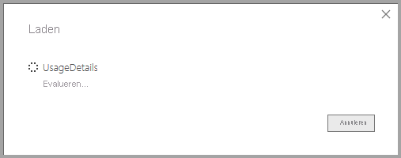
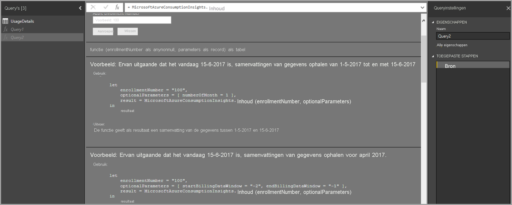

# Verbinding met Azure Consumption Insights-gegevens maken in Power BI Desktop

U kunt via Power BI Desktop verbinding maken met Azure en gedetailleerde gegevens over het Azure-serviceverbruik van uw organisatie krijgen. Met deze gegevens kunt u aangepaste rapporten en meetwaarden maken, zodat u uw Azure-kosten beter begrijpt en beter kunt analyseren.

> [!NOTE]
> Er is beperkte ondersteuning voor de Microsoft Azure Consumption Insights (bèta). Gebruik voor nieuwe functionaliteit de [Azure Cost Management-connector voor Power BI](desktop-connect-azure-cost-management.md).

## Verbinding met Azure Consumption Insights maken

Met Azure Consumption Insights kunt u verbinding maken met Azure Enterprise Agreement-factureringsaccounts.

In deze sectie leert u hoe u de gegevens kunt krijgen die u nodig hebt om te migreren met behulp van de Azure Enterprise-connector. U vindt hier ook een *toewijzing van kolommen voor gebruiksgegevens* die beschikbaar zijn in de **ACI**-API (Azure Consumption Insights).

Om de **Azure Consumption Insights**-connector te kunnen gebruiken, moet u toegang hebben tot de Enterprise-functies binnen Azure Portal.

De **Azure Consumption Insights**-connector gebruiken in **Power BI Desktop**: 

1. Selecteer in het lint **Start** **Gegevens ophalen**.

1. Selecteer **Onlineservices** in de categorieën aan de linkerkant.  

1. Selecteer **Microsoft Azure Consumption Insights (bèta)** . 

1. Selecteer **Verbinding maken**.

   

   Geef uw **Azure-inschrijvingsnummer** op in het dialoogvenster dat wordt weergegeven.

   

   * U kunt uw inschrijvingsnummer ophalen in [Azure Enterprise Portal](https://ea.azure.com), op de locatie die wordt weergegeven in de volgende afbeelding:

  

   In deze versie van de connector worden alleen Enterprise-inschrijvingen vanuit https://ea.azure.com ondersteund. China-inschrijvingen worden momenteel niet ondersteund.

   Geef vervolgens uw *toegangssleutel* op om verbinding te maken.

   

   * U vindt de toegangssleutel voor inschrijving in de [Azure Enterprise-portal](https://ea.azure.com).

  

Als u de *toegangssleutel* hebt opgegeven en **Verbinding maken** selecteert, wordt het venster **Navigator** weergegeven met negen beschikbare tabellen:

| Tabel        | Beschrijving |
|------------- | -------------------------------------------------------------|
| **Budgetten** | Budgetgegevens aan de hand waarvan u de daadwerkelijke kosten of het daadwerkelijke gebruik kunt bekijken en met de bestaande budgetdoelen kunt vergelijken. |
| **MarketPlace** | Op gebruik gebaseerde kosten voor Azure Marketplace. |
| **PriceSheets** | Toepasselijke tarieven per meter voor inschrijving. |
| **RICharges** | De kosten van uw gereserveerde instanties gedurende de afgelopen 24 maanden. |
| **RIRecommendations_Single** | Aanbevelingen voor de aanschaf van gereserveerde instanties op basis van uw gebruikstrends voor één abonnement gedurende de afgelopen 7, 30 of 60 dagen. |
| **RIRecommendations_Shared** | Aanbevelingen voor de aanschaf van gereserveerde instanties op basis van uw gebruikstrends voor al uw abonnementen gedurende de afgelopen 7, 30 of 60 dagen. |
| **RIUsage** | Gebruiksgegevens van uw huidige gereserveerde instanties gedurende de afgelopen maand. |
| **Summaries** | Een maandelijks overzicht met saldo's, nieuwe aankopen en servicekosten, wijzigingen en overschrijdingskosten voor Azure Marketplace. |
| **UsageDetails** | Een uitsplitsing van verbruikte aantallen en geschatte inschrijvingskosten. |

U kunt het selectievakje naast een tabel inschakelen om een voorbeeld van de tabel weer te geven. U kunt een of meer tabellen selecteren door de betreffende selectievakjes in te schakelen en **Laden** te selecteren.

> [!NOTE]
> De tabellen *Samenvatting* en *Prijzenoverzicht* zijn alleen beschikbaar voor de API-sleutel op inschrijvingsniveau. Deze tabellen bevatten bovendien standaard de gegevens voor *Gebruik* en *Prijzenoverzicht* van de huidige maand. De tabellen *Samenvatting* en *Marketplace* zijn niet beperkt tot de huidige maand.
>
>

Wanneer u **Laden** selecteert, worden de gegevens in **Power BI Desktop** geladen.

Nadat de geselecteerde gegevens zijn geladen, worden de geselecteerde tabellen en velden weergegeven in het deelvenster **Velden**.

## Werken met Azure Consumption Insights
Als u de **Azure Consumption Insights**-connector wilt kunnen gebruiken, moet u toegang hebben tot de Enterprise-functies binnen Azure Portal.

Als u gegevens hebt geladen met de **Azure Consumption Insights**-connector, kunt u uw eigen aangepaste metingen en kolommen maken met **Query-editor**. U kunt ook visuals, rapporten en dashboards maken om in de **Power BI-service** te delen.

Met een lege query kunt u een voorbeeldverzameling van aangepaste Azure-query's ophalen. Er zijn twee manieren om dit op te halen: 

In **Power BI Desktop**: 

1. Selecteer het lint **Start** 
2. Selecteer **Gegevens ophalen** > **Lege query** 

Of in **Query-editor**: 

1. Klik met de rechter muisknop in het linkerdeelvenster **Query's** 
2. Selecteer **Nieuwe query > Lege query** in het menu dat wordt weer gegeven

Type in de **formulebalk**:

    = MicrosoftAzureConsumptionInsights.Contents

In de volgende afbeelding ziet u een verzameling voorbeelden weergegeven.

Bij het werken met rapporten en het maken van query's kunt u:

* Gebruik *numberOfMonth* voor het definiëren van het aantal maanden vanaf de huidige datum
  * Een waarde gebruiken tussen 1 en 36. Hiermee geeft u het aantal maanden op, gerekend vanaf de huidige datum, dat u wilt importeren. U kunt het beste maximaal 12 maanden aan gegevens ophalen. Met deze limiet worden importbeperkingen en drempelwaarden voor gegevensvolumes van Power BI-query's voorkomen.
* Gebruik *startBillingDataWindow* en *endBillingDataWindow* voor het definiëren van een aantal maanden in een historisch tijdvenster
* Gebruik *numberOfMonth* niet in combinatie met *startBillingDataWindow* of *endBillingDataWindow*

## Migratie van de Azure Enterprise-connector uitvoeren

Sommige klanten hebben visuals gemaakt met behulp van de *Azure Enterprise-connector (bèta)* . Uiteindelijk wordt deze vervangen door de **Azure Consumption Insights**-connector. De nieuwe connector heeft functies en verbeteringen die het volgende omvatten:

* Extra gegevensbronnen voor *Saldo-overzicht* en *Marketplace-aankopen*
* Nieuwe en geavanceerde parameters, zoals *startBillingDataWindow* en *endBillingDataWindow*
* Betere prestaties en reactietijd

In de volgende stappen ziet u hoe u kunt overstappen op de **Azure Consumption Insights**-connector. Met deze stappen behoudt u het werk dat u al hebt gedaan bij het maken van aangepaste dashboards of rapporten.

### Stap 1: verbinding maken met Azure met behulp van de nieuwe connector
In de eerste stap maakt u gebruik van de **Azure Consumption Insights**-connector, die eerder in dit artikel in detail is beschreven. In deze stap selecteert u **Gegevens ophalen > Lege query** in het lint **Start** in **Power BI Desktop**.

### Stap 2: een query maken met Geavanceerde editor
In **Query-editor** selecteert u **Geavanceerde editor** in de sectie **Query** van het lint **Start**. In het venster **Geavanceerde editor** dat wordt weergegeven, voert u de volgende query in:

    let    
        enrollmentNumber = "100",
        optionalParameters = [ numberOfMonth = 6, dataType="DetailCharges" ],
        data = MicrosoftAzureConsumptionInsights.Contents(enrollmentNumber, optionalParameters)   
    in     
        data

U moet de waarde *enrollmentNumber* vervangen door uw inschrijvingsnummer. U kunt uw nummer ophalen uit de [Azure Enterprise Portal](https://ea.azure.com). De parameter *numberOfMonth* is het aantal maanden aan gegevens dat u wilt bewaren, teruggerekend vanaf de huidige datum. Nul (0) staat voor de huidige maand.

Wanneer u **Gereed** selecteert in het venster **Geavanceerde editor**, wordt het voorbeeld vernieuwd en worden de gegevens van het opgegeven maandbereik in de tabel weergegeven. Selecteer **Sluiten en toepassen** om terug te keren.

### Stap 3: metingen en aangepaste kolommen naar het nieuwe rapport verplaatsen
Vervolgens moet u alle aangepaste kolommen of metingen die u hebt gemaakt, verplaatsen naar de nieuwe detailtabel. Dit zijn de stappen.

1. Open Kladblok (of een andere teksteditor).
2. Selecteer de meting die u wilt verplaatsen, kopieer de tekst van het veld *Formule* en plak deze in Kladblok.

   
3. Wijzig de naam van *Query1* in de oorspronkelijke naam van de detailtabel.
4. Als u nieuwe tabelmetingen en aangepaste kolommen wilt maken, klikt u met de rechtermuisknop op uw tabel en kiest u **Nieuwe meting**. Knip en plak vervolgens uw opgeslagen metingen en kolommen totdat u alles hebt gedaan.

### Stap 4: Tabellen met eerdere relaties opnieuw koppelen
Veel dashboards bevatten aanvullende zoek- of filtertabellen, zoals datumtabellen of tabellen die worden gebruikt voor aangepaste projecten. Als u de relaties van die tabellen opnieuw instelt, zijn de meeste resterende problemen opgelost. U kunt dit als volgt doen.

- Selecteer op het tabblad **Modelleren** in **Power BI Desktop** de optie **Relaties beheren**. Er wordt een venster weergegeven waarin u de relaties binnen het model kunt beheren. Koppel uw tabellen opnieuw naar behoefte.

    

### Stap 5: uw visuals controleren en de veldopmaak zo nodig aanpassen
In dit stadium zal het merendeel van uw oorspronkelijke visuals, tabellen en detailweergaven werken zoals verwacht. Een aantal kleine aanpassingen kan echter nodig zijn om het uiterlijk en de werking nauwkeurig op te maken. Neem de tijd om te controleren of alle dashboards en visuele elementen eruitzien zoals u wilt.

## Verbruiksgegevens ophalen met de Azure Consumption and Insights (ACI) API
Azure wordt geleverd met de [**Azure Consumption and Insights (ACI) API**](https://azure.microsoft.com/blog/announcing-general-availability-of-consumption-and-charge-apis-for-enterprise-azure-customers/). Hiermee kunt u uw eigen aangepaste oplossingen maken voor verzameling, rapportage en visualisatie van het Azure-verbruik met de ACI API.

### Namen en gebruiksgegevens toewijzen tussen de portal, de connector en de API
De kolommen en namen van detailgegevens in Azure Portal zijn vergelijkbaar in de API en de connector, maar zijn niet altijd identiek. De volgende tabel bevat een toewijzing ter verduidelijking. Ook wordt aangegeven of de kolom verouderd is. Zie de [data dictionary voor Azure-facturering](https://docs.microsoft.com/azure/billing/billing-enterprise-api-usage-detail) voor meer informatie en definities van termen.

| Kolomnaam ACI-connector / inhoudspakket | Kolomnaam ACI API | Kolomnaam EA | Verouderd / aanwezig voor achterwaartse compatibiliteit |
| --- | --- | --- | --- |
| AccountName |accountName |Account Name |Nee |
| AccountId |accountId | |Ja |
| AccountOwnerId |accountOwnerEmail |AccountOwnerId |Nee |
| AdditionalInfo |additionalInfo |AdditionalInfo |Nee |
| AdditionalInfold | | |Ja |
| Consumed Quantity |consumedQuantity |Consumed Quantity |Nee |
| Consumed Service |consumedService |Consumed Service |Nee |
| ConsumedServiceId |consumedServiceId | |Ja |
| Cost |cost |ExtendedCost |Nee |
| Cost Center |costCenter |Cost Center |Nee |
| Datum |datum |Datum |Nee |
| Dag | |Dag |Nee |
| DepartmentName |departmentName |Department Name |Nee |
| DepartmentID |departmentId | |Ja |
| Instance ID | | |Ja |
| InstanceId |instanceId |Instance ID |Nee |
| Locatie | | |Ja |
| Meter Category |meterCategory |Meter Category |Nee |
| Meter ID | | |Ja |
| Meternaam |meterName |Meter Name |Nee |
| Meter Region |meterRegion |Meter Region |Nee |
| Meter Sub-Category |meterSubCategory |Meter Sub-Category |Nee |
| MeterId |meterId |Meter ID |Nee |
| Maand | |Maand |Nee |
| Product |product |Product |Nee |
| ProductId |productId | |Ja |
| Resourcegroep |resourceGroup |Resource Group |Nee |
| Resource Location |resourceLocation |Resource Location |Nee |
| ResourceGroupId | | |Ja |
| ResourceLocationId |resourceLocationId | |Ja |
| ResourceRate |resourceRate |ResourceRate |Nee |
| ServiceAdministratorId |serviceAdministratorId |ServiceAdministratorId |Nee |
| ServiceInfo1 |serviceInfo1 |ServiceInfo1 |Nee |
| ServiceInfo1Id | | |Ja |
| ServiceInfo2 |serviceInfo2 |ServiceInfo2 |Nee |
| ServiceInfo2Id | | |Ja |
| Store Service Identifier |storeServiceIdentifier |Store Service Identifier |Nee |
| StoreServiceIdentifierId | | |Ja |
| Abonnementsnaam |subscriptionName |Subscription Name |Nee |
| Tags |tags |Tags |Nee |
| TagsId | | |Ja |
| Unit Of Measure |unitOfMeasure |Unit Of Measure |Nee |
| Jaar | |Jaar |Nee |
| SubscriptionId |subscriptionId |SubscriptionId |Ja |
| SubscriptionGuid |subscriptionGuid |SubscriptionGuid |Nee |

## Volgende stappen

U kunt via Power BI Desktop verbinding maken met allerlei gegevensbronnen. Raadpleeg voor meer informatie de volgende artikelen:

* [Verbinding maken met Azure Cost Management-gegevens in Power BI Desktop](desktop-connect-azure-cost-management.md)
* [Wat is Power BI Desktop?](../fundamentals/desktop-what-is-desktop.md)
* [Data Sources in Power BI Desktop](desktop-data-sources.md) (Gegevensbronnen in Power BI Desktop)
* [Shape and Combine Data with Power BI Desktop](desktop-shape-and-combine-data.md) (Gegevens vormgeven en combineren met Power BI Desktop)
* [Connect to Excel workbooks in Power BI Desktop](desktop-connect-excel.md) (Verbinding maken met Excel-werkmappen in Power BI Desktop)   
* [Enter data directly into Power BI Desktop](desktop-enter-data-directly-into-desktop.md) (Rechtstreeks gegevens in Power BI Desktop invoeren)   
