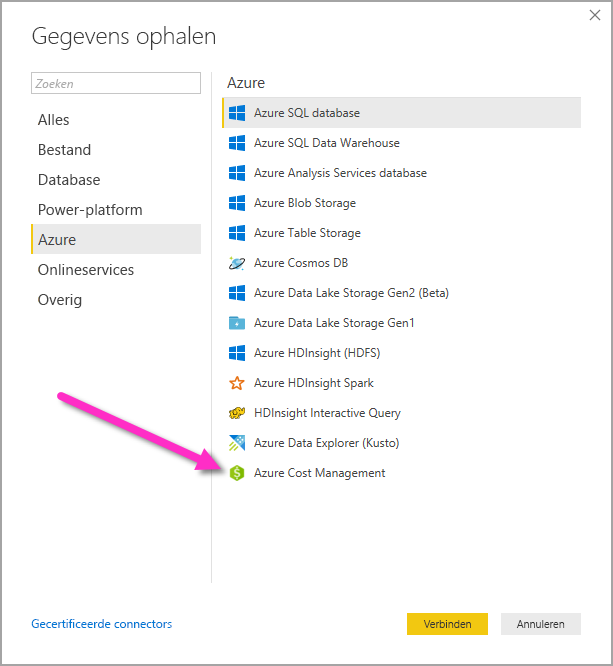
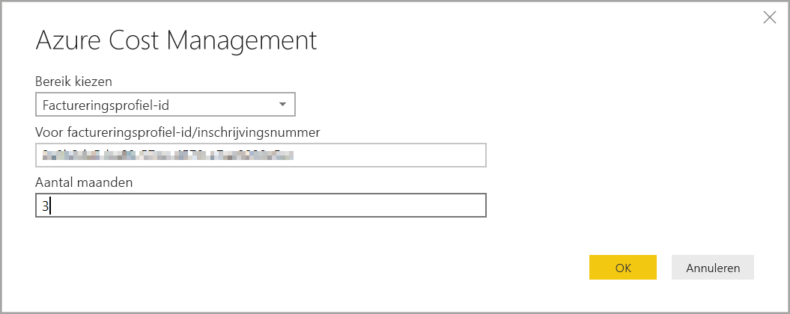
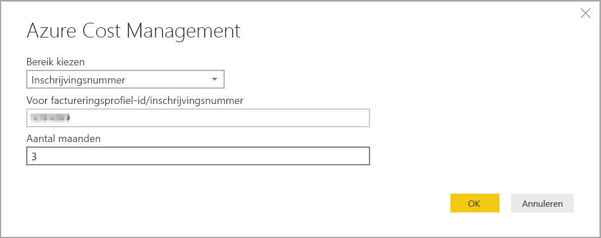
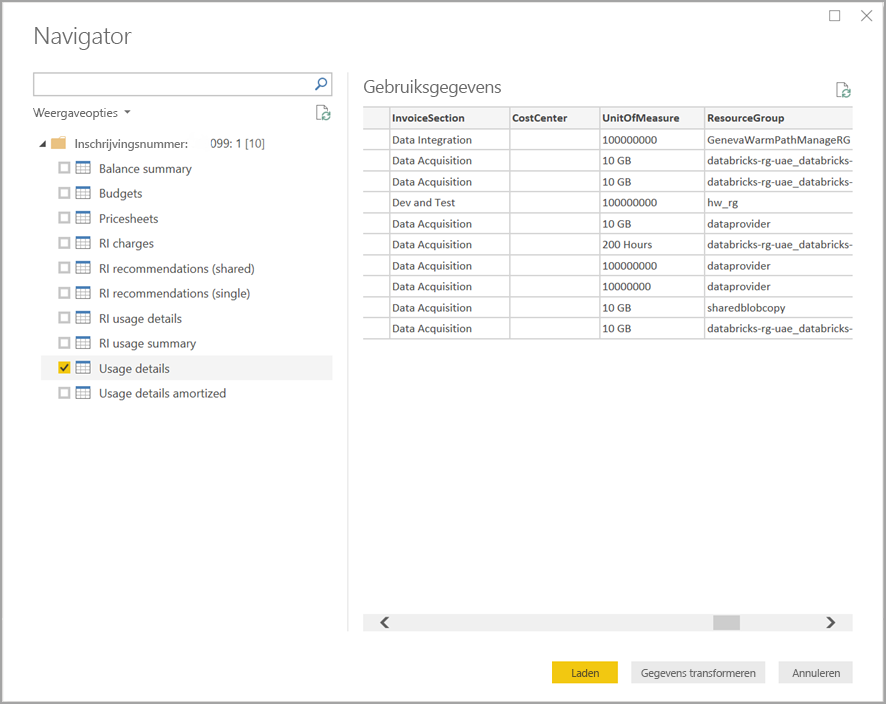

# Visuals en rapporten maken met de Azure Cost Management-connector in Power BI Desktop

U kunt de Azure Cost Management-connector voor Power BI Desktop gebruiken om krachtige, aangepaste visualisaties en rapporten te maken die u een beter inzicht geven in uw uitgaven voor Azure. De Azure Cost Management-connector ondersteunt momenteel klanten met een [Microsoft-klantovereenkomst](https://azure.microsoft.com/pricing/purchase-options/microsoft-customer-agreement/) of een [Enterprise Agreement (EA)](https://azure.microsoft.com/pricing/enterprise-agreement/).  

Met de Azure Cost Management-connector gebruikt u OAuth 2.0 voor verificatie met Azure en identificeert u gebruikers die de connector gaan gebruiken. Tokens die in dit proces worden gegenereerd, zijn geldig voor een specifieke periode. Power BI behoudt het token voor de volgende aanmelding. OAuth 2.0 is een standaard voor het proces dat achter de schermen wordt uitgevoerd om ervoor te zorgen dat deze machtigingen veilig worden verwerkt. Als u verbinding wilt maken, moet u een [ondernemingsbeheerder](https://docs.microsoft.com/azure/billing/billing-understand-ea-roles)-account gebruiken voor Enterprise Agreements of een [eigenaar van een factureringsaccount](https://docs.microsoft.com/azure/billing/billing-understand-mca-roles) zijn voor Microsoft-klantovereenkomsten. 

> [!NOTE]
> Deze connector vervangt de vorige connectors [Azure Consumption Insights en Azure Cost Management (bèta)](desktop-connect-azure-consumption-insights.md). Rapporten die zijn gemaakt met de eerdere connector moeten opnieuw worden gemaakt met behulp van deze connector.

## Verbinding maken met behulp van Azure Cost Management

De **Azure Cost Management**-connector gebruiken in Power BI Desktop, gaat als volgt:

1.  Selecteer in het lint **Start** **Gegevens ophalen**.
2.  Selecteer **Azure** in de lijst met gegevenscategorieën.
3.  Selecteer **Azure Cost Management**.

    

4. Voer in het dialoogvenster dat wordt weergegeven uw **factureringsprofiel-id** voor **Microsoft-klantovereenkomsten** of uw **inschrijvingsnummer** voor **Enterprise Agreements (EA)** in. 

## Verbinding maken met een Microsoft-klantovereenkomstaccount 

Als u verbinding wilt maken met een **Microsoft klantovereenkomst**account, kunt u uw **factureringsprofiel-id** in de Azure-portal ophalen:

1.  Navigeer in de [Azure-portal](https://portal.azure.com/) naar **Cost Management en facturering**.
2.  Selecteer uw factureringsprofiel. 
3.  Selecteer in het menu bij **Instellingen** de optie **Eigenschappen** in de zijbalk.
4.  Kopieer de **id**  bij **Factureringsprofiel**. 
5.  Selecteer voor **Bereik kiezen** **Factureringsprofiel-id** en plak hier de factureringsprofiel-id uit de vorige stap. 
6.  Voer het aantal maanden in en selecteer **OK**.

    

7.  Meld u aan met uw Azure-gebruikersaccount en -wachtwoord als u hierom wordt gevraagd. 

## Verbinding maken met een Enterprise Agreement-account

Als u verbinding wilt maken met een Enterprise Agreement-account (EA), kunt u uw inschrijvings-id ophalen uit Azure Portal:

1.  Navigeer in de [Azure-portal](https://portal.azure.com/) naar **Cost Management en facturering**.
2.  Selecteer uw factureringsaccount.
3.  Kopieer in het menu **Overzicht** de **factureringsprofiel-id**.
4.  Selecteer voor **Bereik kiezen** **Inschrijvingsnummer** en plak hier de factureringsaccount-id uit de vorige stap. 
5.  Voer het aantal maanden in en selecteer vervolgens **OK**.

    

6.  Meld u aan met uw Azure-gebruikersaccount en -wachtwoord als u hierom wordt gevraagd. 

## Gegevens die beschikbaar zijn via de connector

Nadat uw verificatie is geslaagd, wordt het venster **Navigator** weergegeven waarin de volgende gegevenstabellen beschikbaar zijn:

| **Tabel** | **Beschrijving** |
| --- | --- |
| **Saldo-overzicht** | Overzicht van het saldo voor Enterprise Agreements (EA). |
| **Factureringsgebeurtenissen** | Gebeurtenislogboeken van nieuwe facturen, kredietaankopen etc. Alleen Microsoft-gebruikersovereenkomst. |
| **Budgetten** | Budgetgegevens aan de hand waarvan u de daadwerkelijke kosten of het daadwerkelijke gebruik kunt bekijken en met de bestaande budgetdoelen kunt vergelijken. |
| **Kosten** | Een samenvatting op maandniveau van uw Azure-verbruik, Marketplace-kosten en afzonderlijk gefactureerde kosten. Alleen Microsoft-gebruikersovereenkomst. |
| **Kredietpartijen** | Informatie over de aankoop van Azure-kredietpartijen voor het opgegeven factureringsprofiel. Alleen Microsoft-gebruikersovereenkomst. |
| **PriceSheets** | Van toepassing zijnde tarieven per meter voor het opgegeven factureringsprofiel of de opgegeven EA-inschrijving. |
| **RI-kosten** | De kosten van uw gereserveerde instanties gedurende de afgelopen 24 maanden. |
| **RI-aanbevelingen (gedeeld)** | Aanbevelingen voor de aanschaf van gereserveerde instanties op basis van alle gebruikstrends voor uw abonnement gedurende de afgelopen 7, 30 of 60 dagen. |
| **RI-aanbevelingen (enkel)** | Aanbevelingen voor de aanschaf van gereserveerde instanties op basis van uw gebruikstrends voor één abonnement gedurende de afgelopen 7, 30 of 60 dagen. |
| **Gebruiksgegevens voor gereserveerde instanties** | Gebruiksgegevens van uw huidige gereserveerde instanties gedurende de afgelopen maand. |
| **Overzicht gebruik gereserveerde instanties** | Percentage voor dagelijks Azure reserveringsgebruik. |
| **Gebruiksgegevens** | Een specificatie van de gebruikte hoeveelheden en de geschatte kosten voor de opgegeven factureringsprofiel-id bij de EA-inschrijving. |
| **Gebruiksgegevens afgeschreven** | Een specificatie van de gebruikte hoeveelheden en de geschatte afgeschreven kosten voor het opgegeven factureringsprofiel bij de EA-inschrijving. |

U kunt een tabel selecteren om een voorbeeldvenster weer te geven. U kunt een of meer tabellen selecteren door de betreffende selectievakjes in te schakelen en vervolgens **Laden** te selecteren.

Wanneer u **Laden** selecteert, worden de gegevens in Power BI Desktop geladen. 

Nadat de geselecteerde gegevens zijn geladen, worden de gegegevenstabellen en velden weergegeven in het deelvenster **Velden**.

## Volgende stappen

U kunt via Power BI Desktop verbinding maken met allerlei gegevensbronnen. Raadpleeg voor meer informatie de volgende artikelen:

* [Wat is Power BI Desktop?](../fundamentals/desktop-what-is-desktop.md)
* [Data Sources in Power BI Desktop](desktop-data-sources.md) (Gegevensbronnen in Power BI Desktop)
* [Shape and Combine Data with Power BI Desktop](desktop-shape-and-combine-data.md) (Gegevens vormgeven en combineren met Power BI Desktop)
* [Connect to Excel workbooks in Power BI Desktop](desktop-connect-excel.md) (Verbinding maken met Excel-werkmappen in Power BI Desktop)   
* [Enter data directly into Power BI Desktop](desktop-enter-data-directly-into-desktop.md) (Rechtstreeks gegevens in Power BI Desktop invoeren)   
