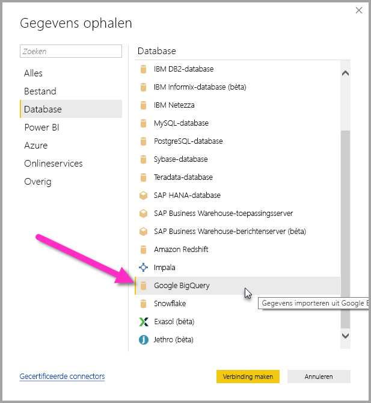
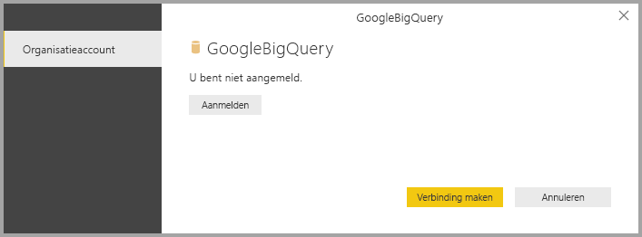
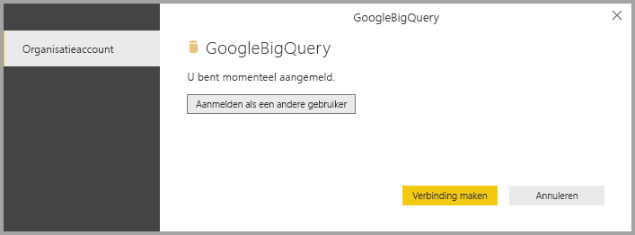
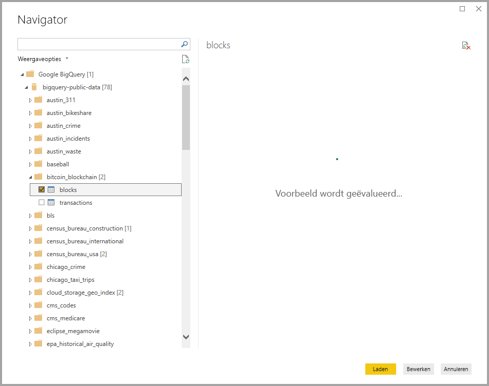

# <a name="connect-to-a-google-bigquery-database-in-power-bi-desktop"></a>Verbinding met een Google BigQuery-database maken in Power BI Desktop
In Power BI Desktop kunt u verbinding maken met een Google **BigQuery**-database en gebruikmaken van de onderliggende gegevens, net zoals elke andere gegevensbron in Power BI Desktop.

## <a name="connect-to-google-bigquery"></a>Verbinding maken met Google BigQuery
Als u verbinding wilt maken met een Google **BigQuery**-database, selecteert u **Gegevens ophalen** op het lint **Start** in Power BI Desktop. Selecteer **Database** in de categorieën aan de linkerkant en u ziet **Google BigQuery**.



In het **Google BigQuery**-venster dat wordt geopend meldt u zich aan bij uw Google BigQuery-account en selecteert u **Verbinden**.



Wanneer u bent aangemeld ziet u het volgende venster, wat aangeeft dat u bent geverifieerd. 



Als u verbinding hebt gemaakt, verschijnt er een **Navigator**-scherm waarin de gegevens worden getoond die op de server beschikbaar zijn. Hier kunt u een of meer elementen selecteren die u in **Power BI Desktop** wilt importeren en gebruiken.



## <a name="considerations-and-limitations"></a>Overwegingen en beperkingen
Houd rekening met enkele beperkingen en overwegingen als u de Google **BigQuery**-connector wilt gebruiken:

* De Google BigQuery-connector is beschikbaar in Power BI Desktop en in de Power BI-service. In de Power BI-service is de connector toegankelijk via de cloud-naar-cloud-verbinding vanuit Power BI met Google BigQuery.

* U kunt Power BI gebruiken met het Google BigQuery **Factureringsproject**. Power BI maakt standaard gebruik van het eerste project in de lijst die voor de gebruiker wordt geretourneerd. 

  Als u het gedrag van het factureringsproject wilt aanpassen bij gebruik met Power BI, geeft u de volgende optie op in de onderliggende M in de stap Bron, die kan worden aangepast met de **Power Query-editor** in Power BI Desktop:

  ```
  Source = GoogleBigQuery.Database([BillingProject="Include-Billing-Project-Id-Here"])
  ```

  Vanaf de release van september 2020 hebben we ondersteuning voor de [Google BigQuery Storage-API](https://cloud.google.com/bigquery/docs/reference/storage) ingeschakeld. Sommige klanten kunnen problemen ondervinden met deze functie als ze gedetailleerde machtigingen gebruiken. In dit scenario ziet u mogelijk het volgende foutbericht:

  `ERROR [HY000] [Microsoft][BigQuery] (131) Unable to authenticate with Google BigQuery Storage API. Check your account permissions`

  U kunt dit probleem oplossen door de gebruikersmachtigingen voor de opslag-API aan te passen. Wijs deze machtigingen voor de opslag-API toe:

  - `bigquery.readsessions.create`: maakt een nieuwe leessessie via de BigQuery Storage-API.
  - `bigquery.readsessions.getData`: leest gegevens uit een leessessie via de BigQuery Storage-API.
  - `bigquery.readsessions.update`: werkt een nieuwe leessessie bij via de BigQuery Storage-API.

  Deze machtigingen worden doorgaans toegekend aan de rol BigQuery.User. Zie [Vooraf gedefinieerde rollen en machtigingen voor Google BigQuery](https://cloud.google.com/bigquery/docs/access-control) voor meer informatie.


## <a name="next-steps"></a>Volgende stappen
Met Power BI Desktop kunt u verbinding maken met allerlei andere gegevens. Bekijk de volgende bronnen voor meer informatie over gegevensbronnen:

* [Wat is Power BI Desktop?](../fundamentals/desktop-what-is-desktop.md)
* [Data Sources in Power BI Desktop](desktop-data-sources.md) (Gegevensbronnen in Power BI Desktop)
* [Shape and Combine Data with Power BI Desktop](desktop-shape-and-combine-data.md) (Gegevens vormgeven en combineren met Power BI Desktop)
* [Connect to Excel workbooks in Power BI Desktop](desktop-connect-excel.md) (Verbinding maken met Excel-werkmappen in Power BI Desktop)   
* [Enter data directly into Power BI Desktop](desktop-enter-data-directly-into-desktop.md) (Rechtstreeks gegevens in Power BI Desktop invoeren)   
