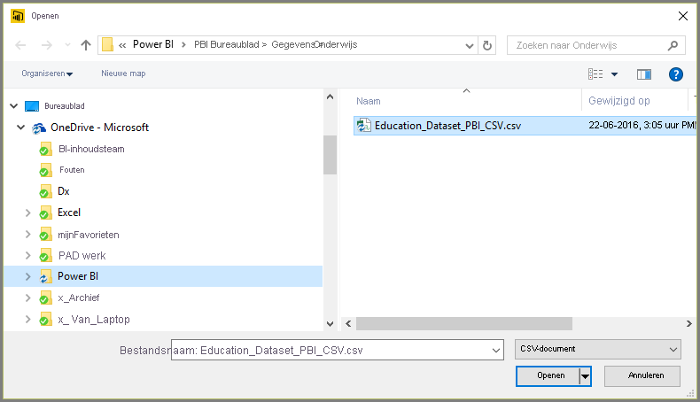
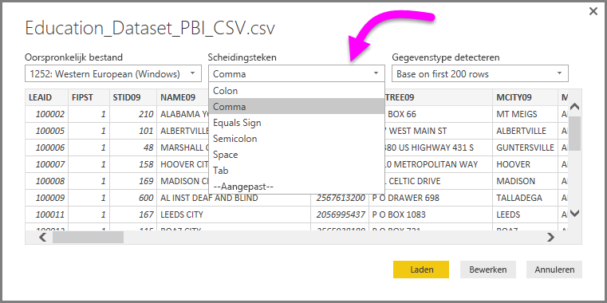
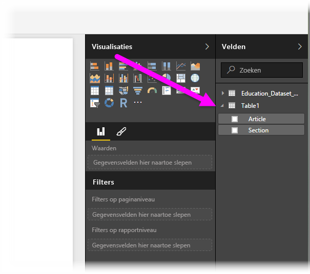

# Verbinding met CSV-bestanden maken in Power BI Desktop
Verbinding maken met een bestand met door komma's gescheiden waarden (*CSV*) vanuit Power BI Desktop lijkt erg veel op verbinding maken met een Excel-werkmap. Beide zijn erg eenvoudig uit te voeren en in dit artikel leert u de stappen kennen om verbinding te maken met een CSV-bestand waartoe u toegang hebt.

Selecteer vanuit Power BI Desktop eerst **Gegevens ophalen > CSV** op het lint **Start**.

Selecteer het CSV-bestand in het dialoogvenster **Openen** dat wordt weergegeven.

Als u **Openen** selecteert, wordt het bestand geopend en worden bepaalde bestandskenmerken vastgesteld, zoals de oorsprong, het type scheidingsteken en hoeveel rijen er moeten worden gebruikt om de gegevenstypen in het bestand te kunnen detecteren.

Deze bestandskenmerken en opties worden weergegeven in de vervolgkeuzelijsten boven aan het dialoogvenster **CSV-import**, zoals hieronder weergegeven. U kunt deze gedetecteerde instellingen handmatig wijzigen door een andere optie te kiezen in een van de vervolgkeuzelijsten.

Als u tevreden bent met uw selecties, kunt u **Laden** selecteren om het bestand in Power BI Desktop te importeren. U kunt ook **Bewerken** selecteren om **Query Editor** te selecteren en de gegevens verder vorm te geven en te transformeren voordat u ze importeert.

Als u de gegevens in Power BI Desktop laadt, ziet u de tabel en de bijbehorende kolommen (die in Power BI Desktop als velden worden voorgesteld) in het deelvenster **Velden** aan de rechterkant van de rapportweergave in Power BI Desktop.

Meer hoeft u niet te doen; de gegevens in uw CSV-bestand staan nu in Power BI Desktop.

U kunt deze gegevens in Power BI Desktop gebruiken om visuele elementen of rapporten te maken of te werken met andere gegevens waarmee u verbinding wilt maken en die u wilt importeren, zoals Excel-werkmappen, databases of een andere gegevensbron.

> [!IMPORTANT]
> Wanneer u een CSV-bestand importeert, wordt in Power BI Desktop een *kolommen=x* gemaakt als stap in Power Query-editor (waarbij *x* het aantal kolommen in het CSV-bestand is tijdens de initiële import). Als u daarna meer kolommen toevoegt en de gegevensbron is ingesteld op vernieuwen, worden alle kolommen die de initiële *x* kolommen overschrijden, niet vernieuwd. 

## Volgende stappen
Met Power BI Desktop kunt u verbinding maken met allerlei andere gegevens. Bekijk de volgende bronnen voor meer informatie over gegevensbronnen:

* [Wat is Power BI Desktop?](../fundamentals/desktop-what-is-desktop.md)
* [Gegevensbronnen in Power BI Desktop](desktop-data-sources.md)
* [Gegevens vormgeven en combineren met Power BI Desktop](desktop-shape-and-combine-data.md)
* [Connect to Excel workbooks in Power BI Desktop](desktop-connect-excel.md) (Verbinding maken met Excel-werkmappen in Power BI Desktop)   
* [Enter data directly into Power BI Desktop](desktop-enter-data-directly-into-desktop.md) (Rechtstreeks gegevens in Power BI Desktop invoeren)   
