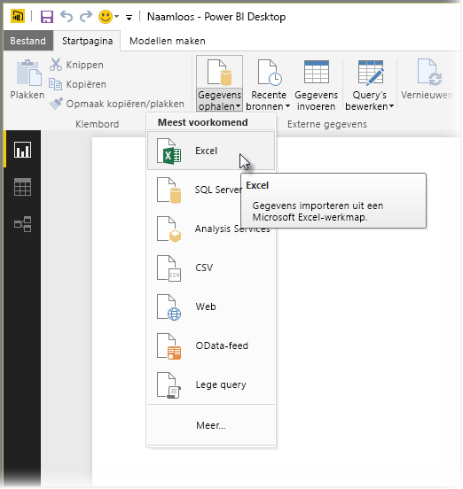
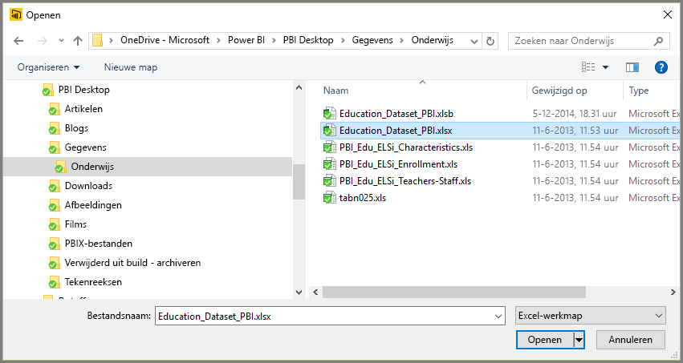
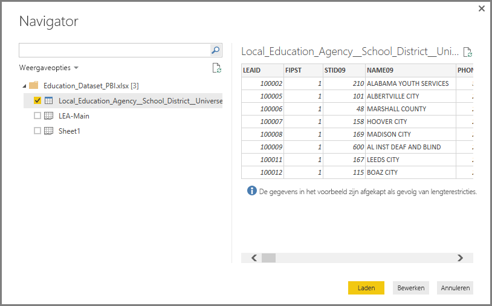
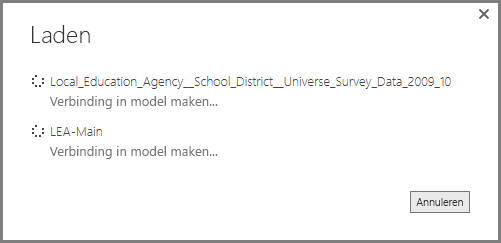
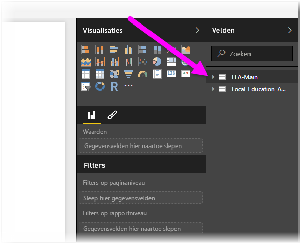

# Verbinding maken met Excel-werkmappen in Power BI Desktop
Verbinding maken met een Excel-werkmap vanuit Power BI Desktop is erg eenvoudig. Dit artikel begeleidt u stapsgewijs door de procedure.

In Power BI Desktop selecteert u op het lint **Start** de opties **Gegevens ophalen > Excel**.

Selecteer werkmap in het dialoogvenster **Openen** dat wordt weergegeven.

De gegevens worden vanuit de werkmap gepresenteerd op andere gegevenselementen in het venster **Navigator**. Wanneer u een tabel in het linkerdeelvenster selecteert, wordt er een voorbeeld van de gegevens in het rechterdeelvenster weergegeven.

Met de knop Laden kunt u de gegevens importeren. Als u de gegevens wilt bewerken met **Query-editor** voordat u ze in Power BI Desktop laadt, selecteert u de knop **Bewerken**.

Wanneer u de gegevens laadt, wordt het venster **Laden** weergegeven en tevens de activiteit die is gekoppeld aan het laden van de gegevens.  

Als u klaar bent, worden in het deelvenster **Velden**, aan de rechterkant van het bureaublad, de tabellen en velden weergegeven die zijn geïmporteerd vanuit uw Excel-werkmap.

Dat is alles.

U bent nu klaar om de geïmporteerde gegevens uit de Excel-werkmap in Power BI Desktop te gebruiken om visuele elementen of rapporten te maken of te werken met andere gegevens waarmee u verbinding wilt maken en importeren, zoals andere Excel-werkmappen, databases of een andere gegevensbron.

## Volgende stappen
Met Power BI Desktop kunt u verbinding maken met allerlei andere gegevens. Bekijk de volgende bronnen voor meer informatie over gegevensbronnen:

* [Wat is Power BI Desktop?](../fundamentals/desktop-what-is-desktop.md)
* [Data Sources in Power BI Desktop](desktop-data-sources.md) (Gegevensbronnen in Power BI Desktop)
* [Shape and Combine Data with Power BI Desktop](desktop-shape-and-combine-data.md) (Gegevens vormgeven en combineren met Power BI Desktop)
* [Connect to CSV files in Power BI Desktop](desktop-connect-csv.md) (Verbinding met CSV-bestanden maken in Power BI Desktop)   
* [Enter data directly into Power BI Desktop](desktop-enter-data-directly-into-desktop.md) (Rechtstreeks gegevens in Power BI Desktop invoeren)   
