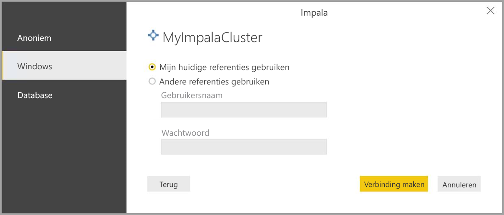
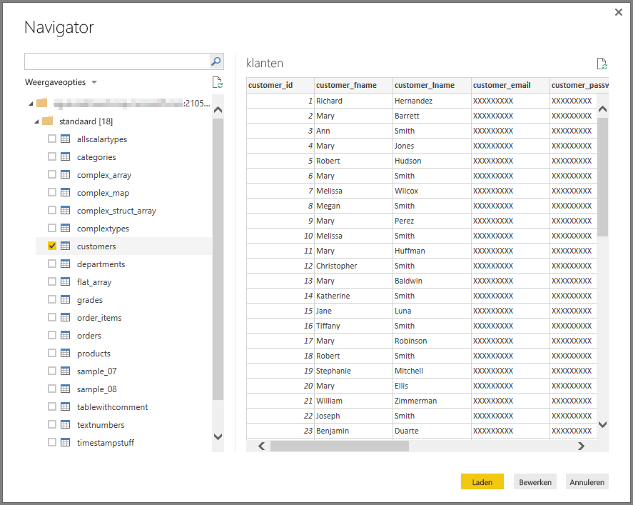

# Verbinding met een Impala-database maken in Power BI Desktop
In Power BI Desktop kunt u verbinding maken met een **Impala**-database en de onderliggende gegevens gebruiken als elke andere gegevensbron in Power BI Desktop.

## Verbinding maken met een Impala-database
Voer de volgende stappen uit om verbinding te maken met een **Impala** database: 

1. Selecteer **Gegevens ophalen** in het lint **Start** in Power BI Desktop. 

2. Selecteer **Database** in de categorieën aan de linkerkant. Nu wordt **Impala** weergegeven.

    

3. In het **Impala**-venster dat verschijnt, typt of plakt u de naam van de Impala-server in het vak. Selecteer **OK**. U kunt de gegevens rechtstreeks **importeren** in Power BI of u kunt **DirectQuery** gebruiken. Meer informatie over het [gebruik van DirectQuery](desktop-use-directquery.md).

    

4. Voer uw referenties in wanneer dit wordt gevraagd, of maak anoniem verbinding. De Impala-connector ondersteunt Anonymous-, Basic- (gebruikersnaam en wachtwoord) en Windows-verificatie.

    

    > [!NOTE]
    > Wanneer u uw gebruikersnaam en wachtwoord voor een bepaalde **Impala**-server hebt ingevoerd, worden deze referenties door Power BI Desktop gebruikt bij volgende pogingen om verbinding te maken. U kunt de referenties wijzigen via **Bestand > Opties en instellingen > Instellingen voor gegevensbron**.

5. Wanneer u verbinding hebt gemaakt, wordt er een **Navigator**-venster weergegeven met de gegevens die beschikbaar zijn op de server. Kies in deze gegevens de elementen die u wilt importeren en gebruiken in **Power BI Desktop**.

    

## Overwegingen en beperkingen
Houd rekening met enkele beperkingen en overwegingen als u de **Impala**-connector wilt gebruiken:

* De Impala-connector wordt ondersteund in de on-premises gegevensgateway met behulp van een van de drie ondersteunde verificatiemechanismen.

## Volgende stappen
Met behulp van Power BI Desktop kunt u verbinding maken met allerlei gegevensbronnen. Bekijk de volgende bronnen voor meer informatie over gegevensbronnen:

* [Wat is Power BI Desktop?](../fundamentals/desktop-what-is-desktop.md)
* [Gegevensbronnen in Power BI Desktop](desktop-data-sources.md)
* [Gegevens vormgeven en combineren met Power BI Desktop](desktop-shape-and-combine-data.md)
* [Connect to Excel workbooks in Power BI Desktop](desktop-connect-excel.md) (Verbinding maken met Excel-werkmappen in Power BI Desktop)   
* [Enter data directly into Power BI Desktop](desktop-enter-data-directly-into-desktop.md) (Rechtstreeks gegevens in Power BI Desktop invoeren)   
