# Verbinding maken met LinkedIn Sales Navigator in Power BI Desktop

In **Power BI Desktop** kunt u verbinding maken met **LinkedIn Sales Navigator** om relaties te zoeken en te bouwen, net als bij elke andere gegevensbron in Power BI Desktop, en om kant-en-klare rapporten te maken over uw voortgang.

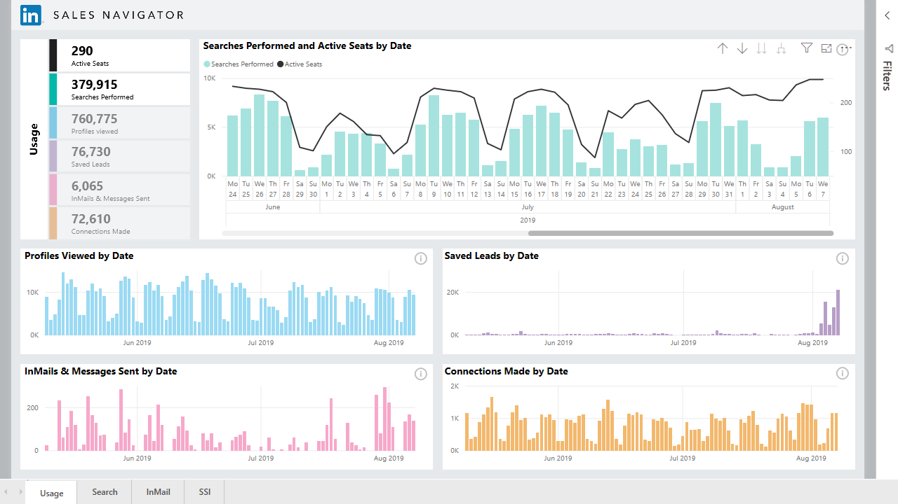

Als u verbinding wilt maken met LinkedIn-gegevens met behulp van de **LinkedIn Sales Navigator**, moet u beschikken over een Enterprise-abonnement voor LinkedIn Sales Navigator, en een beheerder of rapportgebruiker zijn in het Sales Navigator-contract.

De volgende video biedt een korte rondleiding en zelfstudie over het gebruik van de sjabloon-app voor **LinkedIn Sales Navigator**, welke [verderop in dit artikel](#using-the-linkedin-sales-navigator-template-app) in detail wordt beschreven. 

> [!VIDEO https://www.youtube.com/embed/ZqhmaiORLw0]

## Verbinding maken met LinkedIn Sales Navigator

Als u verbinding wilt maken met gegevens uit **LinkedIn Sales Navigator**, selecteert u **Gegevens ophalen** op het lint **Start** in Power BI Desktop. Selecteer **Online Services** in de categorieën aan de linkerkant, en schuif vervolgens tot u **LinkedIn Sales Navigator (bèta)** ziet.

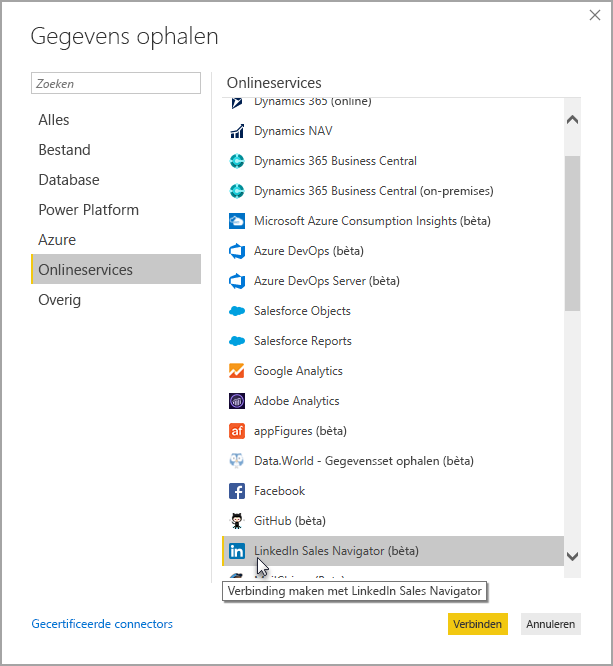

U wordt geadviseerd om verbinding te maken via een verbinding van derden die nog steeds in ontwikkeling is. 

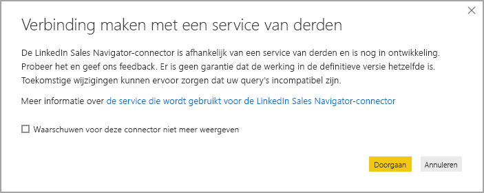

Wanneer u **Doorgaan** selecteert, wordt u gevraagd de gewenste gegevens op te geven.

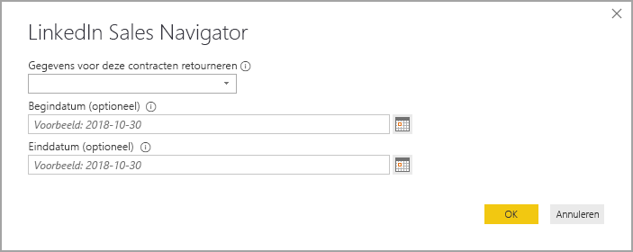

Selecteer in het venster **LinkedIn Sales Navigator** dat wordt weergegeven, de gegevens die u wilt retourneren, hetzij *Alle contactpersonen* of *Geselecteerde contactpersonen* uit de eerste vervolgkeuzelijst. U kunt vervolgens de begin- en einddatum opgeven om de gegevens die worden ontvangen, te beperken tot een bepaald tijdvenster.

Zodra u de informatie hebt verstrekt, maakt Power BI Desktop verbinding met de gegevens die zijn gekoppeld aan uw LinkedIn Sales Navigator-contract. Gebruik hetzelfde e-mailadres dat u gebruikt om u aan te melden bij LinkedIn Sales Navigator via de website. 

Wanneer u verbinding hebt gemaakt, wordt u gevraagd de gegevens uit uw LinkedIn Sales Navigator-contract te selecteren vanuit een **Navigator**-venster.

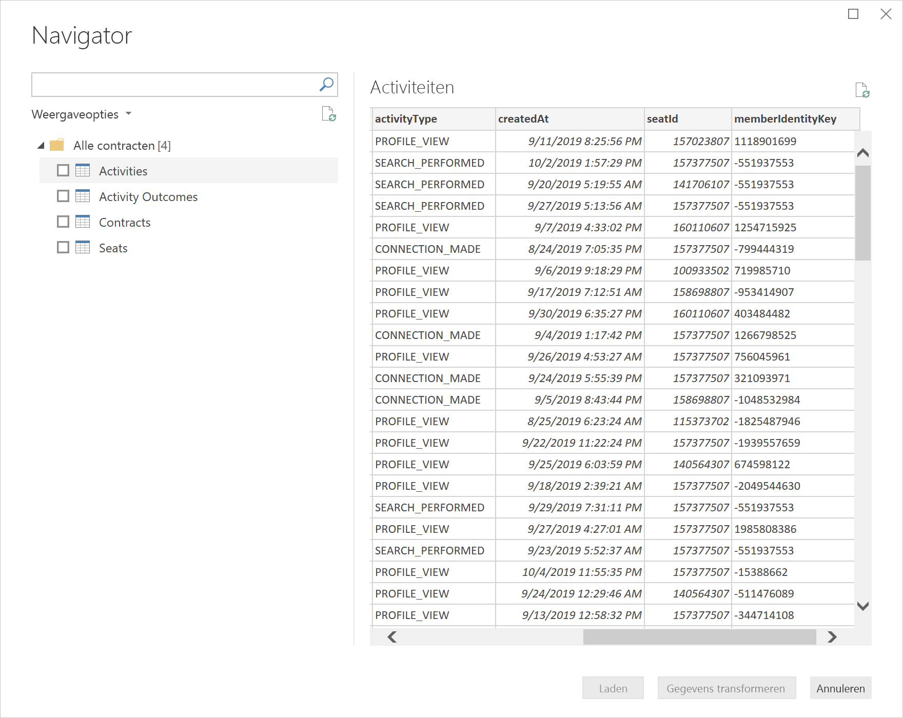

U kunt elk gewenst rapporten maken met uw LinkedIn Sales Navigator-gegevens. Om het eenvoudiger te maken is er ook een LinkedIn Sales Navigator PBIX-bestand dat u kunt downloaden. Dit bestand bevat voorbeeldgegevens die al klaar zijn, zodat u vertrouwd kunt raken met de gegevens en de rapporten, zonder helemaal opnieuw te hoeven beginnen.

U kunt het PBIX-bestand downloaden vanaf de volgende locatie:
* [PBIX voor LinkedIn Sales Navigator](service-template-apps-samples.md)

Naast het PBIX-bestand heeft LinkedIn Sales Navigator ook een sjabloon-app die u kunt downloaden en gebruiken. In de volgende sectie wordt de sjabloon-app in detail beschreven.

## Sjabloon-app voor LinkedIn Sales Navigator gebruiken

Als u het gebruik van **LinkedIn Sales Navigator** zo eenvoudig mogelijk wilt maken, kunt u de [sjabloon-app](service-template-apps-overview.md) gebruiken. Hiermee wordt automatisch een kant-en-klaar rapport gemaakt op basis van uw LinkedIn Sales Navigator-gegevens.

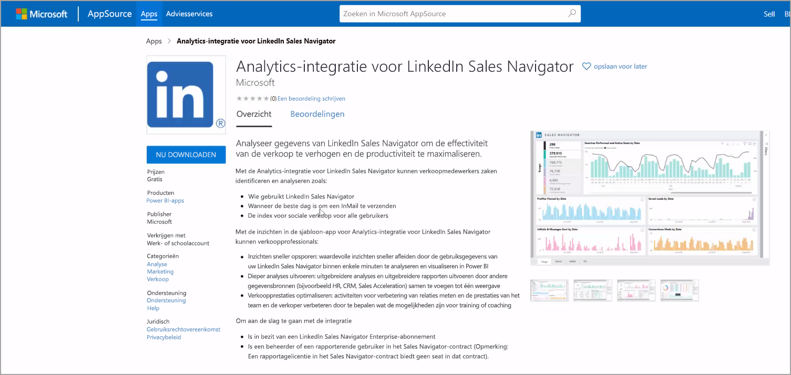

Wanneer u de app downloadt, kunt u selecteren of u verbinding wilt maken met uw gegevens, of de app wilt verkennen met voorbeeldgegevens. U kunt altijd teruggaan en verbinding maken met uw eigen LinkedIn Sales Navigator-gegevens, nadat u de voorbeeldgegevens hebt bekeken. 

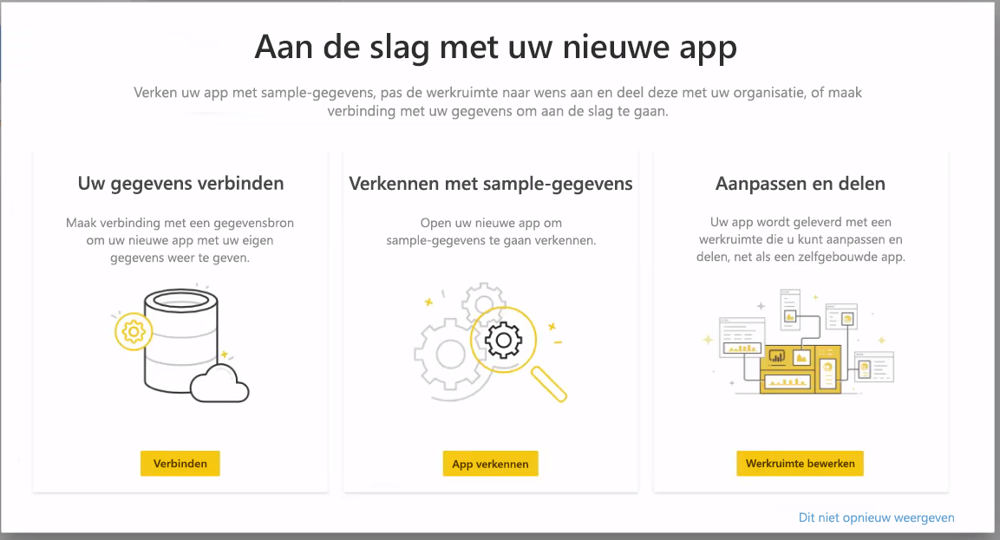

U kunt de sjabloon-app voor **LinkedIn Sales Navigator** downloaden via de volgende koppeling:
* [Sjabloon-app voor LinkedIn Sales Navigator](https://appsource.microsoft.com/en-us/product/power-bi/pbi-contentpacks.linkedin_navigator)

De sjabloon-app biedt vier tabbladen om u te helpen uw gegevens te analyseren en te delen:

* Gebruik
* Zoeken
* InMail
* SSI

Op het tabblad **Gebruik** worden uw algemene gegevens van LinkedIn Sales Navigator weergegeven.

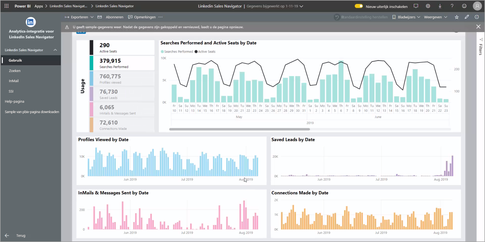

Op het tabblad **Zoeken** kunt u meer gedetailleerd inzoomen op de zoekresultaten:

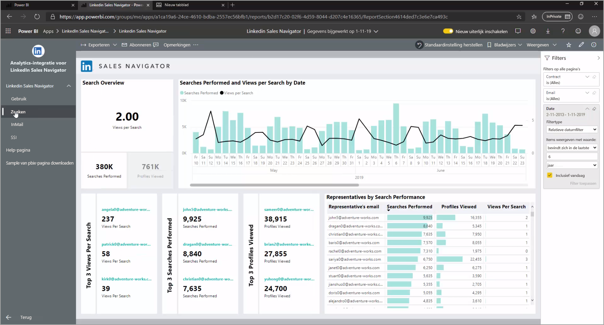

**InMail** biedt inzicht in uw InMail-gebruik, inclusief het aantal verzonden InMail-berichten, acceptatiesnelheden, en andere nuttige informatie:

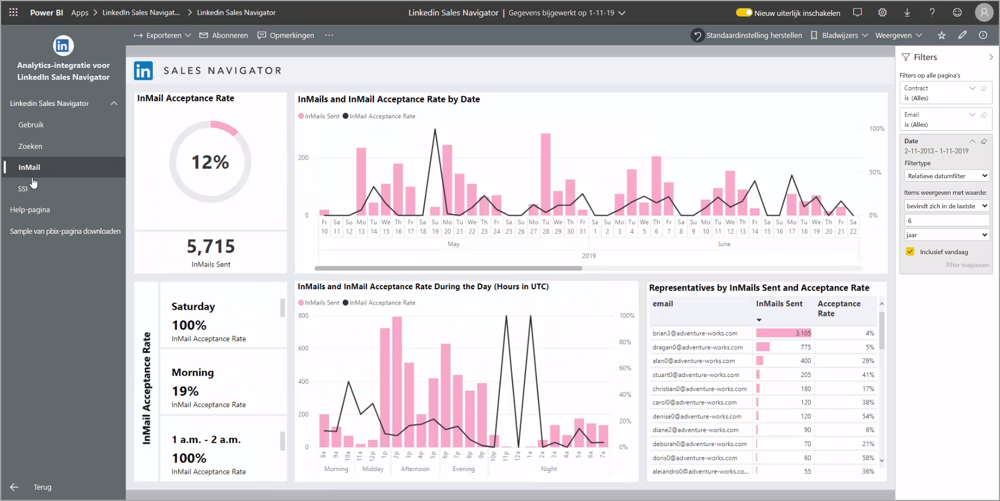

Het tabblad **SSI** biedt meer informatie over uw SSI (Social Selling Index)

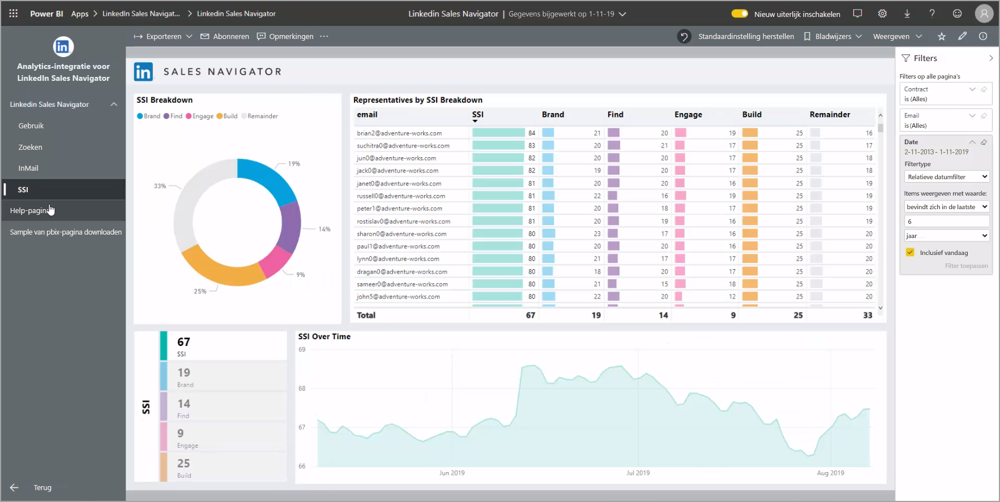

Als u van de voorbeeldgegevens naar uw eigen gegevens wilt gaan, selecteert u in de rechterbovenhoek **app bewerken** (het potloodpictogram). Vervolgens selecteert u **Uw gegevens verbinden** in het scherm dat verschijnt.

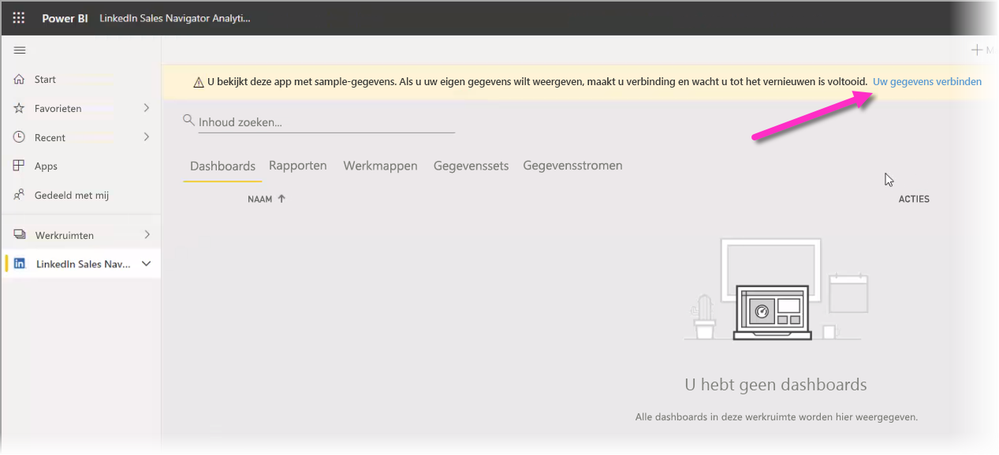

Hier kunt u verbinding maken met uw eigen gegevens en selecteren hoeveel dagen aan gegevens u wilt laden. U kunt maximaal 365 dagen aan gegevens laden. U moet u opnieuw aanmelden, weer met hetzelfde e-mailadres dat u gebruikt om u aan te melden bij LinkedIn Sales Navigator via de website. 

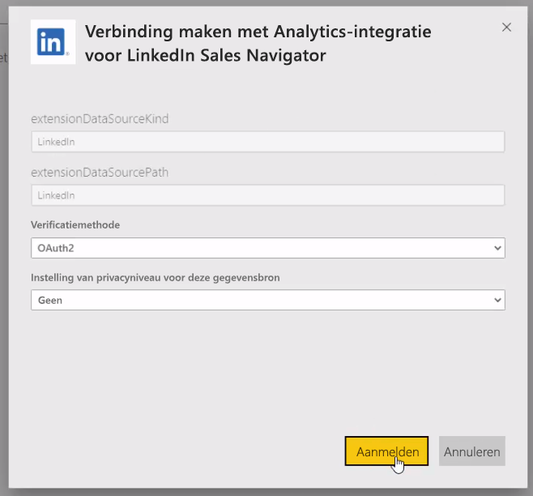

via de sjabloon-app worden vervolgens de gegevens in de app vernieuwd met uw eigen gegevens. U kunt ook een geplande vernieuwing instellen, zodat de gegevens in uw app zo actueel zijn als de opgegeven vernieuwingsfrequentie. 

Zodra de gegevens zijn bijgewerkt, ziet u dat de app is ingevuld met uw eigen gegevens.

## Hulp krijgen

Als u problemen ondervindt bij het maken van verbinding met uw gegevens, kunt u contact opnemen met de ondersteuning voor LinkedIn Sales Navigator op https://www.linkedin.com/help/sales-navigator. 

## Volgende stappen
Met Power BI Desktop kunt u verbinding maken met allerlei andere gegevens. Bekijk de volgende bronnen voor meer informatie over gegevensbronnen:

* [Wat is Power BI Desktop?](../fundamentals/desktop-what-is-desktop.md)
* [Data Sources in Power BI Desktop](desktop-data-sources.md) (Gegevensbronnen in Power BI Desktop)
* [Shape and Combine Data with Power BI Desktop](desktop-shape-and-combine-data.md) (Gegevens vormgeven en combineren met Power BI Desktop)
* [Connect to Excel workbooks in Power BI Desktop](desktop-connect-excel.md) (Verbinding maken met Excel-werkmappen in Power BI Desktop)   
* [Enter data directly into Power BI Desktop](desktop-enter-data-directly-into-desktop.md) (Rechtstreeks gegevens in Power BI Desktop invoeren)   
