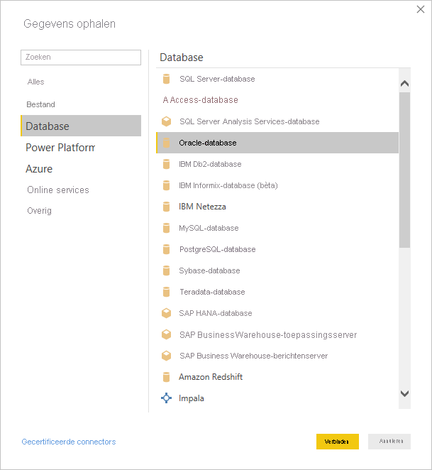
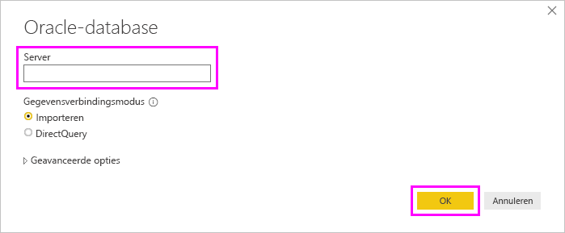
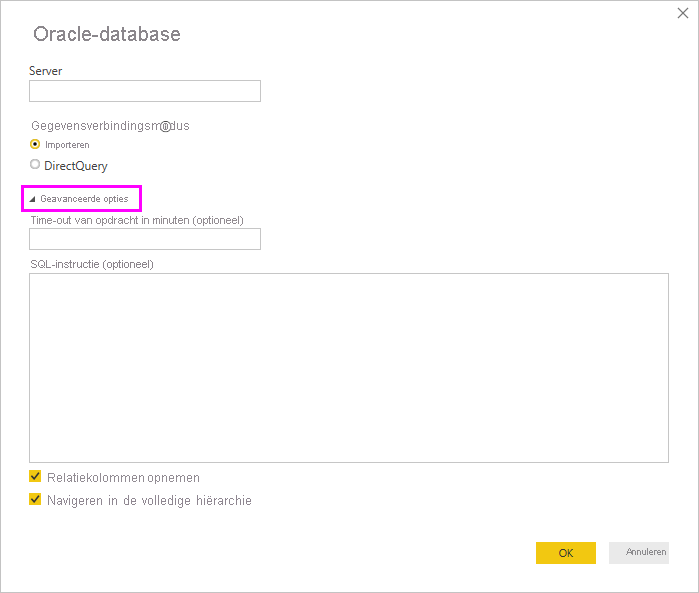

# Verbinding maken met een Oracle-database met Power BI Desktop
Om een Oracle-database te kunnen verbinden met Power BI Desktop, moet de juiste Oracle-clientsoftware worden geïnstalleerd op de computer waarop Power BI Desktop wordt uitgevoerd. De Oracle-clientsoftware die u gebruikt, is afhankelijk van de door u geïnstalleerde versie van Power BI Desktop: 32-bits of 64-bits. Het is ook afhankelijk van uw Oracle Server-versie.

Ondersteunde Oracle-versies: 
- Oracle Server 9 en hoger
- Oracle Data Access Client-software (ODAC) 11.2 en hoger

> [!NOTE]
> Als u een Oracle-database voor Power BI Desktop, On Premises Data Gateway of Power BI Report Server configureert, raadpleegt u de informatie in het artikel [Oracle Connection Type](/sql/reporting-services/report-data/oracle-connection-type-ssrs?view=sql-server-ver15) (Oracle-verbindingstype). 

## Bepalen welke versie van Power BI Desktop is geïnstalleerd
Om te bepalen welke versie van Power BI Desktop is geïnstalleerd, selecteert u **Bestand** > **Help** > **Info** en schakelt u de regel **Versie** in. Op de volgende afbeelding is een 64-bits versie van Power BI Desktop geïnstalleerd:

## De Oracle-client installeren
- [Download en installeer de 32-bits Oracle-client](https://www.oracle.com/technetwork/topics/dotnet/utilsoft-086879.html) voor de 32-bits versie van Power BI Desktop.

- [Download en installeer de 64-bits Oracle-client](https://www.oracle.com/database/technologies/odac-downloads.html) voor de 64-bits versie van Power BI Desktop.

> [!NOTE]
> Kies een versie van Oracle Data Access Client (ODAC) die compatibel is met uw Oracle Server. ODAC 12.x biedt bijvoorbeeld niet altijd ondersteuning voor Oracle Server-versie 9.
> Kies het installatieprogramma van Windows van de Oracle Client.
> Zorg er tijdens de configuratie van de Oracle-client voor dat u *ODP.NET-en/of Oracle-providers configureren voor ASP.NET op computerniveau* inschakelt door het bijbehorende selectievakje tijdens de installatiewizard in te schakelen. Bij sommige versies van de Oracle-clientwizard wordt het selectievakje standaard geselecteerd, maar bij andere niet. Zorg ervoor dat het selectievakje is ingeschakeld, zodat Power BI verbinding kan maken met uw Oracle-database.

## Verbinding maken met een Oracle-database
Nadat u het overeenkomende Oracle-clientstuurprogramma hebt geïnstalleerd, kunt u verbinding maken met een Oracle-database. Voer de volgende stappen uit om de verbinding tot stand te brengen:

1. Selecteer **Gegevens ophalen** op het tabblad **Start**. 

2. Selecteer in het venster **Gegevens ophalen** dat wordt weergegeven de optie **Meer** (indien nodig), selecteer **Database** > **Oracle-database** en selecteer vervolgens **Verbinding maken**.
   
   
3. Geef in het dialoogvenster **Oracle-database** dat wordt weergegeven de naam van de **server** op en selecteer **OK**. Als een SID vereist is, kunt u die opgeven in de volgende indeling: *Servernaam/SID*, waar *SID* de unieke naam van de database is. Als de indeling *Servernaam/SID* niet werkt, gebruikt u *Servernaam/Servicenaam*, waarbij *Servicenaam* de alias is die u gebruikt om verbinding te maken.

   

   > [!NOTE]
   > Als u gebruikmaakt van een lokale database, of van autonome databaseverbindingen, moet u de servernaam mogelijk tussen aanhalingstekens zetten om verbindingsfouten te voorkomen. 
      
4. Als u gegevens wilt importeren met behulp van een systeemeigen databasequery, plaatst u uw query in het vak **SQL-instructie**. Dit vak wordt weergegeven wanneer u het gedeelte **Geavanceerde opties** van het dialoogvenster **Oracle-database** uitvouwt.
   
   

5. Nadat u de Oracle-databasegegevens hebt ingevoerd in het dialoogvenster **Oracle-database** (inclusief eventuele optionele gegevens als een SID of een systeemeigen databasequery) selecteert u **OK** om verbinding te maken.
5. Als de Oracle-database gebruikersreferenties vereist, voert u deze referenties in het dialoogvenster in als u er om wordt gevraagd.

## Problemen oplossen

Als de naamgevingssyntaxis onjuist is of niet goed is geconfigureerd, kunnen in Oracle diverse fouten optreden:

* ORA-12154: TNS:could not resolve the connect identifier specified. (TNS:kan de opgegeven verbindings-id niet omzetten.)
* ORA-12514: TNS:listener does not currently know of service requested in connect descriptor. (TNS:de aangevraagde service in de verbindingsdescriptor is niet bekend bij de listener.)
* ORA-12541: TNS:no listener. (TNS:geen listener.)
* ORA-12170: TNS:connect timeout occurred. (TNS:time-out opgetreden voor de verbinding.)
* ORA-12504: TNS:listener was not given the SERVICE_NAME in CONNECT_DATA. (TNS:listener heeft niet de SERVICE_NAME in CONNECT_DATA.)

Deze fouten kunnen zich voordoen als de Oracle-client niet is geïnstalleerd of niet juist is geconfigureerd. Als de client wel is geïnstalleerd, controleert u of het bestand tnsnames.ora goed is geconfigureerd en of u de juiste net_service_name gebruikt. Zorg er ook voor dat de net_service_name hetzelfde is op de computer waarop Power BI Desktop wordt gebruikt als op de computer waarop de gateway wordt uitgevoerd. Zie [De Oracle-client installeren](#install-the-oracle-client) voor meer informatie.

Er kan ook een compatibiliteitsprobleem optreden tussen de versie van de Oracle-server en de versie van de Oracle Data Access-client. Doorgaans wilt u dat deze versies overeenkomen, aangezien sommige combinaties niet compatibel zijn. ODAC 12.x biedt bijvoorbeeld geen ondersteuning voor Oracle Server-versie 9.

Als u Power BI Desktop vanuit de Microsoft Store hebt gedownload, kunt u wegens een probleem met een Oracle-stuurprogramma mogelijk geen verbinding maken met Oracle-databases. Als u te maken krijgt met dit probleem, wordt het volgende foutbericht weergegeven: *Objectverwijzing is niet ingesteld*. Voor het oplossen van het probleem voert u een van de volgende stappen uit:

* Download Power BI Desktop via het [Downloadcentrum](https://www.microsoft.com/download/details.aspx?id=58494) in plaats van via de Microsoft Store.

* Als u de versie uit de Microsoft Store wilt gebruiken: kopieert u op uw lokale computer oraons.dll vanuit _12.X.X\client_X_ naar _12.X.X\client_X\bin_, waarbij _X_ staat voor de versie- en mapnummers.

Als u de foutmelding *Objectverwijzing is niet ingesteld* in de Power BI Gateway ziet wanneer u verbinding maakt met een Oracle-database, volgt u de instructies in [Uw gegevensbron beheren - Oracle](service-gateway-onprem-manage-oracle.md).

Als u Power BI Report Server gebruikt, raadpleegt u de richtlijnen in het artikel [Oracle Connection Type](/sql/reporting-services/report-data/oracle-connection-type-ssrs?view=sql-server-ver15) (Oracle-verbindingstype).