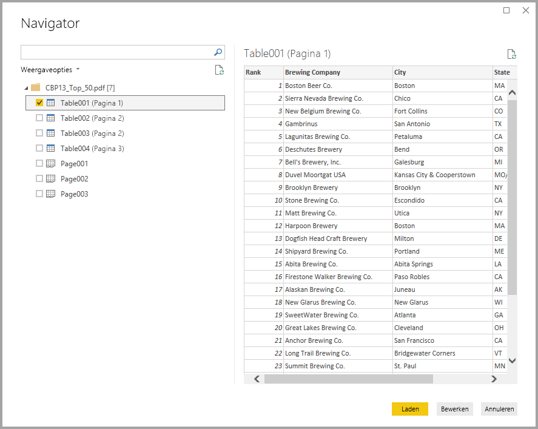
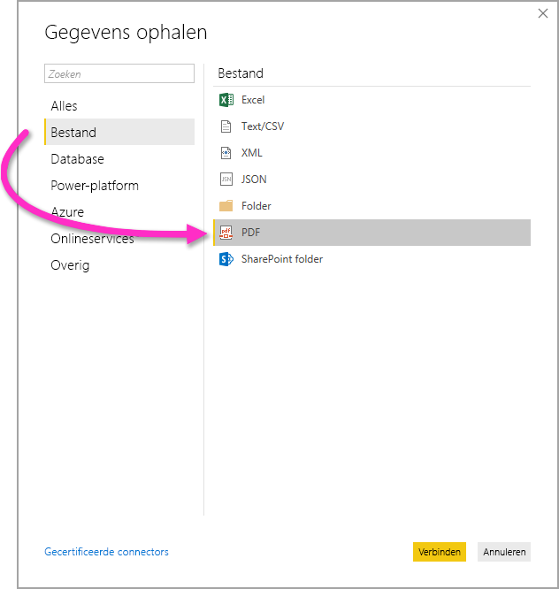

# Verbinding maken met PDF-bestanden in Power BI Desktop
In Power BI Desktop kunt u verbinding maken met een **PDF-bestand** en gebruikmaken van de opgenomen gegevens, net zoals elke andere gegevensbron in Power BI Desktop.

In de volgende secties wordt beschreven hoe u verbinding maakt met een **PDF-bestand**, gegevens selecteert en die gegevens overbrengt naar **Power BI Desktop**.

Het wordt altijd aanbevolen te upgraden naar de meest recente versie van **Power BI Desktop**, die u via een koppeling in [Power BI Desktop downloaden](../fundamentals/desktop-get-the-desktop.md) kunt krijgen. 

## Verbinding maken met een PDF-bestand
Als u verbinding wilt maken met een **PDF**-bestand, selecteert u **Gegevens ophalen** op het lint **Start** in Power BI Desktop. Selecteer **Bestand** in de categorieën aan de linkerkant en u ziet **PDF**.

U wordt gevraagd naar de locatie van het PDF-bestand dat u wilt gebruiken. Als u de bestandslocatie hebt opgegeven en het PDF-bestand wordt geladen, wordt een **Navigator**-scherm weergegeven waarin de gegevens van het bestand worden getoond. Hier kunt u een of meer elementen selecteren die u in **Power BI Desktop** wilt importeren en gebruiken.

Wanneer u een selectievakje naast gedetecteerde elementen in het PDF-bestand markeert, worden deze weergegeven in het rechterdeelvenster. Wanneer u klaar bent om te importeren, selecteert u de knop **Laden** om de gegevens in **Power BI Desktop** te laden.

Sinds de **Power BI Desktop**-versie van november 2018 kunt u de **Startpagina** en **Eindpagina** opgeven als optionele parameters voor uw pdf-bestand. U kunt deze parameters ook opgeven in de M-formuletaal. Maak daarbij gebruik van de volgende indeling:

`Pdf.Tables(File.Contents("c:\sample.pdf"), [StartPage=10, EndPage=11])`

## Beperkingen en overwegingen

Wanneer u werkt met de PDF-connector aan gegevenssets in een Premium-capaciteit, maakt de PDF-connector de verbinding niet op de juiste wijze. Als u de PDF-connector wilt inschakelen voor een gegevensset in een Premium-capaciteit, configureert u die gegevensset voor het gebruik van een gateway en bevestigt u dat de verbinding met die gegevensset via de gateway verloopt.  

## Volgende stappen
Met Power BI Desktop kunt u verbinding maken met allerlei andere gegevens. Bekijk de volgende bronnen voor meer informatie over gegevensbronnen:

* [Wat is Power BI Desktop?](../fundamentals/desktop-what-is-desktop.md)
* [Data Sources in Power BI Desktop](desktop-data-sources.md) (Gegevensbronnen in Power BI Desktop)
* [Shape and Combine Data with Power BI Desktop](desktop-shape-and-combine-data.md) (Gegevens vormgeven en combineren met Power BI Desktop)
* [Connect to Excel workbooks in Power BI Desktop](desktop-connect-excel.md) (Verbinding maken met Excel-werkmappen in Power BI Desktop)   
* [Enter data directly into Power BI Desktop](desktop-enter-data-directly-into-desktop.md) (Rechtstreeks gegevens in Power BI Desktop invoeren)   
