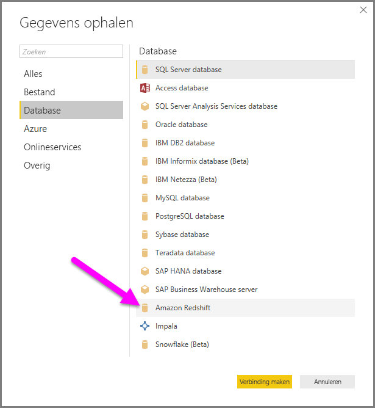
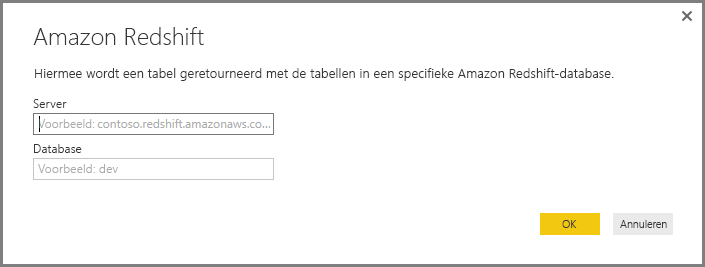
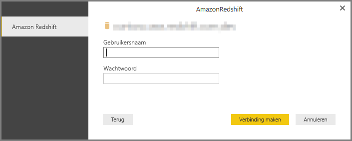
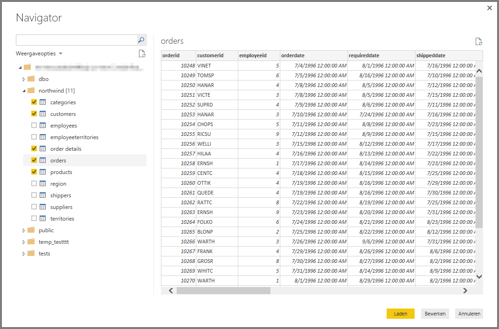

# Verbinding met een Amazon Redshift-database maken in Power BI Desktop
In **Power BI Desktop** kunt u verbinding maken met een **Amazon Redshift**-database en gebruikmaken van de onderliggende gegevens, net zoals elke andere gegevensbron in Power BI Desktop.

## Verbinding maken met een Amazon Redshift-database
Als u verbinding wilt maken met een **Amazon Redshift**-database, selecteert u **Gegevens ophalen** in het lint **Start** in Power BI Desktop. Selecteer **Database** in de categorieën aan de linkerkant en u ziet **Amazon Redshift**.

In het **Amazon Redshift**-venster dat verschijnt, typt of plakt u de naam van uw **Amazon Redshift**-server en -database in het vak. Als onderdeel van het veld *Server* kunnen gebruikers een poort opgeven met de volgende opmaak: *ServerURL:Port*

Voer uw gebruikersnaam en wachtwoord in als u daarom wordt gevraagd. U moet de servernaam gebruiken die precies overeenkomt met die in het SSL-certificaat; hiermee voorkomt u problemen. 

Als u verbinding hebt gemaakt, verschijnt er een **Navigator**-scherm waarin de gegevens worden getoond die op de server beschikbaar zijn. Hier kunt u een of meer elementen selecteren die u in **Power BI Desktop** wilt importeren en gebruiken.

Als u uw selecties in het venster **Navigator** hebt gemaakt, kunt u de gegevens **laden** of **bewerken**.

* Als u de gegevens wilt **laden**, wordt u gevraagd of u *Importeren* of *DirectQuery* wilt gebruiken om de gegevens te laden. Zie [dit artikel voor uitleg over DirectQuery](desktop-use-directquery.md) (Engelstalig) voor meer informatie.
* Als u **Bewerken** selecteert om de gegevens te bewerken, wordt **Query-editor** weergegeven. Hier kunt u allerlei transformaties en filters op de gegevens toepassen, waarvan vele worden toegepast op de onderliggende **Amazon Redshift**-database zelf (indien ondersteund).

## Volgende stappen
Met Power BI Desktop kunt u verbinding maken met allerlei andere gegevens. Bekijk de volgende bronnen voor meer informatie over gegevensbronnen:

* [Wat is Power BI Desktop?](../fundamentals/desktop-what-is-desktop.md)
* [Data Sources in Power BI Desktop](desktop-data-sources.md) (Gegevensbronnen in Power BI Desktop)
* [Shape and Combine Data with Power BI Desktop](desktop-shape-and-combine-data.md) (Gegevens vormgeven en combineren met Power BI Desktop)
* [Connect to Excel workbooks in Power BI Desktop](desktop-connect-excel.md) (Verbinding maken met Excel-werkmappen in Power BI Desktop)   
* [Enter data directly into Power BI Desktop](desktop-enter-data-directly-into-desktop.md) (Rechtstreeks gegevens in Power BI Desktop invoeren)   
