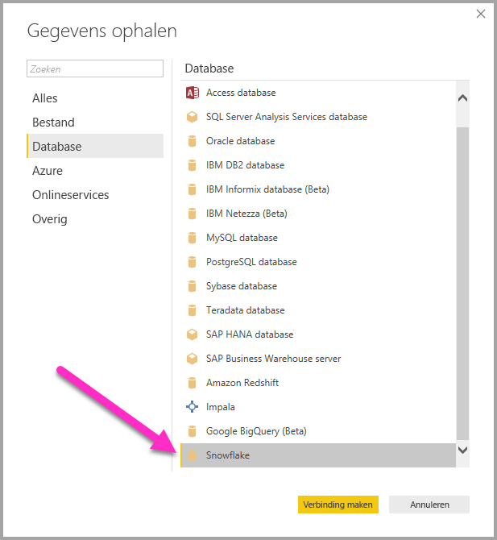
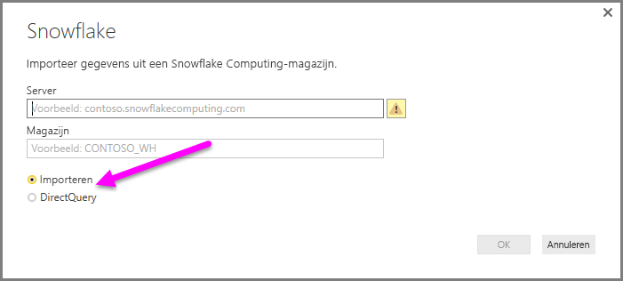
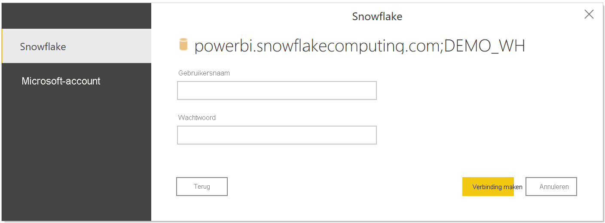
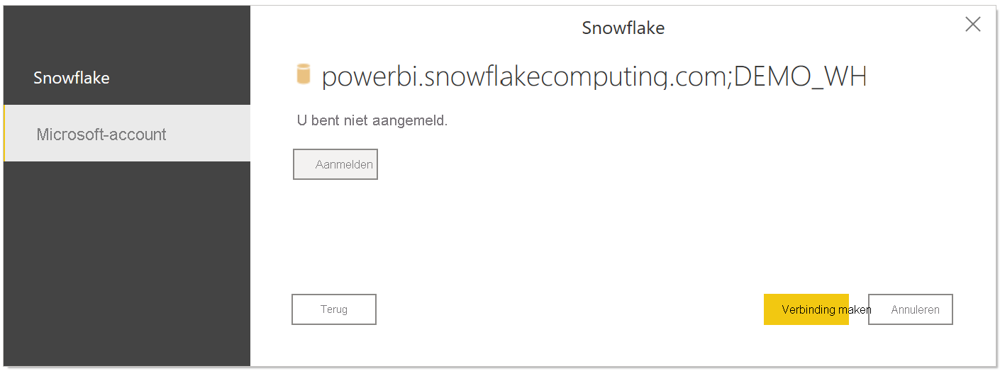
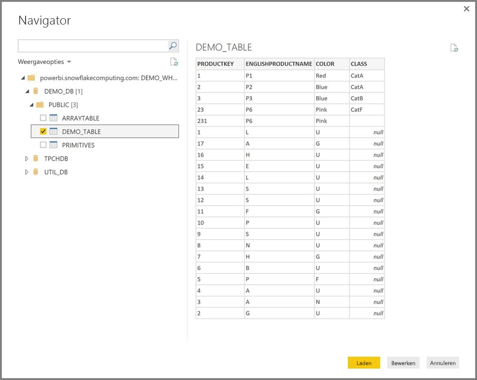

# Verbinding met een Snowflake Computing-magazijn maken in Power BI Desktop
In Power BI Desktop kunt u verbinding maken met een **Snowflake** Computing-magazijn en gebruikmaken van de onderliggende gegevens, net zoals elke andere gegevensbron in Power BI Desktop. 

## Verbinding maken met een Snowflake Computing-magazijn
Als u verbinding wilt maken met een **Snowflake** Computing-magazijn, selecteert u **Gegevens ophalen** in het lint **Start** in Power BI Desktop. Selecteer **Database** uit de categorieën aan de linkerkant en u ziet **Snowflake**.

In het venster **Snowflake** dat verschijnt, typt of plakt u de naam van het Snowflake Computing-magazijn in het vak en selecteert u **OK**. U kunt desgewenst de gegevens rechtstreeks **importeren** in Power BI. U kunt ook **DirectQuery** gebruiken. Over het [gebruik van DirectQuery](desktop-use-directquery.md) kunt u meer informatie vinden (Engelstalig). U ziet dat AAD SSO alleen DirectQuery ondersteunt.

Voer uw gebruikersnaam en wachtwoord in als u daarom wordt gevraagd.

> [!NOTE]
> Als u uw gebruikersnaam en wachtwoord voor een bepaalde **Snowflake**-server hebt ingevoerd, worden deze referenties gebruikt bij volgende pogingen verbinding te maken. U kunt de referenties wijzigen via **Bestand > Opties en instellingen > Instellingen voor gegevensbron**.
> 
> 

Als u de Microsoft-accountoptie wilt gebruiken, moet de integratie met Snowflake AAD worden geconfigureerd aan de kant van Snowflake. Lees hiervoor de sectie Aan de slag in de [Snowflake-documentatie over het onderwerp](https://docs.snowflake.net/manuals/user-guide/oauth-powerbi.html#power-bi-sso-to-snowflake).

Als u verbinding hebt gemaakt, verschijnt er een **Navigator**-scherm waarin de gegevens worden getoond die op de server beschikbaar zijn. Hier kunt u een of meer elementen selecteren die u in **Power BI Desktop** wilt importeren en gebruiken.

U kunt de geselecteerde tabel **laden**, waarna de hele tabel in **Power BI Desktop** wordt geladen. U kunt de query ook **bewerken**. Hiervoor wordt **Query Editor** geopend, zodat u de gewenste set gegevens kunt filteren en verfijnen, om deze verfijnde gegevensset vervolgens in **Power BI Desktop** te laden.

## Volgende stappen
Met Power BI Desktop kunt u verbinding maken met allerlei andere gegevens. Bekijk de volgende bronnen voor meer informatie over gegevensbronnen:

* [Wat is Power BI Desktop?](../fundamentals/desktop-what-is-desktop.md)
* [Data Sources in Power BI Desktop](desktop-data-sources.md) (Gegevensbronnen in Power BI Desktop)
* [Shape and Combine Data with Power BI Desktop](desktop-shape-and-combine-data.md) (Gegevens vormgeven en combineren met Power BI Desktop)
* [Connect to Excel workbooks in Power BI Desktop](desktop-connect-excel.md) (Verbinding maken met Excel-werkmappen in Power BI Desktop)   
* [Enter data directly into Power BI Desktop](desktop-enter-data-directly-into-desktop.md) (Rechtstreeks gegevens in Power BI Desktop invoeren)   
