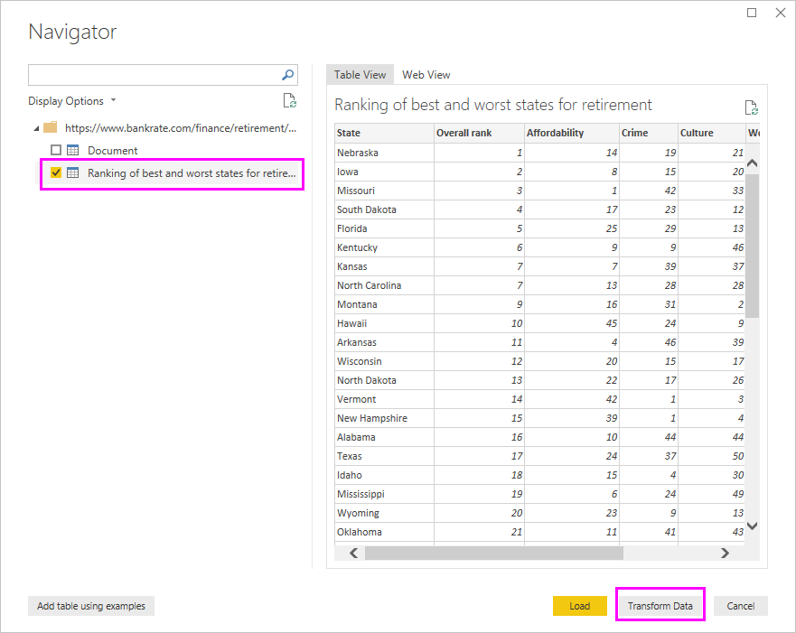
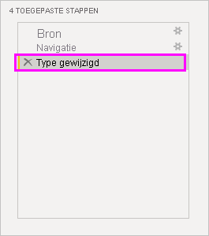
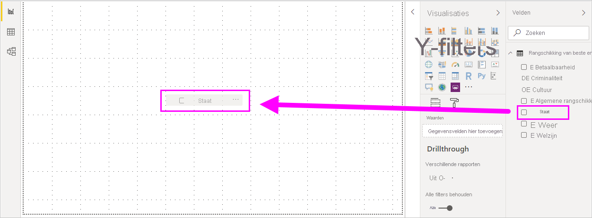
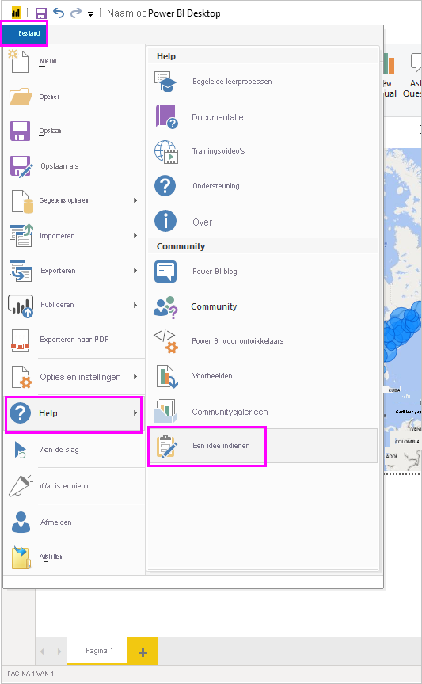

# Verbinding maken met gegevensbronnen in Power BI Desktop

Met Power BI Desktop kunt u eenvoudig verbinding maken met de zich almaar uitbreidende wereld van gegevens. Als u niet beschikt over Power BI Desktop, kunt u het [downloaden](https://go.microsoft.com/fwlink/?LinkID=521662) en installeren.

In Power BI Desktop zijn *allerlei verschillende* gegevensbronnen beschikbaar. In de volgende afbeelding ziet u hoe u verbinding met gegevens maakt door **Gegevens ophalen** > **Overig** > **Internet** te selecteren.

## Voorbeeld van het verbinding maken met gegevens

In dit voorbeeld maken we verbinding met een gegevensbron op het **web**.

Stel dat u met pensioen gaat. U verlangt naar veel zon, lage belastingen en goede zorg. of... u bent een gegevensanalist en u wilt deze informatie om uw klanten te helpen, bijvoorbeeld om een fabrikant van regenjassen verkoopdoelen te laten behalen op een plek waar het *veel* regent.

Hoe dan ook, u vindt een bron op het web met interessante gegevens over onder meer deze onderwerpen:

[https://www.bankrate.com/finance/retirement/best-places-retire-how-state-ranks.aspx](https://www.bankrate.com/finance/retirement/best-places-retire-how-state-ranks.aspx)

Selecteer **Gegevens ophalen** > **Overig** > **Internet**. Voer in **Vanuit internet** het adres in.

Als u **OK** selecteert, gaat de *Query*-functionaliteit van Power BI Desktop aan de slag. Er wordt contact opgenomen met de webbron en in het venster **Navigator** worden de resultaten geretourneerd die op deze website zijn gevonden. In dit geval zijn een tabel en het hele document gevonden. We zijn alleen geïnteresseerd in de tabel, dus we selecteren die in de lijst. In het venster **Navigator** wordt een voorbeeld weergegeven.

Nu kunt u de query bewerken voordat u de tabel laadt. Selecteer hiervoor **Gegevens transformeren** onderaan het venster of laadt de tabel.

Selecteer **Gegevens transformeren** om de tabel te laden en Power Query-editor te starten. Het deelvenster **Query-instellingen** wordt weergegeven. Als dat niet het geval is, selecteert u **Weergave** op het lint en vervolgens **Query-instellingen** om het deelvenster **Query-instellingen** weer te geven. Het geheel ziet er als volgt uit.

De vermeldingen tekst willen we omzetten in getallen. Geen probleem. U hoeft alleen met de rechtermuisknop op de kolomkop te klikken en **Type wijzigen**  > **Geheel getal** te selecteren om ze om te zetten. Als u meer dan één kolom wilt selecteren, selecteert u eerst een kolom en houdt u Shift ingedrukt, selecteert u extra aangrenzende kolommen en klikt u vervolgens met de rechtermuisknop op een kolomkop om alle geselecteerde kolommen te wijzigen. Gebruik Ctrl als u kolommen wilt kiezen die niet aangrenzend zijn.

In **Queryinstellingen** wordt onder **TOEGEPASTE STAPPEN** aangegeven of er wijzigingen zijn aangebracht. Terwijl u aanvullende wijzigingen aan de gegevens aanbrengt, worden de wijzigingen in de sectie **TOEGEPASTE STAPPEN** geregistreerd, waar u ze nog eens kunt bekijken, aanpassen, herschikken of verwijderen.

Nadat de gegevens zijn geladen kunt u nog steeds wijzigingen aan de tabel aanbrengen, maar voorlopig is dit voldoende. Selecteer **Sluiten en toepassen** in het lint **Start** wanneer u klaar bent. De wijzigingen worden toegepast en Power Query-editor wordt afgesloten.

Als het gegevensmodel is geladen, kunnen we in de **rapportweergave** in Power BI Desktop visuele elementen gaan maken door velden naar het canvas te slepen.

Dit is uiteraard slechts een eenvoudig model met één gegevensverbinding. De meeste Power BI Desktop-rapporten hebben verbindingen naar verschillende gegevensbronnen die aan uw wensen zijn aangepast en met relaties die een uitgebreid gegevensmodel produceren.

## Volgende stappen
U kunt allerlei handelingen uitvoeren met Power BI Desktop. Bekijk de volgende bronnen voor meer informatie over de vele mogelijkheden:

* [Wat is Power BI Desktop?](../fundamentals/desktop-what-is-desktop.md)
* [Query-editor in Power BI Desktop gebruiken](../transform-model/desktop-query-overview.md)
* [Gegevensbronnen in Power BI Desktop](desktop-data-sources.md)
* [Gegevens vormgeven en combineren in Power BI Desktop](desktop-shape-and-combine-data.md)
* [Algemene querytaken uitvoeren in Power BI Desktop](../transform-model/desktop-common-query-tasks.md)   

Wilt u feedback geven? Mooi! Gebruik het menu-item **Een idee indienen** in Power BI Desktop of ga naar [Feedback van de community](https://community.powerbi.com/t5/Community-Feedback/bd-p/community-feedback). We horen graag van u!

