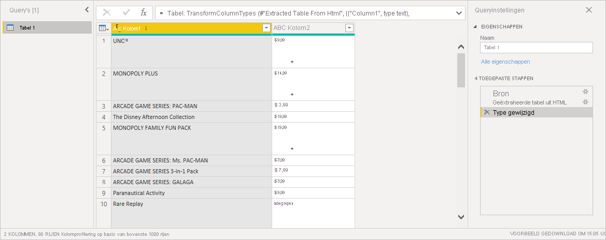

# Webpaginagegevens ophalen door voorbeelden te geven

Door gegevens van een webpagina op te halen, kunnen gebruikers eenvoudig gegevens van webpagina's extraheren en die gegevens importeren in *Power BI Desktop*. Gegevens op webpagina's bevinden zich echter vaak niet in nette tabellen die gemakkelijk kunnen worden geëxtraheerd. Het ophalen van gegevens van dergelijke pagina's kan lastig zijn, zelfs als de gegevens zijn gestructureerd en consistent zijn.

Maar er is een oplossing. Met de functie *Gegevens van web ophalen met een voorbeeld* kunt u Power BI Desktop in feite laten zien welke gegevens u wilt extraheren. Hiervoor geeft u in het dialoogvenster van de connector een of meer voorbeelden op. Power BI Desktop verzamelt andere gegevens op de pagina die overeenkomen met uw voorbeelden. Met deze oplossing kunt u allerlei soorten gegevens van wegpagina's extraheren, waaronder gegevens in tabellen *en* gegevens die zich niet in tabellen bevinden.

Prijzen in afbeeldingen zijn alleen bedoeld als voorbeeld.

## Gegevens ophalen van web met een voorbeeld gebruiken

Selecteer **Gegevens ophalen** in het lintmenu **Start**. Selecteer in het dialoogvenster dat wordt weergegeven **Overig** in de categorieën in het linkerdeelvenster en selecteer vervolgens **Web**. Klik op **Verbinden** om door te gaan.

Voer onder **Van web** de URL in van de webpagina waarvan u gegevens wilt extraheren. In dit artikel wordt de webpagina van Microsoft Store gebruikt en wordt uitgelegd hoe deze connector werkt.

Als u het voorbeeld in het artikel wilt volgen, kunt u de [URL van de Microsoft Store](https://www.microsoft.com/store/top-paid/games/xbox?category=classics) gebruiken die we in dit artikel gebruiken:

    https://www.microsoft.com/store/top-paid/games/xbox?category=classics

Wanneer u **OK** selecteert, wordt het dialoogvenster **Navigator** geopend, waarin de automatisch gedetecteerde tabellen van de webpagina worden weergegeven. In het geval dat in de onderstaande afbeelding wordt weergegeven, zijn er geen tabellen gevonden. Selecteer **Tabel toevoegen met voorbeelden** om voorbeelden te geven.

**Tabel toevoegen met voorbeelden** toont een interactief venster waarin u de inhoud van de webpagina kunt bekijken. Voer voorbeeldwaarden in van de gegevens die u wilt extraheren.

In dit voorbeeld extraheren we de *naam* en de *prijs* voor alle games op de pagina. We kunnen dit doen door voor elke kolom een aantal voorbeelden van de pagina op te geven. Terwijl u voorbeelden invoert, extraheert *Power Query* met behulp van slimme algoritmen voor gegevensextractie gegevens die passen bij het patroon van de voorbeeldregels.

> [!NOTE]
> Waardesuggesties bevatten alleen waarden die maximaal 128 tekens lang zijn.

Als u tevreden bent met de gegevens die van de webpagina zijn geëxtraheerd, selecteert u **OK** om naar Power Query-editor te gaan. U kunt meer transformaties toepassen of de gegevens vormgeven, zoals het combineren van deze gegevens met andere gegevensbronnen.

Hier kunt u visuals maken of de webpaginagegevens op een andere manier gebruiken tijdens het maken van uw Power BI Desktop-rapporten.

## Volgende stappen

Met Power BI Desktop kunt u verbinding maken met allerlei andere gegevens. Bekijk de volgende bronnen voor meer informatie over gegevensbronnen:

* [Add a column from an example in Power BI Desktop](../create-reports/desktop-add-column-from-example.md) (Een kolom uit een voorbeeld toevoegen in Power BI Desktop)
* [Verbinding met webpagina's maken vanuit Power BI Desktop](desktop-connect-to-web.md)
* [Gegevensbronnen in Power BI Desktop](desktop-data-sources.md)
* [Gegevens vormgeven en combineren in Power BI Desktop](desktop-shape-and-combine-data.md)
* [Connect to Excel workbooks in Power BI Desktop](desktop-connect-excel.md) (Verbinding maken met Excel-werkmappen in Power BI Desktop)
* [Connect to CSV files in Power BI Desktop](desktop-connect-csv.md) (Verbinding met CSV-bestanden maken in Power BI Desktop)
* [Enter data directly into Power BI Desktop](desktop-enter-data-directly-into-desktop.md) (Rechtstreeks gegevens in Power BI Desktop invoeren)
