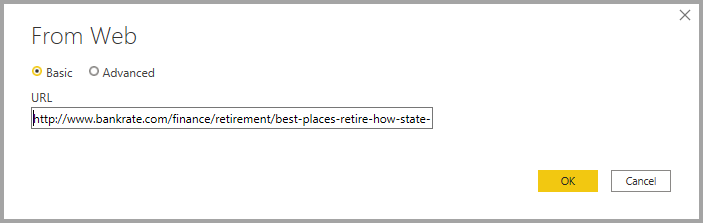
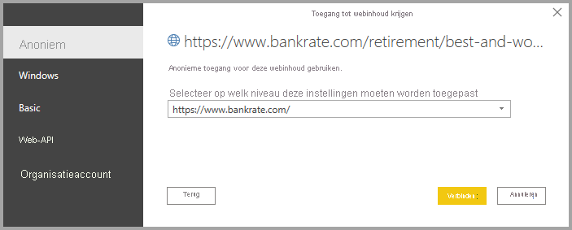

# Verbinding met webpagina's maken vanuit Power BI Desktop

U kunt verbinding maken met een webpagina en de gegevens in Power BI Desktop importeren voor gebruik in uw visuals en gegevensmodellen.

In Power BI Desktop selecteert u op het lint **Start** de opties **Gegevens ophalen > Web**.

Er wordt een dialoogvenster weergegeven, waarin wordt gevraagd om de URL van de webpagina van waaruit u gegevens wilt importeren.

Als u de URL hebt getypt (of geplakt), selecteert u **OK**. Vervolgens moet u opgeven hoe u toegang wilt krijgen tot de webinhoud.

Er wordt verbinding gemaakt met de webpagina en de gegevens op die pagina worden vervolgens in het venster **Navigator** gepresenteerd. Wanneer u een van de beschikbare gegevenselementen selecteert, bijvoorbeeld een tabel van de hele pagina, wordt aan de rechterkant van het venster **Navigator** een voorbeeld van die gegevens weergegeven.

U kunt de knop **Gegevens transformeren** kiezen, waarmee **Query-editor** wordt gestart. Hierin kunt u de gegevens van die webpagina vormgeven en transformeren voordat u ze in Power BI Desktop importeert. U kunt ook de knop **Laden** selecteren en alle gegevenselementen importeren die u in het linker deelvenster hebt geselecteerd.

Als **Laden** wordt geselecteerd, worden de geselecteerde items geïmporteerd en beschikbaar gemaakt in het deelvenster **Velden** aan de rechterkant van de weergave Rapporten in Power BI Desktop.

Meer hoeft u niet te doen om verbinding te maken met een webpagina en de gegevens in Power BI Desktop te importeren.

Hier kunt u de velden naar het rapportcanvas slepen en alle visuele elementen maken die u wilt. U kunt de gegevens van de webpagina ook gebruiken net als alle andere gegevens. U kunt ze vormgeven, relaties maken tussen deze gegevens en andere gegevensbronnen in uw gegevensmodel, en verder doen wat u wilt om een Power BI-rapport naar wens te maken.

Kijk eens in de [handleiding voor Power BI Desktop](../fundamentals/desktop-getting-started.md) (Engelstalig) voor meer informatie over het verbinding maken met een webpagina.

## Controle van certificaatintrekking

Power BI past beveiliging toe voor webverbindingen om uw gegevens te beveiligen. In sommige scenario's, zoals het vastleggen van webaanvragen met Fiddler, werken webverbindingen mogelijk niet goed. Voor dergelijke scenario's kunt u de optie **Controle van certificaatintrekking inschakelen** in Power BI Desktop uitschakelen en Power BI Desktop opnieuw opstarten. 

Als u deze optie wilt wijzigen, selecteert u **Bestand > Opties** en selecteert u vervolgens **Beveiliging** in het linkerdeelvenster. In de volgende afbeelding wordt het selectievakje weergegeven. Als u het selectievakje uitschakelt, worden webverbindingen minder veilig. 

## Volgende stappen
Met Power BI Desktop kunt u verbinding maken met allerlei andere gegevens. Bekijk de volgende bronnen voor meer informatie over gegevensbronnen:

* [Data Sources in Power BI Desktop](desktop-data-sources.md) (Gegevensbronnen in Power BI Desktop)
* [Shape and Combine Data with Power BI Desktop](desktop-shape-and-combine-data.md) (Gegevens vormgeven en combineren met Power BI Desktop)
* [Connect to Excel workbooks in Power BI Desktop](desktop-connect-excel.md) (Verbinding maken met Excel-werkmappen in Power BI Desktop)   
* [Connect to CSV files in Power BI Desktop](desktop-connect-csv.md) (Verbinding met CSV-bestanden maken in Power BI Desktop)   
* [Enter data directly into Power BI Desktop](desktop-enter-data-directly-into-desktop.md) (Rechtstreeks gegevens in Power BI Desktop invoeren)   
