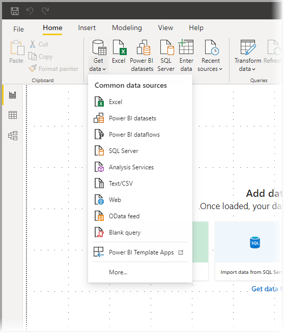
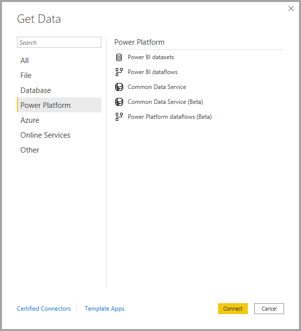

# <a name="data-sources-in-power-bi-desktop"></a>Gegevensbronnen in Power BI Desktop

Met Power BI Desktop kunt u verbinding maken met gegevens uit veel verschillende bronnen. Zie [Power BI-gegevensbronnen](power-bi-data-sources.md) voor een volledige lijst met beschikbare gegevensbronnen.

U maakt verbinding met gegevens met behulp van het lint **Start**. Als u het menu **Meest voorkomend** met gegevenstypen wilt weergeven, selecteert u het knoplabel of de pijl omlaag van **Gegevens ophalen**.



Als u naar het dialoogvenster **Gegevens ophalen** wilt gaan, geeft u het menu **Meest voorkomend** met gegevenstypen weer en selecteert u **Meer**. U kunt het dialoogvenster **Gegevens ophalen** ook weergeven (en het menu **Meest voorkomend** omzeilen) door het pictogram **Gegevens ophalen** rechtstreeks te selecteren.


> [!NOTE]
> Het Power BI-team breidt de beschikbare gegevensbronnen voor Power BI Desktop en de Power BI-service voortdurend uit. Daarom ziet u vaak vroege versies van gegevensbronnen waaraan wordt gewerkt en die worden aangeduid als **bèta** of **preview**. Een gegevensbron die is gemarkeerd als **bèta** of **preview**, heeft beperkte ondersteuning en functionaliteit en dient niet te worden gebruikt in een productieomgeving. Daarnaast is het mogelijk dat gegevensbronnen die als **bèta** of **preview** voor Power BI Desktop zijn gemarkeerd, pas beschikbaar zijn voor gebruik in de Power BI-service of in andere Microsoft-services als de gegevensbron algemeen beschikbaar is.

> [!NOTE]
> Voor veel gegevensconnectors in Power BI Desktop is Internet Explorer 10 (of nieuwer) vereist voor verificatie. 


## <a name="data-sources"></a>Gegevensbronnen

In het dialoogvenster **Gegevens ophalen** zijn gegevenstypen ingedeeld in de volgende categorieën:

* Alles
* Bestand
* Database
* Power Platform
* Azure
* Onlineservices
* Overige

De categorie **Alle** omvat alle gegevenstypen uit alle categorieën.

### <a name="file-data-sources"></a>Bestandsgegevensbronnen

De categorie **Bestand** biedt de volgende gegevensverbindingen:

* Excel
* Tekst/CSV
* XML
* JSON
* Map
* PDF
* SharePoint-map

In de volgende afbeelding ziet u het venster **Gegevens ophalen** voor **Bestand**.


### <a name="database-data-sources"></a>Databasegegevensbronnen

De categorie **Database** biedt de volgende gegevensverbindingen:

* SQL Server-database
* Access-database
* SQL Server Analysis Services-database
* Oracle-database
* IBM DB2-database
* IBM Informix-database (bèta)
* IBM Netezza
* MySQL-database
* PostgreSQL-database
* Sybase-database
* Teradata-database
* SAP HANA-database
* SAP Business Warehouse-toepassingsserver
* SAP Business Warehouse-berichtenserver
* Amazon Redshift
* Impala
* Google BigQuery
* Vertica
* Snowflake
* Essbase
* AtScale-kubussen
* BI-connector 
* Data Virtuality LDW (bèta)
* Denodo
* Dremio
* Exasol
* Indexima (bèta)
* InterSystems IRIS (bèta)
* Jethro (bèta)
* Kyligence
* MarkLogic

> [!NOTE]
> Sommige databaseconnectors moet u eerst inschakelen door **Bestand > Opties en instellingen > Opties** te selecteren en vervolgens **Voorbeeldfuncties** en de connector in te schakelen. Als u geen van de hierboven genoemde connectors ziet en ze wel wilt gebruiken, controleert u de instellingen voor **Voorbeeldfuncties**. Houd er ook rekening mee dat een gegevensbron die wordt gemarkeerd als *bèta* of *preview*, beperkte ondersteuning en functionaliteit heeft en niet dient te worden gebruikt in een productieomgeving.

In de volgende afbeelding ziet u het venster **Gegevens ophalen** voor **Database**.


### <a name="power-platform-data-sources"></a>Power Platform-gegevensbronnen

De categorie **Power Platform** biedt de volgende gegevensverbindingen:

* Power BI-gegevenssets
* Power BI-gegevensstromen
* Common Data Service
* Power Platform-gegevensstromen

In de volgende afbeelding ziet u het venster **Gegevens ophalen** voor **Power Platform**.



### <a name="azure-data-sources"></a>Azure-gegevensbronnen

De categorie **Azure** biedt de volgende gegevensverbindingen:

* Azure SQL-database
* Azure SQL Data Warehouse
* Microsoft Azure Analysis Services-database
* Azure Database for PostgreSQL
* Azure Blob Storage
* Azure Table Storage
* Azure Cosmos DB
* Azure Data Lake Storage Gen2
* Azure Data Lake Storage Gen1
* Azure HDInsight (HDFS)
* Azure HDInsight Spark
* HDInsight Interactive Query
* Azure Data Explorer (Kusto)
* Azure Cost Management


In de volgende afbeelding ziet u het venster **Gegevens ophalen** voor **Azure**.


### <a name="online-services-data-sources"></a>Gegevensbronnen voor onlineservices

De categorie **Onlineservices** biedt de volgende gegevensverbindingen:

* SharePoint Online-lijst
* Microsoft Exchange Online
* Dynamics 365 (online)
* Dynamics NAV
* Dynamics 365 Business Central
* Dynamics 365 Business Central (on-premises)
* Microsoft Azure Consumption Insights (bèta)
* Azure DevOps (alleen Boards)
* Azure DevOps Server (alleen Boards)
* Salesforce-objecten
* Salesforce-rapporten
* Google Analytics
* Adobe Analytics
* appFigures (bèta)
* Data.World - Gegevensset ophalen (bèta)
* GitHub (bèta)
* LinkedIn Sales Navigator (bèta)
* Marketo (bèta)
* Mixpanel (bèta)
* Planview Enterprise One - PRM (bèta)
* Planview Projectplace (bèta)
* QuickBooks Online (bèta)
* Smartsheet
* SparkPost (bèta)
* SweetIQ (bèta)
* Planview Enterprise One - CMT (bèta)
* Twilio (bèta)
* tyGraph (bèta)
* Webtrends (bèta)
* Zendesk (bèta)
* Asana (bèta)
* Dynamics 365 Customer Insights (Bèta)
* Emigo Data Source
* Entersoft Business Suite (bèta)
* FactSet Analytics (bèta)
* Industrial App Store
* Intune Data Warehouse (bèta)
* Microsoft Graph Security (bèta)
* Product Insights (bèta)
* Quick Base
* TeamDesk (bèta)
* Workplace Analytics (bèta)
* Projectplace voor Power BI (bèta)
* Webtrends Analytics (bèta)
* Zoho Creator (bèta)

In de volgende afbeelding ziet u het venster **Gegevens ophalen** voor **Onlineservices**.


### <a name="other-data-sources"></a>Andere gegevensbronnen

De categorie **Overige** biedt de volgende gegevensverbindingen:

* Web
* SharePoint-lijst
* OData-feed
* Active Directory
* Microsoft Exchange
* Hadoop-bestand (HDFS)
* Spark
* Hive LLAP (bèta)
* R-script
* Python-script
* ODBC
* OLE DB
* BI360 - Budgeting & Financial Reporting (bèta)
* Cognite Data Fusion (bèta)
* FHIR
* Information Grid (bèta)
* Jamf Pro (bèta)
* MicroStrategie voor Power BI
* Paxata
* QubolePresto (bèta)
* Roamler (bèta)
* Siteimprove
* SurveyMonkey (bèta)
* TIBCO (R) Data Virtualization (bèta)
* Vena (bèta)
* Workforce Dimensions (bèta)
* Zucchetti HR Infinity (bèta)
* Tenforce (Smart)List
* Short Cuts Business Insights (bèta)
* Vessel Insight (bèta)
* Lege query

In de volgende afbeelding ziet u het venster **Gegevens ophalen** voor **Overige**.


> [!NOTE]
> Op dit moment is het niet mogelijk om verbinding te maken met aangepaste gegevensbronnen die zijn beveiligd met Azure Active Directory.

## <a name="connecting-to-a-data-source"></a>Verbinding maken met een gegevensbron

Als u verbinding wilt maken met een gegevensbron, selecteert u de gegevensbron in het venster **Gegevens ophalen** en selecteert u **Verbinding maken**. In de volgende afbeelding is **Web** geselecteerd in de categorie **Overige**.


Er wordt een verbindingsvenster weergegeven dat specifiek is voor het type gegevensverbinding. Als referenties zijn vereist, wordt u gevraagd ze op te geven. In de volgende afbeelding ziet u hoe een URL wordt ingevoerd om verbinding te maken met een webgegevensbron.


Voer de URL of de gegevens voor de bronverbinding in en selecteer **OK**. Power BI Desktop maakt de verbinding met de gegevensbron en toont de beschikbare gegevensbronnen in de **Navigator**.


Kies de knop **Laden** onder in het deelvenster van de **Navigator** om de gegevens te laden. Als u de query wilt transformeren of bewerken in Power Query-editor voordat u de gegevens laadt, selecteert u de knop **Gegevens transformeren**.

Dat is alles wat u hoeft te weten om verbinding te maken met gegevensbronnen in Power BI Desktop! Probeer verbinding te maken met onze groeiende lijst gegevensbronnen en kom regelmatig terug. We blijven deze lijst voortdurend uitbreiden.

## <a name="using-pbids-files-to-get-data"></a>Gegevens ophalen met behulp van PBIDS-bestanden

PBIDS-bestanden zijn Power BI Desktop-bestanden die een specifieke structuur hebben, samen met een PBIDS-extensie om aan te geven dat het een Power BI-gegevensbronbestand betreft.

U kunt een PBIDS-bestand maken om de ervaring met **Gegevens ophalen** te stroomlijnen voor rapportontwerpers in uw organisatie. We raden aan dat deze bestanden voor veelgebruikte verbindingen door een beheerder worden gemaakt, zodat een nieuwe rapportauteur PBIDS-bestanden eenvoudiger kan gebruiken.

Wanneer een auteur een PBIDS-bestand opent, wordt Power BI Desktop geopend en wordt de gebruiker gevraagd om referenties te verifiëren en verbinding te maken met de gegevensbron die in het bestand is opgegeven. Het dialoogvenster **Navigatie** wordt weergegeven en de gebruiker moet de tabellen van die gegevensbron selecteren om in het model te laden. Gebruikers moeten mogelijk ook de database(s) selecteren als er geen is opgegeven in het PBIDS-bestand.

Vanaf dat moment kan de gebruiker beginnen met het samenstellen van visualisaties of **Recente bronnen** selecteren om een nieuwe groep tabellen in het model te laden.

Momenteel ondersteunen PBIDS-bestanden slechts één gegevensbron in één bestand. Als u meer dan één gegevensbron opgeeft, resulteert dat in een fout.

Voor het maken van het PBIDS-bestand moet een beheerder de vereiste invoer voor een enkele verbinding opgeven. De beheerder kan ook de verbindingsmodus opgeven als DirectQuery of Importeren. Als **mode** ontbreekt/null is in het bestand, wordt de gebruiker die het bestand opent in Power BI Desktop gevraagd om **DirectQuery** of **Importeren** te selecteren.

### <a name="pbids-file-examples"></a>Voorbeelden van PBIDS-bestanden

Deze sectie bevat enkele voorbeelden van veelgebruikte gegevensbronnen. Dit PBIDS-bestandstype ondersteunt alleen gegevensverbindingen die ook worden ondersteund in Power BI Desktop, met twee uitzonderingen: Live Connect en lege query.

Dit PBIDS-bestand bevat *geen* verificatie-informatie en tabel- en schema-informatie.  

De volgende codefragmenten tonen enkele algemene voorbeelden voor PBIDS-bestanden. Ze zijn echter niet volledig of allesomvattend. Voor andere gegevensbronnen kunt u verwijzen naar de [DSR-indeling (Data Source Reference) voor protocol- en adresgegevens ](https://docs.microsoft.com/azure/data-catalog/data-catalog-dsr#data-source-reference-specification).

Deze voorbeelden zijn alleen bedoeld voor het gemak. Ze zijn niet volledig en bevatten niet alle ondersteunde connectors in DSR-indeling. Beheerders of organisaties kunnen hun eigen gegevensbronnen definiëren aan de hand van deze voorbeelden, zodat ze hun eigen gegevensbronbestanden kunnen maken en ondersteunen.

#### <a name="azure-as"></a>Azure AS

```json
{ 
    "version": "0.1", 
    "connections": [ 
    { 
        "details": { 
        "protocol": "analysis-services", 
        "address": { 
            "server": "server-here" 
        }, 
        } 
    } 
    ] 
}
```

#### <a name="folder"></a>Map

```json
{ 
  "version": "0.1", 
  "connections": [ 
    { 
      "details": { 
        "protocol": "folder", 
        "address": { 
            "path": "folder-path-here" 
        } 
      } 
    } 
  ] 
} 
```

#### <a name="odata"></a>OData

```json
{ 
  "version": "0.1", 
  "connections": [ 
    { 
      "details": { 
        "protocol": "odata", 
        "address": { 
            "url": "URL-here" 
        } 
      } 
    } 
  ] 
} 
```

#### <a name="sap-bw"></a>SAP BW

```json
{ 
  "version": "0.1", 
  "connections": [ 
    { 
      "details": { 
        "protocol": "sap-bw-olap", 
        "address": { 
          "server": "server-name-here", 
          "systemNumber": "system-number-here", 
          "clientId": "client-id-here" 
        }, 
      } 
    } 
  ] 
} 
```

#### <a name="sap-hana"></a>SAP Hana

```json
{ 
  "version": "0.1", 
  "connections": [ 
    { 
      "details": { 
        "protocol": "sap-hana-sql", 
        "address": { 
          "server": "server-name-here:port-here" 
        }, 
      } 
    } 
  ] 
} 
```

#### <a name="sharepoint-list"></a>SharePoint-lijst

De URL moet verwijzen naar de SharePoint-site zelf, niet naar een lijst binnen de site. Gebruikers krijgen een navigator waarmee ze een of meer lijsten op die site kunnen selecteren, waarbij elk van die lijsten een tabel in het model wordt.

```json
{ 
  "version": "0.1", 
  "connections": [ 
    { 
      "details": { 
        "protocol": "sharepoint-list", 
        "address": { 
          "url": "URL-here" 
        }, 
       } 
    } 
  ] 
} 
```

#### <a name="sql-server"></a>SQL Server

```json
{ 
  "version": "0.1", 
  "connections": [ 
    { 
      "details": { 
        "protocol": "tds", 
        "address": { 
          "server": "server-name-here", 
          "database": "db-name-here (optional) "
        } 
      }, 
      "options": {}, 
      "mode": "DirectQuery" 
    } 
  ] 
} 
```

#### <a name="text-file"></a>Tekstbestand

```json
{ 
  "version": "0.1", 
  "connections": [ 
    { 
      "details": { 
        "protocol": "file", 
        "address": { 
            "path": "path-here" 
        } 
      } 
    } 
  ] 
} 
```

#### <a name="web"></a>Web

```json
{ 
  "version": "0.1", 
  "connections": [ 
    { 
      "details": { 
        "protocol": "http", 
        "address": { 
            "url": "URL-here" 
        } 
      } 
    } 
  ] 
} 
```

#### <a name="dataflow"></a>Gegevensstroom

```json
{
  "version": "0.1",
  "connections": [
    {
      "details": {
        "protocol": "powerbi-dataflows",
        "address": {
          "workspace":"workspace id (Guid)",
          "dataflow":"optional dataflow id (Guid)",
          "entity":"optional entity name"
        }
       }
    }
  ]
}
```

## <a name="next-steps"></a>Volgende stappen

U kunt allerlei handelingen uitvoeren met Power BI Desktop. Bekijk de volgende bronnen voor meer informatie over de vele mogelijkheden:

* [Wat is Power BI Desktop?](../fundamentals/desktop-what-is-desktop.md)
* [Query-overzicht met Power BI Desktop](../transform-model/desktop-query-overview.md)
* [Gegevenstypen in Power BI Desktop](desktop-data-types.md)
* [Gegevens vormgeven en combineren met Power BI Desktop](desktop-shape-and-combine-data.md)
* [Algemene querytaken in Power BI Desktop](../transform-model/desktop-common-query-tasks.md)
