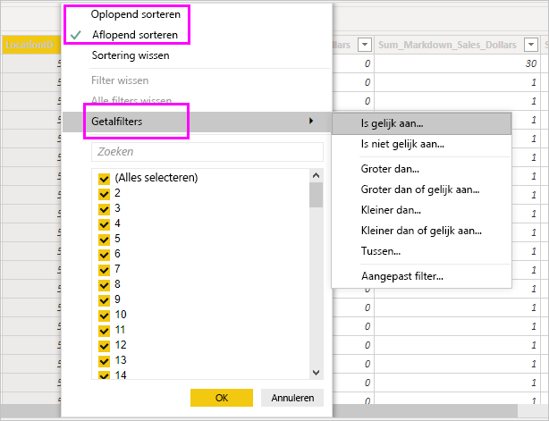

# Werken met de gegevensweergave in Power BI Desktop

De *gegevensweergave* helpt u bij het controleren, onderzoeken en begrijpen van gegevens in uw *Power BI Desktop*-model. Het verschilt van de manier waarop u tabellen, kolommen en gegevens in de *Power Query-editor* bekijkt. In de gegevensweergave bekijkt u gegevens *nadat* deze in het model zijn geladen.

> [!NOTE]
> Omdat de gegevensweergave gegevens toont nadat deze in het model zijn geladen, is het gegevensweergavepictogram niet zichtbaar als alle gegevensbronnen zijn gebaseerd op DirectQuery. 

Wanneer u een gegevensmodel maakt, wilt u soms zien wat een tabel of kolom nu echt bevat zonder een visual te maken op het rapportcanvas. Mogelijk wilt u helemaal tot op rijniveau kijken. Deze mogelijkheid is vooral handig wanneer u metingen en berekende kolommen maakt of als u een gegevenstype of gegevenscategorie moet identificeren.

Laten we enkele van de elementen uit de gegevensweergave nader bekijken.

1. **Het pictogram Gegevensweergave**. Selecteer dit pictogram om de gegevensweergave te openen.

2. **Gegevensraster**. Dit gebied geeft de geselecteerde tabel en alle kolommen en rijen die deze bevat weer. Kolommen die zijn verborgen in het *rapport* worden grijs weergegeven. U kunt met de rechtermuisknop op een kolom klikken voor opties.

3. **Het lint Model maken**. Hier kunt u relaties beheren, berekeningen maken, en het gegevenstype, de indeling en de gegevenscategorie voor een kolom wijzigen.

4. **Formulebalk**. Hier kunt u DAX-formules (Data Analysis Expression) invoeren voor metingen en berekende kolommen.

5. **Zoeken**. Gebruik deze functie om een tabel of kolom te zoeken in het model.

6. **Lijst met velden**. Hier kunt u een tabel of kolom selecteren om weer te geven in het gegevensraster.

## Filteren in de gegevensweergave

U kunt in de gegevensweergave ook filteren op gegevens en gegevens sorteren. Elke kolom bevat een pictogram waarmee de sorteerrichting wordt geïdentificeerd, indien toegepast.

U kunt op afzonderlijke waarden filteren of geavanceerde filters gebruiken op basis van de gegevens in de kolom.

> [!NOTE]
> Als u een Power BI-model maakt voor een andere cultuur dan die van uw huidige gebruikersinterface, wordt het zoekvak in de gebruikersinterface Gegevensweergave alleen weergegeven voor tekstvelden. Dit is bijvoorbeeld van toepassing op een model dat in het Engels (Verenigde Staten) is gemaakt en dat u in het Spaans bekijkt.

## Volgende stappen

U kunt allerlei handelingen uitvoeren met Power BI Desktop. Bekijk de volgende bronnen voor meer informatie over de vele mogelijkheden:

* [Wat is Power BI Desktop?](../fundamentals/desktop-what-is-desktop.md)
* [Query-overzicht met Power BI Desktop](../transform-model/desktop-query-overview.md)
* [Gegevenstypen in Power BI Desktop](desktop-data-types.md)
* [Gegevens vormgeven en combineren met Power BI Desktop](desktop-shape-and-combine-data.md)
* [Algemene querytaken in Power BI Desktop](../transform-model/desktop-common-query-tasks.md)
