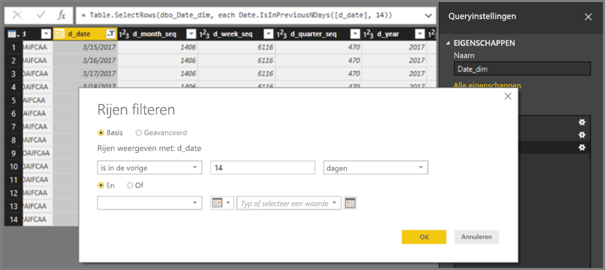
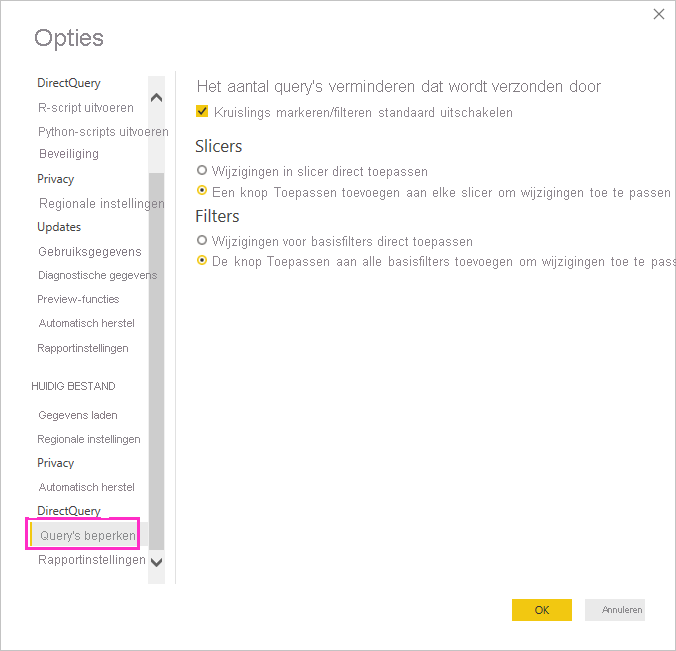
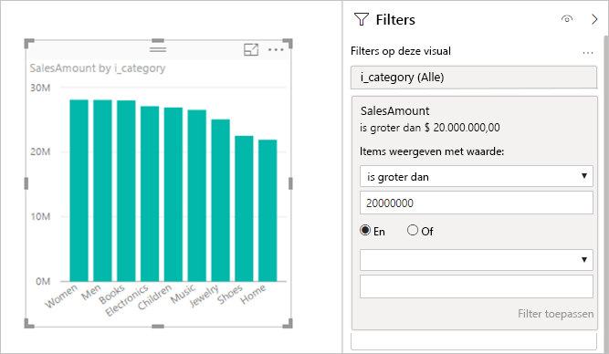
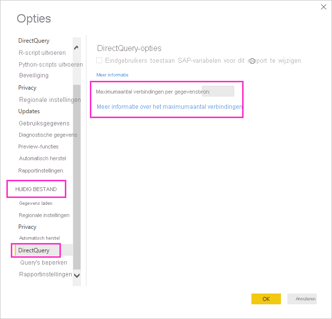
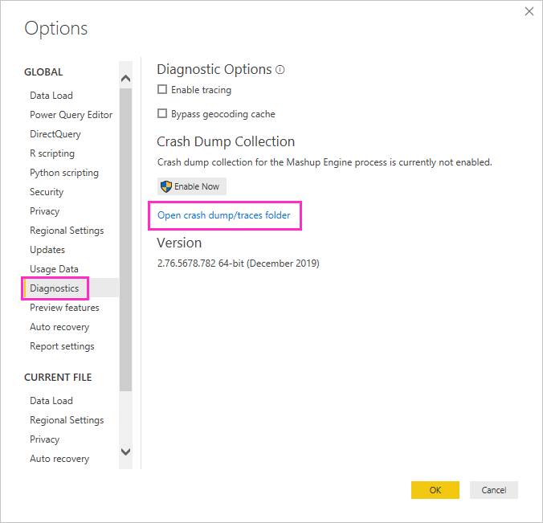
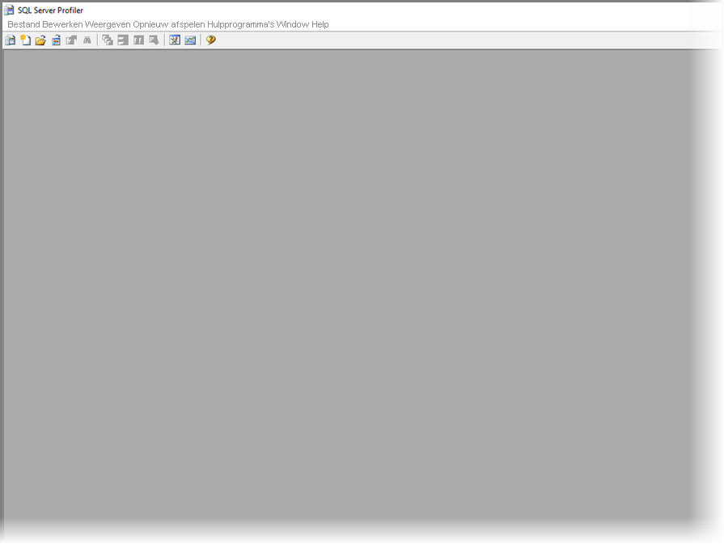
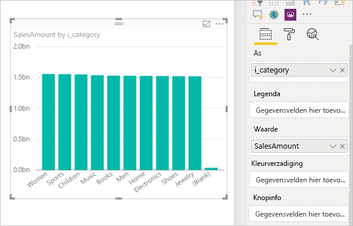

# <a name="about-using-directquery-in-power-bi"></a>Informatie over DirectQuery in Power BI

U kunt verbinding maken met allerlei verschillende gegevensbronnen wanneer u *Power BI Desktop* of de *Power BI-service* gebruikt; deze verbindingen kunt u op verschillende manieren tot stand brengen. U kunt gegevens *importeren* in Power BI, wat de meest voorkomende manier is om gegevens te verkrijgen, of u kunt rechtstreeks verbinding maken met gegevens in de oorspronkelijke opslagplaats, wat *DirectQuery* wordt genoemd. In dit artikel vindt u informatie over DirectQuery-mogelijkheden:

* Verschillende verbindingsmogelijkheden voor DirectQuery
* Richtlijnen voor wanneer u beter DirectQuery kunt gebruiken in plaats van importeren
* Nadelen van het gebruik van DirectQuery
* Aanbevolen procedures voor het gebruik van DirectQuery

Volg de aanbevolen procedures voor het gebruik van importeren vergeleken met DirectQuery:

* Indien mogelijk moet u gegevens importeren in Power BI. U kunt dan gebruikmaken van de geavanceerde en krachtige query-engine van Power BI en u krijgt een zeer interactieve en volledig functionele ervaring.
* Als uw doelstellingen niet kunnen worden gerealiseerd door gegevens te importeren, kunt u DirectQuery gebruiken. Als de gegevens bijvoorbeeld vaak worden gewijzigd, en rapporten de meest recente gegevens moeten bevatten, is DirectQuery waarschijnlijk de beste keuze. U kunt DirectQuery echter alleen gebruiken als de onderliggende gegevensbron interactieve query's kan aanbieden, minder dan vijf seconden voor een gebruikelijke query met statistische functies, en overweg kan met de belasting die wordt gegenereerd. Daarnaast moet de lijst met beperkingen voor het gebruik van DirectQuery goed worden doorgenomen.

De set met mogelijkheden die door Power BI wordt aangeboden voor importeren en DirectQuery zal in de loop der tijd veranderen. Denk hierbij aan meer flexibiliteit bij het gebruik van geïmporteerde gegevens, zodat importeren in meer situaties kan worden gebruikt, evenals het wegnemen van enkele nadelen van het gebruik van DirectQuery. Ongeacht deze verbeteringen, zullen de prestaties van de onderliggende gegevensbron altijd de belangrijkste overweging blijven bij het gebruik DirectQuery. Als de onderliggende gegevensbron traag is, blijft het onwerkbaar om DirectQuery te gebruiken met die bron.

In dit artikel bespreken we DirectQuery in combinatie met Power BI, niet met *SQL Server Analysis Services*. DirectQuery is ook een functie van SQL Server Analysis Services. Veel van de details die in dit artikel worden beschreven, zijn van toepassing op deze functie. Er zijn ook belangrijke verschillen. Zie [DirectQuery in SQL Server 2016 Analysis Services](https://download.microsoft.com/download/F/6/F/F6FBC1FC-F956-49A1-80CD-2941C3B6E417/DirectQuery%20in%20Analysis%20Services%20-%20Whitepaper.pdf) voor meer informatie over het gebruik van DirectQuery met SQL Server Analysis Services.

In dit artikel richten we ons op de aanbevolen workflow voor DirectQuery, waar het rapport wordt gemaakt in Power BI Desktop, maar er wordt ook aandacht besteed aan het rechtstreeks verbinding maken in de Power BI-service.

## <a name="power-bi-connectivity-modes"></a>Verbindingsmodi van Power BI

Power BI kan verbinding maken met een groot aantal verschillende gegevensbronnen, waaronder:

* Onlineservices (Salesforce, Dynamics 365, enzovoort)
* Databases (SQL Server, Access, Amazon Redshift, enzovoort)
* Eenvoudige bestanden (Excel, JSON, enzovoort)
* Andere gegevensbronnen (Spark, websites, Microsoft Exchange, enzovoort)

Voor deze bronnen kunnen de gegevens worden geïmporteerd in Power BI. Voor sommige kan er ook verbinding worden gemaakt via DirectQuery. Zie [Gegevensbronnen die worden ondersteund door DirectQuery](power-bi-data-sources.md) voor een samenvatting van de bronnen die ondersteuning bieden voor DirectQuery. In de toekomst zullen meer bronnen geschikt worden gemaakt voor DirectQuery, met name bronnen die naar verwachting goede prestaties voor interactieve query's kunnen bieden.

SQL Server Analysis Services is een speciaal geval. Wanneer u verbinding maakt met SQL Server Analysis Services, kunt u ervoor kiezen om de gegevens importeren of u kunt een *liveverbinding* gebruiken. Het gebruik van een liveverbinding is vergelijkbaar met DirectQuery. Er worden geen gegevens geïmporteerd en er wordt altijd een query uitgevoerd op de onderliggende gegevensbron om een visual te vernieuwen. Een liveverbinding verschilt op vele andere manieren, dus er wordt een andere term gebruikt, *liveverbinding* versus *DirectQuery*.

Deze drie mogelijkheden om verbinding te maken met gegevens: *importeren*, *DirectQuery* en *liveverbinding*.

### <a name="import-connections"></a>Importverbindingen

Importeren: wanneer u **Gegevens ophalen** in Power BI Desktop gebruikt om verbinding te maken met een gegevensbron zoals SQL Server, is het gedrag van die verbinding als volgt:

* Als u de optie Gegevens ophalen voor het eerst gebruikt, wordt met elk van de geselecteerde set tabellen een query gedefinieerd waarmee een set gegevens wordt geretourneerd. Deze query's kunnen worden bewerkt voordat u de gegevens laadt, bijvoorbeeld om filters toe te passen, de gegevens samen te voegen of verschillende tabellen samen te voegen.
* Bij het laden worden alle gegevens die zijn gedefinieerd met deze query's, geïmporteerd in de cache van Power BI.
* Bij het samenstellen van een visual binnen Power BI Desktop, wordt er een query uitgevoerd op de geïmporteerde gegevens. De Power BI Store zorgt ervoor dat de query snel wordt uitgevoerd. Alle wijzigingen in de visual worden onmiddellijk weergegeven.
* Eventuele wijzigingen in de onderliggende gegevens worden niet doorgevoerd in visuals. U moet *Vernieuwen* om de gegevens opnieuw te importeren.
* Bij het publiceren van het rapport (als een *.pbix*-bestand) naar de Power BI-service, wordt er een gegevensset gemaakt die wordt geüpload naar de Power BI-service. De geïmporteerde gegevens maken deel uit van deze dataset. Vervolgens is het mogelijk om vernieuwing van die gegevens te plannen, bijvoorbeeld om de gegevens elke dag opnieuw te importeren. Afhankelijk van de locatie van de oorspronkelijke gegevensbron, kan het nodig zijn om een on-premises gegevensgateway te configureren.
* Wanneer er een bestaand rapport wordt geopend in de Power BI-service, of bij het ontwerpen van een nieuw rapport, wordt er op de geïmporteerde gegevens opnieuw een query uitgevoerd, zodat er sprake is van interactiviteit.
* Het is mogelijk om visualisaties, maar ook volledige rapportpagina's, als tegels vast te maken aan een dashboard. De tegels worden automatisch vernieuwd zodra de onderliggende gegevensset wordt vernieuwd.

### <a name="directquery-connections"></a>DirectQuery-verbindingen

DirectQuery: wanneer u **Gegevens ophalen** gebruikt in Power BI Desktop om verbinding te maken met een gegevensbron, is het gedrag van die verbinding als volgt:

* Tijdens de eerste fase van Gegevens ophalen wordt de bron geselecteerd. Voor relationele bronnen wordt er een set met tabellen geselecteerd. Elke tabel vertegenwoordigt nog steeds een query waarmee een logische set gegevens wordt geretourneerd. Voor multidimensionale bronnen zoals SAP BW, wordt alleen de bron geselecteerd.
* Bij het laden worden er echter geen gegevens geïmporteerd in de opslaglocatie van Power BI. In plaats daarvan worden bij het bouwen van een visual in Power BI Desktop query's verzonden naar de onderliggende gegevensbron om de benodigde gegevens op te halen. De tijd die nodig is om de visual te vernieuwen, is afhankelijk van de prestaties van de onderliggende gegevensbron.
* Eventuele wijzigingen in de onderliggende gegevens worden niet direct doorgevoerd in bestaande visuals. Het is nog steeds nodig om te vernieuwen. De benodigde query's worden voor elke visual opnieuw verzonden en de visual wordt indien nodig bijgewerkt.
* Bij het publiceren van het rapport in de Power BI-service levert dit weer een gegevensset op in de Power BI-service, net zoals bij importeren. Er worden echter *geen* gegevens opgenomen in deze dataset.
* Bij het openen van een bestaand rapport in de Power BI-service, of bij het ontwerpen van een nieuw rapport, wordt op de onderliggende gegevensbron opnieuw een query uitgevoerd om de benodigde gegevens op te halen. Afhankelijk van de locatie van de oorspronkelijke gegevensbron kan het nodig zijn om een on-premises gegevensgateway te configureren, net zoals dat bij de importmodus nodig is om de gegevens te vernieuwen.
* Het is mogelijk om visualisaties, maar ook volledige rapportpagina's, als tegels vast te maken aan een dashboard. Om ervoor te zorgen dat een dashboard snel wordt geopend, worden de tegels automatisch vernieuwd volgens een bepaald schema, bijvoorbeeld elk uur. Deze frequentie kan worden aangepast om in te spelen op de snelheid waarmee gegevens worden gewijzigd en hoe belangrijk het is om de nieuwste gegevens te zien. Bij het openen van een dashboard bevatten de tegels de gegevens van het moment van de laatste vernieuwing. Dit kan betekenen dat de recentste wijzigingen die zijn aangebracht in de onderliggende gegevensbron, nog niet zichtbaar zijn. U kunt een geopend dashboard vernieuwen om ervoor te zorgen dat het actueel is.

### <a name="live-connections"></a>Live-verbindingen

Bij het verbinden met SQL Server Analysis Services kunt u ervoor kiezen om gegevens te importeren uit het geselecteerde gegevensmodel of om een liveverbinding met de gegevens op te zetten. Als u kiest voor importeren, definieert u een query op die externe SQL Server Analysis Services-bron en worden de gegevens zoals gebruikelijk geïmporteerd. Als u liveverbinding maakt, wordt er geen query gedefinieerd en wordt het externe model in zijn geheel weergegeven in de lijst met velden.

De situatie die wordt beschreven in de vorige alinea geldt ook voor het maken van verbinding met de volgende bronnen, behalve dat er geen mogelijkheid is om de gegevens te importeren:

* Power BI-gegevenssets, bijvoorbeeld bij het verbinden met een Power BI-gegevensset die eerder is gemaakt en gepubliceerd naar de service, om een nieuw rapport voor de set te maken.
* Common Data Services.

Het gedrag van rapporten via SQL Server Analysis Services, bij het publiceren naar de Power BI-service, is op de volgende punten vergelijkbaar met DirectQuery-rapporten:

* Bij het openen van een bestaand rapport in de Power BI-service of bij het ontwerpen van een nieuw rapport, wordt op de onderliggende SQL Server Analysis Services-bron een query uitgevoerd, waarvoor mogelijk een on-premises gegevensgateway nodig is.
* Dashboardtegels worden automatisch vernieuwd volgens een schema, bijvoorbeeld elk uur.

Er zijn ook belangrijke verschillen. Voor bijvoorbeeld liveverbindingen wordt de identiteit van de gebruiker die het rapport opent, altijd doorgegeven aan de onderliggende SQL Server Analysis Services-bron.

U weet nu wat de verschillen en overeenkomsten zijn tussen de beschikbare verbindingsmogelijkheden. In de rest van dit artikel besteden we alleen nog aandacht aan DirectQuery.

## <a name="when-is-directquery-useful"></a>Wanneer is DirectQuery een geschikte oplossing?

In de volgende tabel worden scenario's beschreven waarin het verbinden met DirectQuery bijzonder nuttig kan zijn. Het bevat situaties waarin het als nuttig wordt beschouwd om de gegevens in de oorspronkelijke bron te laten. In de beschrijving wordt besproken of het opgegeven scenario beschikbaar is in Power BI.

| Beperking | Beschrijving |
| --- | --- |
| Gegevens worden vaak gewijzigd en er is behoefte aan bijna realtime rapportage |Modellen met geïmporteerde gegevens kunnen maximaal één keer per uur worden vernieuwd (vaker met Power BI Pro of Power BI Premium-abonnementen). In situaties waarin de gegevens steeds veranderen en rapporten altijd de recentste gegevens moeten bevatten, is importeren met geplande vernieuwingen waarschijnlijk geen oplossing. Het is mogelijk om gegevens rechtstreeks te streamen naar Power BI, maar hierbij gelden wel beperkingen ten aanzien van de gegevensvolumes. <br/> <br/> Bij gebruik van DirectQuery, daarentegen, bevat een geopend of vernieuwd rapport of dashboard altijd de meest recente gegevens uit de bron. Bovendien kunnen de tegels van een dashboard vaker worden bijgewerkt, maximaal elke 15 minuten. |
| Gegevens zijn erg groot |Als de gegevens erg groot zijn, is het importeren van alle gegevens niet haalbaar. Bij DirectQuery is het helemaal niet nodig om grote gegevensoverdrachten uit te voeren, omdat deze lokaal worden opgevraagd. <br/> <br/> Grote hoeveelheden gegevens kunnen echter ook impliceren dat de prestaties van de query's op deze onderliggende gegevensbron te langzaam zijn, zoals besproken in [Gevolgen van het gebruik van DirectQuery](#implications-of-using-directquery). U hoeft niet altijd de volledige gedetailleerde gegevens te importeren. In plaats daarvan kunnen de gegevens tijdens het importeren vooraf worden geaggregeerd. Met de *Query-editor* kunt u de gegevens gemakkelijk vooraf aggregeren tijdens het importeren. In theorie is het mogelijk om exact de aggregatiegegevens te importeren die nodig zijn voor elke visualisatie. Dus waar DirectQuery de eenvoudigste manier is voor grote hoeveelheden gegevens, kan het importeren van aggregatiegegevens een oplossing zijn als de onderliggende gegevensbron te langzaam is. |
| Er zijn beveiligingsregels zijn gedefinieerd in de onderliggende gegevensbron |Wanneer de gegevens worden geïmporteerd, maakt Power BI verbinding met de gegevensbron met behulp van de referenties van de huidige gebruiker uit Power BI Desktop, of de referenties die zijn opgegeven tijdens het configureren van de geplande vernieuwing uit de Power BI-service. Bij het publiceren en delen van een dergelijk rapport is het belangrijk om alleen te delen met gebruikers die dezelfde gegevens mogen zien. Een alternatief is om beveiliging op rijniveau als onderdeel van de gegevensset te definiëren. <br/> <br/> Omdat met DirectQuery altijd een query wordt uitgevoerd op de onderliggende gegevensbron, kan door deze configuratie in het ideale geval elke beveiligingsregel uit deze onderliggende gegevensbron worden toegepast. Op dit moment maakt Power BI echter altijd verbinding met de onderliggende gegevensbron met de referenties die ook zouden worden gebruikt voor importeren. <br/> <br/> Totdat Power BI toestaat dat de identiteit van de rapportgebruiker wordt doorgeven aan de onderliggende gegevensbron, biedt DirectQuery geen voordelen met betrekking tot beveiliging van de gegevensbron. |
| Er gelden beperkingen ten aanzien van de onafhankelijkheid van gegevens |Sommige organisaties hanteren beleidsregels voor de onafhankelijkheid van gegevens, wat betekent dat gegevens de locatie van de organisatie niet mogen verlaten. Een oplossing op basis van importeren zal zeker problemen opleveren. Bij gebruik van DirectQuery, daarentegen, blijven die gegevens aanwezig in de onderliggende gegevensbron. <br/> <br/> Zelfs met DirectQuery worden sommige caches met gegevens op het niveau van de visual echter bewaard in de Power BI-service vanwege geplande vernieuwing van tegels. |
| Onderliggende gegevensbron is een OLAP-bron, met metingen |Als de onderliggende gegevensbron *metingen* bevat, zoals SAP HANA of SAP Business Warehouse, ontstaan er andere problemen als de gegevens worden geïmporteerd. Dit betekent dat de gegevens die zijn geïmporteerd een bepaald niveau van aggregatie hebben, zoals gedefinieerd door de query. Denk aan metingen zoals **Totaalomzet** per **klasse**, **jaar** en **plaats**. Als er vervolgens een visual wordt gebouwd voor gegevens op een hoger aggregatieniveau, zoals **TotalSales** per **jaar**, wordt de aggregatiewaarde verder geaggregeerd. Dit is prima voor additieve metingen zoals **Som** en **Min**, maar het is een probleem voor niet-additieve metingen zoals **Gemiddelde**, **Uniek aantal**. <br/> <br/> Om de juiste aggregatiegegevens, zoals deze nodig zijn voor de specifieke visual, rechtstreeks te verkrijgen vanuit de bron, zou het nodig zijn om query's per visual te versturen, zoals in DirectQuery. <br/> <br/> Wanneer u verbinding maakt met SAP Business Warehouse (BW), biedt een keuze voor DirectQuery de mogelijkheid om metingen op deze manier te verwerken. Zie [DirectQuery en SAP BW](desktop-directquery-sap-bw.md) voor meer informatie over SAP BW. <br/> <br/> Op dit moment verwerkt DirectQuery via SAP HANA de gegevensbron echter op dezelfde manier als een relationele gegevensbron, en vertoont daarom soortgelijk gedrag als bij importeren. Deze methode wordt nader besproken in [DirectQuery en SAP HANA](desktop-directquery-sap-hana.md). |

Op basis van de huidige mogelijkheden van DirectQuery in Power BI worden kort gezegd de volgende voordelen geboden in de volgende scenario's:

* Gegevens worden vaak gewijzigd en er is behoefte aan bijna realtime rapportage.
* Verwerking van zeer grote hoeveelheden gegevens, zonder de noodzaak van vooraf aggregeren.
* Er gelden beperkingen ten aanzien van de onafhankelijkheid van gegevens.
* De bron is een multidimensionale bron met metingen, zoals SAP BW.

De details in de vorige lijst hebben alleen betrekking op het gebruik van Power BI. In plaats daarvan kunt u een extern SQL Server Analysis Services- of Azure Analysis Services-model gebruiken om gegevens te importeren. Gebruik vervolgens Power BI om verbinding te maken met dat model. Hoewel voor deze aanpak aanvullende configuratie nodig is, krijgt u er meer flexibiliteit voor terug. Er kunnen veel grotere hoeveelheden gegevens worden geïmporteerd. Er is geen beperking voor de frequentie waarmee de gegevens kunnen worden vernieuwd.

## <a name="implications-of-using-directquery"></a>Gevolgen van het gebruik van DirectQuery

Het gebruik van DirectQuery heeft mogelijke negatieve gevolgen. Deze worden beschreven in deze sectie. Sommige van deze beperkingen verschillen enigszins afhankelijk van de exacte bron die wordt gebruikt. Beperkingen worden behandeld wanneer dat van toepassing is, en er zijn afzonderlijke artikelen voor bronnen die aanzienlijk verschillen.

### <a name="performance-and-load-on-the-underlying-source"></a>Prestaties en belasting van de onderliggende gegevensbron

Bij gebruik van DirectQuery wordt de algehele ervaring voor een groot deel bepaald door de prestaties van de onderliggende gegevensbron. Als het vernieuwen van elke visual, bijvoorbeeld na het wijzigen van een slicer-waarde, een paar seconden duurt (meestal minder dan 5 seconden), is de ervaring redelijk. De ervaring kan traag zijn vergeleken met de onmiddellijke reactie bij het importeren van de gegevens naar Power BI. Als de vertraging van de bron ertoe leidt dat het vernieuwen van afzonderlijke visuals langer dan tien seconden duurt, wordt de ervaring erg slecht. Query's kunnen zelfs een time-out opleveren.

Naast de prestaties van de onderliggende gegevensbron moet u rekening houden met de belasting die op de bron is geplaatst. De prestaties worden door de belasting beïnvloed. Elke gebruiker die een gedeeld rapport opent en elke dashboardtegel die wordt vernieuwd, verzendt ten minste één query per visual naar de onderliggende bron. Het is belangrijk dat de gegevensbron ook bij een dergelijke querybelasting redelijk blijft presteren.

### <a name="security-implications-when-combining-data-sources"></a>Gevolgen voor de beveiliging bij het combineren van gegevensbronnen

Het is mogelijk om meerdere gegevensbronnen in een DirectQuery-model te gebruiken, net zoals bij het importeren van gegevens. Gebruik hiervoor de functie [Samengestelde modellen](../transform-model/desktop-composite-models.md). Wanneer u meerdere gegevensbronnen gebruikt, is het belangrijk om te begrijpen hoe de gegevens worden verplaatst tussen de onderliggende gegevensbronnen en wat de [gevolgen voor de beveiliging](../transform-model/desktop-composite-models.md#security-implications) zijn.

### <a name="limited-data-transformations"></a>Beperkte gegevenstransformaties

Op dezelfde manier gelden er ook beperkingen in de gegevenstransformaties die kunnen worden toegepast binnen Query-editor. Bij geïmporteerde gegevens kan er eenvoudig een geavanceerde reeks transformaties worden toegepast om de gegevens op te schonen en opnieuw vorm te geven voordat deze worden gebruikt voor het maken van visuals, zoals bij het parseren van JSON-documenten of het draaien van gegevens vanuit een formulier met kolommen naar een formulier met rijen. Deze transformaties zijn beperkter in DirectQuery.

Bij het verbinden met een OLAP-bron zoals SAP Business Warehouse is het al helemaal niet mogelijk om transformaties te definiëren en wordt het externe model in zijn geheel overgenomen van de bron. Voor relationele bronnen zoals SQL Server is het nog steeds mogelijk om per query een set transformaties te definiëren, maar deze transformaties zijn uit prestatieoverwegingen beperkt.

Een dergelijke transformatie moet worden toegepast op elke query die wordt uitgevoerd op de onderliggende gegevensbron, in plaats van één keer bij het vernieuwen van de gegevens. Het gaat dus alleen om transformaties die redelijkerwijs kunnen worden vertaald naar een enkele, systeemeigen query. Als u een transformatie gebruikt die te complex is, ontvangt u een fout dat de transformatie moet worden verwijderd of dat het model moet worden overgeschakeld naar de importmodus.

Bovendien wordt de query die het resultaat is van de opdracht **Gegevens ophalen** of Query-editor gebruikt in een subselectie binnen de gegenereerde query's en wordt deze verzonden voor het ophalen van de benodigde gegevens voor een visual. De query die is gedefinieerd in de Query-editor, moet geldig zijn in deze context. Het is met name niet mogelijk om een query te gebruiken met behulp van algemene tabelexpressies, en ook geen query die opgeslagen procedures aanroept.

### <a name="modeling-limitations"></a>Modelleringsbeperkingen

De term *modellering* in deze context betekent de handeling van het verfijnen en verrijken van de onbewerkte gegevens, als onderdeel van het ontwerpen van een rapport waarin deze gegevens worden gebruikt. Enkele voorbeelden:

* Relaties tussen tabellen definiëren
* Nieuwe berekeningen toevoegen (berekende kolommen en metingen)
* Kolommen en metingen een andere naam geven en verbergen
* Hiërarchieën definiëren
* De opmaak, standaardsamenvatting en sorteervolgorde voor een kolom definiëren
* Waarden groeperen of clusteren

Wanneer u DirectQuery gebruikt, zijn er nog steeds mogelijkheden om het model te verrijken, en het principe van verrijking van de onbewerkte gegevens wordt zeker gehandhaafd, om het latere verbruik van de gegevens te verbeteren. Enkele modelleringsfuncties zijn echter niet beschikbaar, of in beperkte mate, wanneer u DirectQuery gebruikt. Deze beperkingen worden over het algemeen toegepast om prestatieproblemen te voorkomen. In de volgende lijst ziet u de set met beperkingen die gemeenschappelijk zijn voor alle DirectQuery bronnen. Mogelijk zijn aanvullende beperkingen van toepassing op afzonderlijke bronnen, zoals wordt beschreven in [Volgende stappen](#next-steps).

* **Er is geen ingebouwde datumhiërarchie:** Bij het importeren van gegevens geldt dat voor elke datum- of datum- en tijdkolom ook een ingebouwde datumhiërarchie beschikbaar is. Als u bijvoorbeeld een tabel met verkooporders importeert, inclusief een kolom **Orderdatum**, en u **OrderDate** vervolgens gebruikt in een visual, kunt u het niveau (jaar, maand, dag) kiezen dat u wilt gebruiken. Deze ingebouwde datumhiërarchie is niet beschikbaar bij gebruik van DirectQuery. Als er een **datumtabel** beschikbaar is in de onderliggende gegevensbron, wat gebruikelijk is in veel datawarehouses, kunnen de DAX Time Intelligence-functies op de normale manier worden gebruikt.
* **Voor datum/tijd wordt alleen ondersteuning geboden voor nauwkeurigheid tot op de seconde:** Wanneer u tijdkolommen in uw gegevensset gebruikt, kunnen in Power BI alleen query's voor de onderliggende bron worden uitgevoerd tot op een niveau van seconden. Query's worden gedurende enkele milliseconden niet verzonden naar de DirectQuery-bron. Verwijder dit deel van de tijden uit de bronkolommen.
* **Beperkingen in berekende kolommen:** Voor berekende kolommen geldt dat ze zijn beperkt tot intra-rij, wat inhoudt dat ze alleen kunnen verwijzen naar waarden van andere kolommen in dezelfde tabel, zonder het gebruik van een statistische functie. Daarnaast zijn de scalaire DAX-functies, zoals `LEFT()`, die zijn toegestaan, beperkt tot die functies die naar de onderliggende bron kunnen worden gepusht. De functies variëren afhankelijk van de exacte mogelijkheden van de bron. Functies die niet worden ondersteund, worden niet weergegeven bij het automatisch aanvullen van de DAX voor een berekende kolom. Als een dergelijke functie toch wordt gebruikt, levert dit een fout op.
* **Geen ondersteuning voor bovenliggende-onderliggende DAX-functies:** In de DirectQuery-modus is het niet mogelijk om de familie van `DAX PATH()`-functies te gebruiken, die doorgaans structuren op basis van bovenliggend/onderliggend afhandelen, zoals rekeningschema's of werknemershiërarchieën.
* **Berekende tabellen worden niet ondersteund:** De mogelijkheid om een berekende tabel te definiëren met behulp van een DAX-expressie wordt niet ondersteund in de DirectQuery-modus.
* **Filteren op relatie:** Zie [Kruislings filteren in twee richtingen](https://download.microsoft.com/download/2/7/8/2782DF95-3E0D-40CD-BFC8-749A2882E109/Bidirectional%20cross-filtering%20in%20Analysis%20Services%202016%20and%20Power%20BI.docx) voor informatie over filteren in twee richtingen. Dit technisch document bevat voorbeelden in de context van SQL Server Analysis Services. De fundamentele punten gelden ook voor Power BI.
* **Geen clustering:** Wanneer u DirectQuery gebruikt, is het niet mogelijk om met behulp van de voorziening Clustering automatisch te zoeken naar groepen.

### <a name="reporting-limitations"></a>Rapportagebeperkingen

Bijna alle rapportagemogelijkheden worden ondersteund voor DirectQuery-modellen. Dit betekent dat zolang de onderliggende gegevensbron een geschikt prestatieniveau biedt, dezelfde set visualisaties kan worden gebruikt. Er gelden enkele belangrijke beperkingen voor een aantal van de andere mogelijkheden die worden aangeboden in de Power BI-service nadat een rapport is gepubliceerd:

* **Snelle inzichten worden niet ondersteund:** Power BI Quick Insights doorzoekt verschillende subsets van uw gegevensset terwijl er tegelijkertijd geavanceerde algoritmen worden toegepast om potentieel interessante inzichten te detecteren. Gezien de noodzaak voor query's met een snelle respons, is deze mogelijkheid niet beschikbaar voor gegevenssets die DirectQuery gebruiken.
* **Q&A wordt niet ondersteund:** Met Q&A van Power BI kunt u met behulp van intuïtieve, natuurlijke taal uw gegevens verkennen en antwoorden krijgen in de vorm van diagrammen en grafieken. Deze voorziening wordt momenteel echter niet ondersteund voor gegevenssets die DirectQuery gebruiken.
* **Verkenning gebruiken in Excel leidt waarschijnlijk tot slechtere prestaties:** U kunt uw gegevens verkennen met de mogelijkheid Verkennen in Excel in een gegevensset. Door deze methode kunt u draaitabellen en -grafieken maken in Excel. Hoewel deze mogelijkheid wordt ondersteund voor gegevenssets die DirectQuery gebruiken, zijn de prestaties meestal minder dan bij het maken van visuals in Power BI. Als het gebruik van Excel belangrijk is voor uw scenario's, moet u hiermee rekening houden in uw beslissing om DirectQuery te gebruiken.

### <a name="security"></a>Beveiliging

Zoals eerder in dit artikel is besproken, worden voor een rapport in DirectQuery altijd dezelfde vaste referenties gebruikt om verbinding te maken met de onderliggende gegevensbron, nadat deze is gepubliceerd naar de Power BI-service. Dit gedrag geldt specifiek voor DirectQuery, niet voor liveverbindingen met SQL Server Analysis Services, waar dit anders is geregeld. Direct na het publiceren van een DirectQuery-rapport is het nodig om de referenties te configureren van de gebruiker die zal worden gebruikt. Totdat u de referenties hebt geconfigureerd, treedt er een fout op wanneer het rapport wordt geopend in de Power BI-service.

Zodra de gebruikersreferenties zijn opgegeven, worden deze referenties gebruikt, *ongeacht de gebruiker die het rapport opent*. Op deze manier is het precies hetzelfde als geïmporteerde gegevens. Elke gebruiker ziet dezelfde gegevens, tenzij beveiliging op rijniveau is gedefinieerd als onderdeel van het rapport. Dezelfde zorgvuldigheid moet worden betracht bij het delen van het rapport, als er beveiligingsregels zijn gedefinieerd in de onderliggende gegevensbron.

### <a name="behavior-in-the-power-bi-service"></a>Gedrag in de Power BI-service

In deze sectie wordt het gedrag van een DirectQuery-rapport in de Power BI-service beschreven, om de mate van belasting uit te leggen die de gegevensbron in de back-end krijgt te verwerken, afhankelijk van het aantal gebruikers waarmee het rapport en het dashboard worden gedeeld, de complexiteit van het rapport en of beveiliging op rijniveau is ingesteld in het rapport.

#### <a name="reports--opening-interacting-with-editing"></a>Rapporten: openen, interactie en bewerken

Wanneer een rapport wordt geopend, worden alle visuals op de momenteel zichtbare pagina vernieuwd. Voor elke visual moet ten minste één query op de onderliggende gegevensbron worden uitgevoerd. Voor sommige visuals zijn mogelijk meerdere query's vereist. Een visual bevat bijvoorbeeld aggregatiewaarden uit twee verschillende feitentabellen, een meer complexe meting of totalen van een niet-additieve meting zoals Count Distinct. Als u naar een nieuwe pagina gaat, worden deze visuals vernieuwd. Met Vernieuwen wordt een nieuwe set query's naar de onderliggende bron verzonden.

Elke gebruikersinteractie met het rapport kan betekenen dat de visualisaties worden vernieuwd. Als er bijvoorbeeld een andere waarde wordt geselecteerd in een slicer, moet er een nieuwe set query's worden verzonden om alle betreffende visuals te vernieuwen. Hetzelfde geldt voor het klikken op een visualisatie voor het kruislings markeren van andere visualisaties of het wijzigen van een filter.

Op dezelfde manier moeten er voor het bewerken van een nieuw rapport voor elke stap van het traject query's worden verzonden om de uiteindelijke visual te verkrijgen.

Bepaalde resultaten worden in de cache opgeslagen. Het vernieuwen van een visual vindt direct plaats als onlangs exact dezelfde resultaten zijn verkregen. Als er beveiliging op rijniveau is gedefinieerd, worden dergelijke caches niet gedeeld met gebruikers.

#### <a name="dashboard-refresh"></a>Dashboard vernieuwen

U kunt afzonderlijke visualisaties, of volledige pagina's, als tegels koppelen aan een dashboard. Tegels op basis van DirectQuery-gegevenssets worden automatisch vernieuwd volgens een schema. Tegels verzenden query's naar de gegevensbron van de back-end. Standaard worden gegevenssets elk uur vernieuwd, maar in de instellingen van de gegevensset kunt u een waarde opgeven tussen wekelijks en elke 15 minuten.

Als er geen beveiliging op rijniveau is gedefinieerd in het model, wordt elke tegel eenmaal vernieuwd en worden de resultaten met alle gebruikers gedeeld. Anders kan er sprake zijn van een groot vermenigvuldigingseffect. Voor elke tegel is vereist dat per gebruiker afzonderlijke query's worden verzonden naar de onderliggende gegevensbron.

Stel dat een dashboard tien tegels bevat, wordt gedeeld met 100 gebruikers en is gebaseerd op een gegevensset met DirectQuery met beveiliging op rijniveau. Het dashboard is daarnaast geconfigureerd om elke 15 minuten te worden vernieuwd. Het gevolg is dan dat er elke 15 minuten ten minste 1000 query's worden verzonden naar de back-endbron.

Het is belangrijk dat er zorgvuldig wordt gekeken naar het gebruik van beveiliging op rijniveau en de configuratie van het vernieuwingsschema.

#### <a name="time-outs"></a>Time-outs

Er wordt een time-out van vier minuten toegepast op afzonderlijke query's in de Power BI-service. Query's die langer duren, zullen mislukken. Zoals eerder benadrukt, wordt aanbevolen DirectQuery te gebruiken voor bronnen die bijna interactieve queryprestaties bieden. Deze limiet is bedoeld om problemen te voorkomen met te lange uitvoeringstijden.

### <a name="other-implications"></a>Andere implicaties

Het gebruik van DirectQuery heeft onder meer de volgende andere algemene implicaties:

* **Als gegevens worden gewijzigd, is het nodig om te vernieuwen om te controleren of de recentste gegevens worden weergegeven:** Vanwege het gebruik van caches is er geen manier om te garanderen dat in de visual altijd de recentste gegevens worden weergegeven. Stel dat een visualisatie de transacties van de afgelopen dag laat zien. Omdat er een slicer wordt gewijzigd, is het mogelijk dat deze wordt vernieuwd om de transacties voor de afgelopen twee dagen weer te geven. De transacties kunnen recente, nieuwe transacties bevatten. Als de slicer dan weer op de oorspronkelijke waarde wordt gezet, worden opnieuw de eerder verkregen gegevens weergegeven die nog in de cache staan.

  Door **Vernieuwen** te selecteren, worden alle caches leeggemaakt en bevatten alle visuals de meest recente gegevens.

* **Als gegevens worden gewijzigd, kan consistentie tussen visuals niet worden gegarandeerd:** Verschillende visuals, of deze op dezelfde of op verschillende pagina's staan, worden mogelijk op verschillende tijdstippen vernieuwd. Als de gegevens in de onderliggende gegevensbron worden gewijzigd, is er geen garantie dat op enig moment exact dezelfde gegevens worden weergegeven in de visuals. Het feit dat soms meerdere query's nodig zijn voor één visual, bijvoorbeeld om de details en de totalen te verkrijgen, betekent dat zelfs consistentie binnen één visual niet kan worden gegarandeerd. Om deze consistentie mogelijk te maken, zouden bij het vernieuwen van een bepaalde visual alle visuals moeten worden vernieuwd, wat niet alleen veel overhead kost maar ook het gebruik vereist van dure functies zoals Snapshot Isolation in de onderliggende gegevensbron.

  Dit probleem kan grotendeels worden opgevangen door opnieuw handmatig **Vernieuwen** te selecteren om alle visuals op de pagina te vernieuwen. Zelfs bij gebruik van de importmodus is er een vergelijkbaar probleem en kan er geen consistentie worden gegarandeerd als gegevens uit meer dan één tabel worden geïmporteerd.

* **Vernieuwen in Power BI Desktop is nodig om wijzigingen in metagegevens te weergeven:** Nadat een rapport is gepubliceerd, worden de visuals in een rapport vernieuwd met **Vernieuwen**. Als het schema van de onderliggende bron is gewijzigd, worden deze wijzigingen niet automatisch toegepast om de beschikbare velden in de lijst met velden aan te passen. Als tabellen of kolommen zijn verwijderd uit de onderliggende gegevensbron, kan dit tot gevolg hebben dat een query mislukt na het vernieuwen van de gegevens. U kunt de velden in het model bijwerken met de wijzigingen door het rapport te openen in Power BI Desktop en **Vernieuwen** te kiezen.

* **Elke query kan maximaal één miljoen rijen opleveren:** Er geldt een vaste limiet van één miljoen rijen voor het aantal rijen dat met één query kan worden opgevraagd uit de onderliggende gegevensbron. Deze limiet heeft meestal geen praktische gevolgen en in visuals zelf wordt nooit dit aantal gegevenspunten weergegeven. De limiet kan echter een rol spelen in situaties waarin Power BI de verzonden query's niet volledig optimaliseert en er een tussentijds resultaat wordt opgevraagde dat de limiet overschrijdt. Het kan ook gebeuren tijdens het bouwen van een visual, op weg naar een meer redelijke eindstatus. Als bijvoorbeeld de rijen **Customer** en **TotalSalesQuantity** worden opgevraagd terwijl er meer dan 1 miljoen klanten zijn, wordt deze limiet bereikt totdat er een filter wordt toegepast.

  De fout die moet worden geretourneerd, is: 'De resultatenset van een query naar een externe gegevensbron heeft het maximale toegestane aantal van '1000000' rijen overschreden.'

* **Importmodus kan niet worden gewijzigd in DirectQuery-modus:** Hoewel het mogelijk is om een model over te schakelen van de DirectQuery-modus naar de importmodus, betekent dit dat alle benodigde gegevens moeten worden geïmporteerd. Het is ook niet mogelijk om terug te schakelen, voornamelijk als gevolg van een reeks functies die niet wordt ondersteund in de DirectQuery-modus. DirectQuery-modellen via multidimensionale bronnen zoals SAP BW kunnen evenmin worden geschakeld van DirectQuery naar import, als gevolg van de verschillende behandeling van externe metingen.

## <a name="directquery-in-the-power-bi-service"></a>DirectQuery in de Power BI-service

Alle bronnen worden ondersteund vanuit Power BI Desktop. Sommige bronnen zijn ook rechtstreeks beschikbaar vanuit de Power BI-service. Zo kan een zakelijke gebruiker via Power BI verbinding maken met gegevens in Salesforce en onmiddellijk een dashboard weergeven, zonder het gebruik van Power BI Desktop.

Slechts twee bronnen die geschikt zijn voor DirectQuery zijn rechtstreeks beschikbaar in de service:

* Spark
* Azure SQL Data Warehouse

Het wordt echter aanbevolen om het gebruik van DirectQuery met deze twee bronnen te starten in Power BI Desktop. De reden hiervoor is dat er veel belangrijke beperkingen van toepassing zijn wanneer de verbinding voor het eerst wordt gemaakt in de Power BI-service. Hoewel het beginpunt eenvoudig was, zijn er, beginnende met de Power BI-service, beperkingen voor het nog verder verbeteren van het resulterende rapport. Het is bijvoorbeeld niet mogelijk om berekeningen te maken of veel analysefuncties te gebruiken, of zelfs de metagegevens te vernieuwen om eventuele wijzigingen in het onderliggende schema weer te geven.

## <a name="guidance-for-using-directquery-successfully"></a>Richtlijnen voor succesvol gebruik van DirectQuery

Als u DirectQuery wilt gaan gebruiken, leest u hier enkele algemene richtlijnen om dit met succes te gaan doen. De richtlijnen in deze sectie zijn afgeleid van de gevolgen van het gebruik van DirectQuery die eerder in dit artikel zijn beschreven.

### <a name="back-end-data-source-performance"></a>Prestaties van gegevensbron in de back-end

Controleer of eenvoudige visuals binnen een redelijke periode worden vernieuwd. Dit moet binnen vijf seconden zijn voor een acceptabele interactieve ervaring. Als het opbouwen van visuals langer duurt dan 30 seconden, is de kans zeer groot dat er andere problemen zullen optreden na publicatie van het rapport. Door deze problemen kan de oplossing onwerkbaar worden.

Als query's langzaam zijn, controleert u de query's die naar de onderliggende gegevensbron worden verzonden en de reden voor de prestaties van query's. We kunnen hier niet het volledige spectrum van aanbevolen procedures voor database-optimalisatie bespreken voor alle mogelijke onderliggende bronnen. De besproken informatie geldt wel voor de gangbare databaseprocedures die van toepassing zijn op de meeste situaties:

* Relaties op basis van integerkolommen presteren in het algemeen beter dan joins op kolommen van andere gegevenstypen.
* De juiste indexen moeten worden gemaakt. Het maken van een index komt doorgaans neer op het gebruik van columnstore-indexen in de bronnen die hiervoor ondersteuning bieden, zoals SQL Server.
* Eventuele benodigde statistieken in de bron moeten worden bijgewerkt.

### <a name="model-design-guidance"></a>Richtlijnen voor modelontwerp

Wanneer u het model definieert, kunt u de volgende richtlijnen volgen:

* **Vermijd complexe query's in Query-editor.** In de Query-editor wordt een complexe query omgezet in één SQL-query. De enkelvoudige query wordt weergegeven in de subselectie van elke query die naar deze tabel wordt verzonden. Als deze query complex is, kan dit leiden tot prestatieproblemen voor elke verzonden query. De werkelijke SQL-query voor een reeks stappen kan worden verkregen door de laatste stap in Query-editor te selecteren en vervolgens **Systeemeigen query weergeven** te kiezen in het contextmenu.
* **Houd metingen simpel.** Zeker in eerste instantie is het raadzaam om metingen te beperken tot eenvoudige statistische functies. Als de metingen vervolgens goed presteren, kunt u complexere metingen definiëren, maar let wel goed op de prestaties van elke meting.
* **Vermijd relaties tussen berekende kolommen.** Deze richtlijnen zijn relevant voor databases waarin u meerdere kolommen moet koppelen. Power BI biedt op dit moment geen ondersteuning voor relaties die gebaseerd zijn op meerdere kolommen als de FK/PK. Een tijdelijke oplossing is de kolommen samen te voegen met behulp van een berekende kolom en de join op die kolom te baseren. Hoewel deze tijdelijke oplossing redelijk is voor geïmporteerde gegevens, resulteert dit voor DirectQuery in een join op een expressie. Dit leidt er doorgaans toe dat er geen indexen kunnen worden gebruikt en dat de prestaties afnemen. De enige echte oplossing is om de meerdere kolommen daadwerkelijk te converteren naar één kolom in de onderliggende database.
* **Vermijd relaties tussen uniqueidentifier-kolommen.** Power BI biedt geen ingebouwde ondersteuning voor het gegevenstype `uniqueidentifier`. Het definiëren van een relatie tussen kolommen van het type `uniqueidentifier` resulteert in een query met een join waarvoor een Cast nodig is. Deze methode leidt vaak weer tot slechte prestaties. Totdat deze situatie speciaal is geoptimaliseerd, is de enige oplossing om kolommen van een alternatief type te gebruiken in de onderliggende database.
* **Verberg de to-kolom in relaties.** De *to*-kolom in relaties is meestal de primaire sleutel op de *to*-tabel. Deze kolom moet worden verborgen. Als deze kolom verborgen is, wordt deze niet weergegeven in de lijst met velden en kan deze niet worden gebruikt in visuals. De kolommen waarop relaties zijn gebaseerd, zijn in de praktijk vaak *systeemkolommen*, bijvoorbeeld vervangende sleutels in een datawarehouse. Het is sowieso een goed idee om dergelijke kolommen te verbergen. Als de kolom wel een betekenis heeft, introduceert u een berekende kolom die zichtbaar is en die een eenvoudige expressie bevat die gelijk is aan de primaire sleutel, zoals in het volgende voorbeeld:

  ```sql  
      ProductKey_PK   (Destination of a relationship, hidden)
      ProductKey (= [ProductKey_PK],   visible)
      ProductName
      ...
  ```

* **Controleer alle berekende kolommen en wijzigingen van het gegevenstype.** Het gebruik van deze mogelijkheden is niet noodzakelijkerwijs schadelijk. Ze leiden er wel toe dat query's worden verzonden naar de onderliggende bron, die expressies bevat in plaats van eenvoudige verwijzingen naar kolommen. Dit kan tot gevolg hebben dat indexen niet worden gebruikt.
* **Vermijd het gebruik van bidirectioneel kruislings filteren in relaties.** Het gebruik van bidirectioneel kruislings filteren kan leiden tot queryinstructies die niet goed werken.
* **Experimenteer met de instelling *Referentiële integriteit aannemen*.** De instelling Referentiële integriteit aannemen voor relaties stelt query's in staat om `INNER JOIN`-instructies te gebruiken in plaats van `OUTER JOIN`. Deze richtlijn is in het algemeen beter voor de queryprestaties, hoewel de specifieke gegevensbron hierbij ook een rol speelt.
* **Gebruik geen relatieve datumfiltering in Query-editor.** Het is mogelijk om relatieve datumfiltering te definiëren in Query-editor. U kunt zo bijvoorbeeld filteren op rijen waar de datum in de afgelopen 14 dagen ligt.
  
  
  
  Dit filter wordt echter omgezet in een filter op basis van de vaste datum, zoals vastgesteld op het moment van ontwerp van de query. Dit resultaat kunt u zien door de systeemeigen query te bekijken.
  
  
  
  Dit resultaat is waarschijnlijk niet wat u wilt. Om ervoor te zorgen dat het filter wordt toegepast op basis van de datum waarop het rapport wordt uitgevoerd, moet u het filter als een rapportfilter toepassen in het rapport. Momenteel wordt deze methode uitgevoerd door het maken van een berekende kolom die het aantal dagen geleden berekent, met de functie `DAX DATE()`, en die berekende kolom vervolgens in een filter te gebruiken.

### <a name="report-design-guidance"></a>Richtlijnen voor rapportontwerp

Hanteer deze richtlijnen als u een rapport met een DirectQuery-verbinding gaat maken:

* **Overweeg het gebruik van opties voor Query's beperken:** Power BI biedt opties in rapporten om minder query's te verzenden en om bepaalde interacties uit te schakelen die zouden resulteren in een slechte ervaring als de resulterende query's er lang over zouden doen om te worden uitgevoerd. Als u deze opties wilt instellen, gaat u in Power BI Desktop naar **Bestand** > **Opties en instellingen** > **Opties** en selecteert u **Query's beperken**.

   

    U kunt kruislingse markering door uw hele rapport uitschakelen door selectievakjes aan te vinken in **Query's beperken**. U kunt ook de knop **Toepassen** op slicers of filterselecties weergeven. Met deze methode kunt u vervolgens een groot aantal slicers en filterselecties maken voordat u deze toepast. Er worden geen query's verzonden totdat u de knop **Toepassen** op de slicer selecteert. Uw selecties kunnen dan worden gebruikt om de gegevens te filteren.

    Deze opties zijn van toepassing op uw rapport terwijl u er mee communiceert in Power BI Desktop. Deze opties zijn ook van toepassing wanneer uw gebruikers het rapport in de Power BI-service gebruiken.

* **Pas eerst filters toe:** Als u filters wilt toepassen, moet u dit altijd aan het begin van het opbouwen van een visualisatie doen. In plaats van bijvoorbeeld **TotalSalesAmount** en **ProductName** naar de visual te slepen en vervolgens te filteren op een bepaald jaar, past u het filter **Year** helemaal aan het begin toe. Bij elke stap van het bouwen van een visual wordt een query verzonden. Hoewel het mogelijk is om vervolgens een andere wijziging door te voeren voordat de eerste query is voltooid, wordt de onderliggende gegevensbron hierbij onnodig belast. Door filters in een vroeg stadium toe te passen, zijn de tussenliggende query's over het algemeen minder belastend. Een andere consequentie van het niet vroeg toepassen van filters is dat de limiet van één miljoen rijen wordt bereikt.
* **Beperk het aantal visualisaties op een pagina:** Wanneer u een pagina opent of een slicer of filter op de pagina wijzigt, worden alle visuals op de pagina vernieuwd. Er geldt ook een limiet voor het aantal query's dat tegelijk wordt verzonden. Als het aantal visuals toeneemt, worden enkele visuals na elkaar vernieuwd, waardoor het langer duurt om de hele pagina te vernieuwen. Daarom is het raadzaam om het aantal visuals op één pagina te beperken en in plaats daarvan meerdere eenvoudigere pagina's te gebruiken.
* **Overweeg interactie tussen visuals uit te schakelen:** Visualisaties op een rapportpagina kunnen standaard worden gebruikt voor het kruislings filteren en markeren van de andere visualisaties op de pagina. Als u bijvoorbeeld **1999** selecteert in het cirkeldiagram, ziet u in het kolomdiagram markeringen die de verkopen per categorie voor **1999** aangeven.
  
  
  
  Voor kruislings markeren en kruislings filteren in DirectQuery moeten query's worden ingediend bij de onderliggende bron. De interactie moet worden uitgeschakeld als het onredelijk lang duurt voordat er op selecties door gebruikers wordt gereageerd. U kunt deze interactie uitschakelen. Schakel de interactie uit voor het volledige rapport, zoals eerder is beschreven voor de opties voor Query's beperken, of per geval. Zie [Hoe visuele elementen elkaar kruislings filteren in een Power BI-rapport](../consumer/end-user-interactions.md) voor meer informatie.

Naast de bovenstaande suggesties kunnen de volgende rapportagemogelijkheden prestatieproblemen veroorzaken:

* **Maateenheidsfilters:** Visuals met metingen, of totalen van kolommen, kunnen filters bevatten in die metingen. In de volgende grafische afbeelding ziet u bijvoorbeeld **SalesAmount** per **categorie**, maar alleen voor categorieën met meer dan **20 miljoen** aan omzet.
  
  
  
  Door deze methode worden mogelijk twee query's naar de onderliggende gegevensbron verzonden:
  
  * De eerste query haalt de categorieën op die voldoen aan de voorwaarde, **SalesAmount** meer dan USD 20 miljoen.
  * Met de tweede query worden vervolgens de benodigde gegevens voor de visual opgehaald, met inbegrip van de categorieën die voldoen aan de voorwaarde in de `WHERE`-component.
  
  Deze methode werkt meestal prima als er honderden of duizenden categorieën zijn, zoals in dit voorbeeld. Prestaties kunnen afnemen als het aantal categorieën veel groter is. De query mislukt als meer dan een miljoen categorieën voldoen aan de voorwaarde. De limiet van één miljoen rijen is eerder beschreven.

* **TopN-filters:** Er kunnen geavanceerde filters worden gedefinieerd om alleen op de hoogste (of laagste) N-waarden te filteren, geclassificeerd door een meetwaarde. Filters kunnen bijvoorbeeld de 10 belangrijkste categorieën in de vorige visual bevatten. Hiervoor moeten ook weer twee query's naar de onderliggende gegevensbron worden verzonden. De eerste query retourneert echter alle categorieën uit de onderliggende gegevensbron, waarna vervolgens de TopN wordt bepaald op basis van de geretourneerde resultaten. Afhankelijk van de kardinaliteit van de betrokken kolom kan deze methode prestatieproblemen of mislukte query's veroorzaken vanwege de limiet van één miljoen rijen.

* **Mediaan**: Over het algemeen wordt elke aggregatie, zoals `Sum` of `Count Distinct`, naar de onderliggende gegevensbron gepusht. Dit geldt echter niet voor de mediaan, omdat deze statistische functie doorgaans niet wordt ondersteund door de onderliggende gegevensbron. In dergelijke gevallen worden de detailgegevens opgehaald uit de onderliggende gegevensbron en wordt de mediaan berekend aan de hand van de geretourneerde resultaten. Deze methode is handig wanneer de mediaan moet worden berekend van een relatief klein aantal resultaten. Prestatieproblemen of queryfouten vanwege de limiet van één miljoen rijen treden op als de kardinaliteit groot is. Zo kan het berekenen van de **mediaan van het inwonertal van landen** redelijk snel gaan, maar het berekenen van de **mediaan van de verkoopprijs** te lang duren.

* **Geavanceerde tekstfilters (_contains_ en vergelijkbaar):** Bij het filteren op een tekstkolom zijn geavanceerde filters toegestaan zoals *contains* en *begins with*. Deze filters kunnen voor sommige gegevensbronnen zeker tot slechtere prestaties leiden. Het is met name belangrijk dat niet het standaardfilter *contains* wordt gebruikt als een exacte overeenkomst vereist is. Hoewel de resultaten mogelijk hetzelfde zijn, afhankelijk van de werkelijke gegevens, kunnen de prestaties aanzienlijk verschillen vanwege het gebruik van indexen.

* **Slicers met meervoudige selectie:** De standaardinstelling is dat in een slicer maar één selectie kan worden gemaakt. Het toestaan van meervoudige selectie in filters kan enkele prestatieproblemen veroorzaken, omdat de gebruiker een set items selecteert in de slicer. Als de gebruiker bijvoorbeeld de tien producten selecteert waarin hij of zij is geïnteresseerd, worden door elke nieuwe selectie query's naar de bron verzonden. Hoewel de gebruiker het volgende item kan selecteren terwijl de query nog niet is voltooid, leidt deze methode tot extra belasting van de onderliggende bron.

* **Overweeg om totalen in visuals uit te schakelen:** Standaard geven tabellen en matrices totalen en subtotalen weer. In veel gevallen moeten er afzonderlijke query's worden verzonden naar de onderliggende bron om de waarden voor deze totalen op te halen. Dit is van toepassing wanneer u gebruikmaakt van de samenvoeging *DistinctCount*, of in alle gevallen wanneer u DirectQuery gebruikt via SAP BW of SAP HANA. Dergelijke totalen moeten worden uitgeschakeld met behulp van het deelvenster **Indeling**.

### <a name="maximum-number-of-connections-option-for-directquery"></a>Optie voor een maximaal aantal verbindingen voor DirectQuery

U kunt instellen hoeveel verbindingen DirectQuery maximaal opent voor elke onderliggende gegevensbron; op deze manier kunt u bepalen hoeveel query's er gelijktijdig naar elke gegevensbron kunnen worden verzonden.

Het standaard maximumaantal gelijktijdige verbindingen dat in DirectQuery wordt gemaakt, is tien. U kunt het maximumaantal voor het huidige bestand in Power BI Desktop wijzigen. Ga naar **Bestand** > **Opties en instellingen** > **Opties**. Selecteer in de sectie **Huidig bestand** in het linkerdeelvenster de optie **DirectQuery**.



Deze instelling wordt alleen ingeschakeld als er ten minste één DirectQuery-gegevensbron in het huidige rapport staat. De waarde is van toepassing op alle DirectQuery-bronnen en op eventuele nieuwe DirectQuery-bronnen die worden toegevoegd aan hetzelfde rapport.

Het vergroten van het **Maximumaantal verbindingen per gegevensbron** zorgt ervoor dat er meer query's naar de onderliggende gegevensbron kunnen worden verzonden, tot aan het opgegeven maximumaantal. Deze methode is handig wanneer één pagina veel visuals bevat, of als veel gebruikers tegelijkertijd toegang hebben tot een rapport. Wanneer het maximale aantal verbindingen is bereikt, worden aanvullende query's in een wachtrij geplaatst tot er weer een verbinding beschikbaar is. Als u de limiet verhoogt, resulteert dit in een grotere belasting voor de onderliggende bron. Met de instelling worden de algehele prestaties dus niet gegarandeerd beter.

Zodra een rapport is gepubliceerd naar Power BI, hangt het maximumaantal gelijktijdige query's dat naar de onderliggende gegevensbron wordt verzonden, ook af van vaste limieten. De limieten zijn afhankelijk van de doelomgeving waarin het rapport wordt gepubliceerd. In verschillende omgevingen, zoals Power BI, Power BI Premium en Power BI Report Server, kunnen verschillende beperkingen gelden.

### <a name="diagnosing-performance-issues"></a>Oorzaak van prestatieproblemen achterhalen

In dit gedeelte wordt beschreven hoe u de oorzaak van prestatieproblemen kunt achterhalen of hoe u meer gedetailleerde informatie kunt verzamelen met als doel de rapporten te optimaliseren.

Het wordt aangeraden om een diagnose van prestatieproblemen te beginnen in Power BI Desktop, niet in de Power BI-service. Prestatieproblemen zijn vaak gebaseerd op de prestaties van de onderliggende bron. U kunt problemen gemakkelijker identificeren en onderzoeken in de meer geïsoleerde omgeving van Power BI Desktop. Door deze aanpak worden in eerste instantie bepaalde onderdelen geëlimineerd, zoals de Power BI-gateway. Als de prestatieproblemen ontbreken in Power BI Desktop, kunt u de details van het rapport in de Power BI-service onderzoeken. [Performance Analyzer](../create-reports/desktop-performance-analyzer.md) is een handig hulpmiddel voor het opsporen van problemen tijdens dit proces.

Zo is het ook beter om eerst te proberen het probleem te beperken tot een bepaalde visual, in plaats van een groot aantal visuals op dezelfde pagina.

Stel dat u de stappen in de vorige alinea's in deze sectie hebt uitgevoerd. We hebben nu één visual op een pagina in Power BI Desktop dat nog steeds traag is. Gebruik [Performance Analyzer](../create-reports/desktop-performance-analyzer.md) om te bepalen welke query's door Power BI Desktop naar de onderliggende bron zijn verzonden. Het is ook mogelijk om traceringen en diagnostische gegevens weer te geven die mogelijk door de onderliggende gegevensbron zijn verzonden. Traceringen bevatten mogelijk ook nuttige informatie over de manier waarop de query is uitgevoerd en hoe deze kan worden verbeterd.

Zelfs in de afwezigheid van dergelijk traceringen van de bron, is het mogelijk om de query's weer te geven die zijn verzonden door Power BI, samen met hun uitvoeringstijden, zoals in de volgende sectie wordt beschreven.

#### <a name="determining-the-queries-sent-by-power-bi-desktop"></a>Bepalen welke query's zijn verzonden door Power BI Desktop

De standaardinstelling is dat er tijdens een sessie gebeurtenissen worden vastgelegd door Power BI Desktop. Deze worden opgeslagen in het traceringsbestand *FlightRecorderCurrent.trc*.

Voor sommige DirectQuery-bronnen bevat dit logboek alle query's die naar de onderliggende gegevensbron zijn verzonden. De resterende DirectQuery-bronnen worden in de toekomst opgenomen. Vanuit de volgende bronnen worden query's naar het logboek verzonden:

* SQL Server
* Azure SQL Database
* Azure SQL Data Warehouse
* Oracle
* Teradata
* SAP HANA

Het traceringsbestand vindt u in de map *AppData* voor de huidige gebruiker:

*\<User>\AppData\Local\Microsoft\Power BI Desktop\AnalysisServicesWorkspaces*

Om toegang te krijgen tot deze map selecteert u **Bestand** > **Opties en instellingen** > **Opties**. Vervolgens selecteert u **Diagnostische gegevens**. Het volgende dialoogvenster wordt weergegeven:



Als u **Map met crashdumps/traceringen openen** selecteert onder **Diagnostische opties**, wordt de volgende map geopend: *\<User>\AppData\Local\Microsoft\Power BI Desktop\Traces*.

Als u naar de bovenliggende map van die map navigeert, komt u in een map met *AnalysisServicesWorkspaces*, met daarin één werkruimtemap voor elk geopend exemplaar van Power BI Desktop. Deze mappen hebben een naam met een achtervoegsel dat bestaat uit een geheel getal, zoals *AnalysisServicesWorkspace2058279583*.

In die map bevindt zich de map *\\Gegevens*. Deze map bevat het traceringsbestand *FlightRecorderCurrent.trc* voor de huidige Power BI-sessie. De bijbehorende werkruimtemap wordt verwijderd wanneer de bijbehorende sessie van Power BI Desktop wordt beëindigd.

De traceringsbestanden kunnen worden gelezen met behulp van het hulpprogramma *SQL Server Profiler*. Download dit hulpprogramma als onderdeel van het gratis te downloaden [SQL Server Management Studio](/sql/ssms/download-sql-server-management-studio-ssms).

Nadat u SQL Server Management Studio hebt gedownload en geïnstalleerd, voert u SQL Server Profiler uit.



Ga als volgt te werk om het traceringsbestand te openen:

1. Selecteer in SQL Server Profiler **Bestand** > **Openen** > **Traceringsbestand**.

1. Voer het pad in naar het traceringsbestand voor de momenteel geopende Power BI-sessie, zoals: *C:\Gebruikers\<user>\AppData\Local\Microsoft\Power BI Desktop\AnalysisServicesWorkspaces\AnalysisServicesWorkspace2058279583\Data*.

1. Open *FlightRecorderCurrent.trc*.

Alle gebeurtenissen uit de huidige sessie worden weergegeven. Hier ziet u een voorbeeld waarin groepen gebeurtenissen zijn gemarkeerd. Voor elke groep zijn de volgende gebeurtenissen vastgelegd:

* Een gebeurtenis `Query Begin` en `Query End`, die het begin en het einde aangeven van een DAX-query die is gegenereerd door de gebruikersinterface, bijvoorbeeld van een visual of door het invullen van een lijst met waarden in de filterinterface.
* Een of meer sets gebeurtenissen van `DirectQuery Begin` en `DirectQuery End`, die een query voorstellen die is verzonden naar de onderliggende gegevensbron, als onderdeel van het evalueren van de DAX-query.

Er kunnen meerdere DAX-query's tegelijk worden uitgevoerd, wat betekent dat gebeurtenissen uit verschillende groepen elkaar kunnen overlappen. Aan de hand van de waarde van `ActivityID` kan worden vastgesteld welke gebeurtenissen bij dezelfde groep horen.


Hier volgen nog enkele andere interessante kolommen:

* **TextData:** De tekstinhoud van de gebeurtenis. In het geval van gebeurtenissen van `Query Begin/End` is de DAX-query het detail. In het geval van gebeurtenissen van `DirectQuery Begin/End` vormt de SQL-query die naar de onderliggende bron wordt verzonden, het detail. De **TextData** voor de geselecteerde gebeurtenis wordt ook onderaan het venster weergegeven.
* **EndTime:** Het tijdstip waarop de gebeurtenis is voltooid.
* **Duration:** De duur in milliseconden die nodig is voor het uitvoeren van de DAX- of SQL-query.
* **Error:** Geeft aan of er een fout is opgetreden. In dat geval wordt de gebeurtenis ook in rood weergegeven.

In de bovenstaande afbeelding zijn enkele minder interessante kolommen smaller gemaakt, zodat andere kolommen beter te lezen zijn.

De volgende aanpak wordt aanbevolen voor het vastleggen van een tracering die u kan helpen bij het analyseren van een mogelijk prestatieprobleem:

* Open één Power BI Desktop-sessie, om verwarring door meerdere werkruimtemappen te voorkomen.
* Voer in Power BI Desktop de reeks acties uit waarin u bent geïnteresseerd. Voer enkele aanvullende acties uit, zodat u zeker weet dat de interessante gebeurtenissen worden weggeschreven naar het traceringsbestand.
* Open SQL Server Profiler en bekijk de tracering, volgens de eerder beschreven instructies. Vergeet niet dat het traceringsbestand wordt verwijderd zodra u Power BI Desktop afsluit. Daarnaast worden verdere acties in Power BI Desktop niet onmiddellijk weergegeven. Het traceringsbestand moet worden gesloten en opnieuw worden geopend om de nieuwe gebeurtenissen te bekijken.
* Houd afzonderlijke sessies redelijk klein, bijvoorbeeld tien seconden aan acties, niet honderden. Door deze aanpak is het gemakkelijker om het traceringsbestand te interpreteren. Er geldt ook een limiet voor de grootte van het traceringsbestand. Voor lange sessies bestaat de kans dat vroege gebeurtenissen worden verwijderd.

#### <a name="understanding-the-form-of-query-sent-by-power-bi-desktop"></a>Indeling van query's die worden verzonden door Power BI Desktop

De algemene indeling van query's die worden gemaakt en verzonden door Power BI Desktop is dat er subselecties worden gebruikt voor elk van de tabellen waarnaar wordt verwezen. Met de query in de Query-editor wordt de subselectie gedefinieerd. Stel dat de volgende TPC DS-tabellen aanwezig zijn in SQL Server:


Laten we nu eens naar deze query kijken:


Deze query levert de volgende visualisatie op:



Het vernieuwen van deze visual resulteert in de SQL-query die hier wordt weergegeven. Zoals u ziet, zijn er drie subselecties voor `Web Sales`, `Item` en `Date_dim`, die elk alle kolommen uit de bijbehorende tabel retourneren, ook al worden er maar vier kolommen daadwerkelijk gebruikt voor de visual. Deze query's in de subselecties die zijn gearceerd, zijn exact het resultaat van de query's die zijn gedefinieerd in Query-editor. Het op deze manier gebruiken van subselecties is niet nadelig gebleken voor de prestaties, althans niet voor de gegevensbronnen die tot nu toe worden ondersteund voor DirectQuery. Gegevensbronnen zoals SQL Server zorgen ervoor dat de verwijzingen worden geoptimaliseerd voor de andere kolommen.

In Power BI wordt dit patroon gebruikt omdat de gebruikte SQL-query rechtstreeks door de analist kan worden gegeven. Deze wordt 'zoals is opgegeven' gebruikt, zonder een poging om deze te herschrijven.


## <a name="next-steps"></a>Volgende stappen

In dit artikel worden de aspecten van DirectQuery beschreven die door alle gegevensbronnen worden gedeeld. Er zijn echter ook bepaalde gegevens die specifiek zijn voor bepaalde gegevensbronnen. Raadpleeg de volgende artikelen voor informatie over deze specifieke bronnen:

* [DirectQuery en SAP HANA](desktop-directquery-sap-hana.md)
* [DirectQuery en SAP BW](desktop-directquery-sap-bw.md)

Raadpleeg het volgende artikel voor meer informatie over DirectQuery:

* [Gegevensbronnen die worden ondersteund door DirectQuery](power-bi-data-sources.md)
