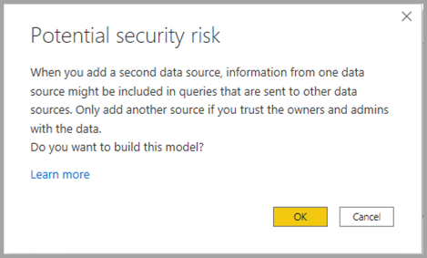

# DirectQuery gebruiken voor Power BI-gegevenssets en Azure Analysis Services (preview-versie)

Met **DirectQuery voor Power BI-gegevenssets en AAS (Azure Analysis Services)** kunt u DirectQuery gebruiken om verbinding te maken met AAS of Power BI-gegevenssets. Als u wilt, kunt u het ook combineren met andere DirectQuery-gegevens en geïmporteerde gegevens. Deze functie is met name handig voor rapportauteurs die de gegevens uit hun zakelijke semantische model willen combineren met andere gegevens waarvan ze de eigenaar zijn, zoals een Excel-spreadsheet, of die de metagegevens uit hun zakelijke semantische model persoonlijker willen maken of willen verrijken.

## De preview-functie inschakelen

Omdat de functionaliteit momenteel beschikbaar is in de preview-versie, moet u deze eerst inschakelen. Ga hiervoor in Power BI Desktop naar **Bestand > Opties en instellingen > Opties**, en schakel in de sectie **Preview-functies** het selectievakje **DirectQuery voor Power BI-gegevenssets en Analysis Services** in om deze preview-functie in te schakelen. U moet Power BI Desktop mogelijk opnieuw opstarten om de wijziging door te voeren.

## DirectQuery gebruiken voor liveverbindingen

Als u DirectQuery wilt gebruiken voor Power BI-gegevenssets en Azure Analysis Services moet uw rapport een lokaal model hebben. U kunt beginnen met een liveverbinding en dan een lokaal model toevoegen of ernaar upgraden, of u kunt beginnen met een DirectQuery-verbinding of geïmporteerde gegevens, waardoor in uw rapport automatisch een lokaal model wordt gemaakt.

Als u wilt zien welke verbindingen worden gebruikt in uw model, controleert u de statusbalk in de rechterbenedenhoek van Power BI Desktop. Als u alleen met een Azure Analysis Services-bron bent verbonden, ziet u een bericht zoals in de volgende afbeelding:

Als u bent verbonden met een Power BI-gegevensset, ziet u een bericht waarin staat met welke Power BI-gegevensset u bent verbonden:

Als u de metagegevens van velden in uw live verbonden gegevensset wilt aanpassen, selecteert u in de statusbalk de optie **Wijzigingen aanbrengen in dit model**. U kunt op de knop **Wijzigingen aanbrengen in dit model** van het lint klikken, zoals weergegeven in de volgende afbeelding. De knop **Wijzigingen aanbrengen in dit model** in **Rapportweergave** op het tabblad **Modellen**. In Modelweergave bevindt de knop zich op het tabblad **Start**.

Als u de knop selecteert, wordt een dialoogvenster weergegeven waarin de toevoeging van een lokaal model wordt bevestigd. Selecteer **Een lokaal model toevoegen** om het maken van nieuwe kolommen in te schakelen of de metagegevens te wijzigen voor velden uit Power BI-gegevenssets of Azure Analysis Services. In de volgende afbeelding wordt het dialoogvenster weergegeven. 

Als u live bent verbonden met een Azure Analysis Services-bron, is er geen lokaal model. U moet een lokaal model toevoegen aan uw rapport om DirectQuery te gebruiken voor live verbonden bronnen, zoals Power BI-gegevenssets en Azure Analysis Services. Wanneer u een rapport met een lokaal model publiceert in de Power BI-service, wordt er ook een gegevensset voor dit lokale model gepubliceerd.

## Koppelen

Gegevenssets vormen samen met de gegevenssets en modellen waarop ze zijn gebaseerd, een *keten*. Dit proces heet **ketenvorming**. Hiermee kunt u een rapport en gegevensset publiceren op basis van andere Power BI-gegevenssets, iets wat eerder niet mogelijk was.

Stel bijvoorbeeld dat uw collega een Power BI-gegevensset publiceert met de naam *Verkoop en budget* die is gebaseerd op een Azure Analysis Services-model met de naam *Verkoop*. En dat uw collega deze gegevensset combineert met een Excel-sheet met de naam *Budget*.

Wanneer u een nieuw rapport (en een nieuwe gegevensset) publiceert met de naam *Verkoop en budget - Europa*, gebaseerd op de Power BI-gegevensset *Verkoop en budget* die is gepubliceerd door uw collega, waarbij u wat verdere wijzigingen of extensies aanbrengt, voegt u eigenlijk een rapport of gegevensset toe aan een keten van drie. Deze keten begint met het Azure Analysis Services-model *Verkoop*, en eindigt met uw Power BI-gegevensset *Verkoop en budget - Europa*. In de volgende afbeelding wordt dit ketenvormingsproces geïllustreerd.

De keten in de vorige afbeelding heeft een lengte van drie. Dit is de maximale lengte tijdens deze preview-periode. Uitbreiding van een ketenlengte naar meer dan drie wordt niet ondersteund, en resulteert in fouten.

## Beveiligingswaarschuwing

Als u de functie **DirectQuery voor Power BI-gegevenssets en AAS (Azure Analysis Services)** gebruikt, krijgt u een dialoogvenster met een beveiligingswaarschuwing te zien, zoals weergegeven in de volgende afbeelding.

Gegevens worden mogelijk van de ene gegevensbron naar een andere worden gepusht, wat dezelfde beveiligingswaarschuwing is voor het combineren van DirectQuery-bronnen en importbronnen in een gegevensmodel. Raadpleeg [Samengestelde modellen gebruiken in Power BI Desktop](../transform-model/desktop-composite-models.md) voor meer informatie over dit gedrag.

## Functies en scenario's om uit te proberen

De volgende lijst biedt suggesties voor hoe u zelf **DirectQuery voor Power BI-gegevenssets en AAS (Azure Analysis Services)** kunt verkennen:

- Verbinding met gegevens maken met behulp van verschillende bronnen: Importeren (zoals bestanden), Power BI-gegevenssets, Azure Analysis Services
- Relaties maken tussen verschillende gegevensbronnen
- Metingen schrijven die gebruikmaken van velden uit verschillende gegevensbronnen
- Nieuwe kolommen maken voor tabellen uit Power BI-gegevenssets of Azure Analysis Services
- Visuals maken die gebruikmaken van kolommen uit verschillende gegevensbronnen

## Overwegingen en beperkingen

Er zijn enkele **overwegingen** om rekening mee te houden bij het gebruik van **DirectQuery voor Power BI-gegevenssets en AAS (Azure Analysis Services)** :

- Als u uw gegevensbronnen vernieuwt, en er fouten optreden met conflicterende veld- of tabelnamen, worden deze problemen in Power BI voor u opgelost.

- Als u rapporten in de Power BI-service wilt bouwen in een samengesteld model dat is gebaseerd op een andere gegevensset, moeten alle referenties zijn ingesteld. Op de instellingenpagina voor het vernieuwen van referenties, voor Azure Analysis Services-bronnen, verschijnt de volgende fout, ook al zijn de referenties juist ingesteld:
    
    
- Omdat dit verwarrend en onjuist is, is dit iets wat we binnenkort zullen afhandelen.

- RLS-regels worden toegepast op de bron waarvoor ze zijn gedefinieerd, maar worden niet toegepast op andere gegevenssets in het model. RLS die is gedefinieerd in het rapport, is niet van toepassing op externe bronnen. RLS die is ingesteld voor externe bronnen, wordt niet toegepast op andere gegevensbronnen.

- Weergavemappen, KPI's, datumtabellen, beveiliging op rijniveau, en vertalingen worden niet geïmporteerd uit de bron in deze preview-release. U kunt nog steeds weergavemappen maken in het lokale model.

- Mogelijk ziet u onverwacht gedrag bij het gebruik van een datumhiërarchie. Gebruik in plaats hiervan een datumkolom om dit probleem op te lossen. Nadat u een datumhiërarchie hebt toegevoegd aan een visual, kunt u overschakelen naar een datumkolom door op de pijl-omlaag in de veldnaam te klikken. Klik vervolgens op de naam van dit veld, in plaats van *Datumhiërarchie* te gebruiken:

    

    Ga naar dit artikel voor meer informatie over het gebruik van datumkolommen versus datumhiërarchieën.

- Mogelijk ziet u onhandige foutberichten wanneer u AI-functies gebruikt met een model dat een DirectQuery-verbinding heeft met Azure Analysis Services. 

- Het gebruik van ALLSELECTED voor een DirectQuery-bron resulteert in onvolledige resultaten.

- Filters en relaties:
    - Een filter dat vanuit een gegevensbron is toegepast op een tabel uit een andere DirectQuery-bron, kan slechts worden ingesteld voor één kolom

    - Het kruislings filteren van twee tabellen in een DirectQuery-bron door deze te filteren met een tabel buiten de bron is geen aanbevolen ontwerp, en wordt niet ondersteund.

    - Een filter kan maar één keer worden toegepast op een tabel. Twee keer hetzelfde filter toepassen op een tabel, via een of meer tabellen buiten de DirectQuery-bron, wordt niet ondersteund.

- Gedurende de preview-periode is drie de maximumlengte van een modelketen. Uitbreiden van de ketenlengte naar meer dan drie wordt niet ondersteund, en resulteert in fouten. 

- Als u hulpprogramma's van derden gebruikt, kunt u een vlag *Ketenvorming ontmoedigen* instellen voor een model, om te voorkomen dat een keten wordt gemaakt of uitgebreid. Om deze vlag in te stellen zoekt u de eigenschap *DiscourageCompositeModels* voor een model. 

Er zijn ook enkele **beperkingen** waar u rekening mee moet houden:

- Parameters voor database- en servernamen zijn momenteel uitgeschakeld. 

- Het definiëren van RLS voor tabellen uit een externe bron wordt niet ondersteund.

- Het gebruik van SSAS (SQL Server Analysis Services) als een DirectQuery-bron wordt momenteel niet ondersteund. 

- Het gebruik van DirectQuery in gegevenssets uit Mijn werkruimte wordt momenteel niet ondersteund. 

- Het verwijderen van verbindingen met externe bronnen die DirectQuery gebruiken, wordt momenteel niet ondersteund.

- Het gebruik van Power BI Embedded met gegevenssets die een DirectQuery-verbinding met een Power BI-gegevensset of Azure Analysis Services-model bevatten, wordt momenteel niet ondersteund.

- Opmaaktekenreeksen in kolommen en metingen uit een externe bron worden niet geïmporteerd in het samengestelde model.

- Berekeningsgroepen in externe bronnen worden niet ondersteund, met niet-gedefinieerde queryresultaten.

- Sommige query's retourneren mogelijk verkeerde resultaten, als er een relatie is tussen berekende tabellen en een of meer tabellen in een externe bron. Het maken van berekende tabellen in een externe gegevensset wordt niet ondersteund, hoewel dit momenteel niet is geblokkeerd in de interface.

- Sorteren op kolom wordt momenteel niet ondersteund.

- Pagina automatisch vernieuwen (APR) wordt alleen ondersteund voor sommige scenario's, afhankelijk van het type gegevensbron. Raadpleeg het artikel [Pagina automatisch vernieuwen in Power BI](../create-reports/desktop-automatic-page-refresh.md) voor meer informatie.

## Volgende stappen

Bekijk de volgende bronnen voor meer informatie over DirectQuery:

- [DirectQuery in Power BI Desktop gebruiken](desktop-use-directquery.md)
- [DirectQuery-modellen in Power BI Desktop](desktop-directquery-about.md)
- [Richtlijnen voor het DirectQuery-model in Power BI Desktop](../guidance/directquery-model-guidance.md)
- Vragen? [Misschien dat de Power BI-community het antwoord weet](https://community.powerbi.com/)
