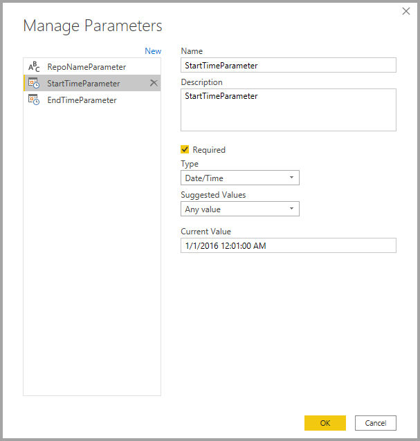
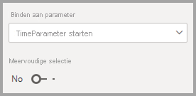

# <a name="dynamic-m-query-parameters-in-power-bi-desktop-preview"></a>Dynamische M-queryparameters in Power BI Desktop (preview)

Met behulp van **dynamische M-queryparameters** kunnen modelontwerpers **rapportgebruikers** filters of slicers laten gebruiken om de waarde(n) in te stellen voor een [M-queryparameter](/power-query/power-query-query-parameters), wat zeer nuttig kan zijn voor de optimalisatie van queryprestaties. Met dynamische M-queryparameters hebben modelontwerpers extra controle over hoe filterselecties worden opgenomen in DirectQuery-bronquery's. 

Als modelontwerpers de beoogde semantiek van hun filters begrijpen, weten ze vaak ook hoe ze efficiënte query's kunnen schrijven voor hun gegevensbron. Die kennis stelt ze in staat om op de juiste plek filterselecties op te nemen in bronquery's om de beoogde resultaten te bereiken met betere prestaties.

## <a name="enabling-dynamic-m-query-parameters"></a>Dynamische M-queryparameters inschakelen

De functie **Dynamische M-queryparameters** is momenteel in preview en moet expliciet worden ingeschakeld om te kunnen worden gebruikt. Selecteer **Bestand > Opties en Instellingen > Opties** en selecteer vervolgens **Preview-functies** in het linkerdeelvenster. Zorg ervoor dat het selectievakje **Dynamische M-queryparameters** is ingeschakeld. U moet Power BI Desktop opnieuw starten om de functie in te schakelen.


Als vereiste voor deze functie moet u een geldige [M queryparameter](/power-query/power-query-query-parameters) hebben gemaakt en moet hiernaar worden verwezen in een of meer DirectQuery-tabellen. 

> [!NOTE]
> Raadpleeg de sectie [Overwegingen en beperkingen](#considerations-and-limitations) in dit artikel, omdat niet alle DirectQuery-bronnen worden ondersteund met deze functie.

Laten we stapsgewijs een voorbeeld doornemen om een **enkele waarde** dynamisch door te geven aan een parameter:

1. Start in Power BI Desktop **Power Query** vanaf het tabblad **Gegevens** en selecteer **Nieuwe parameter** via de knop **Parameters beheren** op het lint.

    

2. Vul vervolgens de volgende gegevens in voor de parameter.

    

3. Klik op **Nieuw** als u nog meer parameters wilt toevoegen.

    

4. Als u de parameters hebt gemaakt, kunt u ernaar verwijzen in de M-query. Als u de M-query wilt wijzigen, opent u de geavanceerd editor terwijl de query is geselecteerd die u wilt wijzigen:

    

5. Verwijs vervolgens naar de parameters in de M-query, die hieronder geel zijn gemarkeerd. 

    

6. De parameters zijn gemaakt en u hebt ernaar verwezen in de M-query. De volgende stap is het maken van een tabel met een kolom die de mogelijke waarden bevat die beschikbaar zijn voor die parameter. Hierdoor kunnen de parameters dynamisch worden ingesteld op basis van filterselectie. In dit voorbeeld willen we dat de parameters *StartTime* en *EndTime* dynamisch zijn. Aangezien deze parameters een Date/Time-parameter vereisen, moeten we datuminvoer genereren die kan worden gebruikt voor het instellen van de datum voor de parameter. Hiervoor gaan we eerst een nieuwe tabel maken:

    

7. Dit is de eerste tabel die is gemaakt voor de parameter *StartTime* :

    ```StartDateTable = CALENDAR (DATE(2016,1,1), DATE(2016,12,31))```

    

8. Dit is de tweede tabel die is gemaakt voor de waarden voor de parameter EndTime:

    ```EndDateTable = CALENDAR (DATE(2016,1,1), DATE(2016,12,31))```

    

    > [!NOTE]
    > Het is raadzaam om een kolomnaam te gebruiken die niet wordt gebruikt in een andere tabel. Als kolommen dezelfde naam hebben, wordt de geselecteerde waarde als een filter toegepast op de daadwerkelijke query.

9. De tabellen met het veld *Date* zijn nu gemaakt en dus kunnen we elk veld aan een parameter binden. Het binden van een veld aan een parameter betekent in feite dat de geselecteerde waarde voor het veld verandert, dat de waarde wordt doorgegeven aan de parameter en dat de query wordt bijgewerkt op de positie waar naar de parameter wordt verwezen. Om het veld te binden, gaat u naar het tabblad **Model maken** , selecteert u het zojuist gemaakte veld en **Geavanceerd** om de bijbehorende eigenschappen weer te geven:

    > [!NOTE]
    > Het gegevenstype van de kolom moet overeenkomen met het type M-parameter.

    

10. Selecteer de vervolgkeuzelijst onder **Binden aan parameter** en selecteer de parameter die u aan het veld wilt binden:

    

    Aangezien dit een voorbeeld is voor een enkele waarde (de parameter wordt ingesteld op één waarde), moet u **Meervoudige selectie** op **Nee** laten staan, wat de standaardinstelling is:

    

    Als voor uw gebruiksscenario meervoudige selectie vereist is (meerdere waarden doorgeven aan één parameter), moet u de schakeloptie op **Ja** zetten en ervoor zorgen dat de M-query is ingesteld voor het accepteren van meerdere waarden in de M-query. Hier ziet u een voorbeeld van *RepoNameParameter* , waarvoor meerdere waarden zijn toegestaan:

    

11. U kunt deze stappen herhalen als u andere velden wilt binden aan andere parameters:

    

12. Ten slotte kunt u naar dit veld verwijzen in een slicer of als een filter:

    

Als Meervoudige selectie is ingesteld op **Nee** voor de toegewezen kolom, moet u de modus Eén selecteren gebruiken in de slicer of Eén selecteren vereisen in de filterkaart.

## <a name="potential-security-risk"></a>Potentieel beveiligingsrisico

Wanneer u rapportlezers toestaat om de waarden voor de M-queryparameters dynamisch in te stellen, hebben ze mogelijk toegang tot aanvullende gegevens of kunnen ze wijzigingen van het bronsysteem initiëren via **injectieaanvallen** , afhankelijk van de manier waarop naar de parameters wordt verwezen in de M-query en welke waarden er worden doorgegeven aan die parameter.

Stel dat u een geparametriseerde Kusto-query hebt gemaakt, zoals in het volgende voorbeeld:

```
Products
| where Category == [Parameter inserted here] & HasReleased == 'True'
 | project ReleaseDate, Name, Category, Region```
```

U vindt het misschien prima dat een goedwillende gebruiker een geschikte waarde voor de parameter opgeeft, bijvoorbeeld *Games* :

```
| where Category == 'Games' & HasReleased == 'True'
```

Een aanvaller kan echter een waarde doorgeven waarmee de query wordt gewijzigd om zo toegang te krijgen tot meer gegevens, bijvoorbeeld *'Games'//* :

```
Products
| where Category == 'Games'// & HasReleased == 'True'
| project ReleaseDate, Name, Category, Region
```

In dit voorbeeld kan de aanvaller toegang krijgen tot informatie over spellen die nog niet zijn vrijgegeven door een deel van de query te veranderen in een opmerking.

**Het risico beperken**

Om het beveiligingsrisico te beperken, wordt aangeraden om het samenvoegen van waarden voor M-parameters te verbieden in de query.  In plaats daarvan gebruikt u die parameterwaarden in M-bewerkingen die naar de bronquery vouwen, zodat de M-engine en connector de uiteindelijke query bouwen. U kunt ook, indien beschikbaar, gebruikmaken van een mechanisme voor het doorgeven van parameters die is ingebouwd in de bronquerytaal en -connectors. [Azure Data Explorer](/azure/data-explorer/kusto/query/queryparametersstatement?pivots=azuredataexplorer) beschikt bijvoorbeeld over ingebouwde queryparameterfuncties die zijn ontworpen om bescherming te bieden tegen injectieaanvallen.

Enkele voorbeelden:

* Voorbeeld met filterbewerkingen van M-query:
    ```
    Table.SelectRows(Source, (r) =\&gt; r[Columns] = Parameter)
    ```

* Voorbeeld waarbij de parameter wordt gedeclareerd in de bronquery (of waarbij de parameterwaarde als invoer wordt doorgegeven aan een bronqueryfunctie):
    ```
    declare query\_parameters (Name of Parameter : Type of Parameter);
    ```

## <a name="considerations-and-limitations"></a>Overwegingen en beperkingen

Er zijn enkele overwegingen en beperkingen waarmee u rekening moet houden wanneer u dynamische M-queryparameters gebruikt:

* Een bepaalde parameter kan niet worden gebonden aan meerdere velden en omgekeerd.
* De functie wordt alleen ondersteund voor gegevensbronnen op basis van M. De volgende DirectQuery-bronnen worden niet ondersteund:
    * Op T-SQL gebaseerde gegevensbronnen: SQL Server, Azure SQL Database, Synapse SQL-pools (oftewel Azure SQL Data Warehouse) en Synapse SQL OnDemand-pools
    * Live Connect-gegevensbronnen: Azure Analysis Services, SQL Server Analysis Services, Power BI-gegevenssets
    * Andere niet-ondersteunde gegevensbronnen: Oracle, Teradata en relationele SAP Hana
    * Gedeeltelijk ondersteund door eindpuntprogrammeerheid XMLA/TOM: SAP BW en SAP Hana 


* De volgende out-of-the-box parametertypen worden niet ondersteund:
  * Alle
  * Duur
  * Waar/onwaar
  * Binair

* Niet-ondersteunde filters:
  * Relatieve tijdslicer of -filter
  * Relatieve datum
  * Hiërarchieslicer
  * include voor meerdere velden
  * exclude- en not-filters
  * Kruislings markeren
  * Inzoomfilter
  * Kruisfilter
  * Top N-filter
* Niet-ondersteunde bewerkingen:
  * En
  * Contains
  * Kleiner dan
  * Groter dan
  * Begint met
  * Begint niet met
  * Is niet
  * Bevat niet
  * Alles selecteren
  * Is leeg
  * Is niet leeg


## <a name="next-steps"></a>Volgende stappen

U kunt allerlei handelingen uitvoeren met Power BI Desktop. Bekijk de volgende bronnen voor meer informatie over de vele mogelijkheden:

* [Informatie over DirectQuery in Power BI](desktop-directquery-about.md)
* [Wat is Power BI Desktop?](../fundamentals/desktop-what-is-desktop.md)
* [Query-overzicht met Power BI Desktop](../transform-model/desktop-query-overview.md)
* [Gegevenstypen in Power BI Desktop](desktop-data-types.md)
* [Gegevens vormgeven en combineren met Power BI Desktop](desktop-shape-and-combine-data.md)
* [Algemene querytaken in Power BI Desktop](../transform-model/desktop-common-query-tasks.md)