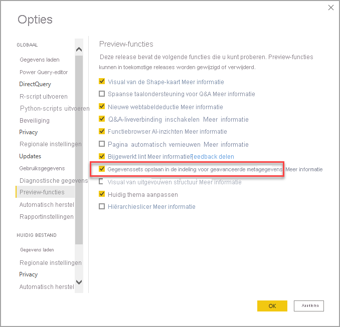

# <a name="using-enhanced-dataset-metadata-preview"></a>Verbeterde metagegevens van gegevensset gebruiken (preview)

Als Power BI Desktop rapporten maakt, worden er ook metagegevens van de gegevensset in de bijbehorende PBIX- en PBIT-bestanden gemaakt. Voorheen werden de metagegevens opgeslagen in een indeling die specifiek was voor Power BI Desktop. Er werd daarbij gebruik gemaakt van M-expressies gecodeerd in base-64 en gegevensbronnen, en er werden veronderstellingen gedaan over hoe die metagegevens werden opgeslagen.

Met de release van de functie **verbeterde metagegevens van gegevenssets** zijn veel van deze beperkingen verwijderd. Wanneer de functie **verbeterde metagegevens van gegevenssets** is ingeschakeld, gebruiken metagegevens die zijn gemaakt door Power BI Desktop een indeling die vergelijkbaar is met wat wordt gebruikt voor Analysis Services-modellen in tabelvorm, op basis van het [Objectmodel in tabelvorm](/analysis-services/tom/introduction-to-the-tabular-object-model-tom-in-analysis-services-amo).


De functie **verbeterde metagegevens van gegevenssets** is strategisch en fundamenteel, omdat toekomstige Power BI-functionaliteit op deze metagegevens wordt gebouwd. Enkele andere mogelijkheden die baat kunnen hebben bij uitgebreide metagegevens van gegevenssets, zijn onder andere [lezen/schrijven van XMLA](https://docs.microsoft.com/power-platform-release-plan/2019wave2/business-intelligence/xmla-readwrite) voor het beheer van Power BI-gegevenssets en de migratie van Analysis Services-workloads naar Power BI om te profiteren van de functies van de volgende generatie.


## <a name="enable-enhanced-dataset-metadata"></a>Verbeterde metagegevens van gegevensset inschakelen

De functie **verbeterde metagegevens van gegevenssets** is momenteel beschikbaar als preview-versie. Als u uitgebreide metagegevens van gegevenssets wilt inschakelen, selecteert u in Power BI Desktop **Bestand > Opties en instellingen > Opties > Preview-functies** en selecteert u vervolgens het selectievakje **Gegevenssets opslaan met indeling voor verbeterde metagegevens**, zoals wordt weergegeven in de volgende afbeelding. 



U wordt gevraagd Power BI Desktop opnieuw op te starten.


Wanneer de preview-functie is ingeschakeld, probeert Power BI Desktop de PBIX- en PBIT-bestanden bij te werken die de vorige metagegevensindeling gebruiken. 

> [!IMPORTANT]
> Het inschakelen van de functie voor **verbeterde metagegevens van gegevenssets** resulteert in een onomkeerbare upgrade van rapporten. Zodra u **verbeterde metagegevens van gegevenssets** inschakelt, worden alle Power BI-rapporten die zijn geladen of gemaakt met Power BI Desktop, geconverteerd naar de indeling voor verbeterde metagegevens van gegevenssets

## <a name="report-backup-files"></a>Back-upbestanden van rapport

Als u een rapport bijwerkt voor het gebruik van de functie **Verbeterde metagegevens van gegevensset**, kunt u dat niet meer terugdraaien. Tijdens de update wordt er echter wel een back-upbestand van het rapport gemaakt om een versie van het rapport op te slaan in de oorspronkelijke indeling (vóór het bijwerken). Dit back-upbestand wordt na 30 dagen verwijderd. 

Ga als volgt te werk om het back-upbestand van een rapport te zoeken:

1. Navigeer naar de volgende locatie: ```C:\Users\<user>\AppData\Local\Microsoft\Power BI Desktop\TempSaves\Backup```. Als u de Microsoft Store-versie van Power BI Desktop gebruikt, gebruikt u de volgende locatie: ```C:\Users\<user>\Microsoft\Power BI Desktop Store App\TempSaves\Backups``` 

2. Zoek daar een kopie van het rapport met de naam en het tijdstempel van het oorspronkelijke bestand.

3. Kopieer het bestand naar de gewenste locatie, zodat u over een back-up beschikt.

4. Zorg ervoor dat de preview-functie **Verbeterde metagegevens van gegevensset** is uitgeschakeld in Power BI Desktop als u ervoor kiest om dat oorspronkelijke bestand te openen of te gebruiken. 

Het back-upbestand wordt gemaakt wanneer het rapport wordt bijgewerkt, wat betekent dat alle wijzigingen die na het bijwerken zijn aangebracht, niet in de back-up staan. Nieuwe rapporten die worden gemaakt wanneer de functie **Verbeterde metagegevens van gegevensset** is ingeschakeld, hebben geen back-upbestand.


## <a name="considerations-and-limitations"></a>Overwegingen en beperkingen

In de preview-versie gelden de volgende beperkingen wanneer de preview-functie is ingeschakeld.

### <a name="unsupported-features-and-connectors"></a>Niet-ondersteunde functies en connectors

De volgende beperkingen zijn van toepassing:

Bij het openen van een bestaand PBIX- of PBIT-bestand dat niet is bijgewerkt, mislukt de upgrade als de gegevensset een van de volgende functies of connectors bevat. Als deze fout zich voordoet, zou dat niet direct invloed moeten hebben op de gebruikerservaring. Power BI Desktop blijft ook de vorige metagegevensindeling gebruiken.

* Alle aangepaste connectors (beperking van release in mei 2020)
* Python-scripts
* Azure DevOps Server
* BI-connector
* Denodo
* Dremio
* Exasol
* Indexima
* IRIS
* Jethro ODBC
* Kyligence Enterprise
* Mark Logic ODBC
* Qubole Presto
* Team Desk
* M-expressies met bepaalde tekencombinaties, zoals '\\n' in kolomnamen
* Wanneer u gegevenssets gebruikt met de functie **verbeterde metagegevens van gegevenssets** ingeschakeld, kunnen eenmalige aanmelding (SSO) niet worden ingesteld in de Power BI-service

Als u de versie **juni 2020** van Power BI Desktop (of hoger) gebruikt, *worden* alle aangepaste connectors en alle ingebouwde connectors ondersteund voor Power BI Desktop en de Power BI-service. Als er tijdens het publicatieproces de release van juni 2020 of hoger wordt gebruikt en de gateway problemen ondervindt, wordt de gegevensset wel gepubliceerd, maar moeten gebruikers het rapport opnieuw publiceren om de gegevens te vernieuwen. Het dialoogvenster **instellingen voor gegevensbron** is de enige indicator dat er problemen zijn met het publicatieproces.

Rapporten die gebruikmaken van deze niet-ondersteunde connectors of functies, worden niet bijgewerkt naar de nieuwe indeling. Rapporten die al zijn bijgewerkt, of die zijn gemaakt na het inschakelen van deze nieuwe functie, bieden geen ondersteuning voor het toevoegen van de vermelde niet-ondersteunde functies of connectors. 

Query's met dynamische gegevensbronnen worden niet ondersteund. Rapporten met dynamische gegevensbronnen worden niet bijgewerkt naar de nieuwe indeling en rapporten die al zijn bijgewerkt of nieuw zijn gemaakt met de functie ingeschakeld, bieden geen ondersteuning voor het toevoegen van dynamische gegevensbronnen. Een query heeft een dynamische gegevensbron als de bron wordt gewijzigd afhankelijk van een parameter, functie-invoer of vluchtige functie. 

Query's met fouten in upstream-stappen of -vertakkingen worden niet ondersteund. 

Daarnaast kunnen PBIX- en PBIT-bestanden die al zijn bijgewerkt om **verbeterde metagegevens van gegevenssets** te gebruiken *niet* de bovenstaande functies (of niet-ondersteunde connectors) gebruiken.

### <a name="lineage-view"></a>Gegevensherkomstweergave
Gegevenssets met de nieuwe metagegevensindeling bevatten momenteel geen koppelingen naar gegevensstromen in de herkomstweergave in de Power BI-service.

## <a name="next-steps"></a>Volgende stappen

U kunt allerlei handelingen uitvoeren met Power BI Desktop. Bekijk de volgende bronnen voor meer informatie over de vele mogelijkheden:

* [Wat is Power BI Desktop?](../fundamentals/desktop-what-is-desktop.md)
* [Wat is er nieuw in Power BI Desktop?](../fundamentals/desktop-latest-update.md)
* [Query-overzicht met Power BI Desktop](../transform-model/desktop-query-overview.md)
* [Gegevenstypen in Power BI Desktop](desktop-data-types.md)
* [Gegevens vormgeven en combineren met Power BI Desktop](desktop-shape-and-combine-data.md)
* [Algemene querytaken in Power BI Desktop](../transform-model/desktop-common-query-tasks.md)
