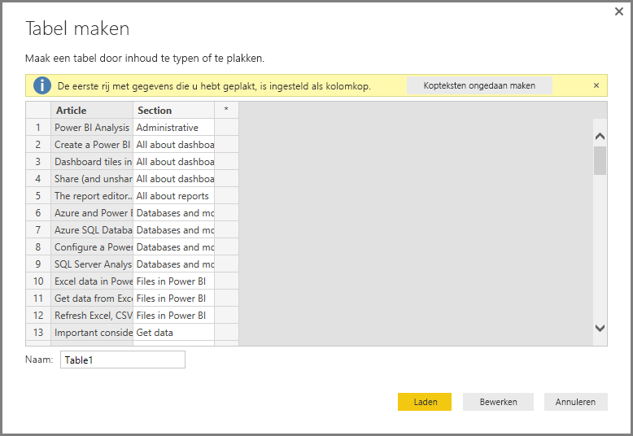
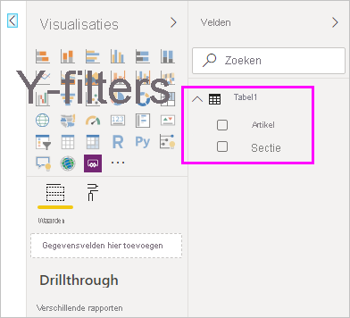

# Rechtstreeks gegevens in Power BI Desktop invoeren

Met Power BI Desktop kunt u gegevens rechtstreeks invoeren en die gegevens gebruiken in uw rapporten en visualisaties. U kunt bijvoorbeeld delen van een werkmap of webpagina kopiëren en vervolgens in Power BI Desktop plakken.

Als u gegevens rechtstreeks in Power bi Desktop wilt invoeren in de vorm van een nieuwe tabel, selecteert u **Gegevens invoeren** op het lint **Start**.

Er kan, indien van toepassing, geprobeerd worden kleine transformaties aan de gegevens aan te brengen, net zoals bij het laden van gegevens vanuit een andere bron. In het volgende voorbeeld is de eerste rij met gegevens naar de koppen verplaatst.

Als u de gegevens wilt vormgeven die u hebt ingevoerd of geplakt, selecteert u **Bewerken** om **Query-editor** te openen. U kunt de gegevens vormgeven en transformeren vóórdat u ze verplaatst naar Power BI Desktop. Selecteer **Laden** om de gegevens te importeren zoals deze worden weergegeven.

Als u **Laden** selecteert, wordt er een nieuwe tabel van de gegevens gemaakt, die in het deelvenster **Velden** wordt weergegeven. In de volgende afbeelding is mijn nieuwe tabel, *Table1* genoemd, zichtbaar in Power BI Desktop, samen met de twee velden die in deze tabel zijn gemaakt.

En dat is alles. Zo eenvoudig is het om gegevens in te voeren in Power BI Desktop.

U bent nu klaar om de gegevens te gebruiken in Power BI Desktop. U kunt visuals of rapporten maken, of werken met andere gegevens waarmee u verbinding wilt maken en die u wilt importeren, zoals Excel-werkmappen, databases of andere gegevensbronnen.

## Volgende stappen

Met Power BI Desktop kunt u verbinding maken met allerlei andere gegevens. Bekijk de volgende bronnen voor meer informatie over gegevensbronnen:

* [Wat is Power BI Desktop?](../fundamentals/desktop-what-is-desktop.md)
* [Gegevensbronnen in Power BI Desktop](desktop-data-sources.md)
* [Gegevens vormgeven en combineren met Power BI Desktop](desktop-shape-and-combine-data.md)
* [Connect to Excel workbooks in Power BI Desktop](desktop-connect-excel.md) (Verbinding maken met Excel-werkmappen in Power BI Desktop)
* [Connect to CSV files in Power BI Desktop](desktop-connect-csv.md) (Verbinding met CSV-bestanden maken in Power BI Desktop)
