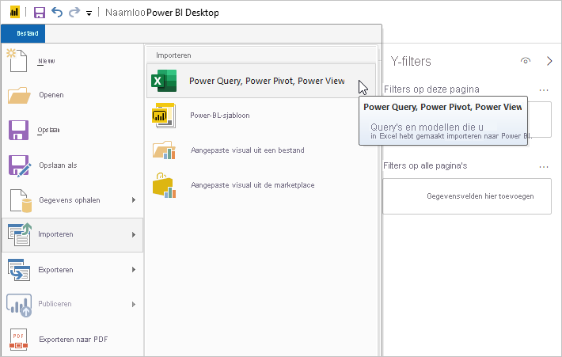
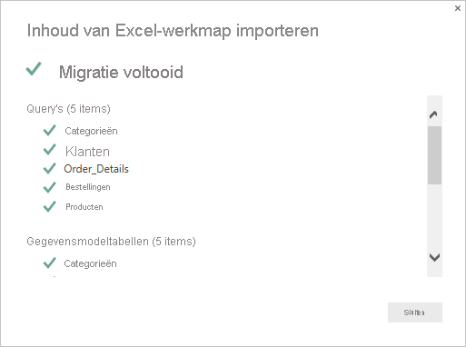
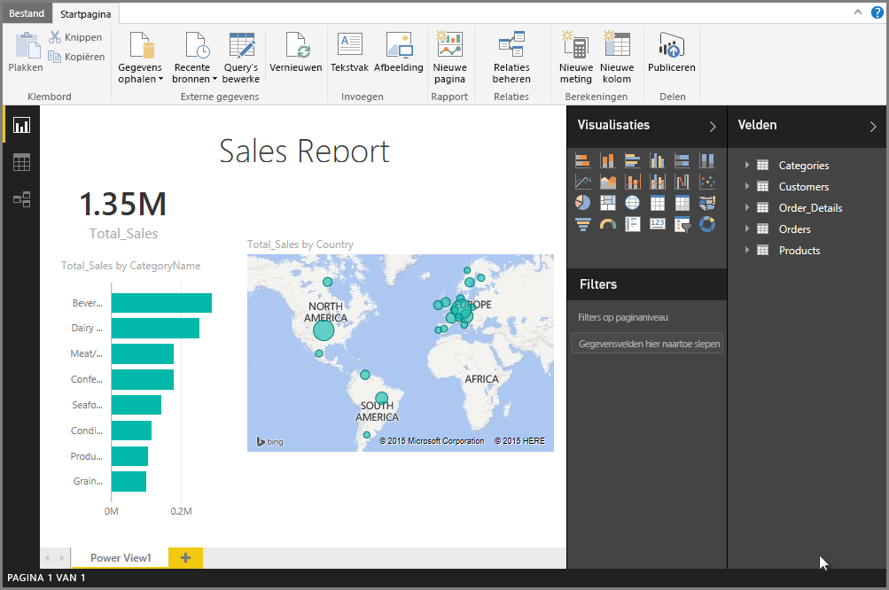

# Excel-werkmappen in Power BI Desktop importeren
Met Power BI Desktop kunt u eenvoudig Excel-werkmappen met Power Query-query's, Power Pivot-modellen en Power View-werkbladen in Power BI Desktop importeren. Power BI Desktop maakt automatisch rapporten en visuals op basis van de Excel-werkmap. Wanneer deze rapporten eenmaal zijn geïmporteerd, kunt u deze blijven verbeteren en verfijnen met Power BI Desktop, met behulp van de bestaande functies en nieuwe functies die met elke maandelijkse update van Power BI Desktop worden uitgebracht.

## Hoe kan ik een Excel-werkmap importeren?
1. Als u een Excel-werkmap wilt importeren in Power BI Desktop, selecteert u **Bestand** > **Importeren** > **Power query, Power Pivot, Power View**.

   

2. Selecteer in het venster **Openen** een Excel-werkmap die u wilt importeren. 

   Hoewel er momenteel geen beperking is aan de omvang of het aantal objecten in de werkmap, duurt het met grotere werkmappen langer om ze in Power BI Desktop te analyseren en te importeren.

   > [!NOTE]
   > Als u Excel-bestanden wilt laden of importeren vanuit gedeelde mappen van OneDrive voor Bedrijven of uit mappen van Microsoft 365-groepen, gebruikt u de URL van het Excel-bestand en voert u deze in de web-gegevensbron in Power BI Desktop in. Er zijn enkele stappen die u moet volgen om de URL voor OneDrive voor Bedrijven op de juiste manier in te delen. Raadpleeg [Koppelingen van OneDrive voor Bedrijven gebruiken in Power BI Desktop](desktop-use-onedrive-business-links.md) voor informatie en de juiste stappenreeks.
   > 
   > 

3. Selecteer **Start** in het weergegeven dialoogvenster voor importeren.

   

   De werkmap wordt in Power BI Desktop geanalyseerd en geconverteerd naar een Power BI Desktop-bestand (.pbix). Deze actie is een eenmalige gebeurtenis. Nadat het Power BI Desktop-bestand met deze stappen is gemaakt, is het niet meer afhankelijk van de oorspronkelijke Excel-werkmap en kan het worden gewijzigd, opgeslagen en gedeeld zonder de oorspronkelijke werkmap te beïnvloeden.

   Wanneer het importeren is voltooid, wordt de overzichtspagina weergegeven, waarin de geconverteerde items worden beschreven. De pagina bevat ook een lijst met alle items die niet konden worden geïmporteerd.

   

4. Selecteer **Sluiten**. 

   De Excel-werkmap wordt in Power BI Desktop geïmporteerd en er wordt een rapport geladen op basis van de inhoud van de werkmap.

   

Nadat de werkmap is geïmporteerd, kunt u verder werken aan het rapport. U kunt nieuwe visuals maken, gegevens toevoegen of nieuwe rapportpagina's maken met behulp van de functies en mogelijkheden die in Power BI Desktop zijn opgenomen.

## Welke werkmap-elementen worden geïmporteerd?
Power BI Desktop kan de volgende elementen, gewoonlijk aangeduid als *objecten*, in Excel importeren.

| Object in Excel-werkmap | Eindresultaat in Power BI Desktop-bestand |
| --- | --- |
| Power Query-query’s |Alle Power Query-query's uit Excel worden geconverteerd naar query's in Power BI Desktop. Als er querygroepen zijn gedefinieerd in de Excel-werkmap, wordt dezelfde organisatie gerepliceerd in Power BI Desktop. Alle query's worden geladen, tenzij deze op **Alleen verbinding maken** zijn ingesteld in het Excel-dialoogvenster **Importgegevens**. Het laadgedrag wordt aangepast door **Eigenschappen** te selecteren op het tabblad **Start** van de Power Query-editor in Power BI Desktop. |
| Externe Power Pivot-gegevensverbindingen |Alle externe Power Pivot-gegevensverbindingen worden geconverteerd naar query's in Power BI Desktop. |
| Gekoppelde tabellen of tabellen uit de huidige werkmap |Als er een werkbladtabel in Excel is gekoppeld aan het gegevensmodel of gekoppeld aan een query (met *Van tabel* of de functie *Excel.CurrentWorkbook()* in M), worden de volgende opties weergegeven: <ol><li><b>De tabel in het Power BI Desktop-bestand importeren</b>. Deze tabel is een momentopname van de gegevens, waarna de gegevens in de tabel in Power BI Desktop alleen-lezen worden. Er geldt een maximale grootte van 1 miljoen tekens (het totaal van alle kolomkoppen en cellen) voor tabellen die zijn gemaakt met deze optie.</li><li><b>Verbinding houden met de oorspronkelijke werkmap</b>. U kunt ook een verbinding met de oorspronkelijke Excel-werkmap behouden. Dan haalt Power BI Desktop bij elke vernieuwing de meest recente inhoud in deze tabel op, net als bij elke andere query op een Excel-werkmap in Power BI Desktop.</li></ul> |
| Berekende kolommen, metingen, KPI's, gegevenscategorieën en relaties van gegevensmodellen |Deze gegevensmodelobjecten worden geconverteerd naar de equivalente objecten in Power BI Desktop. Houd er rekening mee dat er bepaalde gegevenscategorieën zijn die niet beschikbaar zijn in Power BI Desktop, zoals Afbeelding. In dergelijke gevallen wordt de gegevenscategorie-informatie voor de desbetreffende kolommen weer ingesteld op de standaardinstelling. |
| Power View-werkbladen |Er wordt een nieuwe rapportpagina gemaakt voor elk Power View-werkblad in Excel. De namen en de volgorde van deze rapportpagina's komen overeen met de oorspronkelijke Excel-werkmap. |

## Zijn er beperkingen voor het importeren van een werkmap?
Er zijn enkele beperkingen voor het importeren van een werkmap in Power BI Desktop:

* **Externe verbindingen met tabellaire modellen van SQL Server Analysis Services:** In Excel 2013 is het mogelijk een verbinding te maken met SQL Server Analysis Services-modellen in tabelvorm en Power View-rapporten te maken op basis van deze modellen zonder de gegevens te hoeven importeren. Dit type verbinding wordt momenteel niet ondersteund als onderdeel van het importeren van Excel-werkmappen in Power BI Desktop. U moet deze externe verbindingen opnieuw maken in Power BI Desktop.
* **Hiërarchieën:** Dit type gegevensmodelobject wordt momenteel niet ondersteund in Power BI Desktop. Daarom worden hiërarchieën overgeslagen bij het importeren van een Excel-werkmap in Power BI Desktop.
* **Binaire gegevenskolommen:** Dit type gegevensmodelkolom wordt momenteel niet ondersteund in Power BI Desktop. Kolommen met binaire gegevens worden verwijderd uit de resulterende tabel in Power BI Desktop.
* **Niet-ondersteunde Power View-elementen:** Er zijn enkele functies in Power View die niet beschikbaar zijn in Power BI Desktop, zoals thema's of bepaalde soorten visualisaties (spreidingsdiagrammen met afspeelas, inzoom-gedrag, enzovoort). Deze niet-ondersteunde visualisaties veroorzaken *Niet-ondersteunde visualisatie*-berichten op de betreffende locaties in het Power BI Desktop-rapport, die u naar behoefte kunt verwijderen of opnieuw configureren.
* **Benoemde bereiken met** ***Van tabel*** **in Power Query, of met** ***Excel.CurrentWorkbook*** **in M:** Het importeren van gegevens uit deze benoemde bereiken in Power BI Desktop wordt momenteel niet ondersteund, maar het is een geplande update. Deze benoemde bereiken worden momenteel in Power BI Desktop geladen als een verbinding met de externe Excel-werkmap.
* **PowerPivot naar SSRS:** Externe PowerPivot-verbindingen naar SSRS (SQL Server Reporting Services) worden momenteel niet ondersteund, omdat deze gegevensbron momenteel niet beschikbaar is in Power BI Desktop.

